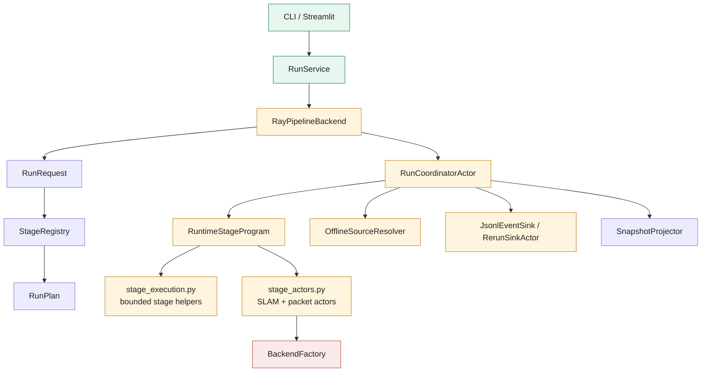
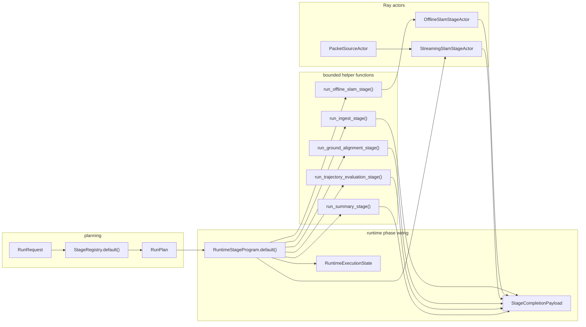
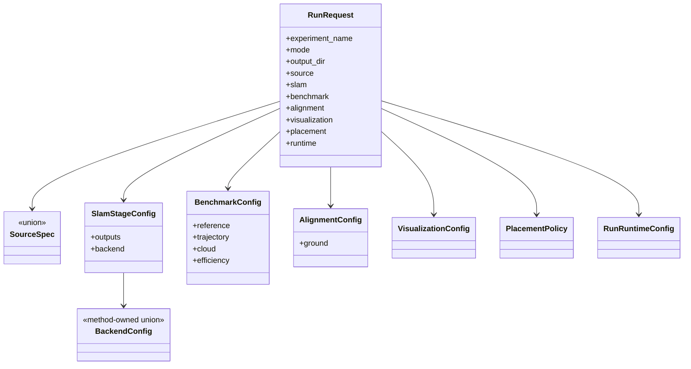
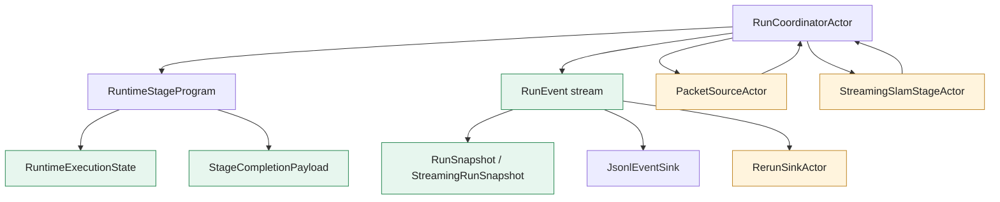
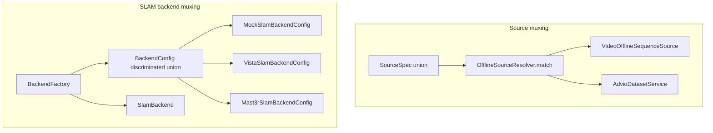

# Pipeline Stage Present-State Audit

This document is the current-state counterpart to
[pipeline-stage-refactor-target.md](./pipeline-stage-refactor-target.md). It
describes how the pipeline, stages, DTOs, configs, runtime helpers, actors, and
factories are placed today, then calls out issues, redundancies, diffuse
responsibilities, and definitions that are currently in awkward or incorrect
locations.

Boundary: this document is diagnostic. It does not define the desired target
architecture. Target module layout, target UML, and implementation-order
decisions belong in
[pipeline-stage-refactor-target.md](./pipeline-stage-refactor-target.md).

Read this together with:

- [Current executable stage protocols and DTOs](./pipeline-stage-protocols-and-dtos.md)
- [Target refactor architecture](./pipeline-stage-refactor-target.md)
- [Package ownership requirements](../../src/prml_vslam/REQUIREMENTS.md)
- [Pipeline requirements](../../src/prml_vslam/pipeline/REQUIREMENTS.md)
- [Refactor notes](../../src/prml_vslam/REFACTOR_PLAN.md)

## Executive Summary

The present pipeline is typed and functional, but stage concepts are spread
across several unrelated modules:

- stage identity and availability live in
  [stage_registry.py](../../src/prml_vslam/pipeline/stage_registry.py)
- request/config fragments live in
  [pipeline/contracts/request.py](../../src/prml_vslam/pipeline/contracts/request.py)
- runtime phase wiring lives in
  [ray_runtime/stage_program.py](../../src/prml_vslam/pipeline/ray_runtime/stage_program.py)
- bounded stage implementations live in
  [ray_runtime/stage_execution.py](../../src/prml_vslam/pipeline/ray_runtime/stage_execution.py)
- stateful actors live in
  [ray_runtime/stage_actors.py](../../src/prml_vslam/pipeline/ray_runtime/stage_actors.py)
- orchestration, status, sinks, streaming credits, and finalization live in
  [ray_runtime/coordinator.py](../../src/prml_vslam/pipeline/ray_runtime/coordinator.py)
- source muxing lives in
  [source_resolver.py](../../src/prml_vslam/pipeline/source_resolver.py)
- SLAM backend muxing lives separately in
  [methods/factory.py](../../src/prml_vslam/methods/factory.py)

The main present-state issue is not that the code is untyped. It is typed, but
the stage abstraction is implicit. There is no single module where one can see
for a stage: config, input DTO, output DTO, runtime target, status telemetry,
resource policy, backend muxing, and Rerun/event integration.

## Present-State Module Tree

The current stage architecture is not organized as stage modules. It is
organized around pipeline contracts, a registry, Ray runtime helpers, and
method wrappers.

```text
src/prml_vslam/pipeline/
├── contracts/
│   ├── request.py       # RunRequest, SourceSpec, SlamStageConfig, placement/runtime policy
│   ├── stages.py        # StageKey, StageDefinition, StageAvailability
│   ├── plan.py          # RunPlan and RunPlanStage
│   ├── events.py        # RunEvent, StageOutcome, runtime event vocabulary
│   ├── runtime.py       # RunSnapshot, StreamingRunSnapshot, RunState
│   ├── handles.py       # transient bulk payload handles
│   └── provenance.py    # RunSummary, StageManifest, StageStatus
├── stage_registry.py    # stage order, availability, expected outputs
├── source_resolver.py   # SourceSpec -> OfflineSequenceSource muxing
├── placement.py         # PlacementPolicy -> RayActorOptions translation
├── finalization.py      # summary projection, stable_hash, write_json
├── ingest.py            # source manifest materialization helpers
├── backend.py           # PipelineBackend protocol and PipelineRuntimeSource alias
├── backend_ray.py       # RayPipelineBackend
├── run_service.py       # app/CLI facade
├── ray_runtime/
│   ├── coordinator.py   # authoritative run coordinator, event fanout, streaming credits
│   ├── stage_program.py # phase-specific stage function wiring
│   ├── stage_execution.py # bounded stage helper implementations
│   ├── stage_actors.py  # OfflineSlamStageActor, StreamingSlamStageActor, PacketSourceActor
│   └── common.py        # Ray handles, artifact maps, backend_config_payload
└── sinks/
    ├── jsonl.py
    ├── rerun.py
    └── rerun_policy.py
```

Related packages:

```text
src/prml_vslam/
├── interfaces/          # shared DTOs, but also imports pipeline handles in slam.py
├── protocols/           # source and packet stream protocols
├── methods/             # backend configs, backend factory, SLAM protocols, method wrappers
├── benchmark/           # benchmark policy config
├── eval/                # metric contracts and services
├── alignment/           # ground alignment config/service
├── visualization/       # Rerun helpers, config, validation DTOs
├── io/                  # transport adapters, plus an io.datasets alias
└── datasets/            # dataset catalogs, normalization, benchmark references
```

## Present-State Architecture



Present-state facts:

- There is no `pipeline/stages/` package.
- There is no generic `StageConfig` base.
- There is no generic `StageRuntime` protocol.
- There is no generic `StageRuntimeStatus` DTO.
- Some stage config lives in `RunRequest`; some stage behavior lives in
  `RuntimeStageProgram`; some stage execution lives in helper functions; some
  stage execution lives in Ray actors.
- Planning is side-effect free, but runtime target construction is not
  config-driven at the stage level.

## Present Stage Wiring



Key contact points:

- [RunRequest](../../src/prml_vslam/pipeline/contracts/request.py#L175)
- [SlamStageConfig](../../src/prml_vslam/pipeline/contracts/request.py#L150)
- [StageRegistry.default()](../../src/prml_vslam/pipeline/stage_registry.py#L136)
- [RuntimeExecutionState](../../src/prml_vslam/pipeline/ray_runtime/stage_program.py#L38)
- [StageCompletionPayload](../../src/prml_vslam/pipeline/ray_runtime/stage_program.py#L60)
- [StageRuntimeSpec](../../src/prml_vslam/pipeline/ray_runtime/stage_program.py#L118)
- [bounded stage helpers](../../src/prml_vslam/pipeline/ray_runtime/stage_execution.py#L60)
- [stage actors](../../src/prml_vslam/pipeline/ray_runtime/stage_actors.py#L42)

## Present Stage Inventory

| Stage | Config today | Planning today | Runtime today | Output today | Present issue |
| --- | --- | --- | --- | --- | --- |
| `ingest` | `RunRequest.source` through `SourceSpec` | [StageRegistry](../../src/prml_vslam/pipeline/stage_registry.py#L140) | [run_ingest_stage()](../../src/prml_vslam/pipeline/ray_runtime/stage_execution.py#L60) | `StageCompletionPayload.sequence_manifest`, `benchmark_inputs` | No `IngestStageConfig`, `IngestStageInput`, or `IngestStageOutput`; source muxing is not factory-aligned with backend muxing. |
| `slam` | [SlamStageConfig](../../src/prml_vslam/pipeline/contracts/request.py#L150) with method-owned backend config | [StageRegistry](../../src/prml_vslam/pipeline/stage_registry.py#L145) | [OfflineSlamStageActor](../../src/prml_vslam/pipeline/ray_runtime/stage_actors.py#L42) and [StreamingSlamStageActor](../../src/prml_vslam/pipeline/ray_runtime/stage_actors.py#L203) | `StageCompletionPayload.slam`, `visualization` | Offline and streaming are separate actors; stage lifecycle is not represented by one stage runtime target. |
| `ground.align` | [AlignmentConfig](../../src/prml_vslam/alignment/contracts.py#L26), enabled through `request.alignment.ground` | [StageRegistry](../../src/prml_vslam/pipeline/stage_registry.py#L150) | [run_ground_alignment_stage()](../../src/prml_vslam/pipeline/ray_runtime/stage_execution.py#L179) | `StageCompletionPayload.ground_alignment` | Config is package-local but injected through a top-level request field, not a stage config; output DTO is implicit. |
| `trajectory.evaluate` | [TrajectoryBenchmarkConfig](../../src/prml_vslam/benchmark/contracts.py), enabled through `request.benchmark.trajectory` | [StageRegistry](../../src/prml_vslam/pipeline/stage_registry.py#L156) | [run_trajectory_evaluation_stage()](../../src/prml_vslam/pipeline/ray_runtime/stage_execution.py#L137) | artifact map only; `EvaluationArtifact` not retained in payload | Benchmark policy and eval computation are split, but output retention is inconsistent with other stages. |
| `reference.reconstruct` | [ReferenceReconstructionConfig](../../src/prml_vslam/benchmark/contracts.py) | placeholder unavailable in [StageRegistry](../../src/prml_vslam/pipeline/stage_registry.py#L162) | none | expected output path only | Stage key exists but has no runtime DTO, runtime target, or implementation owner. |
| `cloud.evaluate` | [CloudBenchmarkConfig](../../src/prml_vslam/benchmark/contracts.py) | placeholder unavailable in [StageRegistry](../../src/prml_vslam/pipeline/stage_registry.py#L171) | none | expected output path only | Stage key exists but metric owner and DTO ownership are not fully wired. |
| `efficiency.evaluate` | [EfficiencyBenchmarkConfig](../../src/prml_vslam/benchmark/contracts.py) | placeholder unavailable in [StageRegistry](../../src/prml_vslam/pipeline/stage_registry.py#L180) | none | expected output path only | Stage key exists but should likely derive metrics from `RunEvent` stream; no DTO/runtime yet. |
| `summary` | no dedicated stage config | [StageRegistry](../../src/prml_vslam/pipeline/stage_registry.py#L189) | [run_summary_stage()](../../src/prml_vslam/pipeline/ray_runtime/stage_execution.py#L211) | `RunSummary`, `StageManifest[]` | Projection-only behavior is correct, but summary config/runtime is implicit. |

## Current Config Placement



Findings:

- `SlamStageConfig` is the only current stage-like config class, but it does
  not derive from a common stage base and does not build a stage runtime target.
- Source config is represented by `SourceSpec`, but source construction happens
  in [OfflineSourceResolver](../../src/prml_vslam/pipeline/source_resolver.py#L46),
  not by a config-as-factory pattern.
- `benchmark`, `alignment`, and `visualization` are top-level run sections.
  They carry stage-like policy but are not modeled as stage configs.
- Placement is a separate map keyed by `StageKey`, not part of each stage
  config.
- Runtime lifecycle policy is run-level only; stage runtime lifecycle is
  implicit in helper functions and actor construction.

## Current Runtime Responsibilities



Findings:

- [RunCoordinatorActor](../../src/prml_vslam/pipeline/ray_runtime/coordinator.py#L75)
  owns too many runtime concerns at once: event log, snapshot projection,
  JSONL sink, Rerun sink, transient handle cache, source credit loop, streaming
  finalization, stage start/completion/failure event emission, and actor
  lifecycle.
- [RuntimeStageProgram](../../src/prml_vslam/pipeline/ray_runtime/stage_program.py#L132)
  looks like a generic stage executor but is currently a hardcoded list of
  function pointers rather than a stage runtime abstraction.
- [StageCompletionPayload](../../src/prml_vslam/pipeline/ray_runtime/stage_program.py#L60)
  is the de facto cross-stage output DTO, but it is a broad union-like bag
  rather than stage-specific output contracts.
- [RuntimeExecutionState](../../src/prml_vslam/pipeline/ray_runtime/stage_program.py#L38)
  is mutable cross-stage state. It works, but it hides which stage produces and
  consumes which fields.
- There is no per-stage status DTO beyond `StageProgress` and projected
  streaming counters.

## Current Backend And Source Muxing



Findings:

- Backend muxing has a typed discriminated union in
  [methods/configs.py](../../src/prml_vslam/methods/configs.py#L251) and a
  factory in [methods/factory.py](../../src/prml_vslam/methods/factory.py#L24).
- Source muxing uses a manual `match` inside
  [OfflineSourceResolver.resolve()](../../src/prml_vslam/pipeline/source_resolver.py#L51).
- Streaming source construction is elsewhere, in
  [pipeline/demo.py](../../src/prml_vslam/pipeline/demo.py), rather than using
  the same resolver/factory abstraction.
- This creates two muxing styles and makes it harder to add new source or
  stage backends consistently.

## Current DTO And Contract Placement Issues

| Contact | Present placement | Issue |
| --- | --- | --- |
| [interfaces/slam.py](../../src/prml_vslam/interfaces/slam.py) | `interfaces` owns `SlamArtifacts`, `SlamUpdate`, `BackendEvent`, but imports pipeline handles and transport model | Shared SLAM DTOs depend on pipeline contracts, which blurs the intended direction from shared interfaces to pipeline. |
| [pipeline/contracts/runtime.py](../../src/prml_vslam/pipeline/contracts/runtime.py#L26) | `RunState`, `RunSnapshot`, `StreamingRunSnapshot` in pipeline contracts | Probably acceptable because snapshots are event projections, but the inline TODO shows ownership is unsettled. |
| [pipeline/contracts/handles.py](../../src/prml_vslam/pipeline/contracts/handles.py#L16) | transient payload handles in pipeline contracts | Placement is probably right, but module comment still says motivation needs explanation. |
| [pipeline/backend.py](../../src/prml_vslam/pipeline/backend.py#L26) | `PipelineBackend` protocol in `backend.py` | Public behavior seam is not in a clearly named `protocols.py` module. |
| [alignment/contracts.py](../../src/prml_vslam/alignment/contracts.py#L12) | alignment configs in package contracts | Placement is likely right, but TODO indicates lack of a documented rule for config ownership. |
| [visualization/validation.py](../../src/prml_vslam/visualization/validation.py#L27) | validation DTOs inside implementation/CLI helper module | DTO definitions should move to `visualization.contracts` or a validation contracts module. |
| [pipeline/finalization.py](../../src/prml_vslam/pipeline/finalization.py#L80) | `stable_hash` and `write_json` in pipeline finalization | Generic serialization/fingerprinting helpers are reused outside finalization, including method code, so ownership is diffuse. |
| [pipeline/placement.py](../../src/prml_vslam/pipeline/placement.py#L16) | Ray option type aliases | The TODO is accurate: resource policy should be a typed config, not a loose dict alias. |

## Current Responsibility Diffusion

### Stage Definition Is Split Across Too Many Places

For one stage, the reader must inspect:

- [StageKey](../../src/prml_vslam/pipeline/contracts/stages.py)
- [StageRegistry.default()](../../src/prml_vslam/pipeline/stage_registry.py#L136)
- [RunRequest fields](../../src/prml_vslam/pipeline/contracts/request.py#L175)
- [RuntimeStageProgram.default()](../../src/prml_vslam/pipeline/ray_runtime/stage_program.py#L138)
- [stage_execution.py](../../src/prml_vslam/pipeline/ray_runtime/stage_execution.py)
- [stage_actors.py](../../src/prml_vslam/pipeline/ray_runtime/stage_actors.py)
- [coordinator.py](../../src/prml_vslam/pipeline/ray_runtime/coordinator.py)

Issue: there is no stage-local “home” where config, runtime, DTOs, resources,
and telemetry are all discoverable.

### Coordinator Owns Runtime Policy And Observer Policy

The coordinator builds the JSONL sink, builds the Rerun sink, handles event
projection, stores transient handles, controls packet credits, starts/stops
actors, and records stage events. Each responsibility is reasonable, but the
combination makes the actor the center of too many policy decisions.

Contact points:

- [Rerun sink creation](../../src/prml_vslam/pipeline/ray_runtime/coordinator.py#L525)
- [stage actor options](../../src/prml_vslam/pipeline/ray_runtime/coordinator.py#L540)
- [stage event emission](../../src/prml_vslam/pipeline/ray_runtime/coordinator.py#L562)
- [packet observation and credits](../../src/prml_vslam/pipeline/ray_runtime/coordinator.py#L206)

### Stage Outputs Are Broad Payloads Instead Of Stage-Specific DTOs

[StageCompletionPayload](../../src/prml_vslam/pipeline/ray_runtime/stage_program.py#L60)
carries optional fields for many stages:

- `sequence_manifest`
- `benchmark_inputs`
- `slam`
- `ground_alignment`
- `visualization`
- `summary`
- `stage_manifests`

Issue: this gives a convenient internal handoff but does not document or
enforce stage-specific input/output contracts. It also encourages downstream
logic to inspect broad optional state instead of typed stage outputs.

### Resource Placement Is Ray-Specific And Untyped

[StagePlacement](../../src/prml_vslam/pipeline/contracts/request.py#L124)
stores `resources: dict[str, float]`. [actor_options_for_stage()](../../src/prml_vslam/pipeline/placement.py#L22)
then interprets `"CPU"` and `"GPU"` keys specially and passes the rest to Ray.

Issues:

- CPU/GPU are magic string keys.
- memory, object-store memory, node/IP affinity, accelerator type, restart
  policy, and task retry policy have no typed request model.
- placement lives outside the stage config, even though it is stage runtime
  policy.

### Serialization Helpers Are Used As Shared Utilities But Owned By Pipeline Finalization

[stable_hash](../../src/prml_vslam/pipeline/finalization.py#L80) and
[write_json](../../src/prml_vslam/pipeline/finalization.py#L88) are generic,
but `stable_hash` is imported by method code such as
[methods/vista/artifacts.py](../../src/prml_vslam/methods/vista/artifacts.py).

Issue: method code depending on pipeline finalization for generic hashing
inverts ownership and makes `pipeline.finalization` more than summary
projection.

### `interfaces` Is Not A Purely Independent Shared Layer

[interfaces/slam.py](../../src/prml_vslam/interfaces/slam.py) imports
[ArrayHandle](../../src/prml_vslam/pipeline/contracts/handles.py) and
[TransportModel](../../src/prml_vslam/pipeline/contracts/transport.py).

Issue: repo-wide interfaces depending on pipeline contracts weakens the
intended layering. Either handles/transport base need to be promoted to a
shared runtime contract, or SLAM streaming notice DTOs should remain
pipeline/method boundary contracts rather than `interfaces`.

## Current Redundancies

| Redundant / overlapping concept | Current locations | Problem |
| --- | --- | --- |
| Runtime stage result | `StageCompletionPayload`, `StageOutcome`, `StageCompleted` event, `RuntimeExecutionState` | Multiple objects represent partly overlapping “stage result” semantics. |
| Stage status | `StageStatus`, `RunState`, `StageProgress`, `StreamingRunSnapshot` counters | No single stage runtime status DTO for queue, FPS, latency, throughput, and resource use. |
| Source construction | `OfflineSourceResolver`, `pipeline/demo.py`, dataset services, IO configs | Offline and streaming source construction do not share one mux/factory abstraction. |
| Backend capability/resource metadata | backend config properties, `BackendFactory.describe()`, `StageRegistry` availability checks, placement defaults | Capability and resource data are available but spread across planning, factory, and placement code. |
| JSON writing / hashing | `pipeline.finalization.write_json`, `pipeline.ingest._write_json_payload`, `BaseConfig.to_jsonable`, external imports of `stable_hash` | Generic serialization rules are duplicated or pulled from pipeline finalization. |
| Visualization artifacts | `interfaces.visualization.VisualizationArtifacts`, `visualization.contracts.VisualizationConfig`, `pipeline.sinks.rerun`, native artifact collection in SLAM actors | Viewer policy, native artifact preservation, and sink behavior are split across multiple layers. |

## Inline TODO / Issue Map

| Contact | Present issue | Why this matters for planning |
| --- | --- | --- |
| [io/__init__.py](../../src/prml_vslam/io/__init__.py#L20) | `io.datasets` alias and explicit uncertainty about dataset ownership | Keep datasets top-level; remove alias after import audit. |
| [datasets/__init__.py](../../src/prml_vslam/datasets/__init__.py) | mirror alias for `prml_vslam.io.datasets` | Same cleanup as above. |
| [interfaces/__init__.py](../../src/prml_vslam/interfaces/__init__.py#L63) | unclear DTO/protocol/module organization | Document and enforce shared DTO vs package-local contract rule. |
| [benchmark/__init__.py](../../src/prml_vslam/benchmark/__init__.py#L25) | benchmark/eval responsibility conflict | Keep benchmark as policy, eval as computation/result owner. |
| [methods/protocols.py](../../src/prml_vslam/methods/protocols.py#L22) | unclear need for both `SlamSession` and `SlamBackend` | Document backend as factory/execution owner and session as stateful streaming lifecycle. |
| [visualization/validation.py](../../src/prml_vslam/visualization/validation.py#L27) | DTOs in validation implementation module | Move DTOs to visualization contracts. |
| [pipeline/contracts/handles.py](../../src/prml_vslam/pipeline/contracts/handles.py#L16) | missing module motivation | Explain transient handle ownership and why arrays stay out of public persisted contracts. |
| [pipeline/backend.py](../../src/prml_vslam/pipeline/backend.py#L26) | protocol in ambiguously named module | Move to `pipeline/protocols.py` or explicitly codify `backend.py` as substrate protocol owner. |
| [pipeline/placement.py](../../src/prml_vslam/pipeline/placement.py#L16) | loose Ray option aliases | Replace with typed `StageResourceConfig`. |
| [alignment/contracts.py](../../src/prml_vslam/alignment/contracts.py#L12) | config placement uncertainty | Keep package-local configs in contracts; document that durable request policy is a contract. |
| [pipeline/contracts/runtime.py](../../src/prml_vslam/pipeline/contracts/runtime.py#L26) | runtime DTO ownership uncertainty | Keep pipeline-owned unless a second package needs identical semantics. |
| [pipeline/finalization.py](../../src/prml_vslam/pipeline/finalization.py#L87) | generic JSON helper in pipeline finalization | Move generic serialization to shared utility; keep summary projection here. |

## Present-State Issue Severity

| Severity | Issue | Why it matters |
| --- | --- | --- |
| High | No generic stage config/runtime abstraction | Blocks clean stage-wise refactor and makes new stages require edits across registry, runtime program, coordinator, and helper modules. |
| High | SLAM stage split into offline actor and streaming actor | Duplicates backend construction/finalization logic and obscures one stage lifecycle. |
| High | Coordinator owns too many runtime/observer responsibilities | Makes streaming changes risky and hard to test in isolation. |
| Medium | Source muxing and backend muxing use different patterns | New source/backend variants require different extension paths. |
| Medium | `StageCompletionPayload` is a broad optional bag | Stage outputs are not self-documenting or decision-complete. |
| Medium | Resource placement is untyped and Ray-specific | Hard to express planned remote actor policy from the sketch. |
| Medium | Shared `interfaces` import pipeline contracts | Layering violation or at least an unresolved layering smell. |
| Low | Placeholder stages exist without DTO/runtime ownership | Acceptable for planning today, but must be resolved before implementation. |
| Low | Validation DTOs live in validation implementation module | Localized cleanup. |

## Present-State Strengths To Preserve

- `RunEvent` is the runtime source of truth, and `RunSnapshot` is projected.
- The executable slice is deterministic and linear.
- `SequenceManifest` is a stable normalized ingest boundary.
- SLAM wrappers return normalized `SlamArtifacts`.
- Alignment is a derived artifact and does not mutate native SLAM outputs.
- Rerun SDK calls are isolated behind the sink sidecar.
- `BackendConfig` already uses a discriminated union for method variants.

## Current Pressure Points For Refactor Planning

The smallest useful refactor should account for these current pressure points:

1. Add a generic stage config/runtime/status contract without moving behavior.
2. Add explicit stage input/output DTOs while keeping `StageCompletionPayload`
   as an internal adapter during migration.
3. Replace `StageRuntimeSpec` function pointers with stage runtime objects
   gradually.
4. Introduce typed resource config before adding remote actor support.
5. Align source muxing with backend muxing.
6. Merge the SLAM stage actor surfaces after the generic runtime abstraction is
   present.
7. Split coordinator responsibilities only after stage runtimes expose clean
   lifecycle and status methods.
