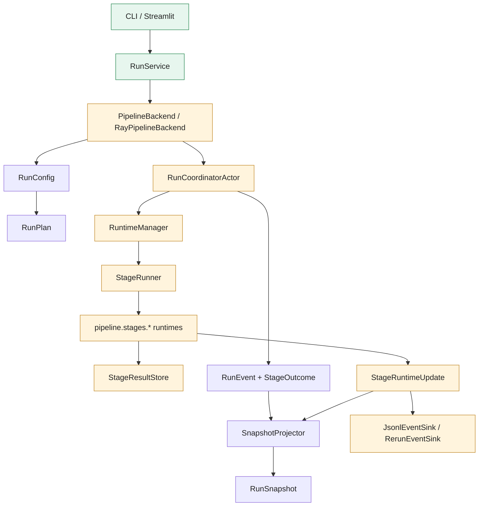

# Pipeline Stage Present-State Audit

This document is the current-state counterpart to
[pipeline-stage-refactor-target.md](./pipeline-stage-refactor-target.md). It
describes how the pipeline, stages, DTOs, configs, runtime helpers, and
observer paths are placed today, then calls out the main remaining migration
contacts and ownership problems.

Boundary: this document is diagnostic. It does not define the desired target
architecture. Target module layout, target UML, and implementation-order
decisions belong in
[pipeline-stage-refactor-target.md](./pipeline-stage-refactor-target.md).

Read this together with:

- [Current executable stage protocols and DTOs](./pipeline-stage-protocols-and-dtos.md)
- [Target refactor architecture](./pipeline-stage-refactor-target.md)
- [Pipeline DTO migration ledger](./pipeline-dto-migration-ledger.md)
- [Package ownership requirements](../../src/prml_vslam/REQUIREMENTS.md)
- [Pipeline requirements](../../src/prml_vslam/pipeline/REQUIREMENTS.md)

## Executive Summary

The present pipeline is no longer organized around `RuntimeStageProgram` and a
single `StageCompletionPayload` handoff bag. In the current worktree, the
runtime path is centered on:

- [`RunConfig`](../../src/prml_vslam/pipeline/config.py) and
  [`RunPlan`](../../src/prml_vslam/pipeline/contracts/plan.py) for planning
- [`RunCoordinatorActor`](../../src/prml_vslam/pipeline/ray_runtime/coordinator.py)
  for orchestration
- [`RuntimeManager`](../../src/prml_vslam/pipeline/runtime_manager.py) and
  [`StageRunner`](../../src/prml_vslam/pipeline/runner.py) for runtime
  construction and sequencing
- [`StageResultStore`](../../src/prml_vslam/pipeline/runner.py) and
  stage-local runtime input DTOs for cross-stage handoff
- [`StageRuntimeUpdate`](../../src/prml_vslam/pipeline/stages/base/contracts.py)
  plus keyed [`RunSnapshot`](../../src/prml_vslam/pipeline/contracts/runtime.py)
  state for live updates and UI projection

That is materially closer to the target architecture. The remaining blockers
are no longer the existence of the old runtime-program files themselves; they
are the compatibility seams still left around launch, planning, stage keys,
and snapshot consumers.

## Present-State Module Tree

The current stage architecture is now organized around stage modules and
runtime scaffolding, with a few request-era compatibility seams still present.

```text
src/prml_vslam/pipeline/
├── contracts/
│   ├── request.py       # migration contacts: RunConfig, SourceBackendConfig, placement/runtime compatibility
│   ├── stages.py        # StageKey and transitional StageAvailability
│   ├── plan.py          # RunPlan, RunPlanStage, PlannedSource
│   ├── events.py        # durable RunEvent union and StageOutcome
│   ├── runtime.py       # keyed RunSnapshot and RunState
│   ├── provenance.py    # RunSummary, StageManifest, ArtifactRef, StageStatus
│   └── transport.py     # transport-safe base models
│   ├── context.py       # run-scoped planning and execution context bundles
├── config.py            # RunConfig, StageBundle, plan compilation, stage-key alias helpers
├── runtime_manager.py   # runtime registration, capability preflight, proxy construction
├── runner.py            # StageRunner and StageResultStore
├── backend.py           # PipelineBackend protocol
├── backend_ray.py       # RayPipelineBackend
├── run_service.py       # app/CLI facade
├── snapshot_projector.py # RunEvent + StageRuntimeUpdate -> RunSnapshot
├── artifact_inspection.py # persisted artifact inspection and typed side payload loading
├── ray_runtime/
│   ├── coordinator.py   # authoritative run coordinator
│   ├── stage_actors.py  # packet-source actor and Ray-side helpers
│   └── common.py        # transient payload refs, artifact helpers, Ray utility glue
├── stages/
│   ├── base/            # StageConfig, StageResult, StageRuntimeStatus, StageRuntimeUpdate, proxy protocols
│   ├── source/          # source config + runtime
│   ├── slam/            # slam contracts, runtime, visualization adapter
│   ├── ground_alignment/
│   ├── trajectory_eval/
│   ├── reconstruction/
│   └── summary/
└── sinks/
    ├── jsonl.py
    ├── rerun.py
    └── rerun_policy.py
```

Historical note: `src/prml_vslam/pipeline/ray_runtime/stage_program.py` and
`stage_execution.py` are no longer present in tracked source. Remaining
references to them should be treated as historical or migration-only notes, not
as current executable ownership.

## Present-State Architecture



## What Is Current Reality

### Runtime authority

The current runtime authority is:

- the coordinator for run orchestration
- the runtime manager for capability and deployment truth
- the stage runner for bounded/streaming lifecycle sequencing
- stage-local runtime classes under `pipeline/stages/*/runtime.py`

This is a real improvement over the old function-pointer program path. The
main `WP-09B` question is now closure and honesty, not whether the old
runtime-program layer still owns production execution.

### Handoff model

Cross-stage handoff is keyed and stage-local now:

- completed stages return [`StageResult`](../../src/prml_vslam/pipeline/stages/base/contracts.py)
- the coordinator stores those results in
  [`StageResultStore`](../../src/prml_vslam/pipeline/runner.py)
- downstream inputs are built from typed prior results rather than a broad
  mutable state bag

The remaining rough edge is that some helper methods still branch on
compatibility `RunConfig` state while `WP-09A` is in flight.

### Durable versus live state

The durable/live split is mostly in place:

- durable state lives in [`RunEvent`](../../src/prml_vslam/pipeline/contracts/events.py),
  [`StageOutcome`](../../src/prml_vslam/pipeline/contracts/events.py),
  [`RunSummary`](../../src/prml_vslam/pipeline/contracts/provenance.py), and
  [`StageManifest`](../../src/prml_vslam/pipeline/contracts/provenance.py)
- live state lives in
  [`StageRuntimeStatus`](../../src/prml_vslam/pipeline/stages/base/contracts.py),
  [`StageRuntimeUpdate`](../../src/prml_vslam/pipeline/stages/base/contracts.py),
  [`VisualizationItem`](../../src/prml_vslam/pipeline/stages/base/contracts.py),
  and [`TransientPayloadRef`](../../src/prml_vslam/pipeline/stages/base/handles.py)
- UI/CLI projection happens through keyed
  [`RunSnapshot`](../../src/prml_vslam/pipeline/contracts/runtime.py) fields

The main remaining gap is documentation and compatibility callers, not the
core durable/live DTO split itself.

## Remaining Migration Contacts

### 1. Launch and planning are still mixed

`RunConfig` is now the canonical planning root and the backend-facing contract,
but the present launch surface is still mixed:

- [`RunService.start_run()`](../../src/prml_vslam/pipeline/run_service.py)
  accepts `run_config` and legacy `request`
- [`RayPipelineBackend.submit_run()`](../../src/prml_vslam/pipeline/backend_ray.py)
  also accepts both
- [`PipelineExecutionContext`](../../src/prml_vslam/pipeline/contracts/context.py)
  still accepts `run_config` or legacy `request`
- several coordinator helper paths still hash or branch on `request` when it is
  present

That means `WP-09A` is still a real blocker even though the planning and
backend seams are already mostly `RunConfig`-shaped.

### 2. Stage-key vocabulary is target-only

The current executable vocabulary is now the canonical target `StageKey` set:

- `source`
- `slam`
- `gravity.align`
- `evaluate.trajectory`
- `reconstruction`
- `evaluate.cloud`
- `summary`

`evaluate.cloud` remains a diagnostic binding without a runtime. The old
stage-key aliases and the deleted `evaluate.cloud` placeholder are no
longer current executable or persisted config vocabulary.

### 3. Migration DTOs are removed from the active launch path

The old runtime-program DTOs, request DTOs, stage-key aliases, live-handle
DTOs, and snapshot compatibility fields are gone from tracked source. Any
remaining references should be historical work-package notes or migration
ledger rows.

### 4. Runtime-manager wording matches current execution

[`RuntimeManager`](../../src/prml_vslam/pipeline/runtime_manager.py) is used by
the coordinator for executable runtime registration and preflight. The
remaining runtime-manager gap is Ray-hosted `StageRuntimeHandle` invocation, not
coordinator bypass.

### 5. Planned stage coverage is intentionally uneven

The coordinator currently registers executable runtimes for:

- `source`
- `slam`
- `gravity.align`
- `evaluate.trajectory`
- `reconstruction`
- `summary`

`evaluate.cloud` remains planned without a registered runtime. That is
acceptable current state because it is a diagnostic placeholder, not an
executable metric stage.

## WP-09B Closure Audit

Audit result for the old runtime-program symbols:

- no production code references remain for `RuntimeStageProgram`
- no production code references remain for `RuntimeExecutionState`
- no production code references remain for `StageCompletionPayload`
- no production code references remain for `StageRuntimeSpec`
- no production code references remain for `RuntimeStageDriver`

The remaining references are in:

- historical architecture docs
- the DTO migration ledger
- work-package notes

That means the `WP-09B` blocker has shifted from runtime-code deletion to:

- stale documentation cleanup
- package-note cleanup
- verifying the remaining runtime path is honest about unsupported Ray-hosted
  proxy deployment and duplicate live projection semantics

## Current Simplification Targets

The largest present-state simplification opportunities are now concentrated in
compatibility surfaces rather than the stage runtime core:

- delete `RunConfig` launch compatibility
- collapse `SourceBackendConfig` into stage-local source config ownership
- delete `StageAvailability` in favor of `RunPlanStage.available`
- remove stage-key alias/projection helpers once target keys are canonical
- remove request-compat branches from coordinator hashing and stage-input
  builders

Those are the real blockers before `WP-10`, not a resurrection of the removed
runtime-program path.
