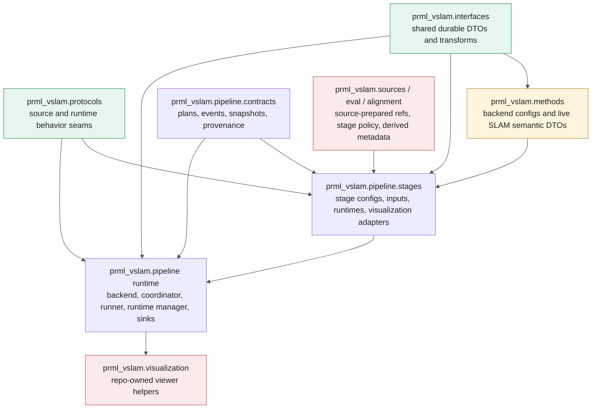
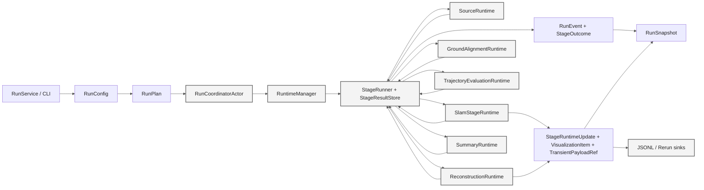

# Pipeline Stage Protocols And DTOs

This note complements [Interfaces And Contracts](./interfaces-and-contracts.md).
It documents the current executable linear pipeline slice and the typed
interfaces and DTO boundaries that matter when implementing a stage, backend,
or observer sink in the current worktree.

Current/target split: this file describes what is executable now. Target DTO
ownership, collapse/removal decisions, owning work packages, and deletion gates
live in [Pipeline DTO Migration Ledger](./pipeline-dto-migration-ledger.md) and
[Pipeline Stage Refactor Target Architecture](./pipeline-stage-refactor-target.md).
Refresh this file only when the executable code changes; do not turn it into
the target architecture.

The current source of truth for the executable slice is the code in:

- [`RunConfig.compile_plan()`](../../src/prml_vslam/pipeline/config.py)
- [`RunCoordinatorActor`](../../src/prml_vslam/pipeline/ray_runtime/coordinator.py)
- [`RuntimeManager`](../../src/prml_vslam/pipeline/runtime_manager.py)
- [`StageRunner`](../../src/prml_vslam/pipeline/runner.py)
- [`SnapshotProjector`](../../src/prml_vslam/pipeline/snapshot_projector.py)

The current executable stage slice is:

- `source`
- `slam`
- optional `gravity.align`
- optional `evaluate.trajectory`
- optional `reconstruction`
- `summary`

`evaluate.cloud` is still a planned/configurable diagnostic stage key, but it
does not currently register an executable runtime.

Historical note: the old `RuntimeStageProgram` / `StageCompletionPayload`
runtime-program path is no longer current executable code in this worktree.
Keep references to it in historical or migration documents only.

## How To Read This Note

- `runtime payload`: rich in-memory payload used inside a bounded or streaming
  execution boundary
- `transport-safe event`: strict durable model used across event-log and
  snapshot projection boundaries
- `durable artifact/provenance`: persisted manifest, artifact reference, or
  summary written under the run artifact root
- `transport-safe projection`: strict projected runtime state exposed to the
  app and CLI

## Ownership Map

## Core Stage And Protocol Seams

| Stage / boundary | Interface or seam | Owner | Consumes | Produces / emits |
| --- | --- | --- | --- | --- |
| planning | [`RunConfig.compile_plan()`](../../src/prml_vslam/pipeline/config.py) | `pipeline` | `RunConfig`, optional canonical SLAM backend config, `PathConfig` | [`RunPlan`](../../src/prml_vslam/pipeline/contracts/plan.py) |
| launch/runtime boundary | [`PipelineBackend.submit_run()`](../../src/prml_vslam/pipeline/backend.py) + [`RunService.start_run()`](../../src/prml_vslam/pipeline/run_service.py) | `pipeline` | `RunConfig`, optional runtime source injection | run id, snapshot/event/payload access |
| runtime construction | [`RuntimeManager`](../../src/prml_vslam/pipeline/runtime_manager.py) | `pipeline` | `RunPlan`, stage key, runtime factory registrations | [`StageRuntimeHandle`](../../src/prml_vslam/pipeline/stages/base/proxy.py), preflight diagnostics |
| source | [`SourceRuntime.run_offline()`](../../src/prml_vslam/sources/runtime.py) | `sources` | `SourceStageInput`, injected `OfflineSequenceSource` or `StreamingSequenceSource` | [`SourceStageOutput`](../../src/prml_vslam/sources/contracts.py), source [`StageResult`](../../src/prml_vslam/pipeline/stages/base/contracts.py) |
| slam (offline) | [`SlamStageRuntime.run_offline()`](../../src/prml_vslam/methods/stage/runtime.py) | `methods.stage` + `methods` | [`SlamOfflineStageInput`](../../src/prml_vslam/methods/stage/contracts.py), method backend config, output policy | [`SlamArtifacts`](../../src/prml_vslam/interfaces/slam.py), slam [`StageResult`](../../src/prml_vslam/pipeline/stages/base/contracts.py) |
| slam (streaming) | [`SlamStageRuntime.start_streaming()`](../../src/prml_vslam/methods/stage/runtime.py) + `submit_stream_item()` + `finish_streaming()` | `methods.stage` + `methods` | [`SlamStreamingStartStageInput`](../../src/prml_vslam/methods/stage/contracts.py), [`Observation`](../../src/prml_vslam/interfaces/observation.py), backend streaming session | [`StageRuntimeUpdate`](../../src/prml_vslam/pipeline/stages/base/contracts.py), final slam [`StageResult`](../../src/prml_vslam/pipeline/stages/base/contracts.py) |
| ground alignment | [`GroundAlignmentRuntime.run_offline()`](../../src/prml_vslam/alignment/stage/runtime.py) | `alignment.stage` + `alignment` | [`GroundAlignmentStageInput`](../../src/prml_vslam/alignment/stage/runtime.py), [`SlamArtifacts`](../../src/prml_vslam/interfaces/slam.py) | [`GroundAlignmentMetadata`](../../src/prml_vslam/interfaces/alignment.py), alignment [`StageResult`](../../src/prml_vslam/pipeline/stages/base/contracts.py) |
| trajectory evaluation | [`TrajectoryEvaluationRuntime.run_offline()`](../../src/prml_vslam/eval/stage_trajectory/runtime.py) | `eval.stage_trajectory` + `eval` | [`TrajectoryEvaluationStageInput`](../../src/prml_vslam/eval/stage_trajectory/runtime.py), [`SlamArtifacts`](../../src/prml_vslam/interfaces/slam.py), prepared references | trajectory metrics artifact, evaluation [`StageResult`](../../src/prml_vslam/pipeline/stages/base/contracts.py) |
| reconstruction | [`ReconstructionRuntime.run_offline()`](../../src/prml_vslam/reconstruction/stage/runtime.py) | `reconstruction.stage` + `reconstruction` | [`ReconstructionStageInput`](../../src/prml_vslam/reconstruction/stage/runtime.py), prepared RGB-D inputs | reconstruction metadata, reconstruction [`StageResult`](../../src/prml_vslam/pipeline/stages/base/contracts.py), reconstruction live updates |
| summary | [`SummaryRuntime.run_offline()`](../../src/prml_vslam/pipeline/stages/summary/runtime.py) | `pipeline.stages.summary` | [`SummaryStageInput`](../../src/prml_vslam/pipeline/stages/summary/runtime.py), ordered [`StageOutcome`](../../src/prml_vslam/pipeline/contracts/events.py) list | [`RunSummary`](../../src/prml_vslam/pipeline/contracts/provenance.py), [`StageManifest`](../../src/prml_vslam/pipeline/contracts/provenance.py) list, summary [`StageResult`](../../src/prml_vslam/pipeline/stages/base/contracts.py) |
| snapshot projection | [`SnapshotProjector.apply()`](../../src/prml_vslam/pipeline/snapshot_projector.py) + `apply_runtime_update()` | `pipeline` | durable [`RunEvent`](../../src/prml_vslam/pipeline/contracts/events.py), live [`StageRuntimeUpdate`](../../src/prml_vslam/pipeline/stages/base/contracts.py) | keyed [`RunSnapshot`](../../src/prml_vslam/pipeline/contracts/runtime.py) |
| observer payload resolution | [`RerunEventSink.observe_update()`](../../src/prml_vslam/visualization/rerun_sink.py) + [`PipelineBackend.read_payload()`](../../src/prml_vslam/pipeline/backend.py) | `pipeline` | [`StageRuntimeUpdate`](../../src/prml_vslam/pipeline/stages/base/contracts.py), [`TransientPayloadRef`](../../src/prml_vslam/pipeline/stages/base/handles.py) | repo-owned viewer side effects only |

## Linear Stage Contract Flow

The compiled stage order is deterministic. Stage enablement can shorten the
executed slice, but the stage-local runtime boundaries do not change.

## Current Stage Views

### Planning And Launch

- [`RunConfig`](../../src/prml_vslam/pipeline/config.py) is the canonical
  planning root and the backend-facing launch contract.
- [`PipelineBackend`](../../src/prml_vslam/pipeline/backend.py) is already
  `RunConfig`-first.
- [`RunService`](../../src/prml_vslam/pipeline/run_service.py),
  [`RayPipelineBackend`](../../src/prml_vslam/pipeline/backend_ray.py), and
  [`StageExecutionContext`](../../src/prml_vslam/pipeline/execution_context.py)
  now use the target `RunConfig` and stage-runtime inputs.
- [`StageKey`](../../src/prml_vslam/pipeline/contracts/stages.py) is the
  current executable vocabulary persisted into events and manifests:
  `source`, `slam`, `gravity.align`, `evaluate.trajectory`, `reconstruction`,
  `evaluate.cloud`, `summary`.

### Bounded Stage Runtimes

The bounded stage path is now stage-local and `StageResult`-based:

- the coordinator builds one [`RuntimeManager`](../../src/prml_vslam/pipeline/runtime_manager.py)
  for the current plan
- [`StageRunner`](../../src/prml_vslam/pipeline/runner.py) sequences bounded
  runtimes and stores results in [`StageResultStore`](../../src/prml_vslam/pipeline/runner.py)
- downstream input builders read typed payloads from that result store instead
  of a broad mutable completion bag

The main bounded inputs are:

- [`SourceStageInput`](../../src/prml_vslam/sources/runtime.py)
- [`SlamOfflineStageInput`](../../src/prml_vslam/methods/stage/contracts.py)
- [`GroundAlignmentStageInput`](../../src/prml_vslam/alignment/stage/runtime.py)
- [`TrajectoryEvaluationStageInput`](../../src/prml_vslam/eval/stage_trajectory/runtime.py)
- [`ReconstructionStageInput`](../../src/prml_vslam/reconstruction/stage/runtime.py)
- [`SummaryStageInput`](../../src/prml_vslam/pipeline/stages/summary/runtime.py)

### Streaming SLAM Hot Path

The current streaming path is split between:

- [`PacketSourceActor`](../../src/prml_vslam/pipeline/ray_runtime/stage_actors.py)
  for source read-loop and credit accounting
- [`SlamStageRuntime`](../../src/prml_vslam/methods/stage/runtime.py)
  for backend session lifecycle and final SLAM result
- [`StageRuntimeUpdate`](../../src/prml_vslam/pipeline/stages/base/contracts.py)
  for live semantic events, live status, and neutral visualization items

Live payload transport is backend-neutral:

- observers see [`TransientPayloadRef`](../../src/prml_vslam/pipeline/stages/base/handles.py)
  in [`VisualizationItem`](../../src/prml_vslam/pipeline/stages/base/contracts.py)
- app and CLI resolve those refs through
  [`RunService.read_payload()`](../../src/prml_vslam/pipeline/run_service.py)
  or the backend directly
- durable event logs do not carry live payload handles

### Durable Events And Snapshot Projection

The current durable event model is lifecycle/provenance only:

- [`RunEvent`](../../src/prml_vslam/pipeline/contracts/events.py) now contains
  run lifecycle, stage lifecycle, artifact registration, and terminal
  [`StageOutcome`](../../src/prml_vslam/pipeline/contracts/events.py) events
- [`StageRuntimeUpdate`](../../src/prml_vslam/pipeline/stages/base/contracts.py)
  carries live semantic events, live status, and visualization descriptors
- [`SnapshotProjector`](../../src/prml_vslam/pipeline/snapshot_projector.py)
  merges both into keyed [`RunSnapshot`](../../src/prml_vslam/pipeline/contracts/runtime.py)
  fields:
  `stage_outcomes`, `stage_runtime_status`, `live_refs`, and `artifacts`

### What Is Still Transitional

The current executable code is closer to the target than the old runtime
program path, but it is still mid-cutover in a few places:

- `RunConfig` compatibility still exists in launch and execution-context code
- `StageAvailability` is still present as a transitional planning DTO
- stage-key alias helpers and target/current key projection still live in
  [`pipeline/config.py`](../../src/prml_vslam/pipeline/config.py)
- planned source normalization in [`RunPlan`](../../src/prml_vslam/pipeline/contracts/plan.py)
  still accepts legacy request source variants while tests migrate

Those are migration contacts, not the desired long-term ownership model.
