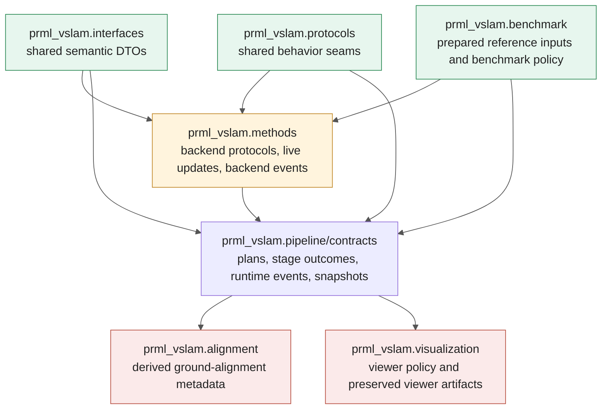
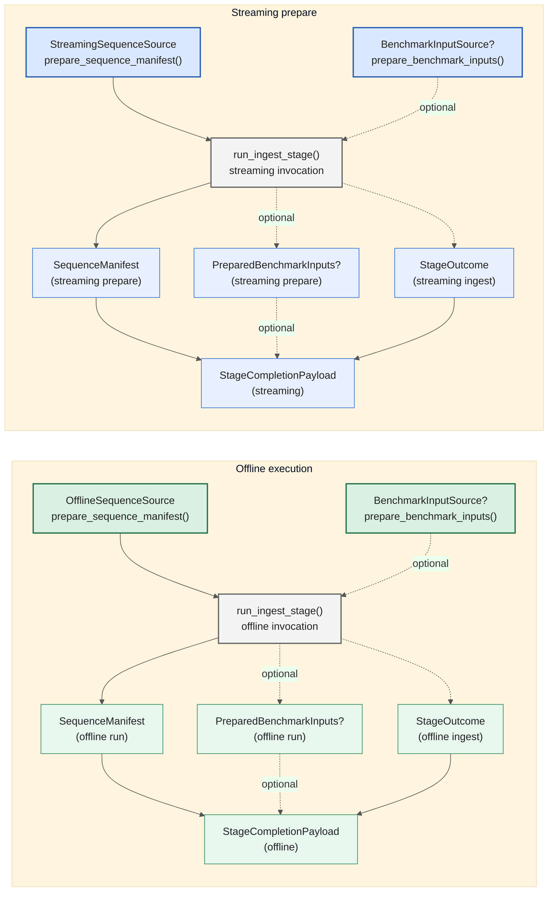
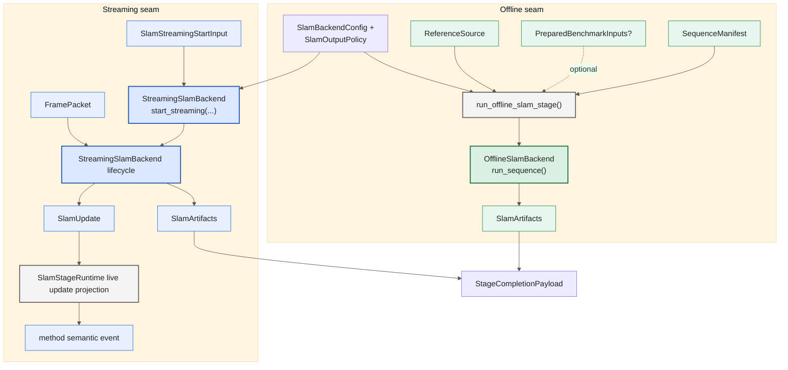
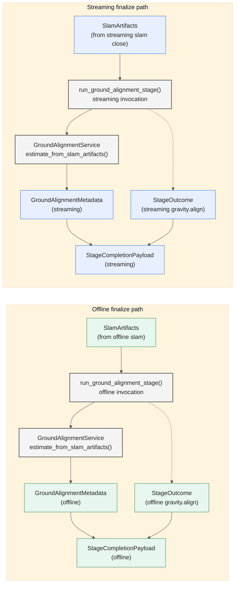
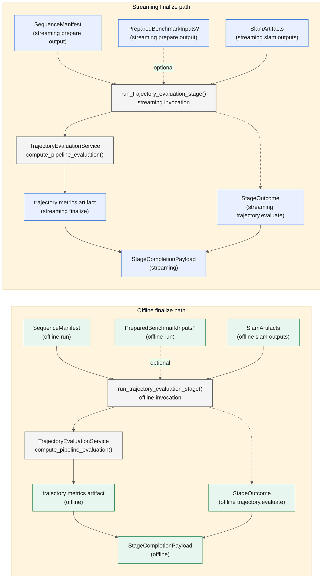
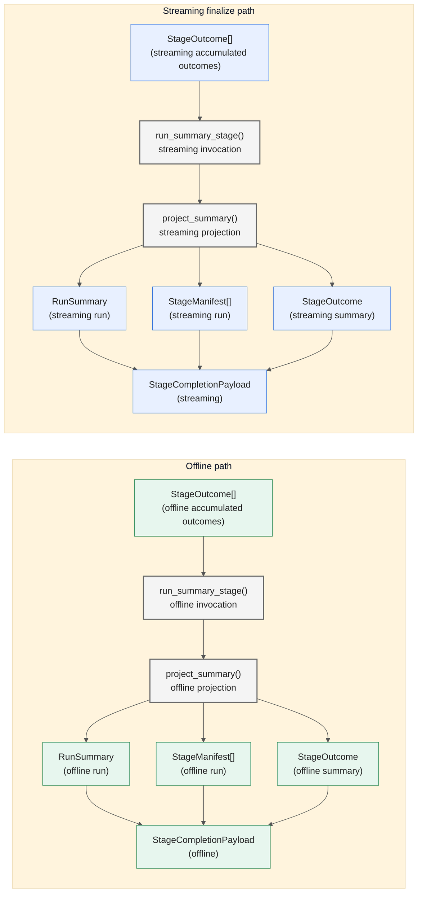

# Pipeline Stage Protocols And DTOs

This note complements [Interfaces And Contracts](./interfaces-and-contracts.md).
It documents the current executable linear pipeline slice and the typed
interfaces and DTO boundaries that matter when implementing a new stage or
backend.

Current/target split: this document describes current executable contracts.
Target DTO ownership, collapse/removal decisions, owning work packages, and
deletion gates live in
[Pipeline DTO Migration Ledger](./pipeline-dto-migration-ledger.md) and
[Pipeline Stage Refactor Target Architecture](./pipeline-stage-refactor-target.md).
Refresh this file only when the current executable code changes; do not turn it
into the target architecture.

The source of truth for what is actually executable remains the code in
[`StageRegistry.default()`][stage-registry-default] and
[`RuntimeStageProgram.default()`][runtime-stage-program-default]. The diagrams
below therefore show only the current executable slice:

- `ingest`
- `slam`
- optional `gravity.align`
- optional `trajectory.evaluate`
- `summary`

The typed placeholder stages `reference.reconstruct`, `cloud.evaluate`, and
`efficiency.evaluate` are intentionally omitted from the main flow because they
do not yet have runtime support.

## How To Read This Note

- `runtime payload`: rich in-memory payload used inside a live or bounded
  execution boundary
- `transport-safe event`: strict transport model used across Ray/runtime event
  boundaries
- `durable artifact/provenance`: persisted manifest, artifact reference, or
  summary written under the run artifact root
- `transport-safe projection`: strict projected runtime state exposed to the app
  and CLI

## Ownership Map

## Core Stage And Protocol Seams

| Stage / boundary | Interface or seam | Owner | Consumes | Produces / emits |
| --- | --- | --- | --- | --- |
| planning | [`RunRequest.build()`][run-request-build] + [`StageRegistry.compile()`][stage-registry-compile] | `pipeline` | [`RunRequest`][run-request], [`BackendDescriptor`][backend-descriptor], [`PathConfig`][path-config] | [`RunPlan`][run-plan] |
| ingest | [`OfflineSequenceSource.prepare_sequence_manifest()`][offline-sequence-source] + [`BenchmarkInputSource.prepare_benchmark_inputs()`][benchmark-input-source] + [`run_ingest_stage()`][run-ingest-stage] | `protocols` + `pipeline` | [`SourceSpec`][source-spec], stage output directory | [`SequenceManifest`][sequence-manifest], [`PreparedBenchmarkInputs`][prepared-benchmark-inputs], ingest [`StageOutcome`][stage-outcome] |
| slam (offline) | [`OfflineSlamBackend.run_sequence()`][offline-slam-backend] | `methods` | [`SequenceManifest`][sequence-manifest], [`PreparedBenchmarkInputs`][prepared-benchmark-inputs], [`ReferenceSource`][reference-source], [`SlamBackendConfig`][slam-backend-config], [`SlamOutputPolicy`][slam-output-policy], `artifact_root` | [`SlamArtifacts`][slam-artifacts] |
| slam (streaming start) | [`StreamingSlamBackend.start_streaming(...)`][streaming-slam-backend] | `methods` | [`SlamStreamingStartInput`][slam-session-init], [`SlamBackendConfig`][slam-backend-config], [`SlamOutputPolicy`][slam-output-policy], `artifact_root` | [`StreamingSlamBackend lifecycle`][slam-session] |
| slam (streaming hot path) | [`StreamingSlamBackend.step_streaming()`][slam-session] + [`StreamingSlamBackend.drain_streaming_updates()`][slam-session] + [`SlamStageRuntime live update projection`][live-update-projection] | `methods` | [`FramePacket`][frame-packet], [`SlamUpdate`][slam-update], transient handles | [`StageRuntimeUpdate.semantic_events`][stage-runtime-update] |
| ground alignment | [`GroundAlignmentService.estimate_from_slam_artifacts()`][ground-alignment-service] + [`run_ground_alignment_stage()`][run-ground-alignment-stage] | `alignment` + `pipeline` | [`SlamArtifacts`][slam-artifacts] | [`GroundAlignmentMetadata`][ground-alignment-metadata], ground-alignment [`StageOutcome`][stage-outcome] |
| trajectory evaluation | [`TrajectoryEvaluationService.compute_pipeline_evaluation()`][trajectory-evaluation-service] + [`run_trajectory_evaluation_stage()`][run-trajectory-evaluation-stage] | `eval` + `pipeline` | [`SequenceManifest`][sequence-manifest], [`PreparedBenchmarkInputs`][prepared-benchmark-inputs], [`SlamArtifacts`][slam-artifacts] | trajectory metrics artifact, trajectory [`StageOutcome`][stage-outcome] |
| summary | [`project_summary()`][project-summary] + [`run_summary_stage()`][run-summary-stage] | `pipeline` | [`StageOutcome[]`][stage-outcome] | [`RunSummary`][run-summary], [`StageManifest[]`][stage-manifest], summary [`StageOutcome`][stage-outcome] |

## Linear Stage Contract Flow

```mermaid
%%{init: {
  "theme": "base",
  "themeVariables": {
    "fontSize": "17px",
    "primaryColor": "#ECECFF",
    "primaryBorderColor": "#9370DB",
    "lineColor": "#555555",
    "tertiaryColor": "#FFF4DD"
  }
}}%%
flowchart LR
    Request["RunRequest<br/>entry contract"]
    Descriptor["BackendDescriptor<br/>backend capability metadata"]
    Planner["RunRequest.build()<br/>StageRegistry.compile()"]
    Plan["RunPlan<br/>ordered executable slice"]

    Source["SourceSpec<br/>selected source contract"]
    Ingest["ingest<br/>OfflineSequenceSource.prepare_sequence_manifest()<br/>run_ingest_stage()"]
    Manifest["SequenceManifest +<br/>PreparedBenchmarkInputs"]
    Slam["slam<br/>OfflineSlamBackend.run_sequence()<br/>or StreamingSlamBackend.start_streaming(...)"]
    Artifacts["SlamArtifacts<br/>normalized SLAM bundle"]
    Ground["gravity.align (optional)<br/>GroundAlignmentService<br/>run_ground_alignment_stage()"]
    Alignment["GroundAlignmentMetadata<br/>derived alignment bundle"]
    Trajectory["trajectory.evaluate (optional)<br/>TrajectoryEvaluationService<br/>run_trajectory_evaluation_stage()"]
    Metrics["trajectory metrics artifact<br/>evaluation output"]
    Outcomes["StageOutcome[]<br/>terminal stage results"]
    Summary["summary<br/>project_summary()<br/>run_summary_stage()"]
    Final["RunSummary + StageManifest[]<br/>durable run provenance"]

    Request -->|"RunRequest"| Planner
    Descriptor -->|"BackendDescriptor"| Planner
    Planner -->|"RunPlan"| Plan

    Plan -->|"plan order"| Ingest
    Ingest -->|"plan order"| Slam
    Slam -->|"plan order"| Ground
    Ground -->|"plan order"| Trajectory
    Trajectory -->|"plan order"| Summary

    Source -->|"SourceSpec"| Ingest
    Ingest -->|"SequenceManifest + PreparedBenchmarkInputs"| Manifest
    Manifest -->|"SequenceManifest + PreparedBenchmarkInputs"| Slam
    Slam -->|"SlamArtifacts"| Artifacts
    Artifacts -->|"SlamArtifacts"| Ground
    Ground -->|"GroundAlignmentMetadata"| Alignment
    Manifest -->|"SequenceManifest + PreparedBenchmarkInputs"| Trajectory
    Artifacts -->|"SlamArtifacts"| Trajectory
    Trajectory -->|"trajectory metrics artifact"| Metrics

    Ingest -.->|"StageOutcome"| Outcomes
    Slam -.->|"StageOutcome"| Outcomes
    Ground -.->|"StageOutcome"| Outcomes
    Trajectory -.->|"StageOutcome"| Outcomes
    Outcomes -->|"StageOutcome[]"| Summary
    Summary -->|"RunSummary + StageManifest[]"| Final

    classDef compute fill:#F4F4F4,stroke:#666666,stroke-width:2px,color:#222222;
    classDef sharedData fill:#ECECFF,stroke:#9370DB,color:#222222;
    classDef contractData fill:#FFF4DD,stroke:#C28A2C,color:#222222;

    class Request,Descriptor,Plan,Source,Manifest,Artifacts,Alignment,Metrics,Outcomes,Final sharedData;
    class Planner,Ingest,Slam,Ground,Trajectory,Summary compute;

    click Request "../../src/prml_vslam/pipeline/contracts/request.py#L189" "RunRequest"
    click Descriptor "../../src/prml_vslam/methods/descriptors.py#L21" "BackendDescriptor"
    click Plan "../../src/prml_vslam/pipeline/contracts/plan.py#L31" "RunPlan"
    click Source "../../src/prml_vslam/pipeline/contracts/request.py#L100" "SourceSpec"
    click Manifest "../../src/prml_vslam/interfaces/ingest.py#L43" "SequenceManifest"
    click Artifacts "../../src/prml_vslam/interfaces/slam.py#L30" "SlamArtifacts"
    click Alignment "../../src/prml_vslam/interfaces/alignment.py#L29" "GroundAlignmentMetadata"
    click Outcomes "../../src/prml_vslam/pipeline/contracts/events.py#L47" "StageOutcome"
    click Final "../../src/prml_vslam/pipeline/contracts/provenance.py#L59" "RunSummary"
```

`gravity.align` and `trajectory.evaluate` are individually request-gated. When a
gate is disabled, the compiled plan shortens, but the typed stage boundaries do
not change.

## Stage Views

The diagrams below zoom in on each executable pipeline stage. Each stage view
shows the stage-local protocol boundary, the main stage DTOs, and the direct
handoff into [`StageCompletionPayload`][stage-completion-payload], which is the
runtime program’s only cross-stage handoff bundle.

In these stage-local diagrams:

- green nodes are offline-mode interfaces and DTOs
- blue nodes are streaming-mode interfaces and DTOs
- lavender nodes are shared or mode-agnostic DTOs or handoff bundles
- gray nodes are compute, service, or stage-execution nodes

### `ingest`

[`run_ingest_stage()`][run-ingest-stage] is the normalized source-ingest seam.
It consumes a planned [`SourceSpec`][source-spec] through the shared source
protocols, materializes the canonical [`SequenceManifest`][sequence-manifest],
and optionally prepares [`PreparedBenchmarkInputs`][prepared-benchmark-inputs]
when the source also implements [`BenchmarkInputSource`][benchmark-input-source].

### `slam`

The `slam` stage has two execution seams. Offline execution enters through
[`run_offline_slam_stage()`][run-offline-slam-stage] and the
[`OfflineSlamBackend`][offline-slam-backend] protocol. Streaming execution
starts with [`StreamingSlamBackend.start_streaming(...)`][streaming-slam-backend],
then flows through [`StreamingSlamBackend lifecycle`][slam-session], [`SlamUpdate`][slam-update],
and [`method semantic event`][stage-runtime-update] before both modes converge on
[`SlamArtifacts`][slam-artifacts] and [`StageCompletionPayload`][stage-completion-payload].

### `gravity.align`

[`run_ground_alignment_stage()`][run-ground-alignment-stage] is a derived
artifact stage. It does not mutate the native SLAM outputs in place. Instead it
interprets [`SlamArtifacts`][slam-artifacts] through
[`GroundAlignmentService.estimate_from_slam_artifacts()`][ground-alignment-service]
and persists a separate [`GroundAlignmentMetadata`][ground-alignment-metadata]
bundle.

### `trajectory.evaluate`

[`run_trajectory_evaluation_stage()`][run-trajectory-evaluation-stage] consumes
the normalized ingest boundary, the prepared benchmark-side references, and the
normalized SLAM outputs. It delegates the metric computation to
[`TrajectoryEvaluationService.compute_pipeline_evaluation()`][trajectory-evaluation-service]
and returns a stage-local wrapper plus terminal [`StageOutcome`][stage-outcome].

### `summary`

[`run_summary_stage()`][run-summary-stage] is projection-only. It does not
rerun metrics or reopen upstream backends. Instead it reduces the accumulated
[`StageOutcome`][stage-outcome] list through
[`project_summary()`][project-summary] into the final
[`RunSummary`][run-summary], [`StageManifest`][stage-manifest] list, and the
summary-stage terminal outcome.

## Streaming Translation Seam

```mermaid
%%{init: {
  "theme": "base",
  "themeVariables": {
    "fontSize": "17px",
    "primaryColor": "#ECECFF",
    "primaryBorderColor": "#9370DB",
    "lineColor": "#555555",
    "tertiaryColor": "#FFF4DD"
  }
}}%%
flowchart LR
    Stream["FramePacketStream<br/>shared source protocol"]
    Packet["FramePacket<br/>repo-wide runtime DTO"]
    Session["StreamingSlamBackend.step_streaming()<br/>StreamingSlamBackend.drain_streaming_updates()"]
    Update["SlamUpdate<br/>method-owned live DTO"]
    PayloadRefs["TransientPayloadRef<br/>runtime-only image/depth/pointmap refs"]
    Translate["SlamStageRuntime live update projection<br/>pipeline/stages/slam/runtime.py"]
    Events["method semantic events<br/>PoseEstimated, KeyframeAccepted, ..."]
    Visuals["VisualizationItem[]<br/>neutral sink descriptors"]
    UpdateEnvelope["StageRuntimeUpdate<br/>live observer envelope"]
    Projector["SnapshotProjector.apply_runtime_update()<br/>live projection"]
    Snapshot["RunSnapshot<br/>keyed live projection"]

    Stream -->|"FramePacket"| Packet
    Packet -->|"step(frame)"| Session
    Session -->|"SlamUpdate[]"| Update
    Update -->|"SlamUpdate"| Translate

    Update -.->|"image_rgb / depth_map / pointmap / preview_rgb"| PayloadRefs
    PayloadRefs -.->|"named payload refs"| Translate

    Translate -->|"semantic_events"| Events
    Translate -->|"visualizations"| Visuals
    Events --> UpdateEnvelope
    Visuals --> UpdateEnvelope
    UpdateEnvelope -->|"live update only"| Projector
    Projector -->|"RunSnapshot"| Snapshot

    classDef compute fill:#F4F4F4,stroke:#666666,stroke-width:2px,color:#222222;
    classDef streamingData fill:#E8F0FF,stroke:#2F6FDB,color:#222222;
    classDef streamingInterface fill:#DCE8FF,stroke:#1F57B5,stroke-width:2px,color:#222222;
    classDef sharedData fill:#ECECFF,stroke:#9370DB,color:#222222;
    classDef transientData fill:#F7F7F7,stroke:#888888,stroke-dasharray: 4 2,color:#222222;

    class Stream,Session streamingInterface;
    class Packet,Update,Events,Visuals streamingData;
    class UpdateEnvelope,Snapshot sharedData;
    class PayloadRefs transientData;
    class Translate,Projector compute;

    click Stream "../../src/prml_vslam/protocols/runtime.py#L10" "FramePacketStream"
    click Packet "../../src/prml_vslam/interfaces/runtime.py#L68" "FramePacket"
    click Session "../../src/prml_vslam/methods/protocols.py#L18" "StreamingSlamBackend lifecycle"
    click Update "../../src/prml_vslam/methods/contracts.py#L13" "SlamUpdate"
    click PayloadRefs "../../src/prml_vslam/pipeline/stages/base/handles.py#L13" "TransientPayloadRef"
    click Events "../../src/prml_vslam/methods/contracts.py#L38" "method semantic events"
    click Visuals "../../src/prml_vslam/pipeline/stages/base/contracts.py#L90" "VisualizationItem"
    click UpdateEnvelope "../../src/prml_vslam/pipeline/stages/base/contracts.py#L137" "StageRuntimeUpdate"
    click Projector "../../src/prml_vslam/pipeline/snapshot_projector.py#L42" "SnapshotProjector"
    click Snapshot "../../src/prml_vslam/pipeline/contracts/runtime.py#L34" "RunSnapshot"
```

This is the critical layering seam for streaming implementations:

- [`FramePacket`][frame-packet] is the repo-wide runtime DTO shared by replay
  and live ingress.
- [`SlamUpdate`][slam-update] is the method-owned live DTO emitted by a backend
  session.
- Method semantic events are package-local live DTOs carried inside
  [`StageRuntimeUpdate`][stage-runtime-update].
- [`RunSnapshot`][run-snapshot] projects durable events plus live runtime
  updates; it is not a second mutable source of truth.

## DTO Tables

### [`FramePacket`][frame-packet]

| Field | Type | Owner | Appears at | Persistence | Frame semantics / notes |
| --- | --- | --- | --- | --- | --- |
| `seq` | `int` | `interfaces` | ingress, [`FramePacketStream`][frame-packet-stream] -> [`StreamingSlamBackend.step_streaming()`][slam-session] | runtime payload | Source-frame sequence number. |
| `timestamp_ns` | `int` | `interfaces` | ingress, [`FramePacketStream`][frame-packet-stream] -> [`StreamingSlamBackend.step_streaming()`][slam-session] | runtime payload | Source timestamp in nanoseconds. |
| `arrival_timestamp_s` | `float \| None` | `interfaces` | ingress | runtime payload | Local arrival timestamp when the transport records one. |
| `rgb` | `NDArray[np.uint8] \| None` | `interfaces` | ingress, streaming hot path | runtime payload | Source-frame RGB raster. |
| `depth` | `NDArray[np.float32] \| None` | `interfaces` | ingress, streaming hot path | runtime payload | Depth raster aligned with the packet raster. |
| `confidence` | `NDArray[np.float32] \| None` | `interfaces` | ingress, streaming hot path | runtime payload | Optional sensor-confidence raster aligned with `depth`. |
| `pointmap` | `NDArray[np.float32] \| None` | `interfaces` | ingress, streaming hot path | runtime payload | Optional XYZ payload aligned with the emitted frame when a source exposes it. |
| `intrinsics` | [`CameraIntrinsics`][camera-intrinsics] \| `None` | `interfaces` | ingress, streaming hot path | runtime payload | Camera model for the packet raster. |
| `pose` | [`FrameTransform`][frame-transform] \| `None` | `interfaces` | ingress, streaming hot path | runtime payload | Canonical runtime pose; default repo convention is `camera -> world`. |
| `provenance` | [`FramePacketProvenance`][frame-packet-provenance] | `interfaces` | ingress, streaming hot path | runtime payload | Typed source, dataset, transport, and replay metadata. |

### [`SequenceManifest`][sequence-manifest]

| Field | Type | Owner | Appears at | Persistence | Frame semantics / notes |
| --- | --- | --- | --- | --- | --- |
| `sequence_id` | `str` | `pipeline` | ingest output, offline/streaming startup | durable artifact/provenance | Stable sequence identifier across downstream artifacts. |
| `dataset_id` | [`DatasetId`][dataset-id] \| `None` | `pipeline` | ingest output, offline/streaming startup | durable artifact/provenance | Present when the source came from a repository-owned dataset. |
| `dataset_serving` | [`DatasetServingConfig`][dataset-serving-config] \| `None` | `pipeline` | ingest output, offline/streaming startup | durable artifact/provenance | Preserves typed dataset-serving semantics from the request surface. |
| `video_path` | `Path \| None` | `pipeline` | ingest output, offline/streaming startup | durable artifact/provenance | Original source video path when one exists. |
| `rgb_dir` | `Path \| None` | `pipeline` | ingest output, offline/streaming startup | durable artifact/provenance | Canonical materialized RGB frame directory. |
| `timestamps_path` | `Path \| None` | `pipeline` | ingest output, offline/streaming startup | durable artifact/provenance | Canonical normalized frame timestamps. |
| `intrinsics_path` | `Path \| None` | `pipeline` | ingest output, offline/streaming startup | durable artifact/provenance | Canonical calibration or intrinsics path. |
| `rotation_metadata_path` | `Path \| None` | `pipeline` | ingest output, offline/streaming startup | durable artifact/provenance | Source-rotation side metadata used by offline ingest. |
| `advio` | [`AdvioManifestAssets`][advio-manifest-assets] \| `None` | `pipeline` | ingest output, offline/streaming startup | durable artifact/provenance | ADVIO-specific assets, including intrinsics, `T_cam_imu`, pose refs, and optional Tango payload indexes. |

### [`PreparedBenchmarkInputs`][prepared-benchmark-inputs]

| Field | Type | Owner | Appears at | Persistence | Frame semantics / notes |
| --- | --- | --- | --- | --- | --- |
| `reference_trajectories` | list of [`ReferenceTrajectoryRef`][reference-trajectory-ref] | `benchmark` | ingest output, slam input, evaluation input | durable artifact/provenance | Prepared normalized TUM references keyed by source. |
| `reference_clouds` | list of [`ReferenceCloudRef`][reference-cloud-ref] | `benchmark` | ingest output, future dense-cloud work | durable artifact/provenance | Static reference clouds carry explicit target-frame and coordinate-status metadata. |
| `reference_point_cloud_sequences` | list of [`ReferencePointCloudSequenceRef`][reference-point-cloud-sequence-ref] | `benchmark` | ingest output, mock replay-style backends | durable artifact/provenance | Step-wise point-cloud streams carry `target_frame`, `native_frame`, and coordinate-status metadata. |

### [`SlamStreamingStartInput`][slam-session-init]

| Field | Type | Owner | Appears at | Persistence | Frame semantics / notes |
| --- | --- | --- | --- | --- | --- |
| `sequence_manifest` | [`SequenceManifest`][sequence-manifest] | `methods` | streaming startup, [`StreamingSlamBackend.start_streaming(...)`][streaming-slam-backend] | runtime payload | Prepared normalized sequence boundary for the run. |
| `benchmark_inputs` | [`PreparedBenchmarkInputs`][prepared-benchmark-inputs] \| `None` | `methods` | streaming startup, [`StreamingSlamBackend.start_streaming(...)`][streaming-slam-backend] | runtime payload | Prepared benchmark-side references available before the first live frame arrives. |
| `baseline_source` | [`ReferenceSource`][reference-source] | `methods` | streaming startup, [`StreamingSlamBackend.start_streaming(...)`][streaming-slam-backend] | runtime payload | Selected benchmark-aware trajectory source, default `ground_truth`. |

### [`SlamUpdate`][slam-update]

| Field | Type | Owner | Appears at | Persistence | Frame semantics / notes |
| --- | --- | --- | --- | --- | --- |
| `seq` | `int` | `methods` | [`StreamingSlamBackend.drain_streaming_updates()`][slam-session] -> [`SlamStageRuntime live update projection`][live-update-projection] | runtime payload | Update sequence number in backend view order. |
| `timestamp_ns` | `int` | `methods` | [`StreamingSlamBackend.drain_streaming_updates()`][slam-session] -> [`SlamStageRuntime live update projection`][live-update-projection] | runtime payload | Update timestamp in nanoseconds. |
| `source_seq` | `int \| None` | `methods` | [`StreamingSlamBackend.drain_streaming_updates()`][slam-session] -> [`SlamStageRuntime live update projection`][live-update-projection] | runtime payload | Source packet sequence number when explicit. |
| `source_timestamp_ns` | `int \| None` | `methods` | [`StreamingSlamBackend.drain_streaming_updates()`][slam-session] -> [`SlamStageRuntime live update projection`][live-update-projection] | runtime payload | Source packet timestamp when explicit. |
| `is_keyframe` | `bool` | `methods` | [`StreamingSlamBackend.drain_streaming_updates()`][slam-session] -> [`SlamStageRuntime live update projection`][live-update-projection] | runtime payload | Whether the backend accepted this update as a keyframe. |
| `keyframe_index` | `int \| None` | `methods` | [`StreamingSlamBackend.drain_streaming_updates()`][slam-session] -> [`SlamStageRuntime live update projection`][live-update-projection] | runtime payload | Accepted keyframe index in backend view order. |
| `pose` | [`FrameTransform`][frame-transform] \| `None` | `methods` | [`StreamingSlamBackend.drain_streaming_updates()`][slam-session] -> [`SlamStageRuntime live update projection`][live-update-projection] | runtime payload | Canonical pose estimate; runtime convention remains `camera -> world`. |
| `num_sparse_points` | `int` | `methods` | [`StreamingSlamBackend.drain_streaming_updates()`][slam-session] -> [`SlamStageRuntime live update projection`][live-update-projection] | runtime payload | Sparse map size telemetry. |
| `num_dense_points` | `int` | `methods` | [`StreamingSlamBackend.drain_streaming_updates()`][slam-session] -> [`SlamStageRuntime live update projection`][live-update-projection] | runtime payload | Dense reconstruction size telemetry. |
| `pointmap` | `NDArray[np.float32] \| None` | `methods` | `StreamingSlamBackend.drain_streaming_updates()` -> transient handles | runtime payload | Camera-local accepted-keyframe pointmap. For ViSTA this stays in the model raster and ViSTA RDF camera basis, not world space. |
| `camera_intrinsics` | [`CameraIntrinsics`][camera-intrinsics] \| `None` | `methods` | [`StreamingSlamBackend.drain_streaming_updates()`][slam-session] -> [`SlamStageRuntime live update projection`][live-update-projection] | runtime payload | Intrinsics for the accepted-keyframe raster. For ViSTA this is the preprocessed model raster, not the original source raster. |
| `image_rgb` | `NDArray[np.uint8] \| None` | `methods` | `StreamingSlamBackend.drain_streaming_updates()` -> transient handles | runtime payload | Accepted-keyframe RGB image on the backend/model raster. |
| `depth_map` | `NDArray[np.float32] \| None` | `methods` | `StreamingSlamBackend.drain_streaming_updates()` -> transient handles | runtime payload | Accepted-keyframe depth raster on the backend/model raster; not the final fused dense cloud. |
| `preview_rgb` | `NDArray[np.uint8] \| None` | `methods` | `StreamingSlamBackend.drain_streaming_updates()` -> transient handles | runtime payload | Diagnostic preview image; ViSTA uses a pseudo-colored pointmap preview. |
| `pose_updated` | `bool` | `methods` | [`StreamingSlamBackend.drain_streaming_updates()`][slam-session] -> [`SlamStageRuntime live update projection`][live-update-projection] | runtime payload | Whether `pose` is fresh from a new backend step. |
| `backend_warnings` | `list[str]` | `methods` | [`StreamingSlamBackend.drain_streaming_updates()`][slam-session] -> [`SlamStageRuntime live update projection`][live-update-projection] | runtime payload | Non-fatal warnings attached to the update. |

### [`method semantic event`][stage-runtime-update] Variants

| Variant | Field | Type | Owner | Appears at | Persistence | Frame semantics / notes |
| --- | --- | --- | --- | --- | --- | --- |
| `PoseEstimated` | `kind` | `Literal["pose.estimated"]` | `methods` | [`SlamStageRuntime live update projection`][live-update-projection] -> [`StageRuntimeUpdate.semantic_events`][stage-runtime-update] | live observer update | Discriminates the pose-estimate event variant. |
| `PoseEstimated` | `seq`, `timestamp_ns`, `source_seq`, `source_timestamp_ns` | scalar fields | `methods` | same as above | live observer update | Update and optional source-packet identity. |
| `PoseEstimated` | `pose` | [`FrameTransform`][frame-transform] | `methods` | same as above | live observer update | Canonical pose estimate, default runtime convention `camera -> world`. |
| `PoseEstimated` | `pose_updated` | `bool` | `methods` | same as above | live observer update | Whether the pose changed on this step. |
| `KeyframeAccepted` | `kind` | `Literal["keyframe.accepted"]` | `methods` | [`SlamStageRuntime live update projection`][live-update-projection] -> [`StageRuntimeUpdate.semantic_events`][stage-runtime-update] | live observer update | Discriminates the keyframe-acceptance event variant. |
| `KeyframeAccepted` | `seq`, `timestamp_ns`, `keyframe_index`, `accepted_keyframe_count`, `backend_fps` | scalar fields | `methods` | same as above | live observer update | Keyframe identity and rolling backend telemetry. |
| `MapStatsUpdated` | `kind` | `Literal["map.stats"]` | `methods` | [`SlamStageRuntime live update projection`][live-update-projection] -> [`StageRuntimeUpdate.semantic_events`][stage-runtime-update] | live observer update | Discriminates the map-stats variant. |
| `MapStatsUpdated` | `seq`, `timestamp_ns`, `num_sparse_points`, `num_dense_points` | scalar fields | `methods` | same as above | live observer update | Sparse and dense map-size telemetry. |
| `BackendWarning` | `kind`, `message`, `seq`, `timestamp_ns` | scalar fields | `methods` | [`SlamStageRuntime live update projection`][live-update-projection] -> [`StageRuntimeUpdate.semantic_events`][stage-runtime-update] | live observer update | Non-fatal backend warning. |
| `BackendError` | `kind`, `message`, `seq`, `timestamp_ns` | scalar fields | `methods` | [`SlamStageRuntime live update projection`][live-update-projection] -> [`StageRuntimeUpdate.semantic_events`][stage-runtime-update] | live observer update | Fatal or actionable backend error. |
| `SessionClosed` | `kind`, `artifact_keys` | scalar fields | `methods` | session teardown -> [`StageRuntimeUpdate.semantic_events`][stage-runtime-update] | live observer update | Terminal session notice listing artifact keys. |
| `VisualizationItem` | `intent`, `role`, `payload_refs`, `pose`, `intrinsics`, `frame_index`, `keyframe_index`, `space`, `metadata` | generic visualization descriptor | `pipeline` | [`SlamVisualizationAdapter`][slam-visualization-adapter] -> [`StageRuntimeUpdate.visualizations`][stage-runtime-update] | live observer update | Neutral sink-facing descriptor. It carries `TransientPayloadRef`s, not arrays or Rerun SDK fields. |

### [`SlamArtifacts`][slam-artifacts]

| Field | Type | Owner | Appears at | Persistence | Frame semantics / notes |
| --- | --- | --- | --- | --- | --- |
| `trajectory_tum` | [`ArtifactRef`][artifact-ref] | `pipeline` | `slam` output, downstream stages, final summary | durable artifact/provenance | Canonical normalized TUM trajectory artifact. |
| `sparse_points_ply` | [`ArtifactRef`][artifact-ref] \| `None` | `pipeline` | `slam` output, `gravity.align`, future dense/sparse evaluation | durable artifact/provenance | Optional sparse geometry artifact in repository-owned PLY form. |
| `dense_points_ply` | [`ArtifactRef`][artifact-ref] \| `None` | `pipeline` | `slam` output, `gravity.align`, future dense evaluation | durable artifact/provenance | Optional dense world-space point cloud artifact in repository-owned PLY form. |
| `extras` | dict[`str`, [`ArtifactRef`][artifact-ref]] | `pipeline` | `slam` output, downstream provenance | durable artifact/provenance | Preserved backend-specific outputs that do not widen the core stage contract. |

### [`StageOutcome`][stage-outcome]

| Field | Type | Owner | Appears at | Persistence | Frame semantics / notes |
| --- | --- | --- | --- | --- | --- |
| `stage_key` | [`StageKey`][stage-key] | `pipeline` | every terminal stage result | durable artifact/provenance | Stable stage identifier. |
| `status` | [`StageStatus`][stage-status] | `pipeline` | every terminal stage result | durable artifact/provenance | Final stage status shared with manifests and summaries. |
| `config_hash` | `str` | `pipeline` | every terminal stage result | durable artifact/provenance | Fingerprint of the relevant stage configuration. |
| `input_fingerprint` | `str` | `pipeline` | every terminal stage result | durable artifact/provenance | Fingerprint of the stage inputs. |
| `artifacts` | dict[`str`, [`ArtifactRef`][artifact-ref]] | `pipeline` | every terminal stage result | durable artifact/provenance | Named materialized outputs produced or reused by the stage. |
| `metrics` | `dict[str, float \| int \| str]` | `pipeline` | every terminal stage result | durable artifact/provenance | Stage-local scalar metrics, such as ground-alignment confidence or candidate count. |
| `error_message` | `str` | `pipeline` | failed or skipped terminal stage result | durable artifact/provenance | Human-readable failure or block reason when present. |

### [`RunSnapshot`][run-snapshot]

| Field | Type | Owner | Appears at | Persistence | Frame semantics / notes |
| --- | --- | --- | --- | --- | --- |
| `run_id` | `str` | `pipeline` | [`SnapshotProjector`][snapshot-projector] output, app/CLI reads | transport-safe projection | Stable run identifier. |
| `state` | [`RunState`][run-state] | `pipeline` | [`SnapshotProjector`][snapshot-projector] output, app/CLI reads | transport-safe projection | Lifecycle state (`idle`, `preparing`, `running`, `completed`, `stopped`, `failed`). |
| `plan` | [`RunPlan`][run-plan] \| `None` | `pipeline` | [`SnapshotProjector`][snapshot-projector] output, app/CLI reads | transport-safe projection | Compiled ordered stage plan. |
| `current_stage_key` | [`StageKey`][stage-key] \| `None` | `pipeline` | [`SnapshotProjector`][snapshot-projector] output, app/CLI reads | transport-safe projection | Currently active stage when one is running. |
| `stage_outcomes` | dict[[`StageKey`][stage-key], [`StageOutcome`][stage-outcome]] | `pipeline` | [`SnapshotProjector`][snapshot-projector] output, app/CLI reads | transport-safe projection | Terminal outcomes keyed by stage. |
| `stage_runtime_status` | dict[[`StageKey`][stage-key], [`StageRuntimeStatus`][stage-runtime-status]] | `pipeline` | [`SnapshotProjector`][snapshot-projector] output, app/CLI reads | transport-safe projection | Live status keyed by stage. |
| `live_refs` | dict[[`StageKey`][stage-key], dict[`str`, [`TransientPayloadRef`][transient-payload-ref]]] | `pipeline` | [`SnapshotProjector.apply_runtime_update()`][snapshot-projector] output, app/CLI reads | transport-safe projection | Live-only payload refs keyed by stage and semantic slot. |
| `artifacts` | dict[`str`, [`ArtifactRef`][artifact-ref]] | `pipeline` | [`SnapshotProjector`][snapshot-projector] output, app/CLI reads | transport-safe projection | Registered artifacts seen so far. |
| `last_event_id` | `str \| None` | `pipeline` | [`SnapshotProjector`][snapshot-projector] output, app/CLI reads | transport-safe projection | Most recent applied event id. |
| `error_message` | `str` | `pipeline` | [`SnapshotProjector`][snapshot-projector] output, app/CLI reads | transport-safe projection | Projected error message for failed runs or stages. |
| `active_executor` | `str \| None` | `pipeline` | [`SnapshotProjector`][snapshot-projector] output, app/CLI reads | transport-safe projection | Active runtime executor, currently `ray`. |
| `last_event_kind` | `str \| None` | `pipeline` | [`SnapshotProjector`][snapshot-projector] output, app/CLI reads | transport-safe projection | Most recent applied event kind. |

[stage-registry-default]: ../../src/prml_vslam/pipeline/stage_registry.py#L125
[runtime-stage-program-default]: ../../src/prml_vslam/pipeline/ray_runtime/stage_program.py#L132
[run-request-build]: ../../src/prml_vslam/pipeline/contracts/request.py#L222
[stage-registry-compile]: ../../src/prml_vslam/pipeline/stage_registry.py#L74
[run-request]: ../../src/prml_vslam/pipeline/contracts/request.py#L189
[backend-descriptor]: ../../src/prml_vslam/methods/descriptors.py#L21
[path-config]: ../../src/prml_vslam/utils/path_config.py#L125
[run-plan]: ../../src/prml_vslam/pipeline/contracts/plan.py#L31
[source-spec]: ../../src/prml_vslam/pipeline/contracts/request.py#L100
[offline-sequence-source]: ../../src/prml_vslam/protocols/source.py#L17
[benchmark-input-source]: ../../src/prml_vslam/protocols/source.py#L27
[run-ingest-stage]: ../../src/prml_vslam/pipeline/ray_runtime/stage_execution.py#L60
[ingest-stage-result]: ../../src/prml_vslam/pipeline/ray_runtime/common.py#L35
[sequence-manifest]: ../../src/prml_vslam/interfaces/ingest.py#L43
[prepared-benchmark-inputs]: ../../src/prml_vslam/interfaces/ingest.py#L86
[stage-outcome]: ../../src/prml_vslam/pipeline/contracts/events.py#L47
[offline-slam-backend]: ../../src/prml_vslam/methods/protocols.py#L30
[reference-source]: ../../src/prml_vslam/benchmark/contracts.py#L12
[slam-backend-config]: ../../src/prml_vslam/methods/contracts.py#L41
[slam-output-policy]: ../../src/prml_vslam/methods/contracts.py#L31
[slam-artifacts]: ../../src/prml_vslam/interfaces/slam.py#L29
[streaming-slam-backend]: ../../src/prml_vslam/methods/protocols.py#L48
[slam-session-init]: ../../src/prml_vslam/interfaces/slam.py#L38
[slam-session]: ../../src/prml_vslam/methods/protocols.py#L16
[run-offline-slam-stage]: ../../src/prml_vslam/pipeline/ray_runtime/stage_execution.py#L108
[slam-stage-result]: ../../src/prml_vslam/pipeline/ray_runtime/common.py#L41
[frame-packet]: ../../src/prml_vslam/interfaces/runtime.py#L68
[frame-packet-provenance]: ../../src/prml_vslam/interfaces/runtime.py#L45
[slam-update]: ../../src/prml_vslam/methods/contracts.py#L13
[live-update-projection]: ../../src/prml_vslam/pipeline/stages/slam/runtime.py#L17
[stage-runtime-update]: ../../src/prml_vslam/pipeline/stages/base/contracts.py#L137
[stage-runtime-status]: ../../src/prml_vslam/pipeline/stages/base/contracts.py#L37
[slam-visualization-adapter]: ../../src/prml_vslam/pipeline/stages/slam/visualization.py#L19
[ground-alignment-service]: ../../src/prml_vslam/alignment/services.py#L65
[ground-alignment-metadata]: ../../src/prml_vslam/interfaces/alignment.py#L29
[run-ground-alignment-stage]: ../../src/prml_vslam/pipeline/ray_runtime/stage_execution.py#L179
[ground-alignment-stage-result]: ../../src/prml_vslam/pipeline/ray_runtime/common.py#L51
[trajectory-evaluation-service]: ../../src/prml_vslam/eval/services.py#L186
[run-trajectory-evaluation-stage]: ../../src/prml_vslam/pipeline/ray_runtime/stage_execution.py#L137
[trajectory-evaluation-stage-result]: ../../src/prml_vslam/pipeline/ray_runtime/common.py#L47
[project-summary]: ../../src/prml_vslam/pipeline/finalization.py#L27
[run-summary-stage]: ../../src/prml_vslam/pipeline/ray_runtime/stage_execution.py#L211
[summary-stage-result]: ../../src/prml_vslam/pipeline/ray_runtime/common.py#L56
[stage-completion-payload]: ../../src/prml_vslam/pipeline/ray_runtime/stage_program.py#L59
[run-summary]: ../../src/prml_vslam/pipeline/contracts/provenance.py#L59
[stage-manifest]: ../../src/prml_vslam/pipeline/contracts/provenance.py#L27
[frame-packet-stream]: ../../src/prml_vslam/protocols/runtime.py#L10
[transient-payload-ref]: ../../src/prml_vslam/pipeline/stages/base/handles.py#L10
[transient-payload-ref-preview]: ../../src/prml_vslam/pipeline/stages/base/handles.py#L20
[snapshot-projector]: ../../src/prml_vslam/pipeline/snapshot_projector.py#L42
[run-snapshot]: ../../src/prml_vslam/pipeline/contracts/runtime.py#L32
[camera-intrinsics]: ../../src/prml_vslam/interfaces/camera.py#L15
[frame-transform]: ../../src/prml_vslam/interfaces/transforms.py#L21
[dataset-id]: ../../src/prml_vslam/datasets/contracts.py#L20
[dataset-serving-config]: ../../src/prml_vslam/datasets/contracts.py#L74
[advio-manifest-assets]: ../../src/prml_vslam/datasets/contracts.py#L103
[reference-trajectory-ref]: ../../src/prml_vslam/interfaces/ingest.py#L57
[reference-cloud-ref]: ../../src/prml_vslam/interfaces/ingest.py#L64
[reference-point-cloud-sequence-ref]: ../../src/prml_vslam/interfaces/ingest.py#L74
[artifact-ref]: ../../src/prml_vslam/pipeline/contracts/provenance.py#L21
[stage-key]: ../../src/prml_vslam/pipeline/contracts/stages.py#L10
[stage-status]: ../../src/prml_vslam/pipeline/contracts/provenance.py#L15
[run-state]: ../../src/prml_vslam/pipeline/contracts/runtime.py#L22
[visualization-artifacts]: ../../src/prml_vslam/interfaces/visualization.py#L11
