# Pipeline Stage Refactor Target Architecture

This document describes the intended target architecture for the next
`prml_vslam` package refactor. It deliberately avoids explaining the current
implementation in detail. Current-state diagnosis, redundancies, and incorrect
definition placement live in the separate
[Pipeline Stage Present-State Audit](./pipeline-stage-present-state-audit.md).

Use this target document for desired stage/module shape, target UML, target
contracts, and implementation-order decisions. Use the present-state audit when
you need to know what exists today and why it needs to change.

Companion references:

- [Present-state audit](./pipeline-stage-present-state-audit.md)
- [Executable stage protocol reference](./pipeline-stage-protocols-and-dtos.md)
- [Package requirements](../../src/prml_vslam/REQUIREMENTS.md)
- [Refactor notes](../../src/prml_vslam/REFACTOR_PLAN.md)
- [Interfaces and contracts guide](./interfaces-and-contracts.md)

Terminology preserved from the executable stage protocol reference:

- `runtime payload`: rich in-memory payload used inside stage or backend boundaries
- `transport-safe event`: strict DTO crossing Ray/runtime event boundaries
- `durable artifact/provenance`: persisted manifest, artifact ref, or summary
- `transport-safe projection`: app/CLI-facing state derived from events

## Target Non-Goals

- Do not convert the pipeline into a generic DAG/workflow engine.
- Do not make every stage a Ray actor.
- Do not expose `PacketSourceActor` or source packet reading as a public
  benchmark stage by default.
- Do not put Rerun SDK conversion methods on core DTOs.
- Do not move `RunSnapshot` or `RunState` out of `pipeline` unless another
  package genuinely shares the same semantics.
- Do not blindly flatten `pipeline/contracts/`; a package with several
  contract slices may keep a `contracts/` package.

## Target Package Ownership

Recommended target: keep package responsibilities stable, but make stage
contracts explicit and uniform. Do not move all DTOs into one global DTO package.
Promote only truly shared semantic DTOs into `interfaces`; keep package-local
stage contracts with the package that owns the semantics.

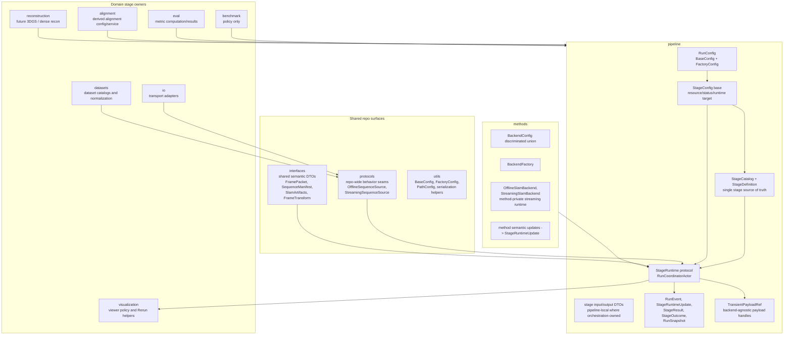

Decision suggestion: this preserves the public ownership documented in
[interfaces-and-contracts.md](./interfaces-and-contracts.md) while solving the
ownership ambiguities cataloged in the
[present-state audit](./pipeline-stage-present-state-audit.md), including
[interfaces package DTO ownership](../../src/prml_vslam/interfaces/__init__.py#L63),
[alignment config ownership](../../src/prml_vslam/alignment/contracts.py#L12),
and [pipeline runtime DTO ownership](../../src/prml_vslam/pipeline/contracts/runtime.py#L26).

## Generic Stage Module Blueprint

Recommended target: introduce a `pipeline/stages/` package with a small generic
stage framework and thin per-stage modules. The base package owns the generic
stage lifecycle, resource, telemetry, and runtime target contracts. Individual
stage packages own only their stage-specific config, input/output DTOs, runtime
adapter, and optional Ray actor.

```text
src/prml_vslam/pipeline/
├── config.py              # RunConfig top-level setup_target()
├── catalog.py             # StageCatalog and StageDefinition
├── stages/
│   ├── __init__.py
│   ├── base/
│   │   ├── __init__.py
│   │   ├── config.py          # StageConfig, StageExecutionConfig, runtime policy
│   │   ├── contracts.py       # StageInput, StageOutput, StageResult, StageRuntimeStatus
│   │   ├── handles.py         # TransientPayloadRef / PayloadHandle
│   │   ├── protocols.py       # StageRuntime, StreamingStageRuntime, StageActorRuntime
│   │   └── ray.py             # Ray actor option translation and actor adapter helpers
│   ├── source/
│   │   ├── __init__.py
│   │   ├── config.py          # SourceStageConfig and source backend variants
│   │   ├── contracts.py       # SourceStageInput, SourceStageOutput
│   │   └── runtime.py         # Source normalization/runtime around legacy ingest logic
│   ├── slam/
│   │   ├── __init__.py
│   │   ├── config.py          # SlamStageConfig, stage resources, backend config field
│   │   ├── contracts.py       # SlamOfflineInput, SlamStreamingInput, SlamStageOutput
│   │   ├── runtime.py         # Common stage runtime facade
│   │   └── actor.py           # Ray SlamStageActor for stateful/GPU/streaming execution
│   ├── ground_alignment/
│   │   ├── config.py
│   │   ├── contracts.py
│   │   └── runtime.py         # In-process runtime around GroundAlignmentService
│   ├── trajectory_eval/
│   │   ├── config.py
│   │   ├── contracts.py
│   │   └── runtime.py         # In-process runtime around TrajectoryEvaluationService
│   └── summary/
│       ├── config.py
│       ├── contracts.py
│       └── runtime.py         # Projection-only runtime around project_summary()
```

This tree should not move method wrappers out of `methods`. For example,
ViSTA- and MASt3R-specific backend configs remain method-owned in
[methods/configs.py](../../src/prml_vslam/methods/configs.py), and backend
construction remains method-owned in
[methods/factory.py](../../src/prml_vslam/methods/factory.py). The pipeline
`slam` stage owns only stage lifecycle, resources, status, DTOs, and the call
into the method factory.

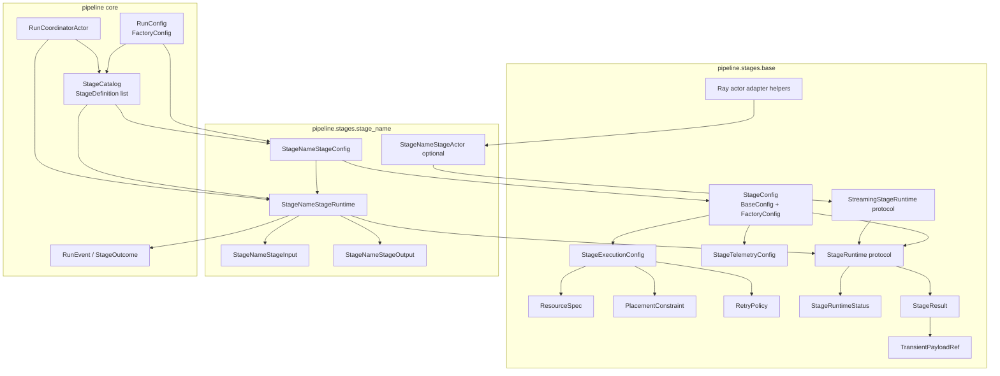

Implementation guidance:

- Put stage-specific DTOs in the stage package when they are not semantically
  shared outside that stage. Promote only shared domain DTOs, such as
  `SequenceManifest`, `FramePacket`, `SlamArtifacts`, and `FrameTransform`, to
  `interfaces`.
- Keep `config.py` free of runtime side effects. It validates and describes the
  target, then delegates runtime construction through `setup_target()`.
- Keep `runtime.py` free of Ray-specific APIs unless the stage has no
  in-process form. Ray wrapping belongs in `actor.py` or `base/ray.py`.
- Keep `contracts.py` focused on typed inputs, outputs, and stage-local status
  payloads. Do not let it import concrete service implementations.

## Stage Catalog And Definition

`StageCatalog` should be the only source of truth for public pipeline stage
semantics. It replaces the split-brain relationship between a planning registry
and a separate runtime program.

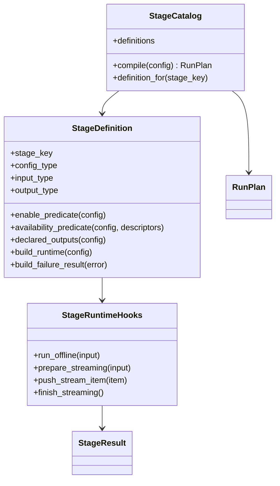

Rules:

- The catalog freezes the public linear order:
  `source -> slam -> [ground.align] -> [trajectory.evaluate] -> summary`.
- Placeholder stages (`reference.reconstruct`, `cloud.evaluate`,
  `efficiency.evaluate`) remain catalog entries with unavailable runtime
  definitions until implemented.
- `RunPlan` may include unavailable stage rows for preview and diagnostics.
  Unavailable stages must carry availability reasons, and runtime execution
  must reject or skip them explicitly before work starts.
- The catalog declares canonical outputs only. Backend-native files are not
  special-cased in planning; they flow through `SlamArtifacts.extras` or
  visualization artifacts.
- Runtime code interprets `StageDefinition` hooks instead of keeping a second
  hardcoded stage-function list.

## Target Config And Factory Shape

Recommended target: make `RunConfig` the only canonical persisted declarative
root and make it itself a `FactoryConfig`. Keep named stage sections under
`[stages.*]` for TOML and UI readability; do not switch to a raw
`StageConfig[]` list. Ephemeral launch-time values should remain
service/runtime parameters around `RunConfig`, not separate core config
contracts.

`RunConfig.setup_target()` builds the pipeline runtime/runner object. Each
stage config also implements `FactoryConfig` and builds its own stage runtime
target. If the stage is stateful or long-running, that target is a Ray actor or
actor-backed proxy. Stateless stages can use lightweight in-process runtime
objects behind the same protocol.

`setup_target()` is side-effect free in the target architecture. It builds a
runtime target, proxy, or descriptor object only. It must not start Ray actors,
open source transports, connect to sinks, or materialize artifacts. Live startup
belongs to the runtime manager when a run is launched.

Target persisted TOML shape:

```toml
experiment_name = "advio-15-offline-vista"
mode = "offline"
output_dir = ".artifacts"

[stages.source]
enabled = true

[stages.source.backend]
source_id = "advio"
sequence_id = "advio-15"

[stages.slam]
enabled = true

[stages.slam.backend]
method_id = "vista"

[stages.slam.outputs]
emit_dense_points = true
emit_sparse_points = false

[stages.ground_alignment]
enabled = false

[stages.trajectory_evaluation]
enabled = false

[stages.summary]
enabled = true

[visualization]
export_viewer_rrd = false
connect_live_viewer = false

[runtime]
executor = "ray"
```

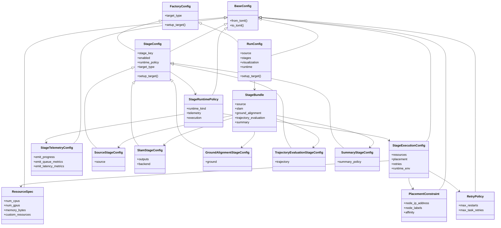

Immediate contact points:

- [RunRequest and stage-section migration contacts](../../src/prml_vslam/pipeline/contracts/request.py#L118)
- [StagePlacement and PlacementPolicy](../../src/prml_vslam/pipeline/contracts/request.py#L124)
- [Ray placement translation](../../src/prml_vslam/pipeline/placement.py#L16)
- [FactoryConfig helper](../../src/prml_vslam/utils/base_config.py#L118)
- [SLAM backend configs as factory precedent](../../src/prml_vslam/methods/configs.py#L26)

Decision suggestion: add `RunConfig`, `StageBundle`, and the shared stage config
base before changing runtime execution. This lets TOML, app controls, registry
planning, and runtime actors converge incrementally while keeping a stable
operator-facing config format.

The important interpretation of the sketch is that `setup_target()` means
“build the stage runtime target,” not “always create a Ray actor.” For SLAM,
`SlamStageConfig.setup_target()` should return a `SlamStageActor` or
actor-backed proxy because SLAM is stateful, streaming-capable, and usually
GPU-bound. For `summary`, `SummaryStageConfig.setup_target()` should return a
small in-process `SummaryStageRuntime` because it is a pure projection over
`StageOutcome[]`.

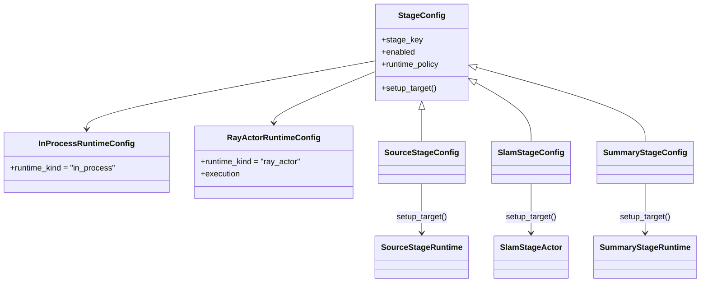

## Target Runtime Integration

Recommended target: introduce a shared `StageRuntime` protocol and a
stage-status DTO. Use Ray actors for stateful/long-running stages, but do not
force every simple stage body to become a separate Ray actor immediately.

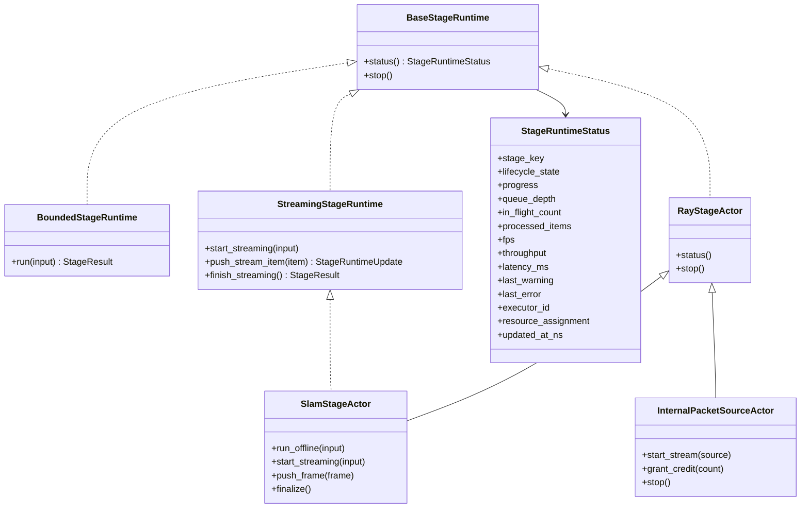

Migration contact points:

- [RuntimeStageDriver](../../src/prml_vslam/pipeline/ray_runtime/stage_program.py#L77)
- [StageRuntimeSpec](../../src/prml_vslam/pipeline/ray_runtime/stage_program.py#L117)
- [OfflineSlamStageActor](../../src/prml_vslam/pipeline/ray_runtime/stage_actors.py#L42)
- [StreamingSlamStageActor](../../src/prml_vslam/pipeline/ray_runtime/stage_actors.py#L203)
- [PacketSourceActor](../../src/prml_vslam/pipeline/ray_runtime/stage_actors.py#L99)
- [coordinator stage actor options](../../src/prml_vslam/pipeline/ray_runtime/coordinator.py#L540)

Decision suggestion: unify offline and streaming SLAM under one future
`SlamStageActor`. Keep packet-source/capture readers separate as internal
runtime collaborators because they own source credits and transport reads, not
durable benchmark stage semantics.

Runtime protocol rule: all runtimes implement `BaseStageRuntime`. Bounded stages
implement `BoundedStageRuntime`; streaming-capable stages implement
`StreamingStageRuntime`. Do not require every stage to expose streaming methods.

### Ray Actor Versus In-Process Runtime

Differentiate runtime targets by capability, not by whether they are “real”
pipeline stages. All stages are real stages, but not all stages deserve a Ray
actor.

| Question | If yes | If no |
| --- | --- | --- |
| Does the stage keep mutable state across frames, batches, or calls? | Use a Ray actor or explicit stateful runtime. | In-process runtime is sufficient. |
| Does the stage need GPU, custom resource, or remote-node placement? | Use a Ray actor target with `StageExecutionConfig` / `ResourceSpec`. | Keep it local unless the stage is slow enough to justify remote execution. |
| Does the stage participate in the streaming hot path? | Use an actor or actor-backed runtime so it can expose `push_*`, `status()`, and `stop()`. | Use `run_offline()` / `finalize()` only. |
| Does the stage need independent stop/cancel/status semantics? | Actor is preferred. | Coordinator can treat it as a bounded call. |
| Is the stage a pure projection over existing artifacts/events? | Avoid Ray actor by default. | Reconsider only if artifact size or runtime cost demands placement. |

Initial classification:

| Stage | Runtime target | Reason |
| --- | --- | --- |
| `source` | In-process runtime first; streaming source backend may use an internal sidecar | Source backend selection and normalization; live packet readers are collaborators, not public stages. |
| `slam` | Ray actor | Stateful backend/session, streaming hot path, GPU placement. |
| `ground.align` | In-process runtime first | Derived artifact from `SlamArtifacts`; can be upgraded if point-cloud size demands remote placement. |
| `trajectory.evaluate` | In-process runtime first | Bounded metric computation over materialized trajectories. |
| `summary` | In-process runtime | Pure projection from `StageOutcome[]`. |
| source/packet reader collaborator | Ray actor or in-process sidecar | Owns live transport state and source credits; not a public benchmark stage by default. |
| `reconstruction.3dgs` | Ray actor | GPU-heavy, long-running, likely status/stop-sensitive. |

The coordinator should not care which target is used. It should call the
bounded or streaming runtime surface and receive `StageRuntimeStatus`,
`StageRuntimeUpdate`, and `StageResult` objects.
The stage config and runtime manager handle the backend-specific details of
local call versus Ray actor call.

### Coordinator Responsibility Boundary

Target coordinator responsibilities:

- sequence the linear run
- record `RunEvent` truth
- project or trigger projection into `RunSnapshot`
- dispatch stage commands through `StageRuntime`
- stop or finalize active stage runtimes

Responsibilities that should move out of the coordinator:

- Ray bootstrap and local/reusable head lifecycle
- source-resolution details
- artifact-map helper logic
- Rerun logging policy
- backend-specific setup payload shaping
- raw placement translation from config to Ray actor options
- transient payload eviction policy details

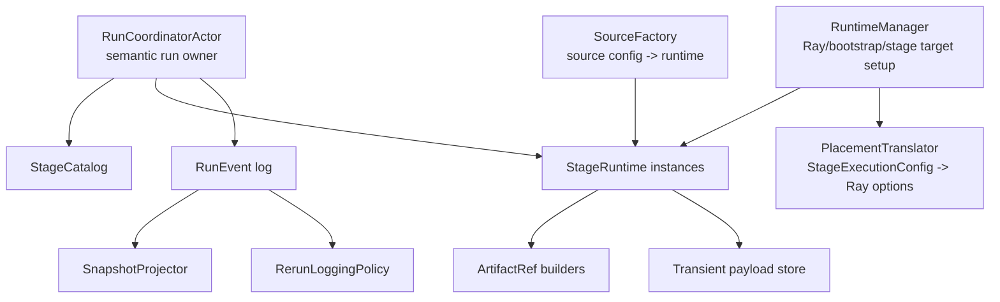

### Public Stages Versus Internal Collaborators

The public stage vocabulary should contain durable benchmark steps only:

- `source`
- `slam`
- `ground.align`
- `trajectory.evaluate`
- `summary`
- future placeholders: `reference.reconstruct`, `cloud.evaluate`,
  `efficiency.evaluate`

Internal runtime collaborators are not public stages by default:

- packet source / capture loop
- Rerun sink
- transient payload handle store
- Ray bootstrap / local head lifecycle
- array/object-store cleanup

This distinction keeps the stage UML focused. A capture loop may become a
first-class capture stage only if the project decides that persisted capture
artifacts are durable benchmark outputs with their own provenance. Until then,
it is a collaborator of streaming execution.

## Stage-Wise DTO Architecture

Recommended target: define one explicit input DTO and output DTO per stage.
For streaming-capable stages, split DTOs by phase: prepare, hot path, and
finalize. `StageResult` is the canonical cross-stage handoff target.
`StageOutcome` is the durable/provenance subset, and stage-specific outputs
remain typed payloads inside `StageResult`.

```mermaid
flowchart LR
    subgraph Planning["Planning"]
        RunConfig["RunConfig"]
        StageConfigs["StageConfig sections"]
        RunPlan["RunPlan"]
    end

    subgraph Runtime["Runtime"]
        Context["StageExecutionContext"]
        Status["StageRuntimeStatus"]
        Result["StageResult"]
        Outcome["StageOutcome"]
    end

    subgraph Source["source"]
        SourceIn["SourceStageInput<br/>source backend config + output root"]
        SourceOut["SourceStageOutput<br/>SequenceManifest + PreparedBenchmarkInputs"]
    end

    subgraph Slam["slam"]
        SlamOfflineIn["SlamOfflineInput<br/>SequenceManifest + PreparedBenchmarkInputs"]
        SlamStreamIn["SlamStreamingStartInput<br/>FramePacket stream"]
        SlamOut["SlamStageOutput<br/>SlamArtifacts + VisualizationArtifacts"]
        SlamTelemetry["StageRuntimeUpdate<br/>pose, keyframe, map stats,<br/>visualization envelopes"]
    end

    subgraph Derived["derived stages"]
        GroundIn["GroundAlignmentInput<br/>SlamArtifacts"]
        GroundOut["GroundAlignmentOutput<br/>GroundAlignmentMetadata"]
        TrajIn["TrajectoryEvaluationInput<br/>SequenceManifest + PreparedBenchmarkInputs + SlamArtifacts"]
        TrajOut["TrajectoryEvaluationOutput<br/>EvaluationArtifact"]
    end

    subgraph Final["summary / visualization"]
        SummaryIn["SummaryInput<br/>StageOutcome list"]
        SummaryOut["SummaryOutput<br/>RunSummary + StageManifest list"]
        RerunOut["RerunEventEnvelope<br/>or visualization adapter output"]
    end

    RunConfig --> StageConfigs --> RunPlan --> Context
    Context --> SourceIn --> SourceOut --> SlamOfflineIn
    SlamOfflineIn --> SlamOut
    SlamStreamIn --> SlamTelemetry
    SlamOut --> GroundIn --> GroundOut
    SlamOut --> TrajIn
    SourceOut --> TrajIn --> TrajOut
    Result --> Outcome
    Result --> SummaryIn --> SummaryOut
    SlamTelemetry --> RerunOut
    GroundOut --> RerunOut
    RerunOut --> Sink["Rerun sink only SDK caller"]
    Status -. queried by .-> Coordinator["RunCoordinatorActor"]
```

Shared DTO migration contacts:

- [SequenceManifest and PreparedBenchmarkInputs](../../src/prml_vslam/interfaces/ingest.py#L43)
- [SlamArtifacts and existing live SLAM DTO migration contacts](../../src/prml_vslam/interfaces/slam.py#L29)
- [StageOutcome](../../src/prml_vslam/pipeline/contracts/events.py#L50)
- [legacy completion payload migration contact](../../src/prml_vslam/pipeline/ray_runtime/stage_program.py#L59)
- [RunSummary and StageManifest](../../src/prml_vslam/pipeline/contracts/provenance.py)
- [GroundAlignmentMetadata](../../src/prml_vslam/interfaces/alignment.py)
- [EvaluationArtifact](../../src/prml_vslam/eval/contracts.py)

## Canonical Stage Result

The target architecture should have exactly one cross-stage completion shape:
`StageResult`.

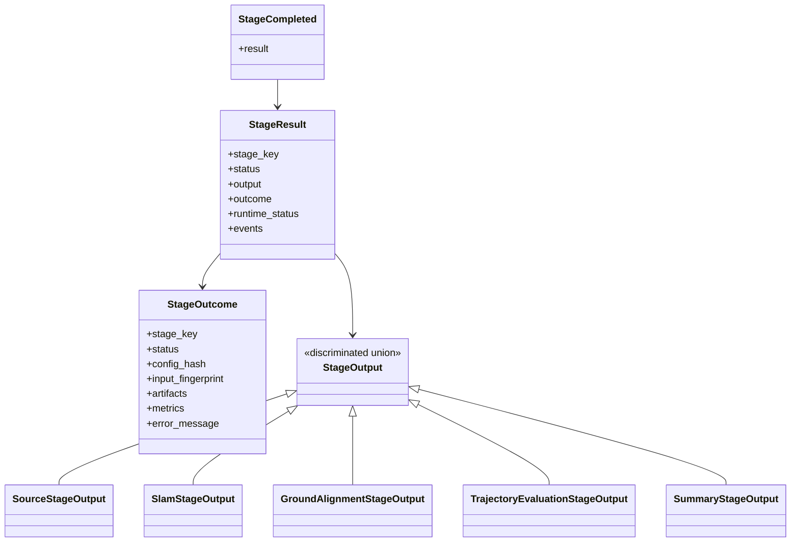

Rules:

- `StageResult` replaces the legacy completion payload as the runtime handoff
  concept.
- `StageOutcome` remains the durable/provenance subset used in manifests and
  summaries.
- `RuntimeExecutionState` stores canonical typed outputs from `StageResult`,
  not another parallel representation of completion.
- `StageCompleted` carries the `StageResult` or a transport-safe projection of
  it, so event replay and summary projection use the same semantic object.

## Runtime Updates, Events, And Visualization Envelopes

Streaming and long-running stages emit `StageRuntimeUpdate` values while they
run. These updates are neutral pipeline objects, not Rerun commands.

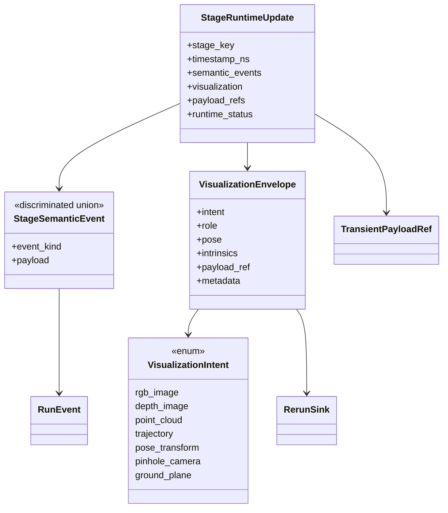

Rules:

- Stage runtimes may return semantic events, neutral visualization envelopes,
  and transient payload refs in one update.
- Stage updates must not include Rerun entity paths, timelines, styling, or SDK
  commands.
- Stage-specific adapters live in the owning stage package, such as
  `pipeline/stages/slam/adapters.py`, and translate internal backend outputs
  into `StageRuntimeUpdate`.
- The Rerun sink owns all Rerun-specific layout, timeline, styling, live/export
  behavior, SDK calls, and best-effort failure handling.
- Methods/backends should emit method-owned semantic data to the stage actor;
  they should not emit pipeline `RunEvent`s directly.

## Event Durability Tiers

The target event model has two explicit tiers:

- durable semantic events: run submitted/started/stopped/failed, stage
  started/completed/failed, artifact produced, summary persisted
- ephemeral telemetry events: queue depth, instantaneous throughput/FPS, live
  previews, transient payload refs, non-replayable live status

`RunSnapshot` can project from both tiers, but durable JSONL/provenance logs
should be durable-first. If an ephemeral event is persisted for debugging, it
must be marked non-replayable and must not be used as scientific provenance.

## Transient Payload Handles

The target should replace separate public array/preview/blob handle DTOs with
one backend-agnostic transient payload reference. Public DTOs should not expose
Ray object-store details such as `backend="ray-object-store"`.

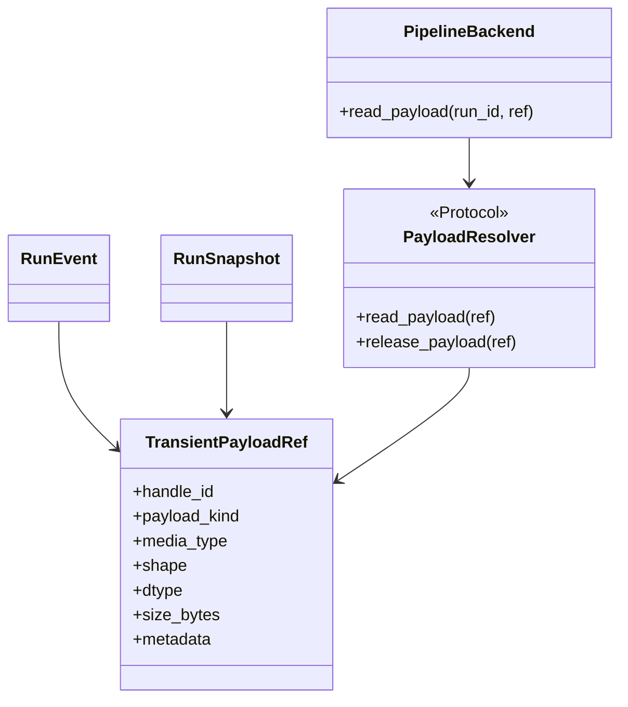

Rules:

- `TransientPayloadRef` is transport-safe metadata only.
- Runtime backends own resolution, eviction, and release semantics.
- Stage DTOs and events may carry refs, but durable scientific artifacts remain
  `ArtifactRef`s, not transient payload refs.
- `TransientPayloadRef` may appear in live event buses, live snapshots, and
  backend resolver APIs. It must not appear in manifests or summaries.
- If transient refs are persisted in debug runtime logs, they must be marked
  non-replayable.
- UI/app callers resolve payloads through the pipeline backend/service, never
  through substrate-specific Ray APIs.

## SLAM Stage Target Sequence

SLAM is the highest-risk stage because it combines method muxing, backend
factory config, offline and streaming lifecycles, normalized artifacts,
incremental telemetry, and Rerun forwarding.

The target sequence should not expose a separate method streaming session as a
pipeline participant. `SlamStageActor` is the pipeline-facing session. It may
keep method-private streaming state internally, but the coordinator should only
talk to `SlamStageActor`.

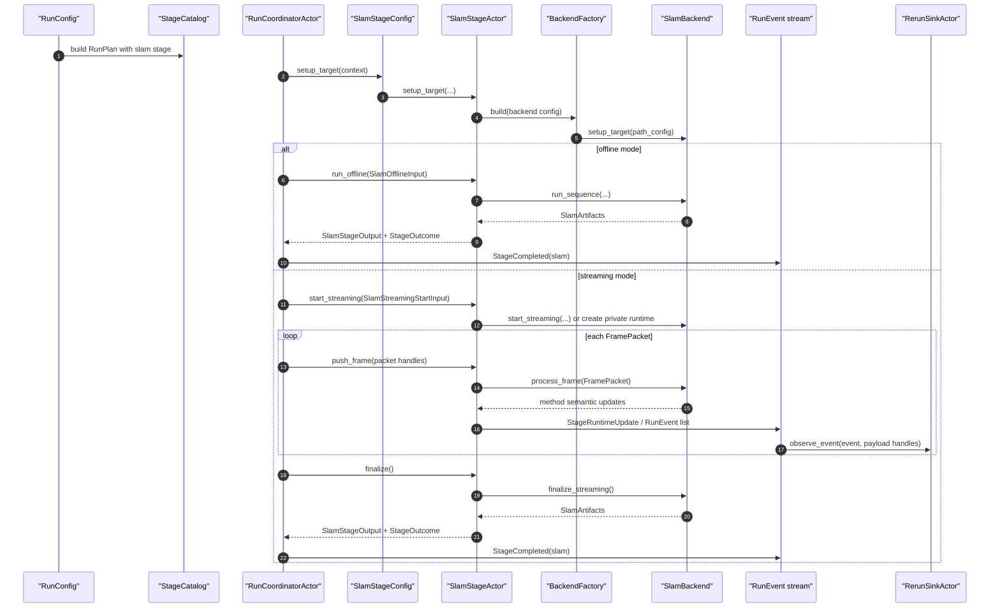

This is a target boundary simplification, not necessarily a ban on private
method streaming helper classes. The existing ViSTA wrapper uses such a helper
internally, and that remains a reasonable implementation detail. The change is
that the helper should stop being part of the public pipeline-facing stage
architecture.

SLAM migration contact points:

- [SlamStageConfig](../../src/prml_vslam/pipeline/contracts/request.py#L150)
- [BackendConfig discriminated union](../../src/prml_vslam/methods/configs.py#L251)
- [BackendFactory](../../src/prml_vslam/methods/factory.py#L24)
- [existing backend/session protocol migration contacts](../../src/prml_vslam/methods/protocols.py#L22)
- [translate_slam_update](../../src/prml_vslam/methods/events.py)
- [OfflineSlamStageActor.run](../../src/prml_vslam/pipeline/ray_runtime/stage_actors.py#L46)
- [StreamingSlamStageActor.start_stage](../../src/prml_vslam/pipeline/ray_runtime/stage_actors.py#L215)
- [StreamingSlamStageActor.push_frame](../../src/prml_vslam/pipeline/ray_runtime/stage_actors.py#L240)
- [StreamingSlamStageActor.close_stage](../../src/prml_vslam/pipeline/ray_runtime/stage_actors.py#L329)

## Target Snapshot Shape

`RunSnapshot` should be a generic keyed projection rather than a growing object
with stage-specific top-level fields.

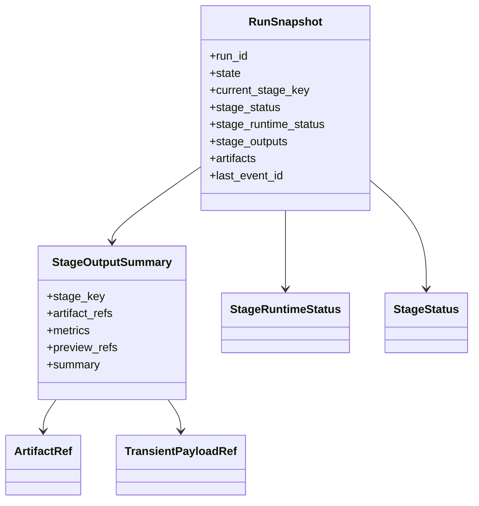

Rules:

- Stage status, runtime status, and output summaries are keyed by `StageKey`.
- Keep only minimal convenience live-view fields if the app truly needs them.
- Do not add new top-level fields for each future stage.

## Stage Matrix

<!-- TODO: should be evaluate.* instead of *.evaluate, as well as reconstruction.* instead of *.reconstruct, also reconstruct might have different backends (i.e. o3d TSDF or 3DGS, these should not be different stages) -->

| Stage | Migration/source contact | Target runtime | Target input DTO | Target output DTO | Status DTO | Rerun/event path | Required changes |
| --- | --- | --- | --- | --- | --- | --- | --- |
| `source` | [SourceSpec](../../src/prml_vslam/pipeline/contracts/request.py#L118), [run_ingest_stage](../../src/prml_vslam/pipeline/ray_runtime/stage_execution.py#L60) | `SourceStageRuntime` in-process first; live source backend may own an internal sidecar | `SourceStageInput` | `SourceStageOutput` with `SequenceManifest` and `PreparedBenchmarkInputs` | `StageRuntimeStatus` | `StageCompleted`; optional source preview update later | Define explicit source backend configs and preserve `SequenceManifest` as normalized boundary. |
| `slam` | [SlamStageConfig](../../src/prml_vslam/pipeline/contracts/request.py#L150), [BackendConfig](../../src/prml_vslam/methods/configs.py#L251) | unified `SlamStageActor` | `SlamOfflineInput`, `SlamStreamingStartInput`, `SlamFrameInput` | `SlamStageOutput` with `SlamArtifacts` and `VisualizationArtifacts` | `StageRuntimeStatus` plus backend keyframe/fps metrics | method semantic updates -> `StageRuntimeUpdate` -> `RunEvent` -> `RerunSinkActor` | Merge offline/streaming actor surfaces; keep backend discriminated union. |
| `ground.align` | [AlignmentConfig](../../src/prml_vslam/alignment/contracts.py#L26), [run_ground_alignment_stage](../../src/prml_vslam/pipeline/ray_runtime/stage_execution.py#L179) | `GroundAlignmentStageRuntime` in-process first | `GroundAlignmentInput` with `SlamArtifacts` | `GroundAlignmentOutput` with `GroundAlignmentMetadata` | `StageRuntimeStatus` | `StageCompleted`; Rerun sink augments export on close | Keep derived artifact semantics; do not mutate native SLAM outputs. |
| `trajectory.evaluate` | [TrajectoryBenchmarkConfig](../../src/prml_vslam/benchmark/contracts.py), [TrajectoryEvaluationService](../../src/prml_vslam/eval/services.py) | `TrajectoryEvaluationStageRuntime` in-process first | `TrajectoryEvaluationInput` | `TrajectoryEvaluationOutput` with `EvaluationArtifact` | `StageRuntimeStatus` | `StageCompleted`; no direct Rerun requirement initially | Keep `benchmark` as policy and `eval` as metric implementation. |
| `reference.reconstruct` placeholder | [StageRegistry placeholder](../../src/prml_vslam/pipeline/stage_registry.py#L162), [ReferenceReconstructionConfig](../../src/prml_vslam/benchmark/contracts.py) | future `ReferenceReconstructionStageRuntime` | `ReferenceReconstructionInput` | `ReferenceReconstructionOutput` with reference cloud refs | `StageRuntimeStatus` | `StageCompleted`; optional viewer artifact adapter | Decide whether implementation belongs in `reconstruction` and policy in `benchmark`. |
| `cloud.evaluate` placeholder | [StageRegistry placeholder](../../src/prml_vslam/pipeline/stage_registry.py#L171), [CloudBenchmarkConfig](../../src/prml_vslam/benchmark/contracts.py) | future `CloudEvaluationStageRuntime` | `CloudEvaluationInput` | `CloudEvaluationOutput` with dense-cloud metrics | `StageRuntimeStatus` | `StageCompleted`; no direct Rerun requirement initially | Move duplicated metric result concepts to `eval` only. |
| `efficiency.evaluate` placeholder | [StageRegistry placeholder](../../src/prml_vslam/pipeline/stage_registry.py#L180), [EfficiencyBenchmarkConfig](../../src/prml_vslam/benchmark/contracts.py) | future `EfficiencyEvaluationStageRuntime` | `EfficiencyEvaluationInput` | `EfficiencyEvaluationOutput` with runtime metrics | `StageRuntimeStatus` | `StageCompleted`; event stream is primary input | Define metrics from `RunEvent` stream rather than separate timers. |
| `reconstruction.3dgs` future | [reconstruction package](../../src/prml_vslam/reconstruction), [Questions 3DGS scope](../Questions.md) | future GPU actor | `ReconstructionInput` with SLAM artifacts and selected frames | `ReconstructionOutput` with scene artifacts | `StageRuntimeStatus` with GPU/memory/fps | `StageCompleted`; optional Rerun adapter | Decide whether it is benchmark stage, method stage, or downstream reconstruction stage. |
| `summary` | [run_summary_stage](../../src/prml_vslam/pipeline/ray_runtime/stage_execution.py#L211), [project_summary](../../src/prml_vslam/pipeline/finalization.py) | `SummaryStageRuntime` in-process | `SummaryInput` with ordered `StageOutcome` list | `SummaryOutput` with `RunSummary`, `StageManifest[]` | `StageRuntimeStatus` | `StageCompleted(summary)` | Keep projection-only; no metric computation. |

## Decision Register

### Stage Actor Scope

Decision to make: should every stage become a Ray actor?

Suggestion: no. Define a common `StageRuntime` protocol for every stage, but
only use Ray actors for stateful, streaming, GPU-heavy, or long-running stages.
This keeps simple artifact-projection stages cheap while giving the pipeline a
uniform status/control surface.

Decide by:

- Needs state across frames or long runtime: actor.
- Needs GPU placement or remote node affinity: actor.
- Pure projection over already materialized artifacts: in-process runtime.

Migration contact points: [stage_program.py](../../src/prml_vslam/pipeline/ray_runtime/stage_program.py#L117),
[stage_execution.py](../../src/prml_vslam/pipeline/ray_runtime/stage_execution.py#L1),
[stage_actors.py](../../src/prml_vslam/pipeline/ray_runtime/stage_actors.py#L1).

### Offline And Streaming SLAM Lifecycle

Decision: use one pipeline-facing `SlamStageActor` and remove separate method
streaming-session protocols from the target public architecture.

Suggestion: one target `SlamStageActor` with explicit methods:
`run_offline()`, `start_streaming()`, `push_frame()`, `finalize()`,
`status()`, and `stop()`. The actor owns any method-private session/runtime
object.

Reasoning: backend construction, output policy, artifact finalization, native
visualization collection, and status telemetry are the same stage
responsibility. The coordinator should not see both `SlamStageActor` and
method streaming session; that adds one lifecycle boundary without adding a useful
pipeline responsibility. The streaming source reader should stay separate
because it owns transport and credit policy, not SLAM state.

Migration contact points: [OfflineSlamStageActor](../../src/prml_vslam/pipeline/ray_runtime/stage_actors.py#L42),
[StreamingSlamStageActor](../../src/prml_vslam/pipeline/ray_runtime/stage_actors.py#L203),
[RunCoordinatorActor.start_streaming_slam_stage](../../src/prml_vslam/pipeline/ray_runtime/coordinator.py#L468).

### Config Hierarchy

Decision: use `RunConfig + [stages.*]`.

Suggestion: make `RunConfig` the persisted root config and a `FactoryConfig`.
Keep named stage sections under `[stages.source]`, `[stages.slam]`,
`[stages.ground_alignment]`, `[stages.trajectory_evaluation]`, and
`[stages.summary]`. Do not use a raw list of stages.

Reasoning: named stage sections keep TOML readable for operators and easy for
Streamlit/app controls to edit, while making every executable stage explicit.
Submission-time overrides, if needed, stay as service/runtime parameters and do
not replace the persisted `RunConfig`.

Migration contact points: [RunRequest](../../src/prml_vslam/pipeline/contracts/request.py#L175),
[SlamStageConfig](../../src/prml_vslam/pipeline/contracts/request.py#L150),
[PlacementPolicy](../../src/prml_vslam/pipeline/contracts/request.py#L130).

### Backend And Source Muxing

Decision to make: use discriminated unions or enum fields plus manual factories?

Suggestion: keep Pydantic discriminated unions for backend/source config
variants and standardize factories through `FactoryConfig.setup_target()`.

Reasoning: [BackendConfig](../../src/prml_vslam/methods/configs.py#L251)
already gives typed variant-specific config. The weaker part is that
[OfflineSourceResolver](../../src/prml_vslam/pipeline/source_resolver.py#L45)
uses manual `match` while [BackendFactory](../../src/prml_vslam/methods/factory.py#L24)
uses a factory wrapper. Make source configs setup targets the same way.

Migration contact points: [source_resolver.py](../../src/prml_vslam/pipeline/source_resolver.py#L45),
[methods/factory.py](../../src/prml_vslam/methods/factory.py#L24),
[FactoryConfig](../../src/prml_vslam/utils/base_config.py#L118).

The target muxing pattern should be the same for source variants, method
backends, and future reconstruction backends:

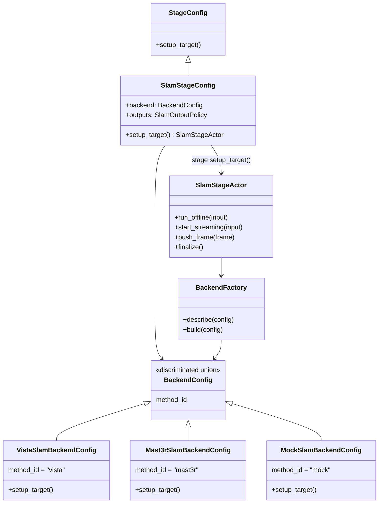

Rules:

- Stage configs choose stage runtime targets.
- Backend configs choose backend implementation targets.
- Use one explicit, typed discriminator per domain. For SLAM backend configs,
  the target discriminator is `method_id` because it aligns with `MethodId`.
  Avoid dual `kind`/`method_id` vocabulary and avoid vague generic
  discriminators when a domain-specific name exists.
- Use the same naming rule elsewhere: `source_id` for source variants and
  `stage_key` for stage variants.
- Factories should not duplicate discriminator switches that Pydantic already
  performed. Prefer calling `config.setup_target(...)` after validation.
- Keep backend capability metadata close to backend configs so planning can ask
  “can this backend run streaming?” without constructing the backend.
- Source muxing should follow the same rule: `DatasetSourceSpec`,
  `VideoSourceSpec`, and `Record3DLiveSourceSpec` should either be factory
  configs themselves or feed a source factory with the same shape as
  `BackendFactory`.

### Public Contract Placement

Decision to make: put all DTOs in one dedicated DTO module or keep them near
their owning package?

Suggestion: keep repo-wide semantic DTOs in `interfaces`, repo-wide protocols
in `protocols`, package-local contracts in `<package>/contracts.py` or
`<package>/contracts/`, and package-local behavior seams in
`<package>/protocols.py`.

Reasoning: this follows [src/prml_vslam/AGENTS.md](../../src/prml_vslam/AGENTS.md)
and keeps one semantic concept under one owner. It also resolves the ownership
issue identified at
[interfaces/__init__.py](../../src/prml_vslam/interfaces/__init__.py#L63).

Migration contact points: [interfaces](../../src/prml_vslam/interfaces),
[protocols](../../src/prml_vslam/protocols),
[pipeline/contracts](../../src/prml_vslam/pipeline/contracts),
[methods/protocols.py](../../src/prml_vslam/methods/protocols.py#L1).

Specific target placement:

- Keep `FramePacket`, `SequenceManifest`, `FrameTransform`, and
  `SlamArtifacts` in `interfaces`.
- Move live SLAM update and backend-event DTOs out of `interfaces` into
  `methods` or a method/pipeline boundary contracts module because they are
  runtime boundary DTOs, not stable repo-wide semantic DTOs.
- Keep stage orchestration wrappers in `pipeline/stages/*`; keep domain
  semantics in the owning domain packages.

### Rerun Integration

Decision to make: should output DTOs implement Rerun conversion methods?

Suggestion: no direct SDK calls and no heavy Rerun policy inside core DTOs.
Use `StageRuntimeUpdate` values with semantic event envelopes, neutral
visualization envelopes, and transient payload refs. The only Rerun SDK caller
remains the sink.

Reasoning: the existing [RerunEventSink](../../src/prml_vslam/pipeline/sinks/rerun.py#L35)
is already the single SDK sidecar. Keep this boundary and let
[RerunLoggingPolicy](../../src/prml_vslam/pipeline/sinks/rerun_policy.py)
map neutral visualization envelopes to entity paths, timelines, styling, and
SDK calls.

Migration contact points: [RerunEventSink.observe](../../src/prml_vslam/pipeline/sinks/rerun.py#L84),
[RerunSinkActor.observe_event](../../src/prml_vslam/pipeline/sinks/rerun.py#L148),
[translate_slam_update](../../src/prml_vslam/methods/events.py).

### Status And Telemetry

Decision to make: where do queue size, FPS, latency, throughput, and resource
usage live?

Suggestion: add a `StageRuntimeStatus` transport-safe DTO under pipeline
contracts. Actors and in-process runtimes implement `status()`. The coordinator
polls or receives status events and projects them into `RunSnapshot`.

Minimum fields:

- lifecycle state
- progress message and completed/total steps
- queue/backlog and in-flight count
- throughput / FPS
- latency
- last warning / last error
- executor identity
- resource assignment
- last update timestamp

Reasoning: [StageProgress](../../src/prml_vslam/pipeline/contracts/events.py#L33)
is too narrow for the target, while [StreamingRunSnapshot](../../src/prml_vslam/pipeline/contracts/runtime.py#L69)
contains only streaming-specific SLAM/source counters.

Migration contact points: [events.py](../../src/prml_vslam/pipeline/contracts/events.py#L33),
[runtime.py](../../src/prml_vslam/pipeline/contracts/runtime.py#L38),
[SnapshotProjector](../../src/prml_vslam/pipeline/snapshot_projector.py).

### Resource Placement Model

Decision to make: keep existing Ray option aliases or introduce typed resource
config?

Suggestion: introduce substrate-neutral execution policy models:

- `StageExecutionConfig`
- `ResourceSpec`
- `PlacementConstraint`
- `RetryPolicy`
- optional runtime environment tag

Ray translation happens only in the Ray backend/runtime layer. Keep legacy
`{"CPU": ..., "GPU": ...}` parsing only as a migration adapter if needed.

Reasoning: the loose-alias issue identified in
[placement.py](../../src/prml_vslam/pipeline/placement.py#L16) is real. The
target needs CPU, GPU, memory, custom resources, node/IP hints, restart policy,
and task retry policy.

Migration contact points: [StagePlacement](../../src/prml_vslam/pipeline/contracts/request.py#L124),
[actor_options_for_stage](../../src/prml_vslam/pipeline/placement.py#L22),
[RunCoordinatorActor._stage_actor_options](../../src/prml_vslam/pipeline/ray_runtime/coordinator.py#L540).

### Benchmark Versus Eval

Decision to make: how to split benchmark and eval responsibilities?

Suggestion: `benchmark` owns policy and requested baselines; `eval` owns metric
computation, metric result DTOs, and metric artifact loading.

Reasoning: this resolves the responsibility conflict identified in
[benchmark/__init__.py](../../src/prml_vslam/benchmark/__init__.py#L25) and
matches the existing service split where
[TrajectoryEvaluationService](../../src/prml_vslam/eval/services.py)
computes metrics from prepared inputs and SLAM artifacts.

Migration contact points: [benchmark/contracts.py](../../src/prml_vslam/benchmark/contracts.py),
[eval/contracts.py](../../src/prml_vslam/eval/contracts.py),
[eval/services.py](../../src/prml_vslam/eval/services.py).

### IO Versus Datasets

Decision to make: should datasets become an `io` submodule?

Suggestion: no. Keep `datasets` top-level. Remove compatibility aliases only
after checking app/tests/config imports.

Reasoning: datasets own catalogs, sequence preparation, and benchmark
references. IO owns transports and packet ingestion. The ownership issue at
[io/__init__.py](../../src/prml_vslam/io/__init__.py#L20) and the alias in
[datasets/__init__.py](../../src/prml_vslam/datasets/__init__.py) should be
resolved by keeping ownership separate.

Migration contact points: [io/__init__.py](../../src/prml_vslam/io/__init__.py#L1),
[datasets/__init__.py](../../src/prml_vslam/datasets/__init__.py),
[protocols/source.py](../../src/prml_vslam/protocols/source.py#L1).

### Snapshot And Event Ownership

Decision to make: move `RunSnapshot` and `RunState` out of pipeline?

Suggestion: keep them in `pipeline.contracts.runtime` for now.

Reasoning: snapshots are projections of pipeline-owned `RunEvent` values and
are app/CLI views over pipeline runtime state. They are not general repo-wide
semantic DTOs yet.

Migration contact points: [runtime ownership note](../../src/prml_vslam/pipeline/contracts/runtime.py#L26),
[RunSnapshot](../../src/prml_vslam/pipeline/contracts/runtime.py#L38),
[RunEvent](../../src/prml_vslam/pipeline/contracts/events.py#L197).

### Artifact Serialization

Decision to make: keep `write_json` and `stable_hash` in finalization or move
them to shared config/data utilities?

Suggestion: move generic deterministic JSON serialization to `BaseData` or
`utils.serialization`, but keep summary projection in `pipeline.finalization`.

Reasoning: [write_json](../../src/prml_vslam/pipeline/finalization.py#L88)
is generic. [project_summary](../../src/prml_vslam/pipeline/finalization.py)
is pipeline-specific.

Migration contact points: [finalization.py](../../src/prml_vslam/pipeline/finalization.py),
[BaseConfig.to_jsonable](../../src/prml_vslam/utils/base_config.py#L68).

### Placeholder Stages

Decision to make: which non-executable stages appear in the target UML and
stage contracts?

Suggestion: include `reference.reconstruct`, `cloud.evaluate`,
`efficiency.evaluate`, and `reconstruction.3dgs` in target docs as future public
stage surfaces. Keep them unavailable until each has a runtime. Do not make a
separate capture stage public by default; keep it as an internal collaborator
unless persisted capture artifacts become a durable benchmark output with
provenance. Do not make visualization export a public stage by default; Rerun
live/export behavior remains sink behavior unless export becomes a required
durable stage with failure/provenance semantics.

Reasoning: [StageRegistry.default](../../src/prml_vslam/pipeline/stage_registry.py#L136)
already includes three placeholders. The project scope in
[Questions.md](../Questions.md) also points to streaming operator visualization
and optional 3DGS reconstruction.

Migration contact points: [StageKey](../../src/prml_vslam/pipeline/contracts/stages.py),
[StageRegistry placeholders](../../src/prml_vslam/pipeline/stage_registry.py#L162),
[reconstruction package](../../src/prml_vslam/reconstruction).

### App And CLI Contract

Decision to make: should app/CLI/FastAPI submit a single config or construct a
stage graph directly?

Suggestion: app, CLI, and future FastAPI adapters should talk only through:

- `RunConfig`
- `RunPlan`
- `RunSnapshot`
- `RunEvent`
- `ArtifactRef`
- `TransientPayloadRef` through backend/service resolver methods

Do not make Streamlit controllers or API adapters compute pipeline semantics or
construct stage graphs directly.

Reasoning: the app should remain a launch and monitoring surface. This
preserves the package requirement that app code must not become a second
pipeline implementation.

Migration contact points: [RunService](../../src/prml_vslam/pipeline/run_service.py),
[pipeline controls](../../src/prml_vslam/app/pipeline_controls.py),
[main CLI](../../src/prml_vslam/main.py).

## Change Inventory For The Actual Refactor

### Contract Additions

- Add `StageConfig`, `StageRuntimePolicy`, `StageExecutionConfig`,
  `ResourceSpec`, `PlacementConstraint`, `RetryPolicy`,
  `StageTelemetryConfig`, and `StageRuntimeStatus` under pipeline-owned
  contracts.
- Add `StageResult` as the canonical runtime stage handoff.
- Add `StageRuntimeUpdate`, semantic event envelopes, and neutral visualization
  envelopes for live/long-running stage updates.
- Add `TransientPayloadRef` as the backend-agnostic transient payload handle.
- Add explicit stage input/output DTOs for `source`, `slam`, `ground.align`,
  `trajectory.evaluate`, and `summary`.
- Add placeholder DTOs for `reference.reconstruct`, `cloud.evaluate`,
  `efficiency.evaluate`, and `reconstruction.3dgs` only when those stages become
  planned implementation work.

### Runtime Changes

- Add a `StageRuntime` protocol.
- Replace `StageRuntimeSpec` function pointers gradually with runtime objects
  created from stage configs.
- Merge offline and streaming SLAM behavior behind one `SlamStageActor` target,
  and hide any method-specific session object behind that actor, while keeping
  the packet source actor separate.
- Add status querying and/or status events for every runtime target.

### Planning Changes

- Introduce `StageCatalog` / `StageDefinition` as the single stage source of
  truth and migrate `StageRegistry` / `RuntimeStageProgram` behavior into it.
- Keep the linear stage plan unless a future requirement explicitly needs DAG
  scheduling.
- Keep unavailable placeholder stages in planning output with precise reasons.

### Factory/Muxing Changes

- Keep `BackendConfig` as a discriminated union.
- Make source configs follow the same discriminated-union and
  config-as-factory pattern as method backends.
- Avoid adding a parallel enum plus manual `if`/`match` switch when the config
  subtype already identifies the backend/source.

### Visualization Changes

- Keep all Rerun SDK calls in `RerunEventSink`/`RerunSinkActor`.
- Add a visualization adapter layer only if stage output DTOs need conversion
  before they become events or sink payloads.
- Keep native upstream `.rrd` artifacts as visualization-owned extras, not
  scientific outputs.

### Ownership Cleanup

- Resolve the issue map in
  [pipeline-stage-present-state-audit.md](./pipeline-stage-present-state-audit.md#inline-todo--issue-map).
- Remove the `io.datasets` compatibility alias after verifying no imports rely
  on it.
- Move Rerun validation DTOs to a visualization contract module.
- Move generic JSON serialization helpers to shared utilities if reused outside
  pipeline finalization.

### Tests To Plan With The Code Refactor

- Request parsing tests for legacy and new stage resource config shapes.
- Plan compilation tests verifying each stage has config, runtime target,
  input/output DTO metadata, and availability.
- Offline pipeline smoke test preserving source-to-SLAM-to-summary behavior.
- Streaming pipeline smoke test preserving source credits, SLAM telemetry,
  event projection, and Rerun sink fan-out.
- Local single-process or single-node runtime smoke test.
- Reusable Ray head smoke test.
- Remote head / multi-machine actor placement planning or integration test.
- Stop during streaming.
- Backend failure during streaming.
- Sink failure isolation.
- Event-log replay to `RunSnapshot` projection.
- Transient payload handle eviction and read-after-eviction behavior.
- Rerun sink tests proving the SDK boundary stays inside the sink.
- Import audit tests or grep checks around `prml_vslam.io.datasets` before
  removing the alias.

## Recommended Implementation Order

1. Add contracts only: `RunConfig`, `SourceStageConfig`, `StageConfig`,
   `StageRuntimePolicy`, `StageExecutionConfig`, `StageRuntimeStatus`,
   `StageRuntimeUpdate`, `StageResult`, `TransientPayloadRef`, and stage
   input/output DTOs.
2. Update docs and inline issue comments to point to the new ownership decisions.
3. Add source factory parity without changing behavior.
4. Introduce `StageRuntime` while adapting existing bounded helpers.
5. Merge SLAM actor/session surfaces behind the new runtime protocol.
6. Add status querying/projection.
7. Convert placeholder stages one at a time when their real implementations are
   in scope.
