# Pipeline Stage Refactor Target Architecture

This document describes the intended target architecture for the next
`prml_vslam` package refactor. It deliberately avoids explaining the current
implementation in detail. Current-state diagnosis, redundancies, and incorrect
definition placement live in the separate
[Pipeline Stage Present-State Audit](./pipeline-stage-present-state-audit.md).

Use this target document for desired stage/module shape, target UML, target
contracts, and implementation-order decisions. Use the present-state audit when
you need to know what exists today and why it needs to change.

Companion references:

- [Present-state audit](./pipeline-stage-present-state-audit.md)
- [Executable stage protocol reference](./pipeline-stage-protocols-and-dtos.md)
- [Package requirements](../../src/prml_vslam/REQUIREMENTS.md)
- [Refactor notes](../../src/prml_vslam/REFACTOR_PLAN.md)
- [Interfaces and contracts guide](./interfaces-and-contracts.md)

Terminology preserved from the executable stage protocol reference:

- `runtime payload`: rich in-memory payload used inside stage or backend boundaries
- `transport-safe event`: strict DTO crossing Ray/runtime event boundaries
- `durable artifact/provenance`: persisted manifest, artifact ref, or summary
- `transport-safe projection`: app/CLI-facing state derived from events

## Target Non-Goals

- Do not convert the pipeline into a generic DAG/workflow engine.
- Do not make every stage a Ray actor.
- Do not expose `PacketSourceActor` or source packet reading as a public
  benchmark stage by default.
- Do not put Rerun SDK conversion methods on core DTOs.
- Do not move `RunSnapshot` or `RunState` out of `pipeline` unless another
  package genuinely shares the same semantics.
- Do not blindly flatten `pipeline/contracts/`; a package with several
  contract slices may keep a `contracts/` package.

## Target Package Ownership

Recommended target: keep package responsibilities stable while making the
generic pipeline runtime contracts explicit. The pipeline owns orchestration,
planning, runtime envelopes, status, events, snapshots, resource policy, and
payload-reference mechanics. Domain and shared packages own semantic payloads,
method/source variants, and concrete domain event kinds.

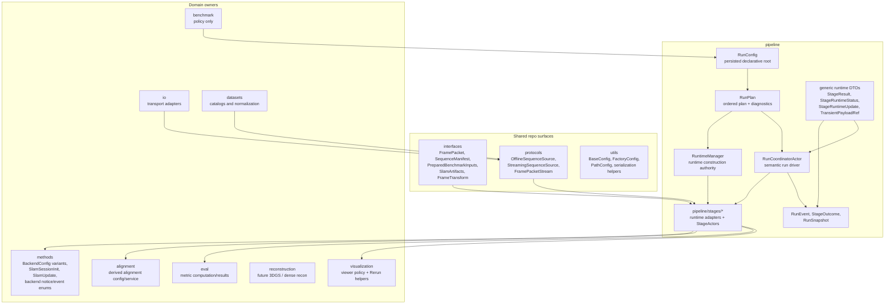

Rules:

- The pipeline owns only generic pipeline-specific DTOs: `RunPlan`,
  `RunEvent`, `RunSnapshot`, `StageResult`, `StageRuntimeStatus`,
  `StageRuntimeUpdate`, `TransientPayloadRef`, and execution/resource policy.
- Semantic payload DTOs stay with their domain owner. Examples:
  `SlamArtifacts` remains shared, live SLAM DTOs move to `methods.contracts`,
  `GroundAlignmentMetadata` remains alignment-owned, and evaluation artifacts
  remain eval-owned.
- `FactoryConfig` remains the construction pattern for concrete domain
  variants such as method backends and source backends. It is not the stage
  runtime construction pattern.
- `pipeline/stages/*` owns stage runtime adapters and any stateful
  `StageActor`s. These modules may use private implementation DTOs, but they
  must not become a second public home for domain semantics.
- Rerun SDK calls remain inside the sink layer. Stage outputs and updates may
  expose neutral visualization payloads, but they do not own Rerun entity paths,
  timelines, styling, or SDK commands.

## Generic Stage Module Blueprint

Recommended target: introduce a `pipeline/stages/` package for stage runtime
adapters and stateful stage actors, while keeping domain semantic contracts in
their owning packages. The base package owns the generic runtime protocol,
status, result, update, payload-reference, and Ray adapter contracts.

```text
src/prml_vslam/pipeline/
├── config.py              # RunConfig and StageBundle; compiles RunPlan
├── runtime_manager.py     # runtime/actor construction authority
├── stages/
│   ├── __init__.py
│   ├── base/
│   │   ├── __init__.py
│   │   ├── config.py          # StageConfig, StageExecutionConfig, runtime policy
│   │   ├── contracts.py       # StageResult, StageRuntimeStatus, StageRuntimeUpdate
│   │   ├── handles.py         # TransientPayloadRef
│   │   ├── protocols.py       # BaseStageRuntime, OfflineStageRuntime, StreamingStageRuntime
│   │   └── ray.py             # Ray placement and actor adapter helpers
│   ├── source/
│   │   ├── __init__.py
│   │   ├── config.py          # SourceStageConfig + SourceBackendConfig union
│   │   └── runtime.py         # source normalization around legacy ingest logic
│   ├── slam/
│   │   ├── __init__.py
│   │   ├── config.py          # SlamStageConfig, resource policy, backend config field
│   │   ├── runtime.py         # actor-backed runtime facade
│   │   └── actor.py           # Ray SlamStageActor for offline + streaming execution
│   ├── ground_alignment/
│   │   ├── config.py          # GroundAlignmentStageConfig; stage policy only
│   │   └── runtime.py         # adapter around GroundAlignmentService
│   ├── trajectory_eval/
│   │   ├── config.py          # TrajectoryEvaluationStageConfig; stage policy only
│   │   └── runtime.py         # adapter around TrajectoryEvaluationService
│   ├── reconstruction/
│   │   ├── config.py          # ReconstructionStageConfig + backend/mode variants
│   │   └── runtime.py         # adapter around reconstruction backends
│   └── summary/
│       ├── config.py          # SummaryStageConfig; projection policy only
│       └── runtime.py         # projection-only runtime around project_summary()
```

This tree must not move method wrappers, alignment logic, metric computation,
dataset normalization, or visualization policy into pipeline stage modules. For
example, ViSTA- and MASt3R-specific backend configs remain method-owned in
[methods/configs.py](../../src/prml_vslam/methods/configs.py), and backend
construction remains method-owned in
[methods/factory.py](../../src/prml_vslam/methods/factory.py). The pipeline
`slam` stage owns stage lifecycle, status, resource policy, and the actor
boundary around the method backend.

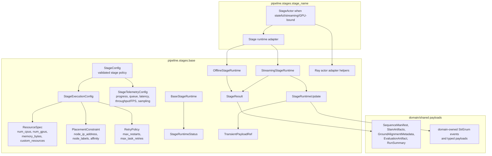

Implementation guidance:

- Keep `config.py` free of runtime construction side effects. Stage configs
  validate declarative policy and expose planning metadata only.
- `RuntimeManager` is the only authority that turns a `RunPlan` and validated
  configs into in-process runtime objects, actor proxies, payload stores, sink
  sidecars, and placement decisions.
- Keep public pipeline contracts generic. If a stage needs a semantic payload,
  use the owning package's DTO instead of adding a parallel pipeline DTO.
- Keep Ray-specific APIs in stage actor modules or `stages/base/ray.py`.

## RunConfig Stage Bundle And Plan Compilation

`RunConfig` is the canonical persisted declarative root. It owns a fixed
`StageBundle` and compiles directly to `RunPlan`; the target architecture does
not require a separate runtime-construction catalog. Stage configs provide
side-effect-free planning metadata such as stage key, enablement,
availability, declared outputs, and resource policy. They do not instantiate
actors or open resources. Failure provenance stays in the planning layer as
stage-specific policy for building stable failure outcomes, config hashes, and
input fingerprints.

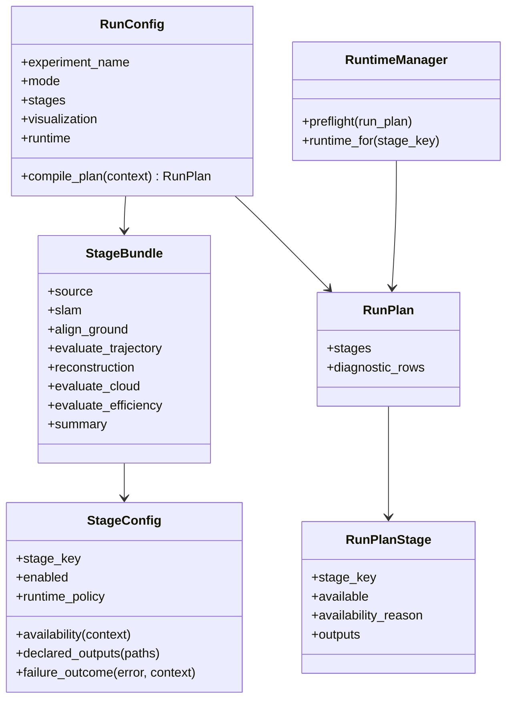

Rules:

- The public linear order is
  `source -> slam -> [align.ground] -> [evaluate.trajectory] ->
  [reconstruction] -> summary`.
- Future metric stages use the same compact verb namespace:
  `evaluate.cloud` and `evaluate.efficiency`. Reconstruction variants are
  backend/mode variants under the umbrella `reconstruction` stage, not separate
  public stage keys.
- `RunPlan` may contain unavailable diagnostic rows for requested or previewed
  stages. Launch preflight must fail before work starts when an enabled
  requested stage is unavailable.
- `RunPlan` declares canonical outputs only. Backend-native files flow through
  domain-owned artifacts such as `SlamArtifacts.extras` or visualization-owned
  artifacts.
- Stage configs own failure-provenance policy so runtime failures can still
  produce stage-specific `StageOutcome` values without a central stage catalog.
- Stage-key to config-section mapping is centralized. Stage keys use dot
  notation; TOML sections and modules use snake_case.

## Target Config Shape

Recommended target: make `RunConfig` the only canonical persisted declarative
root. Keep named stage sections under `[stages.*]` for TOML and UI readability;
do not switch to a raw `StageConfig[]` list. `RunLaunchRequest` is deprecated:
launch should consume `RunConfig -> RunPlan`, with runtime/session policy
expressed in `RunConfig` or backend/service parameters that do not redefine
stage semantics.

`RunConfig`, stage configs, and stage backend configs validate and describe.
They do not construct runtime targets. `RuntimeManager` performs live
construction and startup when a run launches.

Target persisted TOML shape:

```toml
experiment_name = "advio-15-offline-vista"
mode = "offline"
output_dir = ".artifacts"

[stages.source]
enabled = true

[stages.source.backend]
source_id = "advio"
sequence_id = "advio-15"

[stages.slam]
enabled = true

[stages.slam.backend]
method_id = "vista"

[stages.slam.outputs]
emit_dense_points = true
emit_sparse_points = false

[stages.align_ground]
enabled = false

[stages.evaluate_trajectory]
enabled = false

[stages.reconstruction]
enabled = false
mode = "reference"

[stages.summary]
enabled = true

[visualization]
export_viewer_rrd = false
connect_live_viewer = false

[runtime]
executor = "ray"
```

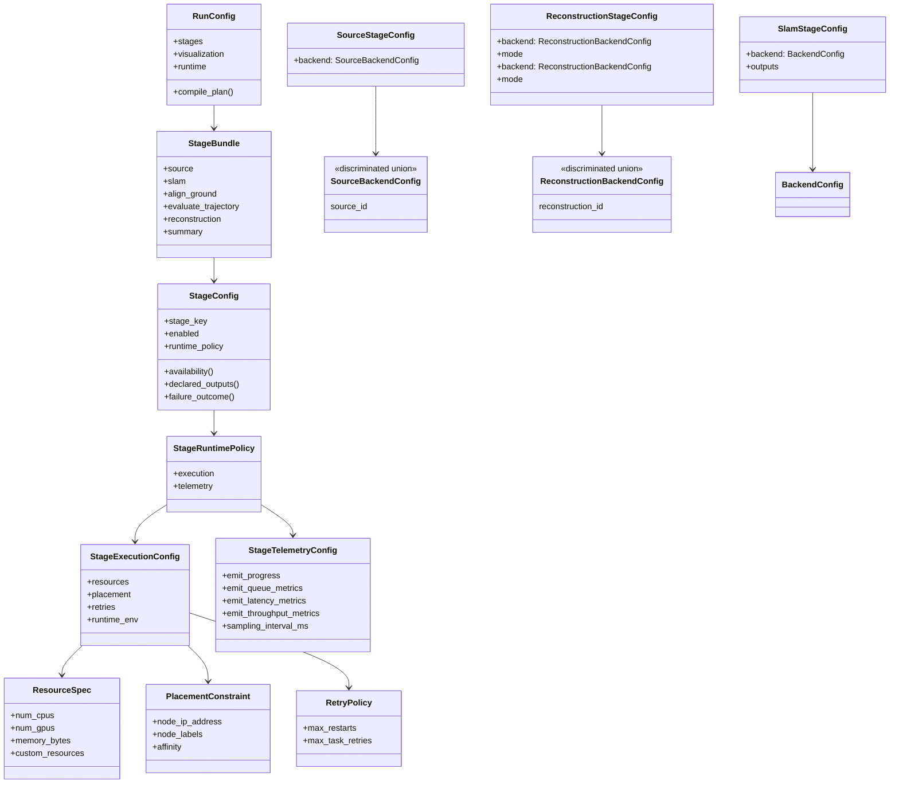

Immediate contact points:

- [RunRequest and stage-section migration contacts](../../src/prml_vslam/pipeline/contracts/request.py#L118)
- [StagePlacement and PlacementPolicy](../../src/prml_vslam/pipeline/contracts/request.py#L124)
- [Ray placement translation](../../src/prml_vslam/pipeline/placement.py#L16)
- [SLAM backend configs as factory precedent](../../src/prml_vslam/methods/configs.py#L26)

Config/factory boundary:

- `RunConfig`, `StageConfig`, `SourceStageConfig`, and `SlamStageConfig`
  validate and describe stage policy. They are not runtime factories.
- `BackendConfig` and `SourceBackendConfig` variants may implement
  `FactoryConfig.setup_target()` because they construct domain/source
  implementation targets, not pipeline stage runtimes.
- `RuntimeManager` is the only owner that constructs stage runtime adapters,
  actor proxies, sink sidecars, payload stores, and placement-specific runtime
  wrappers.

## Target Runtime Integration

Recommended target: introduce split stage runtime protocols and a
stage-status DTO. Use Ray actors for stateful, streaming, GPU-heavy, or
long-running stages, but do not force every simple stage body to become a
separate Ray actor.

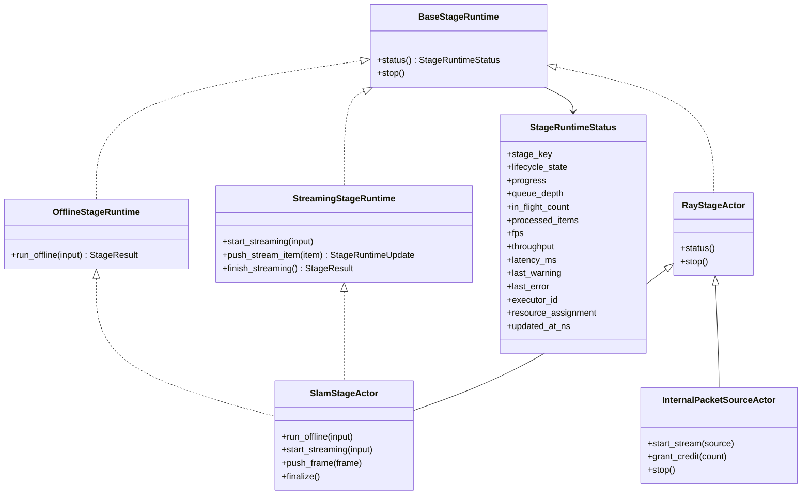

Migration contact points:

- [RuntimeStageDriver](../../src/prml_vslam/pipeline/ray_runtime/stage_program.py#L77)
- [StageRuntimeSpec](../../src/prml_vslam/pipeline/ray_runtime/stage_program.py#L117)
- [OfflineSlamStageActor](../../src/prml_vslam/pipeline/ray_runtime/stage_actors.py#L42)
- [StreamingSlamStageActor](../../src/prml_vslam/pipeline/ray_runtime/stage_actors.py#L203)
- [PacketSourceActor](../../src/prml_vslam/pipeline/ray_runtime/stage_actors.py#L99)
- [coordinator stage actor options](../../src/prml_vslam/pipeline/ray_runtime/coordinator.py#L540)

Decision: unify offline and streaming SLAM under one future
`SlamStageActor`. Keep packet-source/capture readers separate as internal
runtime collaborators because they own source credits and transport reads, not
durable benchmark stage semantics.

Runtime protocol rule: all runtimes implement `BaseStageRuntime`.
Offline-capable stages implement `OfflineStageRuntime`; streaming hot-path
stages implement `StreamingStageRuntime`. A stage may implement both. Offline
does not mean “single item”: the input DTO may represent a sequence, a batch,
or a bundle of artifacts. Do not require every stage to expose streaming
methods.

### Current To Target Responsibility Map

The current runtime complexity is a four-way split across phase routing,
mutable state, actor lifecycle, and observer/event policy. The target refactor
collapses those responsibilities into explicit owners:

| Current responsibility | Current owner | Target owner |
| --- | --- | --- |
| Phase-specific stage function routing | `RuntimeStageProgram` / `StageRuntimeSpec` | Coordinator dispatches through `OfflineStageRuntime` and `StreamingStageRuntime` surfaces. |
| Cross-stage mutable handoff | `RuntimeExecutionState` plus `StageCompletionPayload` | Run-scoped keyed `dict[StageKey, StageResult]` store. |
| Bounded stage bodies | free `run_*` functions in `stage_execution.py` | Stage-local runtime classes under `pipeline/stages/*/runtime.py`. |
| SLAM actor/session lifecycle | separate offline and streaming SLAM actors | one pipeline-facing `SlamStageActor`. |
| Runtime construction and placement | coordinator helpers and stage helpers | hybrid-lazy `RuntimeManager`. |
| Live payload resolution and eviction | coordinator handle cache | runtime-managed payload store behind `TransientPayloadRef`. |
| Rerun/event observer policy | coordinator forwarding `RunEvent`s to sink | direct live update routing plus sink-owned Rerun translation. |

`stage_execution.py` is transitional. The final target eliminates its free
`run_*` functions: bounded stages become `run_offline()` methods on
stage-local runtimes, and `run_offline_slam_stage()` disappears into
`RuntimeManager` plus unified `SlamStageActor.run_offline()`. Compatibility
wrappers may exist during migration, but they are not target APIs.

`RuntimeManager` uses hybrid-lazy construction. It preflights configs,
availability, resource policy, stage mapping, and actor options before work
starts, but instantiates local runtimes and Ray actor proxies lazily when each
stage begins. This gives early validation without allocating unused actors or
opening sources before their stage is reached.

### Ray Actor Versus In-Process Runtime

Differentiate runtime targets by capability, not by whether they are “real”
pipeline stages. All stages are real stages, but not all stages deserve a Ray
actor.

| Question | If yes | If no |
| --- | --- | --- |
| Does the stage keep mutable state across frames, batches, or calls? | Use a Ray actor or explicit stateful runtime. | In-process runtime is sufficient. |
| Does the stage need GPU, custom resource, or remote-node placement? | Use a Ray actor target with `StageExecutionConfig` / `ResourceSpec`. | Keep it local unless the stage is slow enough to justify remote execution. |
| Does the stage participate in the streaming hot path? | Use an actor or actor-backed runtime so it can expose `push_*`, `status()`, and `stop()`. | Use `run_offline()` / `finalize()` only. |
| Does the stage need independent stop/cancel/status semantics? | Actor is preferred. | Coordinator can treat it as a bounded call. |
| Is the stage a pure projection over existing artifacts/events? | Avoid Ray actor by default. | Reconsider only if artifact size or runtime cost demands placement. |

Initial classification:

| Stage | Runtime target | Reason |
| --- | --- | --- |
| `source` | In-process runtime first; streaming source backend may use an internal sidecar | Source backend selection and normalization; live packet readers are collaborators, not public stages. |
| `slam` | Ray actor | Stateful backend/session, streaming hot path, GPU placement. |
| `align.ground` | In-process runtime first | Derived artifact from `SlamArtifacts`; can be upgraded if point-cloud size demands remote placement. |
| `evaluate.trajectory` | In-process runtime first | Offline/finalize metric computation over materialized trajectories. |
| `reconstruction` | Runtime selected by reconstruction backend/mode | Reference reconstruction can stay in-process first; GPU-heavy 3DGS variants use actors. |
| `summary` | In-process runtime | Pure projection from `StageOutcome[]`. |
| source/packet reader collaborator | Ray actor or in-process sidecar | Owns live transport state and source credits; not a public benchmark stage by default. |

The coordinator should not care which deployment target is used. It should call
the offline or streaming runtime surface and receive `StageRuntimeStatus`,
`StageRuntimeUpdate`, and `StageResult` objects. `RuntimeManager` handles the
backend-specific details of local calls versus actor-backed calls.

### Stage Actor API Vocabulary

Stage actors and runtime adapters may use narrow stage-surface DTOs as private
wrapper types without making those DTOs public domain semantics. These wrappers
name runtime call boundaries; their payload fields remain shared or
domain-owned.

Core stage wrapper names:

- `SourceStageInput` and `SourceStageOutput`: source backend config,
  normalization output root, `SequenceManifest`, and optional
  `PreparedBenchmarkInputs`.
- `SlamOfflineInput`, `SlamStreamingStartInput`, `SlamFrameInput`, and
  `SlamStageOutput`: offline sequence input, streaming startup input, hot-path
  frame input, and normalized SLAM completion output.
- `GroundAlignmentStageInput` and `GroundAlignmentStageOutput`: wrapper around
  `SlamArtifacts` and alignment-owned `GroundAlignmentMetadata`.
- `TrajectoryEvaluationStageInput` and `TrajectoryEvaluationStageOutput`:
  wrapper around prepared benchmark inputs, normalized SLAM artifacts, and
  eval-owned trajectory results.
- `SummaryStageInput` and `SummaryStageOutput`: wrapper around ordered
  `StageOutcome` values and pipeline provenance outputs.
- `ReconstructionStageInput` and `ReconstructionStageOutput`: wrapper around
  prepared RGB-D/reference inputs or SLAM-derived reconstruction inputs,
  reconstruction mode/backend policy, and reconstruction-owned artifacts.

Minimum v1 wrapper fields:

| Wrapper | Required fields |
| --- | --- |
| `SourceStageInput` | source backend config, normalization output root, run path context |
| `SourceStageOutput` | `SequenceManifest`, optional `PreparedBenchmarkInputs` |
| `SlamOfflineInput` | `SequenceManifest`, optional `PreparedBenchmarkInputs`, output policy, artifact root |
| `SlamStreamingStartInput` | `SequenceManifest`, optional `PreparedBenchmarkInputs`, baseline source, output policy, artifact root |
| `SlamFrameInput` | packet summary, transient payload refs or resolved arrays, intrinsics, pose, provenance |
| `SlamStageOutput` | `SlamArtifacts`, optional visualization-owned artifacts |
| `GroundAlignmentStageInput` | `SlamArtifacts`, alignment config |
| `GroundAlignmentStageOutput` | `GroundAlignmentMetadata` |
| `TrajectoryEvaluationStageInput` | `SequenceManifest`, optional `PreparedBenchmarkInputs`, `SlamArtifacts`, trajectory policy |
| `TrajectoryEvaluationStageOutput` | eval-owned trajectory evaluation artifact or `None` when no metric is computed |
| `ReconstructionStageInput` | reconstruction config/backend variant, prepared inputs or upstream artifacts, artifact root |
| `ReconstructionStageOutput` | reconstruction-owned artifact bundle and metrics |
| `SummaryStageInput` | ordered terminal `StageOutcome` values |
| `SummaryStageOutput` | `RunSummary`, `StageManifest[]` |

For SLAM, the target actor API specifically uses:

- `SlamOfflineInput`: normalized sequence, prepared benchmark inputs, output
  policy, and artifact root for offline execution.
- `SlamStreamingStartInput`: normalized startup context for a streaming SLAM
  session.
- `SlamFrameInput`: one hot-path frame item plus transient payload refs or
  resolved arrays needed by the actor.
- `SlamStageOutput`: normalized `SlamArtifacts` plus visualization-owned
  artifacts collected at completion.

Method-level session DTOs such as `SlamSessionInit`, `SlamUpdate`, and backend
notice/event payloads belong in `methods.contracts`, not in public pipeline
contracts.

### Coordinator Responsibility Boundary

Target coordinator responsibilities:

- sequence the linear run
- record `RunEvent` truth
- project or trigger projection into `RunSnapshot`
- dispatch stage commands through `StageRuntime`
- stop or finalize active stage runtimes

Responsibilities that should move out of the coordinator:

- Ray bootstrap and local/reusable head lifecycle
- source-resolution details
- artifact-map helper logic
- Rerun logging policy
- backend-specific setup payload shaping
- raw placement translation from config to Ray actor options
- transient payload eviction policy details

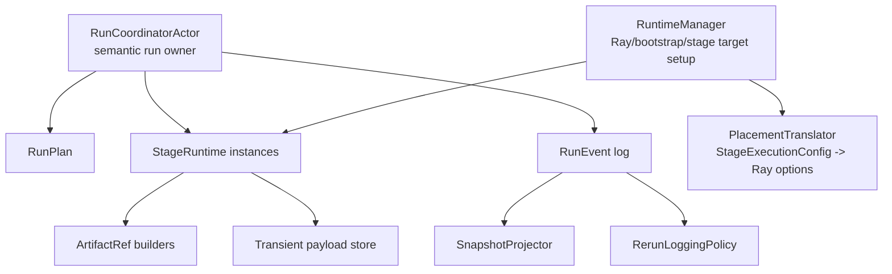

### Public Stages Versus Internal Collaborators

The public stage vocabulary should contain durable benchmark steps only:

- `source`
- `slam`
- `align.ground`
- `evaluate.trajectory`
- `reconstruction`
- `summary`
- future metric placeholders: `evaluate.cloud`, `evaluate.efficiency`

Internal runtime collaborators are not public stages by default:

- packet source / capture loop
- Rerun sink
- transient payload handle store
- Ray bootstrap / local head lifecycle
- array/object-store cleanup

This distinction keeps the stage UML focused. A capture loop may become a
first-class capture stage only if the project decides that persisted capture
artifacts are durable benchmark outputs with their own provenance. Until then,
it is a collaborator of streaming execution.

`reconstruction` is one public durable stage with backend/mode variants.
Reference reconstruction, 3DGS, and future reconstruction methods should be
selected inside `[stages.reconstruction]` rather than by adding separate public
stage keys for each reconstruction flavor.

## Generic DTO And Domain Payload Architecture

Recommended target: keep public pipeline DTOs generic. Do not create a large
set of pipeline-owned stage-specific semantic DTOs. Stage runtimes may use
private implementation inputs, but public payloads inside `StageResult` and
`StageRuntimeUpdate` are domain-owned or shared DTOs.

`StageResult` is the canonical cross-stage completion target. `StageOutcome` is
the durable/provenance subset, and semantic outputs remain typed payloads from
their owning package.

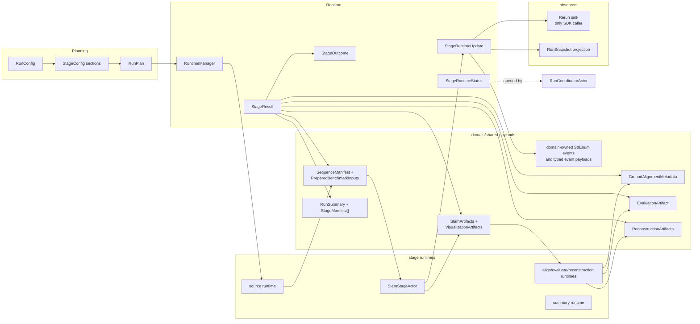

Shared DTO migration contacts:

- [SequenceManifest and PreparedBenchmarkInputs](../../src/prml_vslam/interfaces/ingest.py#L43)
- [SlamArtifacts and existing live SLAM DTO migration contacts](../../src/prml_vslam/interfaces/slam.py#L29)
- [StageOutcome](../../src/prml_vslam/pipeline/contracts/events.py#L50)
- [legacy completion payload migration contact](../../src/prml_vslam/pipeline/ray_runtime/stage_program.py#L59)
- [RunSummary and StageManifest](../../src/prml_vslam/pipeline/contracts/provenance.py)
- [GroundAlignmentMetadata](../../src/prml_vslam/interfaces/alignment.py)
- [EvaluationArtifact](../../src/prml_vslam/eval/contracts.py)

## DTO Simplification Targets

The current implementation has too many DTOs with overlapping responsibility
across request config, plan rows, runtime handoff, runtime events, live
snapshots, durable provenance, domain payloads, and visualization/runtime
handles. The target refactor should reduce this to one canonical DTO per
conceptual layer:

- requested configuration: `RunConfig` plus named stage config sections
- planned execution: `RunPlan` and `RunPlanStage`
- runtime completion: `StageResult`
- durable terminal provenance: `StageOutcome`, then projected manifests and
  summaries
- live runtime status/update: `StageRuntimeStatus` and `StageRuntimeUpdate`
- live bulk payload reference: `TransientPayloadRef`
- semantic payloads: domain/shared DTOs owned outside generic pipeline
  contracts

### Remove Or Make Transitional

| Current DTO | Target | Reason |
| --- | --- | --- |
| `StageCompletionPayload` | remove after migration | Broad optional handoff bag that overlaps with `StageResult`, `StageOutcome`, `StageCompleted`, and runtime state. |
| `RuntimeExecutionState` | replace with keyed `dict[StageKey, StageResult]` | Mutable cross-stage bag hides producer/consumer contracts and duplicates stage output state. |
| `StreamingRunSnapshot` | collapse into keyed snapshot fields | Streaming counters belong in `StageRuntimeStatus`, `StageOutputSummary`, or live `StageRuntimeUpdate` projections. |
| `StageProgress` | collapse into `StageRuntimeStatus.progress` | Too narrow to carry queue, latency, throughput, status, and resource state. |
| `BackendNoticeReceived` | remove from durable target path | Method telemetry should travel through `StageRuntimeUpdate` to live projection and Rerun, not durable JSONL. |
| `PacketObserved` and `FramePacketSummary` | make live-update payloads | Packet telemetry is live-only unless capture becomes a public durable stage. |
| `StageDefinition` | remove or keep only as migration scaffolding | It currently wraps `StageKey`; stage configs and `RunPlanStage` should own meaningful planning metadata. |

### Collapse

| Current overlap | Target collapse |
| --- | --- |
| `StageCompletionPayload`, rich `StageCompleted` fields, and `RuntimeExecutionState` | `StageResult` plus keyed result store; `StageCompleted` carries only durable `StageOutcome` and artifact references. |
| `ArrayHandle`, `PreviewHandle`, and `BlobHandle` | one `TransientPayloadRef` with payload kind, media type, shape, dtype, size, and metadata. |
| `RunSnapshot.sequence_manifest`, `slam`, `ground_alignment`, `summary`, and future top-level stage fields | keyed `stage_outputs: dict[StageKey, StageOutputSummary]` with optional convenience views only when the app needs them. |
| `StageManifest`, `RunSummary.stage_status`, and `StageOutcome` | keep `StageOutcome` canonical and derive manifests/summaries from terminal outcomes. |
| `BackendEvent` plus future domain event envelopes | domain-owned semantic event payloads carried by `StageRuntimeUpdate`; do not wrap them in durable pipeline telemetry events by default. |
| `SourceSpec`, `OfflineSourceResolver`, and streaming source construction helpers | `SourceStageConfig` plus `SourceBackendConfig` variants and `SourceRuntime`. |
| `ReferenceReconstructionConfig` and reconstruction backend config | `[stages.reconstruction]` with reconstruction backend/mode variants. |

### Rename Or Move

| Current DTO | Target |
| --- | --- |
| `RunRequest` | `RunConfig`, the persisted declarative root. |
| `SourceSpec` | `SourceBackendConfig` under `SourceStageConfig`; legacy request variants are migration input. |
| `StagePlacement` / `PlacementPolicy` | `StageExecutionConfig`, `ResourceSpec`, `PlacementConstraint`, and `RetryPolicy`. |
| `reference.reconstruct` stage key | `reconstruction` umbrella stage with reference/3DGS/future backend variants. |
| `EvaluationArtifact` | `TrajectoryEvaluationArtifact` when dense-cloud and efficiency artifacts become first-class. |
| `ArtifactRef` | move out of `interfaces.slam` to a generic artifact contract owner. |
| `SlamSessionInit` | private `SlamStreamingStartInput` at the pipeline stage boundary or method-owned session init, not a public shared DTO. |
| `SlamUpdate` and `BackendEvent` | move out of `interfaces.slam` into `methods.contracts`. |

### Keep

Keep these DTOs as canonical semantic or provenance payloads, with ownership
adjustments where noted:

- shared semantic DTOs: `FramePacket`, `FramePacketProvenance`,
  `CameraIntrinsics`, `FrameTransform`, `SequenceManifest`,
  `PreparedBenchmarkInputs`, and `SlamArtifacts`
- domain payloads: `GroundAlignmentMetadata`, `VisualizationArtifacts`,
  trajectory metric DTOs, dense-cloud and efficiency evaluation artifacts,
  `ReconstructionArtifacts`, and `ReconstructionMetadata`
- pipeline planning/provenance DTOs: `RunPlan`, `RunPlanStage`, `StageOutcome`,
  durable lifecycle `RunEvent` variants, `StageManifest`, and `RunSummary`

### Add

The refactor should add only the generic runtime DTOs needed to replace the
overlap:

- `StageResult`: canonical internal runtime completion shape
- `StageRuntimeStatus`: unified live status/progress/throughput/resource DTO
- `StageRuntimeUpdate`: live update envelope for semantic events,
  visualization intents, transient refs, typed payloads, and status
- `TransientPayloadRef`: backend-agnostic reference to live bulk payloads
- `StageOutputSummary`: snapshot-friendly keyed summary of stage outputs
- private stage input/output wrappers for runtime call boundaries only

Guiding rule: public pipeline DTOs are generic orchestration, runtime,
artifact-reference, and provenance DTOs. Stage-specific semantic payloads stay
with their domain owner. Private stage wrapper DTOs exist only to name runtime
call boundaries and must not become a second public semantic model.

## Canonical Stage Result

The target architecture should have exactly one internal cross-stage completion
shape: `StageResult`.

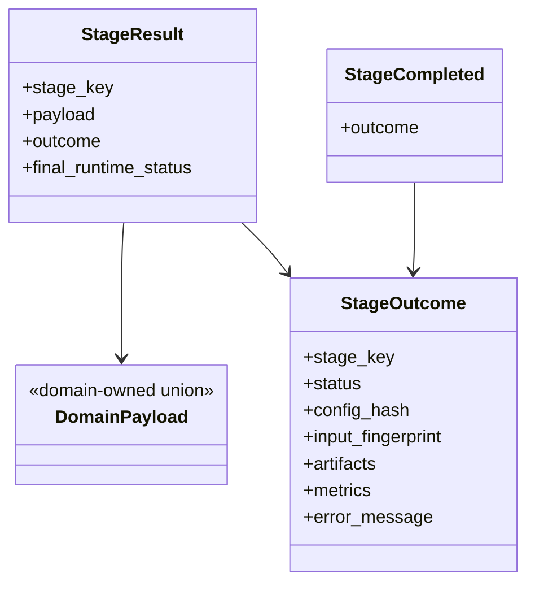

Rules:

- `StageResult` replaces the legacy completion payload as the runtime handoff
  concept.
- Runtime state stores completed results as `dict[StageKey, StageResult]`.
  Stage input builders read the required prior result payloads from this keyed
  store and fail with a stage-specific error when a dependency is missing or
  has the wrong payload type.
- `StageOutcome` remains the durable/provenance subset used in manifests and
  summaries.
- `StageResult` is a pure completion bundle: domain-owned payload,
  `StageOutcome`, and final runtime status. It is internal runtime state and
  does not carry a mini event log.
- Durable completion/failure events carry `StageOutcome`, not full
  `StageResult`. Rich payloads are materialized as artifacts, projected into
  snapshots, or retained in runtime state as appropriate.
- Summary and manifests depend on terminal `StageOutcome` values and durable
  artifact refs, not telemetry replay.

## Runtime Updates, Events, And Visualization Envelopes

Streaming and long-running stages emit `StageRuntimeUpdate` values while they
run. These updates are neutral pipeline objects, not Rerun commands.

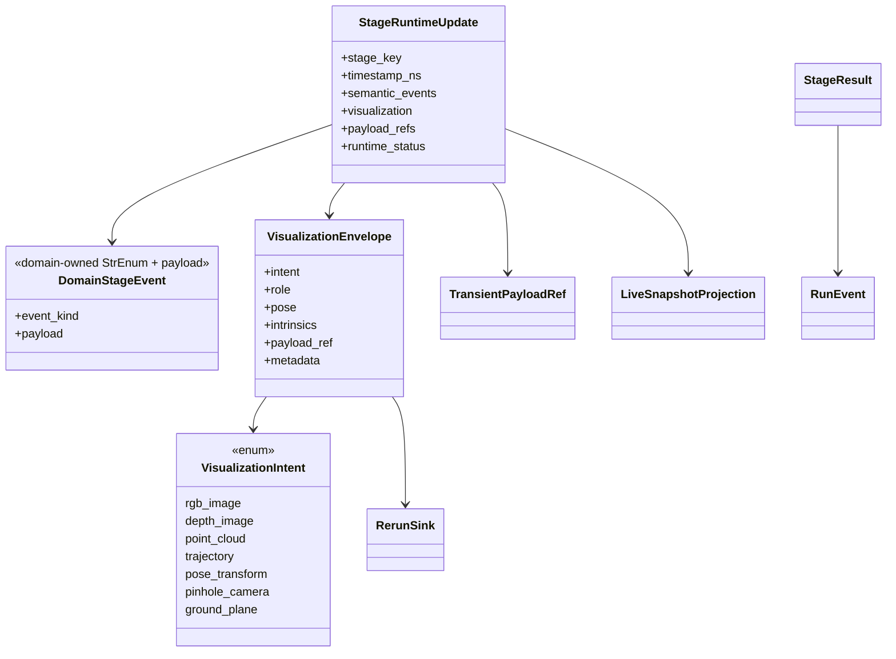

Rules:

- Stage runtimes may return domain-owned StrEnum semantic events, actual typed
  or transient payloads, neutral visualization envelopes, and runtime status in
  one update.
- `StageRuntimeUpdate` is routed directly to live snapshot/status state and to
  the Rerun sink. It does not need to be wrapped in a telemetry `RunEvent`
  before a sink can observe it.
- Durable JSONL/provenance remains centered on lifecycle events and
  `StageOutcome` values from `StageResult`.
- Stage updates must not include Rerun entity paths, timelines, styling, or SDK
  commands.
- Stage runtime adapters translate internal backend outputs into
  `StageRuntimeUpdate`; concrete event kinds and payload DTOs remain
  domain-owned.
- The Rerun sink owns all Rerun-specific layout, timeline, styling, live/export
  behavior, SDK calls, and best-effort failure handling.
- Methods/backends should emit method-owned semantic data to the stage actor;
  they should not emit pipeline `RunEvent`s directly.

## Event Durability Tiers

The target event model has two explicit tiers:

- durable semantic events: run submitted/started/stopped/failed, stage
  started/completed/failed, artifact produced, summary persisted
- ephemeral telemetry events: queue depth, instantaneous throughput/FPS, live
  previews, transient payload refs, non-replayable live status

`RunSnapshot` can project from durable events plus live `StageRuntimeUpdate`
values, but durable JSONL/provenance logs persist only durable lifecycle and
artifact events. Live telemetry is in-memory and Rerun-facing only in the
target architecture. It must not be required for scientific provenance or final
benchmark summaries.

## Transient Payload Handles

The target should replace separate public array/preview/blob handle DTOs with
one backend-agnostic transient payload reference. Public DTOs should not expose
Ray object-store details such as `backend="ray-object-store"`.

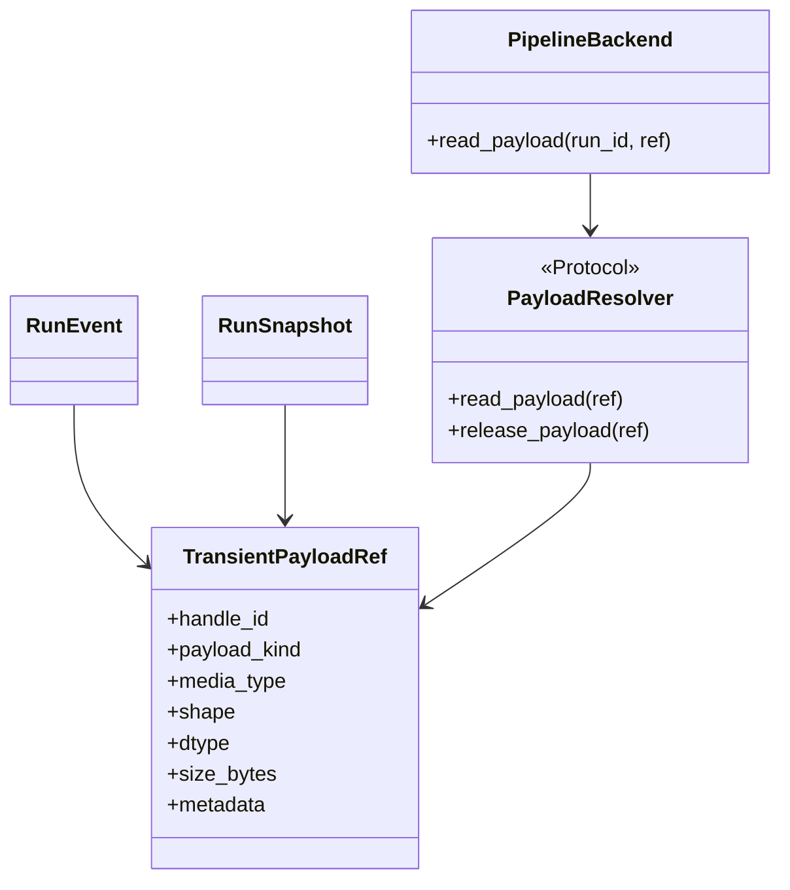

Rules:

- `TransientPayloadRef` is transport-safe metadata only.
- Runtime backends own run-scoped resolution, eviction, and release semantics.
- Live updates and snapshots may carry refs, but durable scientific artifacts remain
  `ArtifactRef`s, not transient payload refs.
- `TransientPayloadRef` may appear in live event buses, live snapshots, and
  backend resolver APIs. It must not appear in manifests or summaries.
- Read-after-eviction returns a typed not-found result rather than leaking a
  backend-specific error.
- UI/app callers resolve payloads through the pipeline backend/service, never
  through substrate-specific Ray APIs.

## SLAM Stage Target Sequence

SLAM is the highest-risk stage because it combines method muxing, backend
factory config, offline and streaming lifecycles, normalized artifacts,
incremental telemetry, and Rerun forwarding.

The target sequence should not expose a separate method streaming session as a
pipeline participant. `SlamStageActor` is the pipeline-facing session. It may
keep method-private streaming state internally, but the coordinator should only
talk to `SlamStageActor`.

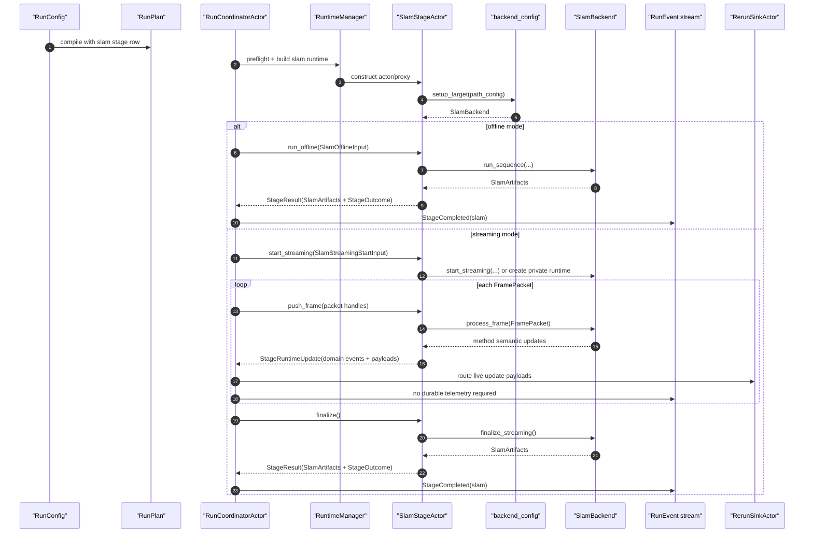

This is a target boundary simplification, not necessarily a ban on private
method streaming helper classes. The existing ViSTA wrapper uses such a helper
internally, and that remains a reasonable implementation detail. The change is
that the helper should stop being part of the public pipeline-facing stage
architecture.

SLAM migration contact points:

- [SlamStageConfig](../../src/prml_vslam/pipeline/contracts/request.py#L150)
- [BackendConfig discriminated union](../../src/prml_vslam/methods/configs.py#L251)
- [BackendFactory](../../src/prml_vslam/methods/factory.py#L24)
- [existing backend/session protocol migration contacts](../../src/prml_vslam/methods/protocols.py#L22)
- [translate_slam_update](../../src/prml_vslam/methods/events.py)
- [OfflineSlamStageActor.run](../../src/prml_vslam/pipeline/ray_runtime/stage_actors.py#L46)
- [StreamingSlamStageActor.start_stage](../../src/prml_vslam/pipeline/ray_runtime/stage_actors.py#L215)
- [StreamingSlamStageActor.push_frame](../../src/prml_vslam/pipeline/ray_runtime/stage_actors.py#L240)
- [StreamingSlamStageActor.close_stage](../../src/prml_vslam/pipeline/ray_runtime/stage_actors.py#L329)

## Target Snapshot Shape

`RunSnapshot` should be a generic keyed projection rather than a growing object
with stage-specific top-level fields. Durable fields project from `RunEvent`s;
live status, previews, and transient refs may also project from
`StageRuntimeUpdate` values that are not persisted to durable JSONL.

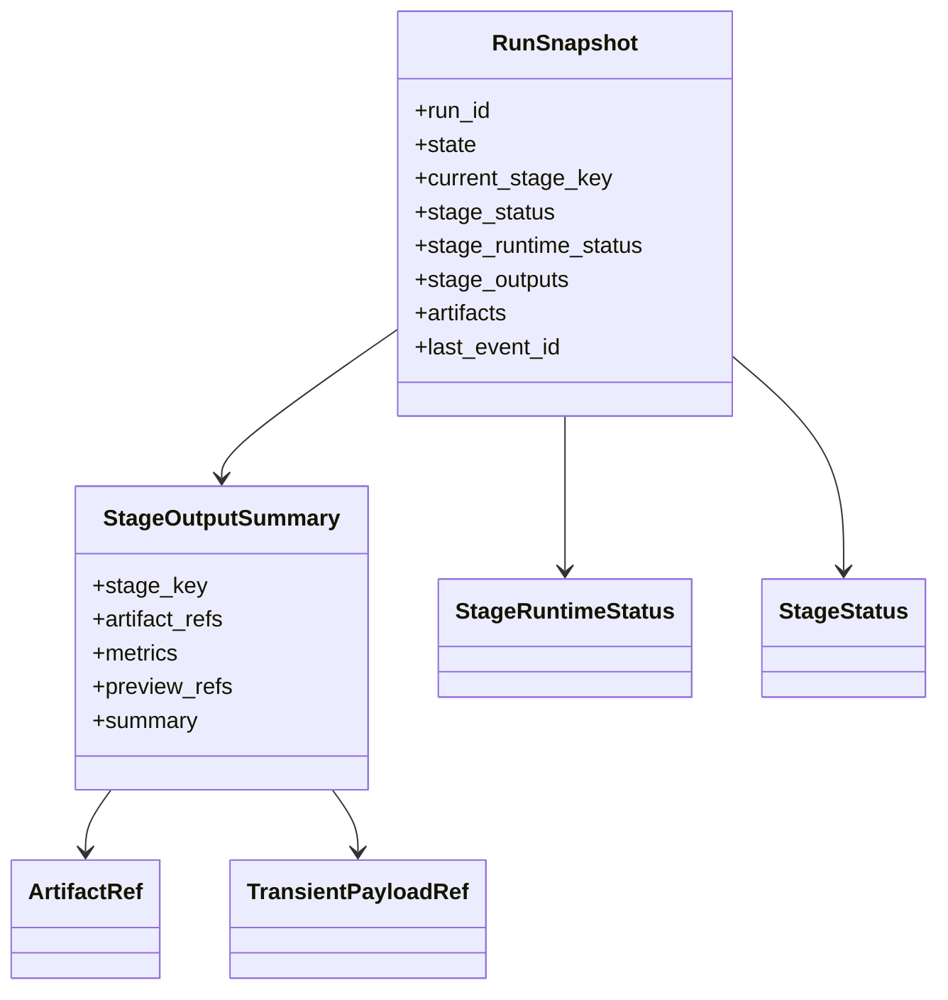

Rules:

- Stage status, runtime status, and output summaries are keyed by `StageKey`.
- Top-level artifact indexes are derived convenience views over keyed stage
  output summaries, not independent canonical state.
- Keep only minimal convenience live-view fields if the app truly needs them.
- Do not add new top-level fields for each future stage.

## Stage Matrix

| Stage key | Config section | Runtime target | Semantic payload owner | Event/Rerun path | Required changes |
| --- | --- | --- | --- | --- | --- |
| `source` | `[stages.source]` | in-process `SourceRuntime`; streaming source backend may own an internal packet sidecar | shared `SequenceManifest` and `PreparedBenchmarkInputs` | durable `StageCompleted`; optional live source `StageRuntimeUpdate` | Replace public `ingest` vocabulary; add `SourceBackendConfig` union with `source_id`; preserve normalized boundary and keep packet reading internal. |
| `slam` | `[stages.slam]` | unified actor-backed `SlamStageActor` | shared `SlamArtifacts`, visualization-owned artifacts, methods-owned live DTOs | method semantic updates -> `StageRuntimeUpdate` -> live snapshot/status + Rerun sink; completion -> durable `StageCompleted` | Merge offline/streaming actor surfaces; hide method session behind the actor; keep backend discriminated union. |
| `align.ground` | `[stages.align_ground]` | in-process runtime first | alignment-owned `GroundAlignmentMetadata` | durable `StageCompleted`; Rerun sink may augment export on close | Keep derived artifact semantics; do not mutate native SLAM outputs. |
| `evaluate.trajectory` | `[stages.evaluate_trajectory]` | in-process runtime first | eval-owned trajectory evaluation artifact | durable `StageCompleted` | Keep `benchmark` as policy and `eval` as metric implementation/result owner. |
| `reconstruction` | `[stages.reconstruction]` | selected by reconstruction backend/mode: in-process for reference, actor for GPU-heavy variants | reconstruction-owned artifact bundle | durable `StageCompleted`; optional `StageRuntimeUpdate` visualization envelopes for long-running variants | Replace `reference.reconstruct` target vocabulary with one umbrella reconstruction stage and model reference/3DGS/future methods as variants. |
| `summary` | `[stages.summary]` | in-process runtime | pipeline-owned generic provenance: `RunSummary`, `StageManifest[]`, `StageOutcome` | durable `StageCompleted(summary)` | Keep projection-only; no metric computation. |

## Extension Stage Matrix

| Stage key | Config section | Runtime target | Semantic payload owner | Event/Rerun path | Required changes |
| --- | --- | --- | --- | --- | --- |
| `evaluate.cloud` | `[stages.evaluate_cloud]` | future runtime, unavailable until implemented | eval-owned dense-cloud metric artifacts | durable `StageCompleted` when implemented | Keep metric result concepts in `eval`. |
| `evaluate.efficiency` | `[stages.evaluate_efficiency]` | future runtime, unavailable until implemented | eval-owned efficiency metrics derived from durable events and runtime status | durable `StageCompleted`; telemetry is live-only input unless summarized | Define metrics from the event/status model rather than ad hoc timers. |

## Migration Contacts

| Target stage key | Current implementation contacts |
| --- | --- |
| `source` | [SourceSpec](../../src/prml_vslam/pipeline/contracts/request.py#L118), [run_ingest_stage](../../src/prml_vslam/pipeline/ray_runtime/stage_execution.py#L60), [OfflineSourceResolver](../../src/prml_vslam/pipeline/source_resolver.py) |
| `slam` | [SlamStageConfig](../../src/prml_vslam/pipeline/contracts/request.py#L150), [BackendConfig](../../src/prml_vslam/methods/configs.py#L251), [OfflineSlamStageActor](../../src/prml_vslam/pipeline/ray_runtime/stage_actors.py#L42), [StreamingSlamStageActor](../../src/prml_vslam/pipeline/ray_runtime/stage_actors.py#L203) |
| `align.ground` | [AlignmentConfig](../../src/prml_vslam/alignment/contracts.py#L26), [GroundAlignmentService](../../src/prml_vslam/alignment/services.py), [run_ground_alignment_stage](../../src/prml_vslam/pipeline/ray_runtime/stage_execution.py#L179) |
| `evaluate.trajectory` | [TrajectoryBenchmarkConfig](../../src/prml_vslam/benchmark/contracts.py), [TrajectoryEvaluationService](../../src/prml_vslam/eval/services.py), [run_trajectory_evaluation_stage](../../src/prml_vslam/pipeline/ray_runtime/stage_execution.py#L137) |
| `reconstruction` | [ReferenceReconstructionConfig](../../src/prml_vslam/benchmark/contracts.py), current [reference.reconstruct stage](../../src/prml_vslam/pipeline/stage_registry.py#L164), [run_reference_reconstruction_stage](../../src/prml_vslam/pipeline/ray_runtime/stage_execution.py#L212), [reconstruction package](../../src/prml_vslam/reconstruction) |
| `evaluate.cloud` | [CloudBenchmarkConfig](../../src/prml_vslam/benchmark/contracts.py), [stage placeholders](../../src/prml_vslam/pipeline/stage_registry.py#L171), [eval package](../../src/prml_vslam/eval) |
| `evaluate.efficiency` | [EfficiencyBenchmarkConfig](../../src/prml_vslam/benchmark/contracts.py), [stage placeholders](../../src/prml_vslam/pipeline/stage_registry.py#L180), [RunEvent](../../src/prml_vslam/pipeline/contracts/events.py) |
| `summary` | [run_summary_stage](../../src/prml_vslam/pipeline/ray_runtime/stage_execution.py#L257), [project_summary](../../src/prml_vslam/pipeline/finalization.py), [provenance contracts](../../src/prml_vslam/pipeline/contracts/provenance.py) |

## Decision Register

### Stage Actor Scope

Decision: do not make every stage a Ray actor. Define common runtime protocols,
but use actors only for stateful, streaming, GPU-heavy, remote-placement, or
long-running stages. This keeps simple artifact-projection stages cheap while
giving the pipeline a uniform status/control surface.

Decide by:

- Needs state across frames or long runtime: actor.
- Needs GPU placement or remote node affinity: actor.
- Pure projection over already materialized artifacts: in-process runtime.

Migration contact points: [stage_program.py](../../src/prml_vslam/pipeline/ray_runtime/stage_program.py#L117),
[stage_execution.py](../../src/prml_vslam/pipeline/ray_runtime/stage_execution.py#L1),
[stage_actors.py](../../src/prml_vslam/pipeline/ray_runtime/stage_actors.py#L1).

### Runtime Protocol Taxonomy

Decision: use `BaseStageRuntime`, `OfflineStageRuntime`, and
`StreamingStageRuntime`.

`OfflineStageRuntime` is a bounded stage invocation surface, but its input can
represent a sequence, batch, or artifact bundle. `StreamingStageRuntime` owns
the hot-path surface for `start_streaming(...)`, `push_stream_item(...)`, and
`finish_streaming()`. A runtime may implement both surfaces. Deployment remains
separate: a runtime can be in-process or actor-backed.

### Runtime Manager Construction

Decision: `RuntimeManager` uses hybrid-lazy construction.

It preflights the plan, stage mapping, availability, resource policy, and actor
options before execution starts. It instantiates local runtimes, actor proxies,
payload stores, and sidecar collaborators only when a stage is about to run.

Reasoning: this catches configuration and placement errors early without
allocating unused actors, opening sources, or connecting sidecars before their
stage is reached.

### Stage Execution Helper Fate

Decision: eliminate free `run_*` functions as target runtime APIs.

The existing [stage_execution.py](../../src/prml_vslam/pipeline/ray_runtime/stage_execution.py#L1)
module is a migration contact only. Bounded helper bodies move into
stage-local runtime classes, and SLAM actor construction moves into
`RuntimeManager` plus `SlamStageActor`. Temporary wrapper functions may exist
only to stage the migration.

### Offline And Streaming SLAM Lifecycle

Decision: use one pipeline-facing `SlamStageActor` and remove separate method
streaming-session protocols from the target public architecture.

Target surface: one `SlamStageActor` with explicit methods:
`run_offline()`, `start_streaming()`, `push_frame()`, `finalize()`,
`status()`, and `stop()`. The actor owns any method-private session/runtime
object.

Reasoning: backend construction, output policy, artifact finalization, native
visualization collection, and status telemetry are the same stage
responsibility. The coordinator should not see both `SlamStageActor` and
method streaming session; that adds one lifecycle boundary without adding a useful
pipeline responsibility. The streaming source reader should stay separate
because it owns transport and credit policy, not SLAM state.

Migration contact points: [OfflineSlamStageActor](../../src/prml_vslam/pipeline/ray_runtime/stage_actors.py#L42),
[StreamingSlamStageActor](../../src/prml_vslam/pipeline/ray_runtime/stage_actors.py#L203),
[RunCoordinatorActor.start_streaming_slam_stage](../../src/prml_vslam/pipeline/ray_runtime/coordinator.py#L468).

### Source Runtime Boundary

Decision: add a local `SourceRuntime` and keep packet reading as an internal
sidecar.

`SourceRuntime` owns source config/factory parity and normalized
`SequenceManifest` / `PreparedBenchmarkInputs` preparation. Streaming packet
reading, credits, source EOF/error callbacks, and transport state remain in an
internal sidecar actor or collaborator. Packet reading is not a public stage
unless persisted capture artifacts become a durable benchmark output.

Migration contact points: [OfflineSourceResolver](../../src/prml_vslam/pipeline/source_resolver.py#L46),
[build_runtime_source_from_request](../../src/prml_vslam/pipeline/demo.py),
[PacketSourceActor](../../src/prml_vslam/pipeline/ray_runtime/stage_actors.py#L99).

### Stop And Failure Semantics

Decision: finalize active runtimes when possible, then mark terminal state.

On stop, source error, or backend failure, the coordinator/runtime driver asks
active runtimes to finalize or stop gracefully. Partial durable artifacts that
were materialized are preserved and attached to the terminal `StageOutcome`.
Downstream stages that require a clean SLAM result are skipped after stop or
failure. The run then emits `RunStopped` or `RunFailed` according to the
terminal cause.

### Reconstruction Stage

Decision: use one umbrella public `reconstruction` stage.

Reference reconstruction, 3DGS, and future reconstruction methods are
configuration/backend variants under `[stages.reconstruction]`. The current
`reference.reconstruct` key remains a migration contact only. In-process
reference reconstruction and GPU-heavy actor-backed 3DGS variants should share
the same `ReconstructionStageInput`, `ReconstructionStageOutput`, and
`StageResult` handoff shape.

### Config Hierarchy

Decision: use `RunConfig + [stages.*]`.

`RunConfig` is the persisted root config and compiles to `RunPlan`. It is not a
runtime factory. Keep named stage sections under `[stages.source]`,
`[stages.slam]`, `[stages.align_ground]`, `[stages.evaluate_trajectory]`,
`[stages.reconstruction]`, and `[stages.summary]`. Do not use a raw list of
stages.

Reasoning: named stage sections keep TOML readable for operators and easy for
Streamlit/app controls to edit, while making every executable stage explicit.
`RunLaunchRequest` is deprecated from the target vocabulary; launch consumes
`RunConfig -> RunPlan`.

Migration contact points: [RunRequest](../../src/prml_vslam/pipeline/contracts/request.py#L175),
[SlamStageConfig](../../src/prml_vslam/pipeline/contracts/request.py#L150),
[PlacementPolicy](../../src/prml_vslam/pipeline/contracts/request.py#L130).

### Backend And Source Muxing

Decision: use Pydantic discriminated unions for backend/source config variants
and factories for implementation construction. Use `method_id` for method
backend variants and `source_id` for source backend variants. Backend/source
factories may call domain-owned config factories, but pipeline stage configs do
not construct stage runtimes.

Reasoning: [BackendConfig](../../src/prml_vslam/methods/configs.py#L251)
already gives typed variant-specific config. The weaker part is that
[OfflineSourceResolver](../../src/prml_vslam/pipeline/source_resolver.py#L45)
uses manual `match` while method backends already validate concrete config
variants. Source variants should move to the same typed discriminated-union and
config-as-factory style.

Migration contact points: [source_resolver.py](../../src/prml_vslam/pipeline/source_resolver.py#L45),
[methods/factory.py](../../src/prml_vslam/methods/factory.py#L24),
[FactoryConfig](../../src/prml_vslam/utils/base_config.py#L118).

The target muxing pattern should be the same for source variants, method
backends, and future reconstruction backends: concrete variant configs build
their implementation targets through `setup_target()`, while stage runtime
construction stays in `RuntimeManager`.

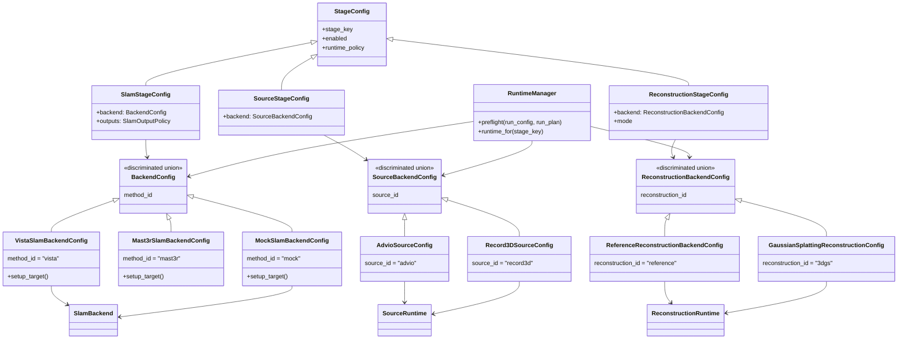

Rules:

- Stage configs validate and describe stage policy; `RuntimeManager` constructs
  stage runtime targets.
- Backend/source config variants may implement `FactoryConfig.setup_target()`
  because they construct concrete domain/source targets.
- Use one explicit, typed discriminator per domain. For SLAM backend configs,
  the target discriminator is `method_id` because it aligns with `MethodId`.
  Avoid dual `kind`/`method_id` vocabulary and avoid vague generic
  discriminators when a domain-specific name exists.
- Use the same naming rule elsewhere: `source_id` for source variants,
  `reconstruction_id` for reconstruction variants, and `stage_key` for stage
  variants.
- Factories should not duplicate discriminator switches that Pydantic already
  performed. Target diagrams should show concrete config `setup_target()` calls
  rather than a second construction authority.
- Keep backend capability metadata close to backend configs so planning can ask
  “can this backend run streaming?” without constructing the backend.
- Source muxing should follow the same rule: `SourceBackendConfig` variants may
  be `FactoryConfig`s; `SourceStageConfig` remains stage policy and never
  constructs the source stage runtime.

### Public Contract Placement

Decision: keep repo-wide semantic DTOs in `interfaces`, repo-wide protocols in
`protocols`, package-local contracts in `<package>/contracts.py` or
`<package>/contracts/`, and package-local behavior seams in
`<package>/protocols.py`.

Reasoning: this follows [src/prml_vslam/AGENTS.md](../../src/prml_vslam/AGENTS.md)
and keeps one semantic concept under one owner. It also resolves the ownership
issue identified at
[interfaces/__init__.py](../../src/prml_vslam/interfaces/__init__.py#L63).

Migration contact points: [interfaces](../../src/prml_vslam/interfaces),
[protocols](../../src/prml_vslam/protocols),
[pipeline/contracts](../../src/prml_vslam/pipeline/contracts),
[methods/protocols.py](../../src/prml_vslam/methods/protocols.py#L1).

Specific target placement:

- Keep `FramePacket`, `SequenceManifest`, `FrameTransform`, and
  `SlamArtifacts` in `interfaces`.
- Move live SLAM update and backend-event DTOs out of `interfaces` into
  `methods.contracts` because they are runtime boundary DTOs, not stable
  repo-wide semantic DTOs.
- Keep stage runtime adapters and `StageActor`s in `pipeline/stages/*`; keep
  domain semantics in the owning domain packages.
- Pipeline-owned public DTOs are generic orchestration/runtime DTOs only.
- Move `PipelineBackend` to `pipeline/protocols.py` so backend behavior seams
  sit with other pipeline-local protocols instead of an ambiguously named
  implementation module.

### Rerun Integration

Decision: output/update DTOs may expose neutral visualization envelopes, but no
DTO or stage actor talks to the Rerun SDK. `StageRuntimeUpdate` carries
domain-owned StrEnum events plus actual typed payloads or transient refs. The
runtime driver routes those updates directly to live snapshot/status state and
the Rerun sink; they do not need to become telemetry `RunEvent`s first. The
Rerun sink logs from those events and payloads and remains the only SDK caller.

Reasoning: the existing [RerunEventSink](../../src/prml_vslam/pipeline/sinks/rerun.py#L35)
is already the single SDK sidecar. Keep this boundary and let
[RerunLoggingPolicy](../../src/prml_vslam/pipeline/sinks/rerun_policy.py)
map neutral visualization envelopes to entity paths, timelines, styling, and
SDK calls.

Migration contact points: [RerunEventSink.observe](../../src/prml_vslam/pipeline/sinks/rerun.py#L84),
[RerunSinkActor.observe_event](../../src/prml_vslam/pipeline/sinks/rerun.py#L148),
[translate_slam_update](../../src/prml_vslam/methods/events.py).

### Status And Telemetry

Decision: add a `StageRuntimeStatus` transport-safe DTO under pipeline
contracts. Actors and in-process runtimes implement `status()`. Important
status transitions are pushed through `StageRuntimeUpdate`; `status()` remains
available for polling, recovery, and late observers.

Minimum fields:

- lifecycle state
- progress message and completed/total steps
- queue/backlog and in-flight count
- throughput / FPS
- latency
- last warning / last error
- executor identity
- resource assignment
- last update timestamp

Reasoning: [StageProgress](../../src/prml_vslam/pipeline/contracts/events.py#L33)
is too narrow for the target, while [StreamingRunSnapshot](../../src/prml_vslam/pipeline/contracts/runtime.py#L69)
contains only streaming-specific SLAM/source counters.

Migration contact points: [events.py](../../src/prml_vslam/pipeline/contracts/events.py#L33),
[runtime.py](../../src/prml_vslam/pipeline/contracts/runtime.py#L38),
[SnapshotProjector](../../src/prml_vslam/pipeline/snapshot_projector.py).

### Resource Placement Model

Decision: introduce typed substrate-neutral resource config.

Target execution policy models:

- `StageExecutionConfig`
- `ResourceSpec`
- `PlacementConstraint`
- `RetryPolicy`
- optional runtime environment tag

Ray translation happens only in the Ray backend/runtime layer. Keep legacy
`{"CPU": ..., "GPU": ...}` parsing only as a migration adapter if needed.

Reasoning: the loose-alias issue identified in
[placement.py](../../src/prml_vslam/pipeline/placement.py#L16) is real. The
target needs CPU, GPU, memory, custom resources, node/IP hints, restart policy,
and task retry policy.

Migration contact points: [StagePlacement](../../src/prml_vslam/pipeline/contracts/request.py#L124),
[actor_options_for_stage](../../src/prml_vslam/pipeline/placement.py#L22),
[RunCoordinatorActor._stage_actor_options](../../src/prml_vslam/pipeline/ray_runtime/coordinator.py#L540).

### Benchmark Versus Eval

Decision: split benchmark policy from evaluation computation.

`benchmark` owns policy and requested baselines; `eval` owns metric
computation, metric result DTOs, and metric artifact loading.

Reasoning: this resolves the responsibility conflict identified in
[benchmark/__init__.py](../../src/prml_vslam/benchmark/__init__.py#L25) and
matches the existing service split where
[TrajectoryEvaluationService](../../src/prml_vslam/eval/services.py)
computes metrics from prepared inputs and SLAM artifacts.

Migration contact points: [benchmark/contracts.py](../../src/prml_vslam/benchmark/contracts.py),
[eval/contracts.py](../../src/prml_vslam/eval/contracts.py),
[eval/services.py](../../src/prml_vslam/eval/services.py).

### IO Versus Datasets

Decision: datasets remain a top-level package.

Keep `datasets` top-level. Remove compatibility aliases only after checking
app/tests/config imports.

Reasoning: datasets own catalogs, sequence preparation, and benchmark
references. IO owns transports and packet ingestion. The ownership issue at
[io/__init__.py](../../src/prml_vslam/io/__init__.py#L20) and the alias in
[datasets/__init__.py](../../src/prml_vslam/datasets/__init__.py) should be
resolved by keeping ownership separate.

Migration contact points: [io/__init__.py](../../src/prml_vslam/io/__init__.py#L1),
[datasets/__init__.py](../../src/prml_vslam/datasets/__init__.py),
[protocols/source.py](../../src/prml_vslam/protocols/source.py#L1).

### Snapshot And Event Ownership

Decision: keep `RunSnapshot` and `RunState` in pipeline.

Keep them in `pipeline.contracts.runtime` for now.

Reasoning: snapshots are projections of pipeline-owned `RunEvent` values and
are app/CLI views over pipeline runtime state. They are not general repo-wide
semantic DTOs yet.

Migration contact points: [runtime ownership note](../../src/prml_vslam/pipeline/contracts/runtime.py#L26),
[RunSnapshot](../../src/prml_vslam/pipeline/contracts/runtime.py#L38),
[RunEvent](../../src/prml_vslam/pipeline/contracts/events.py#L197).

### Artifact Serialization

Decision: move generic serialization helpers out of pipeline finalization when
that cleanup is in scope.

Move generic deterministic JSON serialization to `BaseData` or
`utils.serialization`, but keep summary projection in `pipeline.finalization`.

Reasoning: [write_json](../../src/prml_vslam/pipeline/finalization.py#L88)
is generic. [project_summary](../../src/prml_vslam/pipeline/finalization.py)
is pipeline-specific.

Migration contact points: [finalization.py](../../src/prml_vslam/pipeline/finalization.py),
[BaseConfig.to_jsonable](../../src/prml_vslam/utils/base_config.py#L68).

### Placeholder Stages

Decision: include `reconstruction`, `evaluate.cloud`, and
`evaluate.efficiency` in target docs as public or future public stage surfaces.
Reference reconstruction and 3DGS are variants under `reconstruction`, not
separate target stage keys. Keep unavailable variants or metric stages
diagnostic until each has a runtime. Do not make `source.capture` or
`visualization.export` public stages by default. Capture loops, packet readers,
and Rerun export remain collaborators/sinks unless they own durable outputs
plus failure/provenance semantics.

Reasoning: [StageRegistry.default](../../src/prml_vslam/pipeline/stage_registry.py#L136)
already includes three placeholders. The project scope in
[Questions.md](../Questions.md) also points to streaming operator visualization
and optional 3DGS reconstruction.

Migration contact points: [StageKey](../../src/prml_vslam/pipeline/contracts/stages.py),
[StageRegistry placeholders](../../src/prml_vslam/pipeline/stage_registry.py#L162),
[reconstruction package](../../src/prml_vslam/reconstruction).

### App And CLI Contract

Decision: app, CLI, and future FastAPI adapters submit config and observe
pipeline contracts; they do not construct stage graphs.

App, CLI, and future FastAPI adapters should talk only through:

- `RunConfig`
- `RunPlan`
- `RunSnapshot`
- `RunEvent`
- `ArtifactRef`
- `TransientPayloadRef` through backend/service resolver methods

Do not make Streamlit controllers or API adapters compute pipeline semantics or
construct stage graphs directly.

Reasoning: the app should remain a launch and monitoring surface. This
preserves the package requirement that app code must not become a second
pipeline implementation.

Migration contact points: [RunService](../../src/prml_vslam/pipeline/run_service.py),
[pipeline controls](../../src/prml_vslam/app/pipeline_controls.py),
[main CLI](../../src/prml_vslam/main.py).

## Change Inventory For The Actual Refactor

### Contract Additions

- Add `StageConfig`, `StageRuntimePolicy`, `StageExecutionConfig`,
  `ResourceSpec`, `PlacementConstraint`, `RetryPolicy`,
  `StageTelemetryConfig`, and `StageRuntimeStatus` under pipeline-owned
  contracts.
- Add `StageResult` as the canonical runtime stage handoff.
- Keep durable `StageCompleted` and `StageFailed` events centered on
  `StageOutcome`; do not persist full `StageResult` payloads.
- Add `StageRuntimeUpdate` as the generic live-update envelope carrying
  domain-owned StrEnum events, typed payloads, neutral visualization envelopes,
  runtime status, and transient payload refs.
- Add `TransientPayloadRef` as the backend-agnostic transient payload handle.
- Keep `RunSummary`, `StageManifest`, and `StageOutcome` as pipeline-owned
  generic provenance DTOs.
- Do not add public pipeline-owned stage-specific semantic DTOs. Keep semantic
  payloads in shared/domain packages and use private stage implementation DTOs
  only when useful.
- Add minimal private wrapper DTOs for runtime call boundaries:
  `SourceStageInput/Output`, `SlamOfflineInput`, `SlamStreamingStartInput`,
  `SlamFrameInput`, `SlamStageOutput`, `GroundAlignmentStageInput/Output`,
  `TrajectoryEvaluationStageInput/Output`, `ReconstructionStageInput/Output`,
  and `SummaryStageInput/Output`.

### Runtime Changes

- Add `BaseStageRuntime`, `OfflineStageRuntime`, and `StreamingStageRuntime`.
- Replace `StageRuntimeSpec` function pointers with runtime objects
  constructed by hybrid-lazy `RuntimeManager`.
- Replace `RuntimeExecutionState` with a keyed `dict[StageKey, StageResult]`
  store and typed stage input builders.
- Decompose `stage_execution.py`: move bounded `run_*` bodies into stage-local
  runtime classes, and remove the free functions as target APIs.
- Merge offline and streaming SLAM behavior behind one `SlamStageActor` target,
  and hide any method-specific session object behind that actor, while keeping
  the packet source actor separate.
- Add `SourceRuntime` for source normalization and source factory parity; keep
  packet reading and credits in an internal sidecar collaborator.
- Route `StageRuntimeUpdate` directly to live snapshot/status and Rerun sink;
  keep durable JSONL centered on lifecycle events and `StageOutcome`.
- Finalize active runtimes on stop/failure when possible, preserve partial
  artifacts, mark terminal outcomes, and skip downstream stages that require
  clean upstream outputs.
- Add pushed status updates and `status()` querying for every runtime target.

### Planning Changes

- Introduce `RunConfig`, `StageBundle`, and centralized stage-key/config-section
  mapping as the planning source of truth.
- Use `[stages.reconstruction]` and public stage key `reconstruction` for
  reference reconstruction, 3DGS, and future reconstruction variants.
- Keep the linear stage plan unless a future requirement explicitly needs DAG
  scheduling.
- Keep unavailable placeholder and diagnostic stage rows in planning output with
  precise reasons; fail launch preflight for enabled unavailable stages.

### Factory/Muxing Changes

- Keep `BackendConfig` as a discriminated union.
- Make source configs follow the same discriminated-union and factory pattern
  as method backends.
- Add reconstruction backend/mode variants under `ReconstructionStageConfig`.
- Avoid adding a parallel enum plus manual `if`/`match` switch when the config
  subtype already identifies the backend/source.

### Visualization Changes

- Keep all Rerun SDK calls in `RerunEventSink`/`RerunSinkActor`.
- Let the sink consume `StageRuntimeUpdate` visualization intents and typed
  payloads directly; add a visualization adapter only if stage output DTOs need
  conversion before they become sink payloads.
- Keep native upstream `.rrd` artifacts as visualization-owned extras, not
  scientific outputs.

### Ownership Cleanup

- Resolve the issue map in
  [pipeline-stage-present-state-audit.md](./pipeline-stage-present-state-audit.md#inline-todo--issue-map).
- Remove the `io.datasets` compatibility alias after verifying no imports rely
  on it.
- Move Rerun validation DTOs to a visualization contract module.
- Move generic JSON serialization helpers to shared utilities if reused outside
  pipeline finalization.

### Tests To Plan With The Code Refactor

Use slice-based acceptance tests so each migration step can be verified before
the next one starts:

| Slice | Required acceptance tests |
| --- | --- |
| Contracts | `StageResult`, `StageRuntimeUpdate`, `StageRuntimeStatus`, `TransientPayloadRef`, runtime policy, resource config, and stage config parsing. |
| Planning | diagnostic unavailable rows, fail-fast launch preflight, stage-key to config-section mapping, and `[stages.reconstruction]` variant selection. |
| Runtime manager | hybrid-lazy construction, preflight without actor allocation, lazy actor/local runtime creation, and no direct coordinator construction path. |
| Source runtime | offline normalization through `SourceRuntime`, source factory parity, streaming packet sidecar separation, and no public capture stage. |
| Bounded runtimes | ground alignment, trajectory evaluation, reconstruction, and summary runtimes return `StageResult` and no longer require free `run_*` functions. |
| SLAM actor | offline run, streaming start, frame push, finalize, status, stop, backend failure, and partial artifact preservation. |
| Update routing | `StageRuntimeUpdate` reaches live snapshot/status and Rerun sink without durable telemetry JSONL; durable completions still persist `StageOutcome`. |
| Failure/stop | finalize-then-mark behavior, source error, backend error, stop during streaming, downstream skip policy, and terminal run state. |
| Payloads/Rerun | backend-owned transient refs, typed read-after-eviction, sink failure isolation, and no SDK calls from DTOs or stage actors. |
| Compatibility cleanup | import audit or grep checks around `prml_vslam.io.datasets` before removing aliases. |

## Recommended Implementation Order

1. Add contracts only: `RunConfig`, `SourceStageConfig`, `StageConfig`,
   `StageRuntimePolicy`, `StageExecutionConfig`, `StageRuntimeStatus`,
   `StageRuntimeUpdate`, `StageResult`, `TransientPayloadRef`, private
   stage-wrapper DTOs, and reconstruction stage config variants.
2. Update docs and inline issue comments to point to the new ownership decisions.
3. Add source factory parity and local `SourceRuntime` without changing
   behavior; keep packet reading as an internal sidecar.
4. Introduce `BaseStageRuntime`, `OfflineStageRuntime`,
   `StreamingStageRuntime`, hybrid-lazy `RuntimeManager`, and keyed
   `StageResult` storage while adapting existing bounded helpers.
5. Decompose `stage_execution.py` by moving bounded `run_*` bodies into
   stage-local runtimes, leaving only temporary wrappers if needed.
6. Merge SLAM actor/session surfaces behind the new runtime protocol.
7. Route `StageRuntimeUpdate` directly to live snapshot/status and Rerun sink.
8. Add status querying/projection and finalize-then-mark stop/failure handling.
9. Convert future metric or reconstruction variants one at a time when their
   real implementations are in scope.
