# Pipeline Stage Refactor Target Architecture

This document describes the intended target architecture for the next
`prml_vslam` package refactor. It deliberately avoids explaining the current
implementation in detail. Current-state diagnosis, redundancies, and incorrect
definition placement live in the separate
[Pipeline Stage Present-State Audit](./pipeline-stage-present-state-audit.md).

Use this target document for desired stage/module shape, target UML, target
contracts, and implementation-order decisions. Use the present-state audit when
you need to know what exists today and why it needs to change.

Companion references:

- [Present-state audit](./pipeline-stage-present-state-audit.md)
- [Executable stage protocol reference](./pipeline-stage-protocols-and-dtos.md)
- [Package requirements](../../src/prml_vslam/REQUIREMENTS.md)
- [Refactor notes](../../src/prml_vslam/REFACTOR_PLAN.md)
- [Interfaces and contracts guide](./interfaces-and-contracts.md)
- [Artifact cleanup policy](./pipeline-stage-artifact-cleanup-policy.md)
- [Pipeline refactor review A01 actions](./pipeline-refactor-review-a01-actions.md)

Terminology preserved from the executable stage protocol reference:

- `runtime payload`: rich in-memory payload used inside stage or backend boundaries
- `transport-safe event`: strict DTO crossing Ray/runtime event boundaries
- `durable artifact/provenance`: persisted manifest, artifact ref, or summary
- `transport-safe projection`: app/CLI-facing state derived from events

## Target Non-Goals

- Do not convert the pipeline into a generic DAG/workflow engine.
- Do not make every stage a Ray actor.
- Do not expose `PacketSourceActor` or source packet reading as a public
  benchmark stage by default.
- Do not put Rerun SDK conversion methods on core DTOs.
- Do not move `RunSnapshot` or `RunState` out of `pipeline` unless another
  package genuinely shares the same semantics.
- Do not blindly flatten `pipeline/contracts/`; a package with several
  contract slices may keep a `contracts/` package.

## Target Package Ownership

Recommended target: keep package responsibilities stable while making the
generic pipeline runtime contracts explicit. The pipeline owns orchestration,
planning, runtime envelopes, status, events, snapshots, resource policy, and
payload-reference mechanics. Domain and shared packages own semantic payloads,
method/source variants, and concrete domain event kinds.

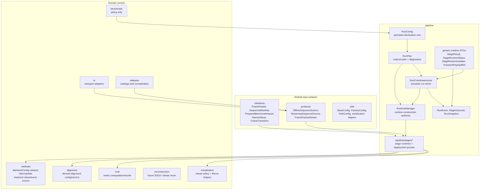

Rules:

- The pipeline owns only generic pipeline-specific DTOs: `RunPlan`,
  `RunEvent`, `RunSnapshot`, `StageResult`, `StageRuntimeStatus`,
  `StageRuntimeUpdate`, `TransientPayloadRef`, and execution/resource policy.
- Semantic payload DTOs stay with their domain owner. Examples:
  `SlamArtifacts` remains shared, live SLAM DTOs move to `methods.contracts`,
  `GroundAlignmentMetadata` remains alignment-owned, and evaluation artifacts
  remain eval-owned.
- `FactoryConfig` remains the construction pattern for concrete domain
  variants such as method backends and source backends. It is not the stage
  runtime construction pattern.
- `pipeline/stages/*` owns stage runtime adapters and private deployment
  helpers. These modules may use private implementation DTOs, but they must not
  become a second public home for domain semantics.
- Domain services/backends own reusable computation and package-local
  behavior. They may hold immutable config and dependencies, but they do not
  own pipeline lifecycle, `StageResult`, `RunEvent`, Ray refs, or Rerun SDK
  calls. Run-specific mutable algorithm state belongs behind the stage runtime;
  stage runtimes adapt those services and backends into pipeline contracts.
- Rerun SDK calls remain inside the sink layer. Stage updates may expose
  neutral `VisualizationItem`s, but they do not own Rerun entity paths,
  timelines, styling, SDK commands, or bulk viewer payloads.

### SLAM Artifact Normalization And Inspection Ownership

The SLAM stage completes with a normalized `SlamArtifacts` bundle, but the
semantic ownership of individual artifact families stays with the package that
understands them.

- `interfaces.camera` owns shared camera datamodels and pure camera-model
  transforms. A reusable typed estimated-intrinsics artifact, such as
  `CameraIntrinsicsSeries`, belongs there rather than in pipeline, app, or a
  method wrapper.
- `methods.vista` owns ViSTA-native artifact interpretation and
  standardization. This includes converting native `intrinsics.npy` into typed
  camera artifacts and persisting ViSTA preprocessing metadata needed to know
  that estimated intrinsics live in the 224x224 model raster.
- `eval` owns typed estimated-vs-reference intrinsics comparison artifacts when
  those residuals or statistics are persisted or benchmarked. Do not add an
  `evaluate.calibration` stage key until calibration/intrinsics metrics become
  first-class planned stages.
- `pipeline` owns run layout, `ArtifactRef`s, stage outcomes, manifests,
  summaries, run-event truth, and attempt/provenance inspection. It does not
  own method-native raster semantics.
- `utils.geometry` may own generic color-preserving PLY IO and other reusable
  geometry helpers. The decision to preserve ViSTA point-cloud colors in the
  normalized SLAM artifact remains in `methods.vista.artifacts`.
- `visualization` owns Rerun validation DTOs and `.rrd` validation-bundle
  generation. Native or repo-owned `.rrd` files are viewer artifacts, not the
  scientific source of truth.
- `app` owns only controls and orchestration for inspecting these artifacts;
  `plotting` owns only figure construction.

## Generic Stage Module Blueprint

Recommended target: introduce a `pipeline/stages/` package for stage runtime
adapters and Ray-hosted runtime helpers, while keeping domain semantic
contracts in their owning packages. The base package owns the generic runtime
protocol, status, result, update, payload-reference, proxy, and Ray adapter
contracts.

```text
src/prml_vslam/pipeline/
├── config.py              # RunConfig and StageBundle; compiles RunPlan
├── runtime_manager.py     # runtime/proxy construction authority
├── stages/
│   ├── __init__.py
│   ├── base/
│   │   ├── __init__.py
│   │   ├── config.py          # StageConfig, StageExecutionConfig, runtime policy
│   │   ├── contracts.py       # StageResult, StageRuntimeStatus, StageRuntimeUpdate
│   │   ├── handles.py         # TransientPayloadRef
│   │   ├── protocols.py       # BaseStageRuntime, Offline/LiveUpdate/Streaming protocols
│   │   ├── proxy.py           # StageRuntimeProxy for local/Ray-hosted invocation
│   │   └── ray.py             # Ray placement and invocation helpers
│   ├── source/
│   │   ├── __init__.py
│   │   ├── config.py          # SourceStageConfig + SourceBackendConfig union
│   │   └── runtime.py         # source normalization around legacy ingest logic
│   ├── slam/
│   │   ├── __init__.py
│   │   ├── config.py          # SlamStageConfig, resource policy, backend config field
│   │   ├── visualization.py   # SlamVisualizationAdapter, no Rerun SDK calls
│   │   └── runtime.py         # unified offline + streaming SLAM runtime
│   ├── ground_alignment/
│   │   ├── config.py          # GroundAlignmentStageConfig; stage policy only
│   │   └── runtime.py         # adapter around GroundAlignmentService
│   ├── trajectory_eval/
│   │   ├── config.py          # TrajectoryEvaluationStageConfig; stage policy only
│   │   └── runtime.py         # adapter around TrajectoryEvaluationService
│   ├── reconstruction/
│   │   ├── config.py          # ReconstructionStageConfig references reconstruction-owned backend variants
│   │   ├── visualization.py   # optional future reconstruction VisualizationItem adapter
│   │   └── runtime.py         # adapter around reconstruction backends
│   └── summary/
│       ├── config.py          # SummaryStageConfig; projection policy only
│       └── runtime.py         # projection-only runtime around project_summary()
```

This tree must not move method wrappers, alignment logic, metric computation,
dataset normalization, or visualization policy into pipeline stage modules. For
example, ViSTA- and MASt3R-specific backend configs remain method-owned in
[methods/configs.py](../../src/prml_vslam/methods/configs.py), and backend
construction remains method-owned in
[methods/factory.py](../../src/prml_vslam/methods/factory.py). The pipeline
`slam` stage owns stage lifecycle, status, resource policy, and the runtime
boundary around the method backend.

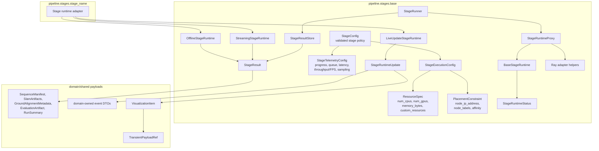

Implementation guidance:

- Keep `config.py` free of runtime construction side effects. Stage configs
  validate declarative policy and expose planning metadata only.
- `RuntimeManager` is the only authority that turns a `RunPlan` and validated
  configs into in-process runtime objects, runtime proxies, payload stores,
  sink sidecars, and placement decisions.
- Keep public pipeline contracts generic. If a stage needs a semantic payload,
  use the owning package's DTO instead of adding a parallel pipeline DTO.
- Keep Ray-specific APIs in `stages/base/ray.py`, runtime proxy helpers, or
  optional Ray implementation details. Stage-specific actors are migration
  contacts or private implementation choices, not the default target shape.

## RunConfig Stage Bundle And Plan Compilation

`RunConfig` is the canonical persisted declarative root. It owns a fixed
`StageBundle` and compiles directly to `RunPlan`; the target architecture does
not require a separate runtime-construction catalog. Stage configs provide
side-effect-free planning metadata such as stage key, enablement,
availability, declared outputs, and resource policy. They do not instantiate
actors or open resources. Failure provenance stays in the planning layer as
stage-specific policy for building stable failure outcomes, config hashes, and
input fingerprints.

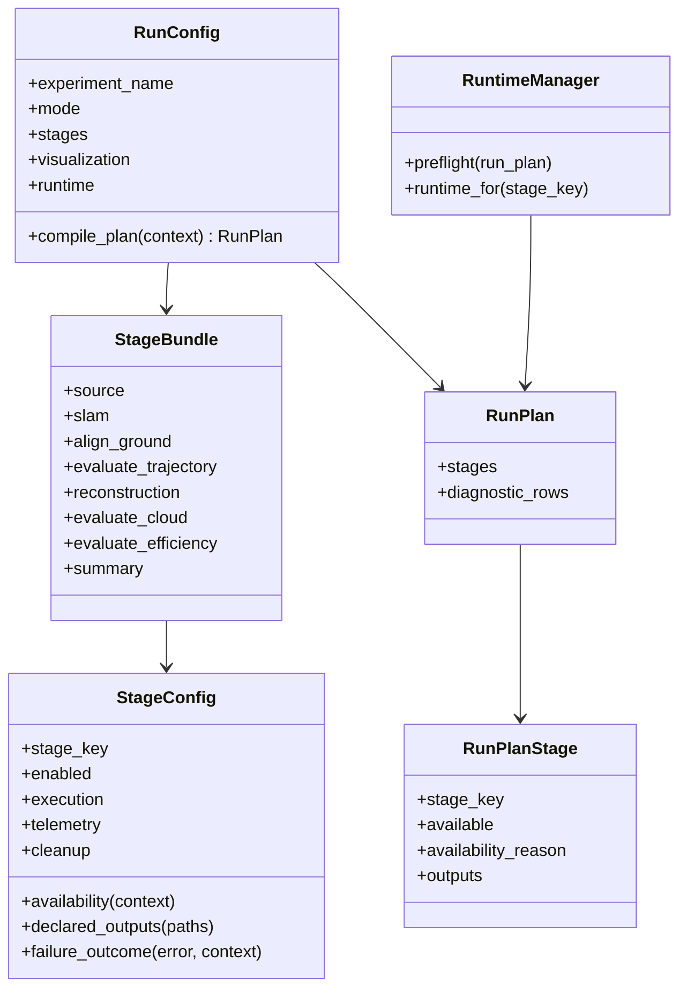

Rules:

- The public linear order is
  `source -> slam -> [align.ground] -> [evaluate.trajectory] ->
  [reconstruction] -> summary`.
- Future metric stages use the same compact verb namespace:
  `evaluate.cloud` and `evaluate.efficiency`. Reconstruction variants are
  backend/mode variants under the umbrella `reconstruction` stage, not separate
  public stage keys.
- `RunPlan` may contain unavailable diagnostic rows for requested or previewed
  stages. Launch preflight must fail before work starts when an enabled
  requested stage is unavailable.
- `RunPlan` declares canonical outputs only. Backend-native files flow through
  domain-owned artifacts such as `SlamArtifacts.extras` or visualization-owned
  artifacts.
- Stage configs own failure-provenance policy so runtime failures can still
  produce stage-specific `StageOutcome` values without a central stage catalog.
- Stage configs own artifact cleanup policy through `StageConfig.cleanup`.
  Cleanup semantics are defined in
  [Pipeline Stage Artifact Cleanup Policy](./pipeline-stage-artifact-cleanup-policy.md)
  and remain stage runtime policy, not backend output policy.
- Stage-key to config-section mapping is centralized. Stage keys use dot
  notation; TOML sections and modules use snake_case.

## Target Config Shape

Recommended target: make `RunConfig` the only canonical persisted declarative
root. Keep named stage sections under `[stages.*]` for TOML and UI readability;
do not switch to a raw `StageConfig[]` list. `RunLaunchRequest` is deprecated:
launch should consume `RunConfig -> RunPlan`, with runtime/session policy
expressed in `RunConfig` or backend/service parameters that do not redefine
stage semantics.

`RunConfig`, stage configs, and stage backend configs validate and describe.
They do not construct runtime targets. `RuntimeManager` performs live
construction and startup when a run launches.

External context: use the repo-local
[$pydantic](../../.agents/skills/pydantic/SKILL.md) skill for Pydantic v2
modeling patterns. Target config work should prefer `Field`,
`model_validator` / field validators, discriminated unions, serialization via
`model_dump` / `model_dump_json`, and the repo's existing `BaseConfig` /
`BaseData` conventions; see also the official Pydantic docs on
[unions](https://pydantic.dev/docs/validation/latest/concepts/unions/),
[serialization](https://docs.pydantic.dev/latest/concepts/serialization/), and
[models](https://docs.pydantic.dev/latest/concepts/models/).

Target persisted TOML shape:

```toml
experiment_name = "advio-15-offline-vista"
mode = "offline"
output_dir = ".artifacts"

[stages.source]
enabled = true

[stages.source.backend]
source_id = "advio"
sequence_id = "advio-15"

[stages.slam]
enabled = true

[stages.slam.backend]
method_id = "vista"

[stages.slam.outputs]
emit_dense_points = true
emit_sparse_points = false

[stages.align_ground]
enabled = false

[stages.evaluate_trajectory]
enabled = false

[stages.reconstruction]
enabled = false
mode = "reference"

[stages.summary]
enabled = true

[visualization]
export_viewer_rrd = false
connect_live_viewer = false

[runtime]
executor = "ray"
```

Per-stage cleanup is available through an optional nested
`[stages.<stage>.cleanup]` table once the active config model supports
`StageConfig.cleanup`. The cleanup policy selects artifacts by stage artifact
key, not filesystem path; see the dedicated
[artifact cleanup policy](./pipeline-stage-artifact-cleanup-policy.md).

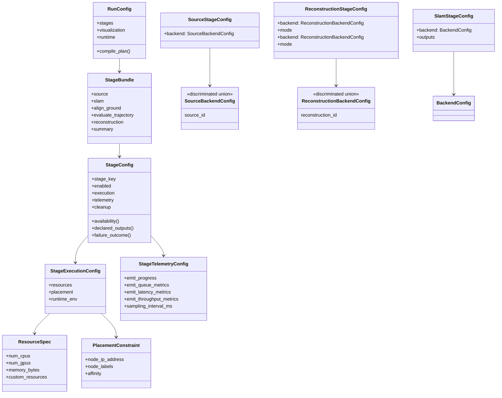

Immediate contact points:

- [RunRequest and stage-section migration contacts](../../src/prml_vslam/pipeline/contracts/request.py#L118)
- [StagePlacement and PlacementPolicy](../../src/prml_vslam/pipeline/contracts/request.py#L124)
- [Ray placement translation](../../src/prml_vslam/pipeline/placement.py#L16)
- [SLAM backend configs as factory precedent](../../src/prml_vslam/methods/configs.py#L26)

Config/factory boundary:

- `RunConfig`, `StageConfig`, `SourceStageConfig`, and `SlamStageConfig`
  validate and describe stage policy. They are not runtime factories.
- `StageConfig` owns `execution`, `telemetry`, and `cleanup` directly. Do not
  add a separate runtime-policy wrapper unless it gains independent semantics
  beyond grouping fields.
- Do not add a public retry DTO in the first target slice. Current Ray
  retry knobs remain backend/runtime implementation details until the project
  needs a repo-level retry contract.
- `BackendConfig` and `SourceBackendConfig` variants may implement
  `FactoryConfig.setup_target()` because they construct domain/source
  implementation targets, not pipeline stage runtimes.
- `RuntimeManager` is the only owner that constructs stage runtime adapters,
  runtime proxies, sink sidecars, payload stores, and placement-specific runtime
  wrappers.
- This target document supersedes older refactor-note wording that described
  every top-level stage config as a factory. Backend/source/reconstruction
  variant configs may remain `FactoryConfig`s; stage configs remain
  declarative planning and policy contracts.

## Target Runtime Integration

Recommended target: separate runtime capability from deployment. Stage
capability is expressed through `BaseStageRuntime`, `OfflineStageRuntime`,
`LiveUpdateStageRuntime`, and `StreamingStageRuntime`. Deployment is
expressed by capability-typed `StageRuntimeProxy` instances, which hide whether
the concrete runtime is an in-process object or Ray-hosted runtime.

External context: use
[Ray runtime patterns](../../.agents/references/ray-runtime-patterns.md) when
implementing Ray-hosted runtimes, proxy task tracking, actor method ordering,
object refs, resources, runtime envs, termination, State API diagnostics, or
custom metrics.

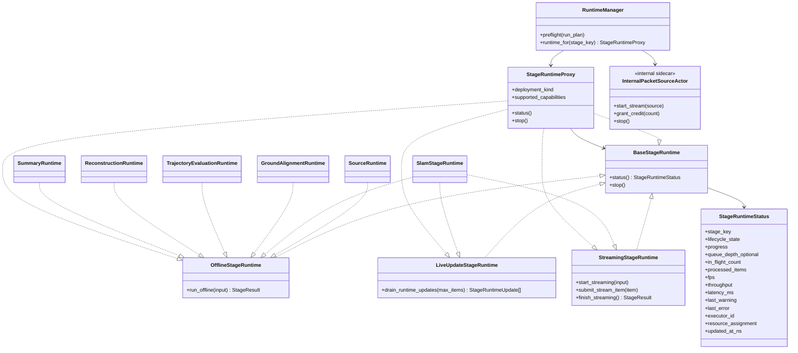

`StageRuntimeProxy` exposes capability-specific protocol views selected during
preflight. The UML edges to `OfflineStageRuntime`, `LiveUpdateStageRuntime`,
and `StreamingStageRuntime` are conditional views, not a universal proxy that
supports every method for every runtime.

Migration contact points:

- [RuntimeStageDriver](../../src/prml_vslam/pipeline/ray_runtime/stage_program.py#L77)
- [StageRuntimeSpec](../../src/prml_vslam/pipeline/ray_runtime/stage_program.py#L117)
- [OfflineSlamStageActor](../../src/prml_vslam/pipeline/ray_runtime/stage_actors.py#L42)
- [StreamingSlamStageActor](../../src/prml_vslam/pipeline/ray_runtime/stage_actors.py#L203)
- [PacketSourceActor](../../src/prml_vslam/pipeline/ray_runtime/stage_actors.py#L99)
- [coordinator stage actor options](../../src/prml_vslam/pipeline/ray_runtime/coordinator.py#L540)

Decision: unify offline and streaming SLAM under one future
`SlamStageRuntime`. It implements `OfflineStageRuntime`,
`LiveUpdateStageRuntime`, and `StreamingStageRuntime`. `RuntimeManager` may
deploy that runtime in-process or as a Ray-hosted runtime behind
`StageRuntimeProxy`. Keep packet-source/capture readers separate as internal
runtime collaborators because they own source credits and transport reads, not
durable benchmark stage semantics.

Runtime protocol rule: all runtimes implement `BaseStageRuntime`.
Offline-capable stages implement `OfflineStageRuntime`; active runtimes that
emit live updates implement `LiveUpdateStageRuntime`; streaming hot-path
stages implement `StreamingStageRuntime`. A stage may implement several
surfaces. Offline does not mean “single item”: the input DTO may represent a
sequence, a batch, or a bundle of artifacts. Do not require every stage to
expose streaming methods or live-update draining when it has no active
observer feed.

Streaming runtimes use command/query separation. `submit_stream_item(...)`
submits one hot-path item to the runtime and returns no semantic update payload.
`drain_runtime_updates(max_items=None)` retrieves the live updates that have
already been produced by prior submitted work. `finish_streaming()` finalizes
the runtime and returns the terminal `StageResult`. The same
`LiveUpdateStageRuntime` drain surface may also be used later by
long-running bounded runtimes such as reconstruction or evaluation.
For source-to-SLAM streaming, one source credit is released after the runtime
or proxy has accepted and processed the submitted frame; observer sinks and
Rerun logging do not participate in credit release.

`RuntimeManager` returns a `StageRuntimeProxy` to `StageRunner` and the
coordinator. The proxy is typed to the selected runtime's capabilities; a
non-streaming runtime does not present a streaming command surface, and
unsupported capability calls fail during plan/preflight rather than at an
arbitrary hot-path call site. For in-process deployment the proxy can be a thin
direct-call adapter. For Ray-hosted deployment it owns actor creation,
`.remote()` calls, Ray task refs, task counters, and failure accounting. Ray
object refs and actor mailboxes never cross into `StageRunner`, coordinator,
app, or CLI code. Queue depth is reported only when the runtime or pipeline
explicitly owns a measurable queue or credit counter, such as source-to-SLAM
in-flight frames.

Ray-idiomatic status uses both pipeline-owned counters and Ray observability.
For Ray-hosted runtimes, `StageRuntimeProxy` tracks submitted, completed,
failed, and in-flight actor method refs. Ray-hosted runtimes may also emit Ray
custom metrics for stage-owned queue depth, FPS, throughput, and latency. Ray
State API and Dashboard data remain useful diagnostics, but they are not the
canonical pipeline contract because state snapshots can be stale or partial.
Proxy counters are internal deployment state and surface only through
`StageRuntimeStatus`.

Per-stage runtime classification:

| Runtime | Capability protocols | Domain executor |
| --- | --- | --- |
| `SourceRuntime` | `OfflineStageRuntime` | Source normalization adapter and source backend config. |
| `SlamStageRuntime` | `OfflineStageRuntime` + `StreamingStageRuntime` + `LiveUpdateStageRuntime` | `SlamBackend`. |
| `GroundAlignmentRuntime` | `OfflineStageRuntime` | `GroundAlignmentService`. |
| `TrajectoryEvaluationRuntime` | `OfflineStageRuntime` | `TrajectoryEvaluationService`. |
| `ReconstructionRuntime` | `OfflineStageRuntime` first; `LiveUpdateStageRuntime` only for long-running variants; streaming only if needed later | `ReconstructionBackend` such as `Open3dTsdfBackend`. |
| `SummaryRuntime` | `OfflineStageRuntime` | `project_summary()`. |

Per-runtime deployment defaults:

| Runtime | Initial deployment | Ray-hosting trigger |
| --- | --- | --- |
| `SourceRuntime` | in-process; streaming source may use an internal sidecar | USB/Wi-Fi source locality or independent source credits. |
| `SlamStageRuntime` | Ray-hosted when GPU, streaming, or remote placement is needed | stateful hot path, GPU placement, remote node affinity, or independent cancellation/status. |
| `GroundAlignmentRuntime` | in-process | large point-cloud cost or remote resource placement. |
| `TrajectoryEvaluationRuntime` | in-process | expensive metrics or remote placement. |
| `ReconstructionRuntime` | in-process for reference mode | GPU-heavy 3DGS or long-running reconstruction variants. |
| `SummaryRuntime` | in-process | no expected Ray-hosting need. |

A domain executor is the single package-owned computation dependency behind a
runtime. It may be an existing service, backend, or pure helper. It does not
emit `RunEvent`, build `StageResult`, own Ray refs, or call the Rerun SDK.

Compact per-stage runtime patterns:

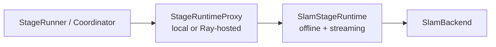

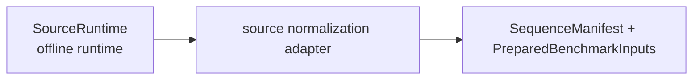

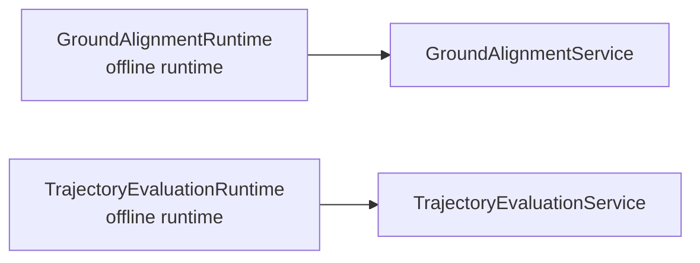

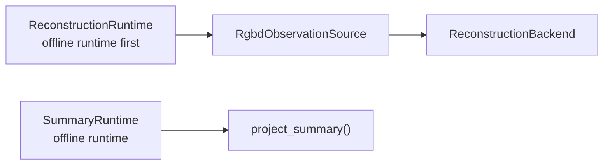

### Current To Target Responsibility Map

The current runtime complexity is a four-way split across phase routing,
mutable state, actor lifecycle, and observer/event policy. The target refactor
collapses those responsibilities into explicit owners:

| Current responsibility | Current owner | Target owner |
| --- | --- | --- |
| Phase-specific stage function routing | `RuntimeStageProgram` / `StageRuntimeSpec` | `StageRunner` invokes `OfflineStageRuntime` and `StreamingStageRuntime` surfaces under coordinator sequencing. |
| Cross-stage mutable handoff | `RuntimeExecutionState` plus `StageCompletionPayload` | `StageResultStore` over run-scoped keyed `dict[StageKey, StageResult]`. |
| Bounded stage bodies | free `run_*` functions in `stage_execution.py` | Stage-local runtime classes under `pipeline/stages/*/runtime.py`. |
| Stage-specific input pulls | `_require_sequence_manifest()`, `_require_slam_artifacts()`, and ad hoc state reads | shared `StageResultStore` accessors plus stage-local `build_input(...)` functions. |
| Completion application | `_apply_completion()` | `StageResultStore.put(result)`. |
| Failure outcome hooks | `build_failure_outcome` callbacks and `_failure_builder(...)` | `StageConfig.failure_outcome(...)` plus shared `StageOutcome` helpers. |
| Completion/failure event callbacks | `record_stage_completion` / `record_stage_failure` callbacks | coordinator event recorder methods invoked by `StageRunner`. |
| SLAM actor/session lifecycle | separate offline and streaming SLAM actors | one `SlamStageRuntime` implementing offline, streaming, and live-update protocols, optionally Ray-hosted behind `StageRuntimeProxy`. |
| Streaming SLAM driver hooks | `RuntimeStageDriver.start_streaming_slam_stage()` / `close_streaming_slam_stage()` | `RuntimeManager` constructs the runtime; coordinator calls runtime protocol methods. |
| Runtime construction and placement | coordinator helpers and stage helpers | hybrid-lazy `RuntimeManager`. |
| Live payload resolution and eviction | coordinator handle cache | runtime-managed payload store behind `TransientPayloadRef`. |
| Rerun/event observer policy | coordinator forwarding `RunEvent`s to sink | direct live update routing plus sink-owned Rerun translation. |

`stage_execution.py` is transitional. The final target eliminates its free
`run_*` functions: bounded stages become `run_offline()` methods on
stage-local runtimes, and `run_offline_slam_stage()` disappears into
`RuntimeManager`, `StageRuntimeProxy`, and the unified SLAM runtime surface.
Compatibility wrappers may exist during migration, but they are not target APIs.

`RuntimeManager` uses hybrid-lazy construction. It preflights configs,
availability, resource policy, stage mapping, and actor options before work
starts, but instantiates local runtimes and Ray-hosted runtime proxies lazily when each
stage begins. This gives early validation without allocating unused actors or
opening sources before their stage is reached.

### Runtime Capability Versus Deployment

Differentiate runtime targets by capability, then choose deployment separately.
All stages are real stages, but not all stages need Ray-hosted execution.

| Question | If yes | If no |
| --- | --- | --- |
| Does the stage keep mutable state across frames, batches, or calls? | Implement the needed runtime protocol and consider Ray-hosting. | In-process deployment is sufficient. |
| Does the stage need GPU, custom resource, or remote-node placement? | Deploy the runtime through a Ray-hosted `StageRuntimeProxy` with `StageExecutionConfig` / `ResourceSpec`. | Keep it in-process unless the stage is slow enough to justify remote execution. |
| Does the stage participate in the streaming hot path? | Implement `StreamingStageRuntime` and let `RuntimeManager` choose in-process or Ray-hosted deployment. | Implement only `OfflineStageRuntime` / `finish_streaming()` where needed. |
| Does the stage need independent stop/cancel/status semantics? | Keep the protocol surface uniform; Ray-host only if cancellation/status requires a separate worker. | Coordinator can treat it as a bounded call through the same proxy surface. |
| Is the stage a pure projection over existing artifacts/events? | Keep in-process by default. | Reconsider only if artifact size or runtime cost demands placement. |

Initial classification:

| Stage | Runtime target | Reason |
| --- | --- | --- |
| `source` | In-process runtime first; streaming source backend may use an internal sidecar | Source backend selection and normalization; live packet readers are collaborators, not public stages. |
| `slam` | `SlamStageRuntime` through `StageRuntimeProxy`, Ray-hosted when needed | Stateful backend, streaming hot path, GPU placement. |
| `align.ground` | In-process runtime first | Derived artifact from `SlamArtifacts`; can be upgraded if point-cloud size demands remote placement. |
| `evaluate.trajectory` | In-process runtime first | Offline/finalize metric computation over materialized trajectories. |
| `reconstruction` | Runtime selected by reconstruction backend/mode | Reference reconstruction can stay in-process first; GPU-heavy 3DGS variants use Ray hosting. |
| `summary` | In-process runtime | Pure projection from `StageOutcome[]`. |
| source/packet reader collaborator | Ray actor or in-process sidecar | Owns live transport state and source credits; not a public benchmark stage by default. |

The coordinator should not care which deployment target is used. It should call
the capability-typed `StageRuntimeProxy` surface and receive
`StageRuntimeStatus`, drained `StageRuntimeUpdate` values when the runtime is
update-capable, and `StageResult` objects. In-process proxies call domain
executors directly; Ray-hosted proxies hide Ray calls, task refs, and actor
failures behind the same runtime surface.

### Stage Runtime API Vocabulary

Stage runtimes may use narrow stage-surface DTOs as private wrapper types
without making those DTOs public domain semantics. Use wrappers only where
they clarify a real runtime boundary; do not require every stage to define
paired input/output DTOs when a domain payload or `StageOutcome` is already
clear.

Recommended private wrapper boundaries:

- `SlamOfflineInput`, `SlamStreamingStartInput`, `SlamFrameInput`, and
  `SlamStageOutput`: offline sequence input, streaming startup input, hot-path
  frame input, and normalized SLAM completion output.
- `ReconstructionStageInput` and `ReconstructionStageOutput`: wrapper around
  prepared RGB-D/reference inputs or SLAM-derived reconstruction inputs,
  reconstruction mode/backend policy, and reconstruction-owned artifacts.
- Stage-specific result wrappers only when a runtime needs to return more than
  one domain payload before constructing `StageResult`.

Simple local runtimes may consume domain payloads directly. For example,
`GroundAlignmentRuntime` can consume `SlamArtifacts` and return
`GroundAlignmentMetadata` inside `StageResult`; `SummaryRuntime` can call
`project_summary()` directly without dedicated summary wrapper DTOs.

For SLAM, the target runtime boundary specifically uses:

- `SlamOfflineInput`: normalized sequence, prepared benchmark inputs, output
  policy, and artifact root for offline execution.
- `SlamStreamingStartInput`: normalized startup context for a streaming SLAM
  runtime.
- `SlamFrameInput`: one hot-path frame item plus transient payload refs or
  resolved arrays needed by the runtime.
- `SlamStageOutput`: normalized `SlamArtifacts` plus visualization-owned
  artifacts collected at completion.

The public generic streaming runtime method names are
`start_streaming(...)`, `submit_stream_item(...)`, and
`finish_streaming()`. Active runtimes that emit live observer updates expose
`drain_runtime_updates(...)` through `LiveUpdateStageRuntime`. Stage modules
may keep private helpers with narrower names, such as `push_frame(...)`, but
`StageRunner` and `RunCoordinatorActor` must depend on the generic method
names. For SLAM, `submit_stream_item(SlamFrameInput)` maps to the backend's
stream-item execution surface, while `drain_runtime_updates()` maps to the
backend update-drain surface plus translation into `StageRuntimeUpdate` values.

Method-level live DTOs such as `SlamUpdate` and backend notice/event payloads
belong in `methods.contracts`, not in public pipeline contracts. Method-visible
streaming session objects are current implementation details, not target
architecture roles.

### Coordinator Responsibility Boundary

Target coordinator responsibilities:

- sequence the linear run
- record `RunEvent` truth
- project or trigger projection into `RunSnapshot`
- dispatch stage commands through `StageRuntimeProxy`
- stop or finalize active stage runtimes
- publish `StageRuntimeUpdate` values to live projection and observer sinks

Responsibilities that should move out of the coordinator:

- Ray bootstrap and local/reusable head lifecycle
- source-resolution details
- artifact-map helper logic
- Rerun logging policy
- backend-specific setup payload shaping
- raw placement translation from config to Ray actor options
- transient payload eviction policy details

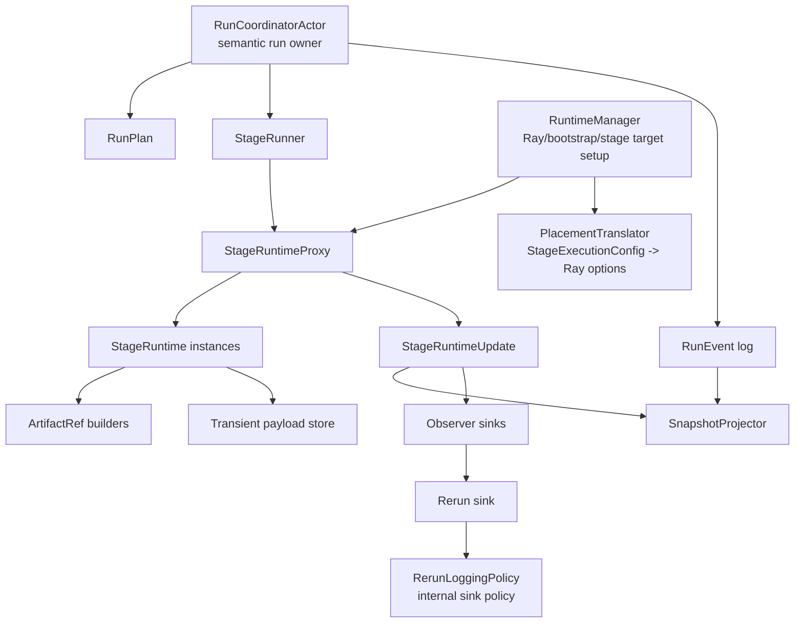

### Public Stages Versus Internal Collaborators

The public stage vocabulary should contain durable benchmark steps only:

- `source`
- `slam`
- `align.ground`
- `evaluate.trajectory`
- `reconstruction`
- `summary`
- future metric placeholders: `evaluate.cloud`, `evaluate.efficiency`

Internal runtime collaborators are not public stages by default:

- packet source / capture loop
- Rerun sink
- transient payload handle store
- Ray bootstrap / local head lifecycle
- array/object-store cleanup

This distinction keeps the stage UML focused. A capture loop may become a
first-class capture stage only if the project decides that persisted capture
artifacts are durable benchmark outputs with their own provenance. Until then,
it is a collaborator of streaming execution.

`reconstruction` is one public durable stage with backend/mode variants.
Reference reconstruction, 3DGS, and future reconstruction methods should be
selected inside `[stages.reconstruction]` rather than by adding separate public
stage keys for each reconstruction flavor.

## Generic DTO And Domain Payload Architecture

Recommended target: keep public pipeline DTOs generic. Do not create a large
set of pipeline-owned stage-specific semantic DTOs. Stage runtimes may use
private implementation inputs, but public payloads inside `StageResult` and
`StageRuntimeUpdate` are domain-owned or shared DTOs.

`StageResult` is the canonical cross-stage completion target. `StageOutcome` is
the durable/provenance subset, and semantic outputs remain domain-owned
payloads from their owning package.

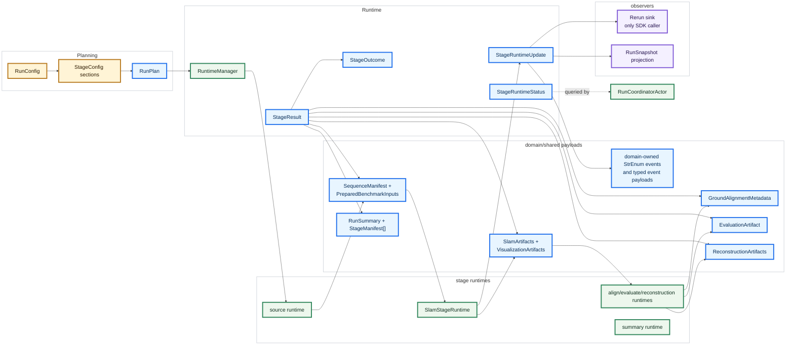

Shared DTO migration contacts:

- [SequenceManifest and PreparedBenchmarkInputs](../../src/prml_vslam/interfaces/ingest.py#L43)
- [SlamArtifacts and existing live SLAM DTO migration contacts](../../src/prml_vslam/interfaces/slam.py#L29)
- [StageOutcome](../../src/prml_vslam/pipeline/contracts/events.py#L50)
- [legacy completion payload migration contact](../../src/prml_vslam/pipeline/ray_runtime/stage_program.py#L59)
- [RunSummary and StageManifest](../../src/prml_vslam/pipeline/contracts/provenance.py)
- [GroundAlignmentMetadata](../../src/prml_vslam/interfaces/alignment.py)
- [EvaluationArtifact](../../src/prml_vslam/eval/contracts.py)

## DTO Simplification Targets

The current implementation has too many DTOs with overlapping responsibility
across request config, plan rows, runtime handoff, runtime events, live
snapshots, durable provenance, domain payloads, and visualization/runtime
handles. The target refactor should reduce this to one canonical DTO per
conceptual layer:

- requested configuration: `RunConfig` plus named stage config sections
- planned execution: `RunPlan` and `RunPlanStage`
- runtime completion: `StageResult`
- durable terminal provenance: `StageOutcome`, then projected manifests and
  summaries
- live runtime status/update: `StageRuntimeStatus` and `StageRuntimeUpdate`
- live bulk payload reference: `TransientPayloadRef`
- semantic payloads: domain/shared DTOs owned outside generic pipeline
  contracts

### Remove Or Make Transitional

| Current DTO | Target | Reason |
| --- | --- | --- |
| `StageCompletionPayload` | remove after migration | Broad optional handoff bag that overlaps with `StageResult`, `StageOutcome`, `StageCompleted`, and runtime state. |
| `RuntimeExecutionState` | replace with keyed `dict[StageKey, StageResult]` | Mutable cross-stage bag hides producer/consumer contracts and duplicates stage output state. |
| `StreamingRunSnapshot` | collapse into keyed snapshot fields | Streaming counters belong in `StageRuntimeStatus`, durable outcomes, or live `StageRuntimeUpdate` projections. |
| `StageProgress` | collapse into `StageRuntimeStatus.progress` | Too narrow to carry queue, latency, throughput, status, and resource state. |
| `BackendNoticeReceived` | remove from durable target path | Method telemetry should travel through `StageRuntimeUpdate` to live projection and Rerun, not durable JSONL. |
| `PacketObserved` and `FramePacketSummary` | make live-update payloads | Packet telemetry is live-only unless capture becomes a public durable stage. |
| `StageProgressed` | remove from target `RunEvent` | Progress belongs in `StageRuntimeStatus` or `StageRuntimeUpdate`, not durable provenance. |
| `StageDefinition` | remove | It currently wraps `StageKey`; stage configs and `RunPlanStage` should own meaningful planning metadata. |
| separate stage availability DTO | remove | Availability collapses into `RunPlanStage.available` and `RunPlanStage.availability_reason`; do not keep a separate migration DTO. |

### Collapse

| Current overlap | Target collapse |
| --- | --- |
| `StageCompletionPayload`, rich `StageCompleted` fields, and `RuntimeExecutionState` | `StageResult` plus keyed result store; `StageCompleted` carries only durable `StageOutcome` and artifact references. |
| `ArrayHandle`, `PreviewHandle`, and `BlobHandle` | one `TransientPayloadRef` with payload kind, media type, shape, dtype, size, and metadata. |
| `RunSnapshot.sequence_manifest`, `slam`, `ground_alignment`, `summary`, `stage_status`, and future top-level stage fields | keyed maps of `StageOutcome`, artifact refs, `StageRuntimeStatus`, and transient live refs; derive display status at read time instead of storing a third status map. |
| `StageManifest`, `RunSummary.stage_status`, and `StageOutcome` | keep `StageOutcome` canonical and derive manifests/summaries from terminal outcomes. |
| `BackendEvent` plus future domain event envelopes | domain-owned semantic event payloads carried by `StageRuntimeUpdate`; do not wrap them in durable pipeline telemetry events by default. |
| `SourceSpec`, `OfflineSourceResolver`, and streaming source construction helpers | `SourceStageConfig` plus `SourceBackendConfig` variants and `SourceRuntime`. |
| `ReferenceReconstructionConfig` and reconstruction backend config | `[stages.reconstruction]` with stage policy in pipeline and backend/mode variants owned by `reconstruction`. |

### Rename Or Move

| Current DTO | Target |
| --- | --- |
| `RunRequest` | `RunConfig`, the persisted declarative root. |
| `SourceSpec` | `SourceBackendConfig` under `SourceStageConfig`; legacy request variants are migration input. |
| `StagePlacement` / `PlacementPolicy` | `StageExecutionConfig`, `ResourceSpec`, and `PlacementConstraint`; current Ray retry knobs stay backend/runtime implementation details. |
| `ingest` stage key | `source` stage key, with an alias/projection mapping during migration so current runs remain inspectable. |
| `ground.align` stage key | `align.ground` stage key, with an alias/projection mapping during migration so current runs remain inspectable. |
| `reference.reconstruct` stage key | `reconstruction` umbrella stage with reference/3DGS/future backend variants, with an alias/projection mapping during migration. |
| `EvaluationArtifact` | `TrajectoryEvaluationArtifact` when dense-cloud and efficiency artifacts become first-class. |
| `ArtifactRef` | move out of `interfaces.slam` to a generic artifact contract owner. |
| current SLAM streaming init DTO | private `SlamStreamingStartInput` at the pipeline stage boundary or method-owned streaming init, not a public shared DTO. |
| `SlamUpdate` and `BackendEvent` | move out of `interfaces.slam` into `methods.contracts`. |

### Keep

Keep these DTOs as canonical semantic or provenance payloads, with ownership
adjustments where noted:

- shared semantic DTOs: `FramePacket`, `FramePacketProvenance`,
  `CameraIntrinsics`, `FrameTransform`, `SequenceManifest`,
  `PreparedBenchmarkInputs`, and `SlamArtifacts`
- domain payloads: `GroundAlignmentMetadata`, `VisualizationArtifacts`,
  trajectory metric DTOs, dense-cloud and efficiency evaluation artifacts,
  `ReconstructionArtifacts`, and `ReconstructionMetadata`
- pipeline planning/provenance DTOs: `RunPlan`, `RunPlanStage`, `StageOutcome`,
  durable lifecycle `RunEvent` variants, `StageManifest`, and `RunSummary`

### Add

The refactor should add only the generic runtime DTOs needed to replace the
overlap:

- `StageResult`: canonical internal runtime completion shape
- `StageRuntimeStatus`: unified live status/progress/throughput/resource DTO
- `StageRuntimeUpdate`: live update envelope for domain-owned semantic event
  DTOs, sink-facing visualization items, and runtime status
- `TransientPayloadRef`: backend-agnostic reference to live bulk payloads
- private stage input/output wrappers for runtime call boundaries only

Guiding rule: public pipeline DTOs are generic orchestration, runtime,
artifact-reference, and provenance DTOs. Stage-specific semantic payloads stay
with their domain owner. Private stage wrapper DTOs exist only for real runtime
boundaries and must not become a second public semantic model.

## Canonical Stage Result

The target architecture should have exactly one internal cross-stage completion
shape: `StageResult`.

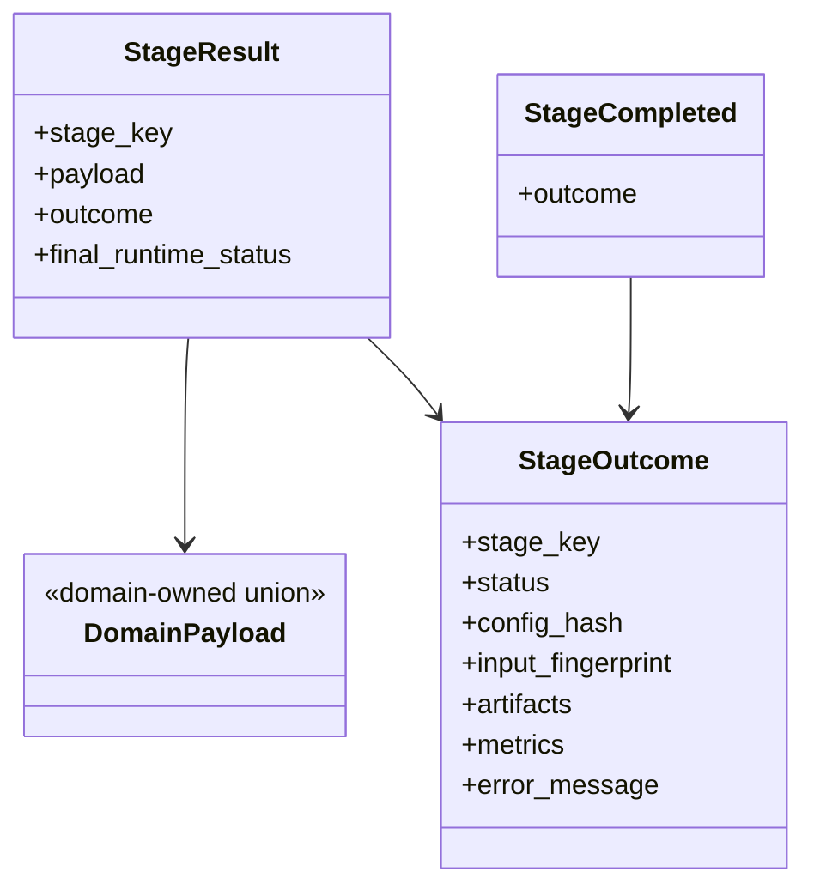

Rules:

- `StageResult` replaces the legacy completion payload as the runtime handoff
  concept.
- Runtime state stores completed results as `dict[StageKey, StageResult]`.
  Stage input builders read the required prior result payloads from this keyed
  store and fail with a stage-specific error when a dependency is missing or
  has the wrong payload type.
- `StageOutcome` remains the durable/provenance subset used in manifests and
  summaries.
- `StageResult` is a pure completion bundle: domain-owned payload,
  `StageOutcome`, and final runtime status. It is internal runtime state and
  does not carry a mini event log.
- Durable completion/failure events carry `StageOutcome`, not full
  `StageResult`. Rich payloads are materialized as artifacts, projected into
  snapshots, or retained in runtime state as appropriate.
- Summary and manifests depend on terminal `StageOutcome` values and durable
  artifact refs, not telemetry replay.

## Runtime Updates, Events, And Visualization Items

Streaming and long-running stages emit `StageRuntimeUpdate` values while they
run. Any stage runtime may emit these updates, but downstream stages must depend
only on completed `StageResult` values. Updates are immutable live-observer
objects for UI/status/Rerun/debug data, not Rerun commands and not the
stage-to-stage dependency contract.

External context: use the repo-local
[Rerun SLAM integration skill](../../.agents/skills/rerun-slam-integration/SKILL.md)
for `VisualizationItem` mapping, transforms, camera-local geometry, pinhole,
depth, timelines, blueprints, and official Rerun examples. Start from the
official [Python API](https://ref.rerun.io/docs/python/stable/common/),
[RGBD](https://rerun.io/examples/robotics/rgbd), and
[DROID](https://rerun.io/examples/robotics/droid) entry points when validating
Rerun-specific behavior.

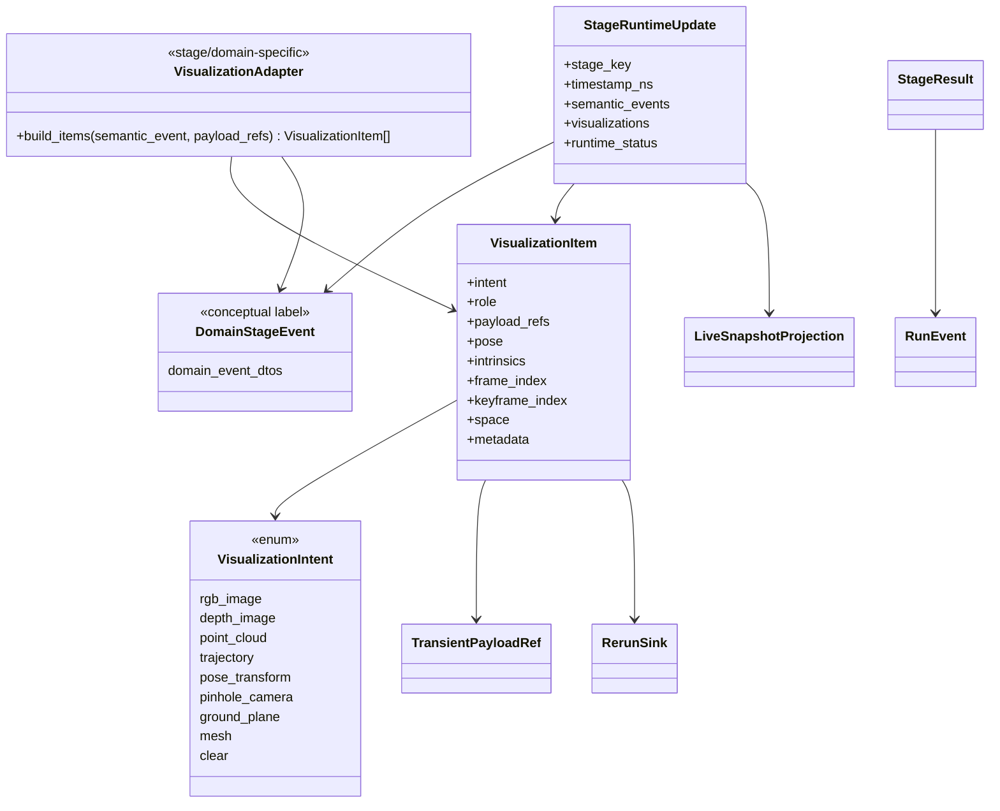

Rules:

- `StageResult` remains the reliable terminal handoff: one completed-stage
  domain payload, one `StageOutcome`, and final runtime status. It replaces the
  legacy `StageCompletionPayload` / `RuntimeExecutionState` handoff and is the
  only object downstream stage input builders may depend on.
- `StageRuntimeUpdate` remains the live observer feed. A stage may emit zero,
  one, or many updates during execution or near completion; these updates may
  be dropped by observers without invalidating stage correctness.
- Stage runtimes may return domain-owned semantic event DTOs, neutral
  `VisualizationItem` values, and runtime status in one update.
- `DomainStageEvent` is a conceptual diagram label for concrete domain-owned
  event DTOs such as `SlamUpdate`; the pipeline does not add a generic
  wrapper around them.
- `VisualizationItem` is a small immutable sink-facing descriptor. It carries
  `VisualizationIntent`, role, payload refs by semantic slot, optional pose,
  intrinsics, frame/keyframe indices, coordinate-space hints such as
  `camera_local` or `world`, and scalar metadata.
- `VisualizationItem` does not contain bulk arrays, meshes, point clouds, Rerun
  entity paths, timelines, styling, SDK objects, or SDK commands. Bulk images,
  depth maps, points, and meshes live behind `TransientPayloadRef` or durable
  artifact refs.
- `StageRuntimeUpdate` does not carry a generic top-level payload-ref bucket.
  `TransientPayloadRef`s live inside the object that gives them meaning:
  `VisualizationItem.payload_refs`, pipeline-owned live projection/update
  DTOs, or payload resolver APIs. Pure domain DTOs such as `SlamUpdate` must
  not import or embed `TransientPayloadRef`.
- `StageRuntimeUpdate` is routed to live snapshot/status state and observer
  sinks. The exact first-slice routing can stay compatible with the current
  coordinator/Rerun sidecar structure; the target only requires that live
  updates do not need to be wrapped in telemetry `RunEvent`s before observers
  can consume them.
- Durable JSONL/provenance remains centered on lifecycle events and
  `StageOutcome` values from `StageResult`.
- Stage runtime adapters translate internal backend outputs into
  `StageRuntimeUpdate`; concrete event kinds and payload DTOs remain
  domain-owned.
- Stage/domain-specific visualization adapters convert semantic event DTOs plus
  runtime-created named payload refs into `VisualizationItem` values. Adapters
  live stage-locally, starting with
  `pipeline/stages/slam/visualization.py` for `SlamVisualizationAdapter`; future
  long-running stages may add stage-local visualization modules when needed.
  For SLAM, `SlamStageRuntime` receives method-owned `SlamUpdate` values,
  stores large arrays in the transient payload store, creates named
  `TransientPayloadRef`s, and passes `SlamUpdate` plus those refs to
  `SlamVisualizationAdapter`.
- The Rerun sink consumes `StageRuntimeUpdate.visualizations`, resolves payload
  refs best-effort, maps items to Rerun entity paths, timelines, archetypes,
  blueprints, styling, and SDK calls, and isolates sink failures from
  `StageResult` correctness. Missing or evicted live refs skip that
  visualization item rather than failing the producing stage.
- The Rerun sink is grounded in the pinned `rerun-sdk==0.24.1` API: create one
  explicit `RecordingStream` per run, attach live/file outputs through
  `GrpcSink` / `FileSink`, and keep `set_time(...)`, `Transform3D`,
  `Pinhole`, `DepthImage`, `Image`, `Points3D`, `LineStrips3D`, and
  blueprint calls inside the sink/policy layer.
- Rerun policy must preserve spatial semantics: `Pinhole.resolution` is
  `[width, height]`; camera-local geometry stays under posed camera entities;
  world-space geometry stays under world-space entities; depth payloads use a
  `DepthImage(..., meter=...)` scale matching their native units.
- Methods/backends should emit method-owned semantic data to the stage runtime;
  they should not emit pipeline `RunEvent`s directly.
- For the first implementation slice, support the current SLAM/Rerun surfaces:
  source RGB, model RGB, model depth, camera pose, pinhole, camera-local
  pointmap, tracking trajectory, keyframe history, and ground-plane overlay.
  A full modality system for reconstruction and future evaluation
  visualizations can remain deferred.

## Durable Run Events And Live Updates

The target event model has two explicit channels:

- durable `RunEvent` values: run submitted/started/stopped/failed, stage
  started/completed/failed, artifact produced, summary persisted, and other
  replayable provenance records
- ephemeral `StageRuntimeUpdate` values: queue depth, instantaneous
  throughput/FPS, live previews, transient payload refs, non-replayable live
  status, and observer-facing semantic events

`RunSnapshot` can project from durable events plus live `StageRuntimeUpdate`
values, but durable JSONL/provenance logs persist only durable lifecycle and
artifact events. Live telemetry is in-memory and Rerun-facing only in the
target architecture. It must not be required for scientific provenance or final
benchmark summaries.

Target `RunEvent` is a discriminated durable event union with common run/event
identity fields such as `event_id`, `run_id`, `attempt_id`, and `ts_ns`.
Durable variants include run lifecycle events, stage lifecycle events, artifact
registration, terminal stage outcomes, and summary persistence. `StageCompleted`
and `StageFailed` carry `StageOutcome`; they do not carry live payload refs,
runtime telemetry, or full `StageResult` payloads.

Current `RunEvent` telemetry variants such as `StageProgressed`,
`PacketObserved`, and `BackendNoticeReceived` are migration contacts only. Once
telemetry moves to `StageRuntimeUpdate`, `RunEvent` is durable-only and no tier
discriminator is needed.

## Transient Payload Handles

The target should replace separate public array/preview/blob handle DTOs with
one backend-agnostic transient payload reference. Public DTOs should not expose
Ray object-store details such as `backend="ray-object-store"`.

External context: use
[Ray runtime patterns](../../.agents/references/ray-runtime-patterns.md) for
Ray object refs and object-store semantics. `TransientPayloadRef` is public
metadata; Ray `ObjectRef`s remain behind runtime-owned payload resolvers.

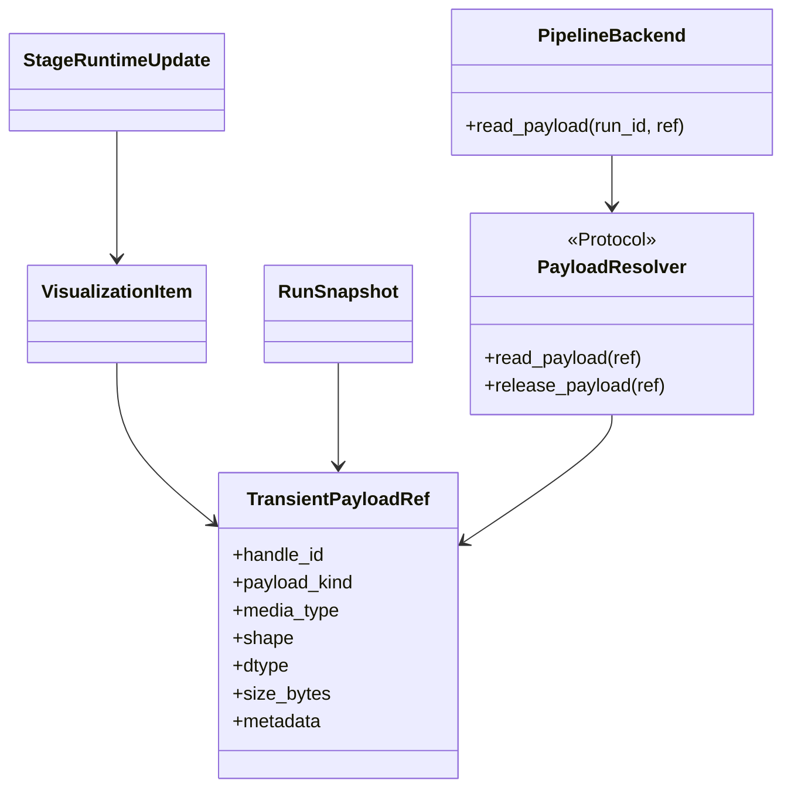

Rules:

- `TransientPayloadRef` is transport-safe metadata only.
- Runtime backends own run-scoped resolution, eviction, and release semantics.
- Live updates and snapshots may expose refs, but durable scientific artifacts
  remain `ArtifactRef`s, not transient payload refs.
- `TransientPayloadRef` may appear in `VisualizationItem.payload_refs`,
  pipeline-owned live projection/update DTOs, live snapshots, and backend
  resolver APIs. It must not appear in pure domain DTOs, durable `RunEvent`s,
  manifests, or summaries.
- SLAM uses the boundary `SlamUpdate -> SlamStageRuntime stores arrays ->
  named TransientPayloadRefs -> SlamVisualizationAdapter -> VisualizationItem`.
  It must not use `SlamUpdate -> TransientPayloadRef` directly.
- Read-after-eviction returns a typed not-found result rather than leaking a
  backend-specific error.
- UI/app callers resolve payloads through the pipeline backend/service, never
  through substrate-specific Ray APIs.

## SLAM Stage Target Sequence

SLAM is the highest-risk stage because it combines method muxing, backend
factory config, offline and streaming lifecycles, normalized artifacts,
incremental telemetry, and Rerun forwarding.

The target sequence should not expose a separate method streaming session or
Ray worker as a pipeline participant. `SlamStageRuntime` is the pipeline-facing
execution surface. `RuntimeManager` returns a `StageRuntimeProxy` so the
coordinator and `StageRunner` use the same protocol calls whether the runtime
is in-process or Ray-hosted.

External context: use the repo-local
[Rerun SLAM integration skill](../../.agents/skills/rerun-slam-integration/SKILL.md)
when implementing or reviewing the SLAM visualization path. Keep Rerun
transform, pinhole, depth, timeline, and blueprint semantics inside the
sink/policy layer.

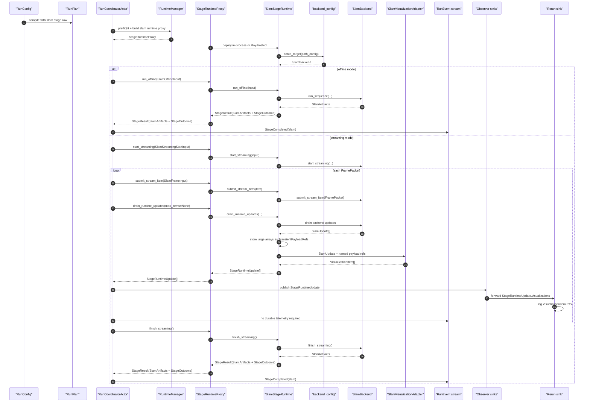

This is a target boundary simplification, not a ban on migration shims while
current code is being moved. The target method backend exposes the execution
surface needed by `SlamStageRuntime`; current helper names such as
`push_frame(...)` and existing method-visible streaming sessions stop being
part of the target pipeline-facing architecture.

SLAM migration contact points:

- [SlamStageConfig](../../src/prml_vslam/pipeline/contracts/request.py#L150)
- [BackendConfig discriminated union](../../src/prml_vslam/methods/configs.py#L251)
- [BackendFactory](../../src/prml_vslam/methods/factory.py#L24)
- [existing backend/session protocol migration contacts](../../src/prml_vslam/methods/protocols.py#L22)
- [translate_slam_update](../../src/prml_vslam/methods/events.py)
- [OfflineSlamStageActor.run](../../src/prml_vslam/pipeline/ray_runtime/stage_actors.py#L46)
- [StreamingSlamStageActor.start_stage](../../src/prml_vslam/pipeline/ray_runtime/stage_actors.py#L215)
- [StreamingSlamStageActor.push_frame](../../src/prml_vslam/pipeline/ray_runtime/stage_actors.py#L240)
- [StreamingSlamStageActor.close_stage](../../src/prml_vslam/pipeline/ray_runtime/stage_actors.py#L329)

## Target Snapshot Shape

`RunSnapshot` should be a generic keyed projection rather than a growing object
with stage-specific top-level fields. Durable fields project from durable
`RunEvent`s; live status, previews, and transient refs may also project from
`StageRuntimeUpdate` values that are not persisted to durable JSONL.

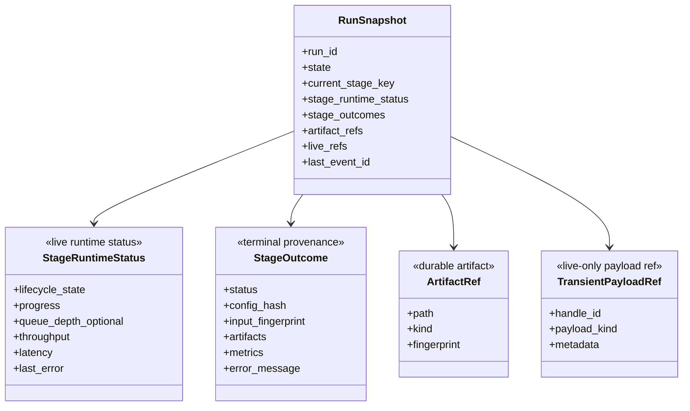

Rules:

- Runtime status, terminal outcomes, artifact refs, and live refs are keyed by
  `StageKey`.
- `stage_outcomes` and `stage_runtime_status` are canonical for per-stage state;
  do not store a third `stage_status` map in the target snapshot.
- UI and CLI derive display status at read time from terminal
  `StageOutcome.status` when a terminal outcome exists, otherwise from live
  `StageRuntimeStatus.lifecycle_state`, otherwise from plan availability and
  current-stage context.
- Top-level artifact indexes are derived convenience views over keyed stage
  outcome/artifact maps, not independent canonical state.
- Keep only minimal convenience live-view fields if the app truly needs them.
- Do not add new top-level fields for each future stage.

## Stage Matrix

| Stage key | Config section | Runtime target | Semantic payload owner | Event/Rerun path | Required changes |
| --- | --- | --- | --- | --- | --- |
| `source` | `[stages.source]` | in-process `SourceRuntime`; streaming source backend may own an internal packet sidecar | shared `SequenceManifest` and `PreparedBenchmarkInputs` | durable `StageCompleted`; optional live source `StageRuntimeUpdate` | Replace public `ingest` vocabulary; add `SourceBackendConfig` union with `source_id`; preserve normalized boundary and keep packet reading internal. |
| `slam` | `[stages.slam]` | `SlamStageRuntime` implements `OfflineStageRuntime`, `StreamingStageRuntime`, and `LiveUpdateStageRuntime`; may be Ray-hosted behind `StageRuntimeProxy` | shared `SlamArtifacts`, visualization-owned artifacts, methods-owned live DTOs | semantic updates -> `StageRuntimeUpdate.semantic_events` -> live observers/status; runtime-created refs + `SlamVisualizationAdapter` -> `StageRuntimeUpdate.visualizations` / `VisualizationItem`s -> Rerun sink; completion -> durable `StageCompleted` | Merge offline/streaming runtime surfaces; hide current actor/session helpers behind migration adapters; keep backend discriminated union. |
| `align.ground` | `[stages.align_ground]` | in-process runtime first | alignment-owned `GroundAlignmentMetadata` | durable `StageCompleted`; Rerun sink may augment export on close | Keep derived artifact semantics; do not mutate native SLAM outputs. |
| `evaluate.trajectory` | `[stages.evaluate_trajectory]` | in-process runtime first | eval-owned trajectory evaluation artifact | durable `StageCompleted` | Keep `benchmark` as policy and `eval` as metric implementation/result owner. |
| `reconstruction` | `[stages.reconstruction]` | selected by reconstruction backend/mode: in-process for reference, Ray-hosted for GPU-heavy variants | reconstruction-owned artifact bundle | durable `StageCompleted`; optional `StageRuntimeUpdate` visualization items for long-running variants | Replace `reference.reconstruct` target vocabulary with one umbrella reconstruction stage and model reference/3DGS/future methods as variants. |
| `summary` | `[stages.summary]` | in-process runtime | pipeline-owned generic provenance: `RunSummary`, `StageManifest[]`, `StageOutcome` | durable `StageCompleted(summary)` | Keep projection-only; no metric computation. |

## Extension Stage Matrix

| Stage key | Config section | Runtime target | Semantic payload owner | Event/Rerun path | Required changes |
| --- | --- | --- | --- | --- | --- |
| `evaluate.cloud` | `[stages.evaluate_cloud]` | future runtime, unavailable until implemented | eval-owned dense-cloud metric artifacts | durable `StageCompleted` when implemented | Keep metric result concepts in `eval`. |
| `evaluate.efficiency` | `[stages.evaluate_efficiency]` | future runtime, unavailable until implemented | eval-owned efficiency metrics derived from durable events and runtime status | durable `StageCompleted`; telemetry is live-only input unless summarized | Define metrics from the event/status model rather than ad hoc timers. |

## Migration Contacts

| Target stage key | Current implementation contacts |
| --- | --- |
| `source` | [SourceSpec](../../src/prml_vslam/pipeline/contracts/request.py#L118), [run_ingest_stage](../../src/prml_vslam/pipeline/ray_runtime/stage_execution.py#L60), [OfflineSourceResolver](../../src/prml_vslam/pipeline/source_resolver.py) |
| `slam` | [SlamStageConfig](../../src/prml_vslam/pipeline/contracts/request.py#L150), [BackendConfig](../../src/prml_vslam/methods/configs.py#L251), [OfflineSlamStageActor](../../src/prml_vslam/pipeline/ray_runtime/stage_actors.py#L42), [StreamingSlamStageActor](../../src/prml_vslam/pipeline/ray_runtime/stage_actors.py#L203) |
| `align.ground` | current `ground.align` stage key, [AlignmentConfig](../../src/prml_vslam/alignment/contracts.py#L26), [GroundAlignmentService](../../src/prml_vslam/alignment/services.py), [run_ground_alignment_stage](../../src/prml_vslam/pipeline/ray_runtime/stage_execution.py#L179) |
| `evaluate.trajectory` | [TrajectoryBenchmarkConfig](../../src/prml_vslam/benchmark/contracts.py), [TrajectoryEvaluationService](../../src/prml_vslam/eval/services.py), [run_trajectory_evaluation_stage](../../src/prml_vslam/pipeline/ray_runtime/stage_execution.py#L137) |
| `reconstruction` | [ReferenceReconstructionConfig](../../src/prml_vslam/benchmark/contracts.py), current [reference.reconstruct stage](../../src/prml_vslam/pipeline/stage_registry.py#L164), [run_reference_reconstruction_stage](../../src/prml_vslam/pipeline/ray_runtime/stage_execution.py#L212), [reconstruction package](../../src/prml_vslam/reconstruction) |
| `evaluate.cloud` | [CloudBenchmarkConfig](../../src/prml_vslam/benchmark/contracts.py), [stage placeholders](../../src/prml_vslam/pipeline/stage_registry.py#L171), [eval package](../../src/prml_vslam/eval) |
| `evaluate.efficiency` | [EfficiencyBenchmarkConfig](../../src/prml_vslam/benchmark/contracts.py), [stage placeholders](../../src/prml_vslam/pipeline/stage_registry.py#L180), [RunEvent](../../src/prml_vslam/pipeline/contracts/events.py) |
| `summary` | [run_summary_stage](../../src/prml_vslam/pipeline/ray_runtime/stage_execution.py#L257), [project_summary](../../src/prml_vslam/pipeline/finalization.py), [provenance contracts](../../src/prml_vslam/pipeline/contracts/provenance.py) |

## Decision Register

### Runtime Deployment Scope

Decision: do not make every stage a Ray-hosted runtime. Define common runtime
protocols, but use Ray hosting only for stateful, streaming, GPU-heavy,
remote-placement, or long-running stages. This keeps simple artifact-projection
stages cheap while giving the pipeline a uniform status/control surface.

Decide by:

- Needs state across frames or long runtime: consider Ray hosting.
- Needs GPU placement or remote node affinity: Ray-host the runtime.
- Pure projection over already materialized artifacts: in-process runtime.

Migration contact points: [stage_program.py](../../src/prml_vslam/pipeline/ray_runtime/stage_program.py#L117),
[stage_execution.py](../../src/prml_vslam/pipeline/ray_runtime/stage_execution.py#L1),
[stage_actors.py](../../src/prml_vslam/pipeline/ray_runtime/stage_actors.py#L1).

### Runtime Protocol Taxonomy

Decision: use `BaseStageRuntime`, `OfflineStageRuntime`,
`LiveUpdateStageRuntime`, and `StreamingStageRuntime` as the capability
protocols. Concrete stage runtimes implement these protocols directly.

`OfflineStageRuntime` is a bounded stage invocation surface, but its input can
represent a sequence, batch, or artifact bundle.
`LiveUpdateStageRuntime` owns the live update-drain surface for active
runtimes. `StreamingStageRuntime` owns the hot-path command surface for
`start_streaming(...)`, `submit_stream_item(...)`, and `finish_streaming()`.
A runtime may implement several surfaces. Deployment remains separate:
`RuntimeManager` returns a capability-typed `StageRuntimeProxy` that either
calls an in-process runtime or invokes a Ray-hosted runtime while preserving
the selected protocol surface. `StageRuntimeProxy` is deployment plumbing, not
a stage role and not a second runtime taxonomy.

`submit_stream_item(...)` is an ingress command. It submits one item and does
not return semantic updates. `drain_runtime_updates(max_items=None)` is the
non-blocking observation query. It returns updates already produced by
completed prior work and may wait only as needed to preserve runtime-order
consistency, not for future source items. For SLAM, this maps to the
method-owned backend streaming execution and update-drain surface.

Ray-hosted runtimes may use Ray-native actor method ordering and actor
mailboxes for submitted work. Ray mailboxes are not the portable queue model
for pipeline contracts. `StageRuntimeProxy` tracks task refs, in-flight counts,
and failures as internal deployment state only; it surfaces that state through
`StageRuntimeStatus`, and coordinator and app code do not receive Ray object
refs or mailbox handles.

External context: use
[Ray runtime patterns](../../.agents/references/ray-runtime-patterns.md) for
actor ordering, `.remote()` invocation, `ray.wait` / `ray.get`, task refs,
object refs, and queue/backpressure guardrails.

### Runtime Manager Construction

Decision: `RuntimeManager` uses hybrid-lazy construction.

It preflights the plan, stage mapping, availability, resource policy, and Ray
deployment options before execution starts. It instantiates local runtimes,
runtime proxies, payload stores, and sidecar collaborators only when a stage is
about to run.

Ray process-level initialization policy belongs in `RunRuntimeConfig.ray` or a
future runtime-manager config, not in hard-coded backend kwargs. The target
must expose public, repo-owned options for `log_to_driver` and
`include_dashboard`; keep private Ray init knobs such as `_skip_env_hook`
backend-internal unless the project has a stable public reason to expose them.

Reasoning: this catches configuration and placement errors early without
allocating unused actors, opening sources, or connecting sidecars before their
stage is reached.

External context: use
[Ray runtime patterns](../../.agents/references/ray-runtime-patterns.md) for
Ray runtime environment, resource, placement, actor creation, and State API
diagnostic considerations.

Migration contact points:
[RayRuntimeConfig](../../src/prml_vslam/pipeline/contracts/request.py#L136),
[RayPipelineBackend._ensure_ray](../../src/prml_vslam/pipeline/backend_ray.py#L190).

### Stage Execution Helper Fate

Decision: eliminate free `run_*` functions as target runtime APIs.

The existing [stage_execution.py](../../src/prml_vslam/pipeline/ray_runtime/stage_execution.py#L1)
module is a migration contact only. Bounded helper bodies move into
stage-local runtime classes, and local/Ray-hosted runtime deployment moves into
`RuntimeManager` plus `StageRuntimeProxy`. Temporary wrapper functions may
exist only to stage the migration.

### Stage Runner And Result Store

Decision: replace `StageRuntimeSpec` support hooks with `StageRunner`,
`StageResultStore`, stage-local input builders, and declarative
`StageConfig.failure_outcome(...)` policy.

`StageRunner` owns generic lifecycle mechanics:

- emit or request stage-start recording
- invoke the selected offline or streaming runtime protocol method
- convert exceptions into failed `StageOutcome` values through the stage config
- store successful `StageResult` values
- call coordinator event recorder methods for completion and failure

`StageResultStore` owns shared runtime dependency access. It stores completed
results keyed by `StageKey` and may expose common typed accessors for shared
dependencies such as source output, SLAM output, and ordered terminal outcomes.
It must not become a central stage-input registry. Each stage module owns its
own `build_input(result_store, context)` function and private input DTO.

Target interface sketches:

```python
class StageResultStore:
    def put(self, result: StageResult) -> None: ...
    def require_result(self, stage_key: StageKey) -> StageResult: ...
    def require_sequence_manifest(self) -> SequenceManifest: ...
    def require_slam_artifacts(self) -> SlamArtifacts: ...
    def ordered_outcomes(self) -> list[StageOutcome]: ...
```

```python
class StageRunner:
    def run_offline_stage(stage_key, runtime, input_builder) -> StageResult: ...
    def start_streaming_stage(stage_key, runtime, input_builder) -> None: ...
    def finish_streaming_stage(stage_key, runtime) -> StageResult: ...
```

```python
class StageConfig:
    def failure_outcome(error, input_fingerprint, artifacts) -> StageOutcome: ...
```

Exact signatures may change during implementation, but the ownership must not:
`StageRunner` owns lifecycle, `StageResultStore` owns shared dependency access,
stage modules own input construction and execution adapters, and `StageConfig`
owns declarative failure-provenance policy. Do not recreate
`StageRuntimeSpec` as a new central registry under another name.

### Offline And Streaming SLAM Lifecycle

Decision: use one pipeline-facing `SlamStageRuntime` implementing
`OfflineStageRuntime`, `StreamingStageRuntime`, and
`LiveUpdateStageRuntime`. It may be Ray-hosted behind `StageRuntimeProxy`
when Ray deployment is needed. Remove separate method streaming-session
protocols from the target public architecture.

Target surface: one SLAM runtime with explicit methods:
`run_offline()`, `start_streaming()`, `submit_stream_item()`,
`drain_runtime_updates()`, `finish_streaming()`, `status()`, and `stop()`.
`SlamBackend` exposes the execution surface needed by that runtime; no
method-visible session object is part of the target architecture.

Reasoning: backend construction, output policy, artifact finalization, native
visualization collection, update draining, and status telemetry are the same
stage responsibility. The coordinator should not see raw Ray handles, private
`push_frame(...)` helpers, or method streaming sessions; those
add lifecycle boundaries without adding useful pipeline responsibility. The
streaming source reader should stay separate because it owns transport and
credit policy, not SLAM state.

Migration contact points: [OfflineSlamStageActor](../../src/prml_vslam/pipeline/ray_runtime/stage_actors.py#L42),
[StreamingSlamStageActor](../../src/prml_vslam/pipeline/ray_runtime/stage_actors.py#L203),
[RunCoordinatorActor.start_streaming_slam_stage](../../src/prml_vslam/pipeline/ray_runtime/coordinator.py#L468).

### Source Runtime Boundary

Decision: add a local `SourceRuntime` and keep packet reading as an internal
sidecar.

`SourceRuntime` owns source config/factory parity and normalized
`SequenceManifest` / `PreparedBenchmarkInputs` preparation. Streaming packet
reading, credits, source EOF/error callbacks, and transport state remain in an
internal sidecar actor or collaborator. Packet reading is not a public stage
unless persisted capture artifacts become a durable benchmark output.

Migration contact points: [OfflineSourceResolver](../../src/prml_vslam/pipeline/source_resolver.py#L46),
[build_runtime_source_from_request](../../src/prml_vslam/pipeline/demo.py),
[PacketSourceActor](../../src/prml_vslam/pipeline/ray_runtime/stage_actors.py#L99).

### Stop And Failure Semantics

Decision: finalize active runtimes when possible, then mark terminal state.

On stop, source error, or backend failure, the coordinator/runtime driver asks
active runtimes to finalize or stop gracefully. Partial durable artifacts that
were materialized are preserved and attached to the terminal `StageOutcome`.
Downstream stages that require a clean SLAM result are skipped after stop or
failure. The run then emits `RunStopped` or `RunFailed` according to the
terminal cause.

For Ray-hosted streaming runtimes, stop first prevents new
`submit_stream_item(...)` calls. `StageRuntimeProxy` then observes completed
task refs, records failures from submitted work, drains feasible
`StageRuntimeUpdate` values and durable artifacts, and calls
`finish_streaming()` or `stop()` according to the terminal cause. Immediate
Ray actor kill is reserved for unrecoverable runtime failure or timeout.

External context: use
[Ray runtime patterns](../../.agents/references/ray-runtime-patterns.md) for
actor termination, fault tolerance, task refs, and graceful-vs-immediate stop
behavior.

### Reconstruction Stage

Decision: use one umbrella public `reconstruction` stage.

Reference reconstruction, 3DGS, and future reconstruction methods are
configuration/backend variants under `[stages.reconstruction]`. The current
`reference.reconstruct` key remains a migration contact only. In-process
reference reconstruction and GPU-heavy Ray-hosted 3DGS variants should share
the same `ReconstructionStageInput`, `ReconstructionStageOutput`, and
`StageResult` handoff shape.

### Config Hierarchy

Decision: use `RunConfig + [stages.*]`.

`RunConfig` is the persisted root config and compiles to `RunPlan`. It is not a
runtime factory. Keep named stage sections under `[stages.source]`,
`[stages.slam]`, `[stages.align_ground]`, `[stages.evaluate_trajectory]`,
`[stages.reconstruction]`, and `[stages.summary]`. Do not use a raw list of
stages.

Reasoning: named stage sections keep TOML readable for operators and easy for
Streamlit/app controls to edit, while making every executable stage explicit.
`RunLaunchRequest` is deprecated from the target vocabulary; launch consumes
`RunConfig -> RunPlan`.

Migration contact points: [RunRequest](../../src/prml_vslam/pipeline/contracts/request.py#L175),
[SlamStageConfig](../../src/prml_vslam/pipeline/contracts/request.py#L150),
[PlacementPolicy](../../src/prml_vslam/pipeline/contracts/request.py#L130).

### Backend And Source Muxing

Decision: use Pydantic discriminated unions for backend/source config variants
and factories for implementation construction. Use `method_id` for method
backend variants and `source_id` for source backend variants. Backend/source
factories may call domain-owned config factories, but pipeline stage configs do
not construct stage runtimes.

Reasoning: [BackendConfig](../../src/prml_vslam/methods/configs.py#L251)
already gives typed variant-specific config. The weaker part is that
[OfflineSourceResolver](../../src/prml_vslam/pipeline/source_resolver.py#L45)
uses manual `match` while method backends already validate concrete config
variants. Source variants should move to the same typed discriminated-union and
config-as-factory style.

Migration contact points: [source_resolver.py](../../src/prml_vslam/pipeline/source_resolver.py#L45),
[methods/factory.py](../../src/prml_vslam/methods/factory.py#L24),
[FactoryConfig](../../src/prml_vslam/utils/base_config.py#L118).

The target muxing pattern should be the same for source variants, method
backends, and future reconstruction backends: concrete variant configs build
their implementation targets through `setup_target()`, while stage runtime
construction stays in `RuntimeManager`.

External context: use the repo-local
[$pydantic](../../.agents/skills/pydantic/SKILL.md) skill for discriminated
unions, validators, `Field`, serialization, and the repo's
`BaseConfig` / `BaseData` conventions. Pydantic is the config/modeling tool
here; it must not become a second runtime construction authority.

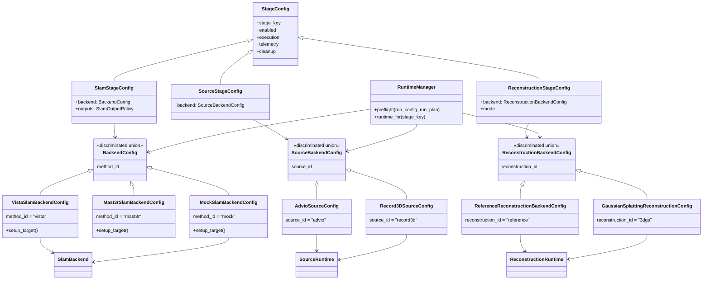

Rules:

- Stage configs validate and describe stage policy; `RuntimeManager` constructs
  stage runtime targets.
- Backend/source config variants may implement `FactoryConfig.setup_target()`
  because they construct concrete domain/source targets.
- Use one explicit, typed discriminator per domain. For SLAM backend configs,
  the target discriminator is `method_id` because it aligns with `MethodId`.
  Avoid dual `kind`/`method_id` vocabulary and avoid vague generic
  discriminators when a domain-specific name exists.
- Use the same naming rule elsewhere: `source_id` for source variants,
  `reconstruction_id` for reconstruction variants, and `stage_key` for stage
  variants.
- Factories should not duplicate discriminator switches that Pydantic already
  performed. Target diagrams should show concrete config `setup_target()` calls
  rather than a second construction authority.
- Keep backend capability metadata close to backend configs so planning can ask
  “can this backend run streaming?” without constructing the backend.
- Source muxing should follow the same rule: `SourceBackendConfig` variants may
  be `FactoryConfig`s; `SourceStageConfig` remains stage policy and never
  constructs the source stage runtime.
- Reconstruction backend config variants are reconstruction-owned. The pipeline
  `ReconstructionStageConfig` references those variants and owns stage policy;
  it does not become the home for reconstruction backend implementation config.

### Public Contract Placement

Decision: keep repo-wide semantic DTOs in `interfaces`, repo-wide protocols in
`protocols`, package-local contracts in `<package>/contracts.py` or
`<package>/contracts/`, and package-local behavior seams in
`<package>/protocols.py`.

Reasoning: this follows [src/prml_vslam/AGENTS.md](../../src/prml_vslam/AGENTS.md)
and keeps one semantic concept under one owner. It also resolves the ownership
issue identified at
[interfaces/__init__.py](../../src/prml_vslam/interfaces/__init__.py#L63).

Migration contact points: [interfaces](../../src/prml_vslam/interfaces),
[protocols](../../src/prml_vslam/protocols),
[pipeline/contracts](../../src/prml_vslam/pipeline/contracts),
[methods/protocols.py](../../src/prml_vslam/methods/protocols.py#L1).

Specific target placement:

- Keep `FramePacket`, `SequenceManifest`, `FrameTransform`, and
  `SlamArtifacts` in `interfaces`.
- Move live SLAM update and backend-event DTOs out of `interfaces` into
  `methods.contracts` because they are runtime boundary DTOs, not stable
  repo-wide semantic DTOs.
- Keep stage runtime adapters and deployment proxies in `pipeline/stages/*`;
  keep domain semantics in the owning domain packages.
- Pipeline-owned public DTOs are generic orchestration/runtime DTOs only.
- Move `PipelineBackend` to `pipeline/protocols.py` so backend behavior seams
  sit with other pipeline-local protocols instead of an ambiguously named
  implementation module.

### Rerun Integration

Decision: output/update DTOs may expose neutral `VisualizationItem` values, but no
DTO, stage runtime, or runtime proxy talks to the Rerun SDK.
`StageRuntimeUpdate` carries domain-owned semantic event DTOs, visualization items,
and runtime status. Transient payload refs live inside visualization items or
pipeline-owned live projection/update DTOs, never inside pure domain DTOs.
Stage/domain-specific visualization adapters, starting with
`SlamVisualizationAdapter` in `pipeline/stages/slam/visualization.py`, create
`VisualizationItem` values from semantic events plus runtime-created named
refs. The runtime driver routes those updates to live snapshot/status state and
observer sinks; they do not need to become telemetry `RunEvent`s first. The
Rerun sink logs only from
`StageRuntimeUpdate.visualizations` plus resolved payload refs and remains the
only SDK caller.

Reasoning: the existing [RerunEventSink](../../src/prml_vslam/pipeline/sinks/rerun.py#L35)
is already the single SDK sidecar. Keep this boundary and let
[RerunLoggingPolicy](../../src/prml_vslam/pipeline/sinks/rerun_policy.py)
map neutral `VisualizationItem` values to entity paths, timelines, styling,
and SDK calls.

External context: use the repo-local
[Rerun SLAM integration skill](../../.agents/skills/rerun-slam-integration/SKILL.md)
for Rerun SDK, transform, pinhole, depth, timeline, blueprint, and example
guidance. Avoid duplicating that detailed Rerun guidance in this target
architecture document.

Migration contact points: [RerunEventSink.observe](../../src/prml_vslam/pipeline/sinks/rerun.py#L84),
[RerunSinkActor.observe_event](../../src/prml_vslam/pipeline/sinks/rerun.py#L148),
[translate_slam_update](../../src/prml_vslam/methods/events.py).

### Status And Telemetry

Decision: the target includes a `StageRuntimeStatus` transport-safe DTO under
pipeline contracts. Stage runtimes and their proxies implement `status()`.
Important status transitions are pushed through `StageRuntimeUpdate`;
`status()` remains available for polling, recovery, and late observers.

Minimum fields:

- lifecycle state
- progress message and completed/total steps
- optional queue/backlog count for queues or credits owned by the
  pipeline/runtime
- submitted, completed, failed, and in-flight work counts
- throughput / FPS
- latency
- last warning / last error
- executor identity
- resource assignment
- last update timestamp

Reasoning: [StageProgress](../../src/prml_vslam/pipeline/contracts/events.py#L33)
is too narrow for the target, while [StreamingRunSnapshot](../../src/prml_vslam/pipeline/contracts/runtime.py#L69)
contains only streaming-specific SLAM/source counters.

For Ray-hosted runtimes, stage-owned counters should be implemented with
Ray-native task refs and application metrics where possible. Ray's own actor
mailbox is not exposed as a portable `queue_depth` field.

External context: use
[Ray runtime patterns](../../.agents/references/ray-runtime-patterns.md) for
Ray custom metrics, State API diagnostics, and the distinction between
Ray-observed state and canonical `StageRuntimeStatus`.

Migration contact points: [events.py](../../src/prml_vslam/pipeline/contracts/events.py#L33),
[runtime.py](../../src/prml_vslam/pipeline/contracts/runtime.py#L38),
[SnapshotProjector](../../src/prml_vslam/pipeline/snapshot_projector.py).

### Resource Placement Model

Decision: introduce typed substrate-neutral resource config.

Target execution policy models:

- `StageExecutionConfig`
- `ResourceSpec`
- `PlacementConstraint`
- optional runtime environment tag

Ray translation happens only in the Ray backend/runtime layer. Keep legacy
`{"CPU": ..., "GPU": ...}` parsing and current Ray retry options only as
migration adapters if needed.

Reasoning: the loose-alias issue identified in
[placement.py](../../src/prml_vslam/pipeline/placement.py#L16) is real. The
target needs CPU, GPU, memory, custom resources, and node/IP hints. Do not add
a public retry DTO until the project has a concrete repo-level retry
requirement beyond Ray actor option translation.

External context: use
[Ray runtime patterns](../../.agents/references/ray-runtime-patterns.md) for
official Ray resources, runtime environments, placement, and retry/fault
tolerance context.

Migration contact points: [StagePlacement](../../src/prml_vslam/pipeline/contracts/request.py#L124),
[actor_options_for_stage](../../src/prml_vslam/pipeline/placement.py#L22),
[RunCoordinatorActor._stage_actor_options](../../src/prml_vslam/pipeline/ray_runtime/coordinator.py#L540).

### Benchmark Versus Eval

Decision: split benchmark policy from evaluation computation.

`benchmark` owns policy and requested baselines; `eval` owns metric
computation, metric result DTOs, and metric artifact loading.

Reasoning: this resolves the responsibility conflict identified in
[benchmark/__init__.py](../../src/prml_vslam/benchmark/__init__.py#L25) and
matches the existing service split where
[TrajectoryEvaluationService](../../src/prml_vslam/eval/services.py)
computes metrics from prepared inputs and SLAM artifacts.

Migration contact points: [benchmark/contracts.py](../../src/prml_vslam/benchmark/contracts.py),
[eval/contracts.py](../../src/prml_vslam/eval/contracts.py),
[eval/services.py](../../src/prml_vslam/eval/services.py).

### IO Versus Datasets

Decision: datasets remain a top-level package.

Keep `datasets` top-level. Remove compatibility aliases only after checking
app/tests/config imports.

Reasoning: datasets own catalogs, sequence preparation, and benchmark
references. IO owns transports and packet ingestion. The ownership issue at
[io/__init__.py](../../src/prml_vslam/io/__init__.py#L20) and the alias in
[datasets/__init__.py](../../src/prml_vslam/datasets/__init__.py) should be
resolved by keeping ownership separate.

Migration contact points: [io/__init__.py](../../src/prml_vslam/io/__init__.py#L1),
[datasets/__init__.py](../../src/prml_vslam/datasets/__init__.py),
[protocols/source.py](../../src/prml_vslam/protocols/source.py#L1).

### Snapshot And Event Ownership

Decision: keep `RunSnapshot` and `RunState` in pipeline.

Keep them in `pipeline.contracts.runtime` for now.

Reasoning: snapshots are projections of pipeline-owned `RunEvent` values and
are app/CLI views over pipeline runtime state. They are not general repo-wide
semantic DTOs yet.

Migration contact points: [runtime ownership note](../../src/prml_vslam/pipeline/contracts/runtime.py#L26),
[RunSnapshot](../../src/prml_vslam/pipeline/contracts/runtime.py#L38),
[RunEvent](../../src/prml_vslam/pipeline/contracts/events.py#L197).

### Run Attempts And Event Logs

Decision: add explicit `attempt_id` semantics for reused run roots.

Each execution attempt under a stable `run_id` receives an `attempt_id`.
Durable `RunEvent` values, stage outcomes, summaries, and inspection outputs
must carry or derive the attempt identity. Summary projection selects one
active attempt instead of silently mixing events from earlier failed or stopped
attempts. Reused run roots remain inspectable, but attempt selection is
pipeline-owned and explicit.

Reasoning: present-state run roots can accumulate repeated
`summary/run-events.jsonl` attempts for the same run id. Without attempt
identity, the final summary may look clean while older failed events remain in
the log.

### Artifact Serialization

Decision: move generic serialization helpers out of pipeline finalization when
that cleanup is in scope.

Move generic deterministic JSON serialization to `BaseData` or
`utils.serialization`, but keep summary projection in `pipeline.finalization`.

Reasoning: [write_json](../../src/prml_vslam/pipeline/finalization.py#L88)
is generic. [project_summary](../../src/prml_vslam/pipeline/finalization.py)
is pipeline-specific.

External context: use the repo-local
[$pydantic](../../.agents/skills/pydantic/SKILL.md) skill and official
Pydantic [serialization docs](https://docs.pydantic.dev/latest/concepts/serialization/)
when moving model serialization behavior.

Migration contact points: [finalization.py](../../src/prml_vslam/pipeline/finalization.py),
[BaseConfig.to_jsonable](../../src/prml_vslam/utils/base_config.py#L68).

### Placeholder Stages

Decision: include `reconstruction`, `evaluate.cloud`, and
`evaluate.efficiency` in target docs as public or future public stage surfaces.
Reference reconstruction and 3DGS are variants under `reconstruction`, not
separate target stage keys. Keep unavailable variants or metric stages
diagnostic until each has a runtime. Do not make `source.capture` or
`visualization.export` public stages by default. Capture loops, packet readers,
and Rerun export remain collaborators/sinks unless they own durable outputs
plus failure/provenance semantics.

Reasoning: [StageRegistry.default](../../src/prml_vslam/pipeline/stage_registry.py#L136)
already includes three placeholders. The project scope in
[Questions.md](../Questions.md) also points to streaming operator visualization
and optional 3DGS reconstruction.

Migration contact points: [StageKey](../../src/prml_vslam/pipeline/contracts/stages.py),
[StageRegistry placeholders](../../src/prml_vslam/pipeline/stage_registry.py#L162),
[reconstruction package](../../src/prml_vslam/reconstruction).

### App And CLI Contract

Decision: app, CLI, and future FastAPI adapters submit config and observe
pipeline contracts; they do not construct stage graphs.

App, CLI, and future FastAPI adapters should talk only through:

- `RunConfig`
- `RunPlan`
- `RunSnapshot`
- `RunEvent`
- `ArtifactRef`
- `TransientPayloadRef` through backend/service resolver methods

Do not make Streamlit controllers or API adapters compute pipeline semantics or
construct stage graphs directly.

Reasoning: the app should remain a launch and monitoring surface. This
preserves the package requirement that app code must not become a second
pipeline implementation.

Migration contact points: [RunService](../../src/prml_vslam/pipeline/run_service.py),
[pipeline controls](../../src/prml_vslam/app/pipeline_controls.py),
[main CLI](../../src/prml_vslam/main.py).

## Future Implementation Inventory

This inventory documents target contract expectations and future code slices.
It is not part of the docs/requirements consistency patch itself.

### Target Contract Expectations

- Document `StageConfig`, `StageExecutionConfig`, `ResourceSpec`,
  `PlacementConstraint`, `StageTelemetryConfig`, `StageConfig.cleanup`, and
  `StageRuntimeStatus` under pipeline-owned contracts.
- Document `StageResult` as the canonical runtime stage handoff.
- Keep durable `StageCompleted` and `StageFailed` events centered on
  `StageOutcome`; do not persist full `StageResult` payloads.
- Document `StageRuntimeUpdate` as the generic live-update envelope carrying
  domain-owned semantic event DTOs, neutral `VisualizationItem` values, and runtime
  status.
- Document `TransientPayloadRef` as the backend-agnostic transient payload handle.
- Keep `RunSummary`, `StageManifest`, and `StageOutcome` as pipeline-owned
  generic provenance DTOs.
- Document run-attempt identity on durable event/provenance surfaces so reused run
  roots can be inspected without mixing events from multiple attempts.
- Do not add public pipeline-owned stage-specific semantic DTOs. Keep semantic
  payloads in shared/domain packages and use private stage implementation DTOs
  only when useful.
- Document private wrapper DTOs only for real runtime boundaries, especially SLAM
  streaming inputs and reconstruction prepared-observation inputs. Simple
  local runtimes may consume domain payloads directly.

### Target Runtime Expectations

- Document `BaseStageRuntime`, `OfflineStageRuntime`,
  `LiveUpdateStageRuntime`, `StreamingStageRuntime`, and
  capability-typed `StageRuntimeProxy`.
- Replace `StageRuntimeSpec` function pointers with runtime objects
  constructed by hybrid-lazy `RuntimeManager` and invoked through `StageRunner`.
- Replace `RuntimeExecutionState` with `StageResultStore`, backed by a keyed
  `dict[StageKey, StageResult]`, shared typed accessors, and stage-local input
  builders.
- Document `StageRunner` as the shared lifecycle owner for start, invoke, failure,
  completion, and result storage.
- Document Ray-hosted runtime proxy tracking for submitted Ray task refs,
  submitted/completed/failed/in-flight counts, and task failures; expose those
  counters through `StageRuntimeStatus`, not as public proxy fields, and do not
  expose Ray mailbox depth as a portable queue metric.
- Keep `StageConfig.failure_outcome(...)` declarative and use shared helpers
  for consistent failed `StageOutcome` construction.
- Decompose `stage_execution.py`: move bounded `run_*` bodies into stage-local
  runtime classes, and remove the free functions as target APIs.
- Merge offline and streaming SLAM behavior behind one `SlamStageRuntime`
  implementing offline and streaming protocols, and hide current
  method-specific session objects plus private actor helpers behind migration
  adapters, while keeping the packet source sidecar separate.
- Document `SourceRuntime` for source normalization and source factory parity; keep
  packet reading and credits in an internal sidecar collaborator.
- Route `StageRuntimeUpdate` to live snapshot/status and observer sinks without
  requiring durable telemetry JSONL; keep durable JSONL centered on lifecycle
  events and `StageOutcome`.
- Finalize active runtimes on stop/failure when possible, preserve partial
  artifacts, mark terminal outcomes, and skip downstream stages that require
  clean upstream outputs.
- Document pushed status updates and `status()` querying for every runtime target.
- Stop new stream submissions on stop/failure, observe completed Ray task refs,
  drain feasible updates/artifacts, then finish or stop according to the
  terminal cause.

### Planning Changes

- Introduce `RunConfig`, `StageBundle`, and centralized stage-key/config-section
  mapping as the planning source of truth.
- Use `[stages.reconstruction]` and public stage key `reconstruction` for
  reference reconstruction, 3DGS, and future reconstruction variants.
- Keep the linear stage plan unless a future requirement explicitly needs DAG
  scheduling.
- Keep unavailable placeholder and diagnostic stage rows in planning output with
  precise reasons; fail launch preflight for enabled unavailable stages.

### Factory/Muxing Changes

- Keep `BackendConfig` as a discriminated union.
- Make source configs follow the same discriminated-union and factory pattern
  as method backends.
- Document `ReconstructionStageConfig` as referencing reconstruction-owned
  backend/mode variants.
- Avoid adding a parallel enum plus manual `if`/`match` switch when the config
  subtype already identifies the backend/source.

External context: use the repo-local
[$pydantic](../../.agents/skills/pydantic/SKILL.md) skill for discriminated
union, validation, and serialization patterns while implementing these config
changes.

### Visualization Changes

- Keep all Rerun SDK calls in `RerunEventSink`/`RerunSinkActor`.
- Let the sink consume `StageRuntimeUpdate.visualizations` plus resolved
  payload refs.
- Use stage-local visualization adapters, starting with
  `pipeline/stages/slam/visualization.py`, to convert semantic stage updates
  plus runtime-created named refs into sink-facing `VisualizationItem`s.
- Keep native upstream `.rrd` artifacts as visualization-owned extras, not
  scientific outputs.

### Ownership Cleanup

- Resolve the issue map in
  [pipeline-stage-present-state-audit.md](./pipeline-stage-present-state-audit.md#inline-todo--issue-map).
- Remove the `io.datasets` compatibility alias after verifying no imports rely
  on it.
- Move Rerun validation DTOs to a visualization contract module.
- Move generic JSON serialization helpers to shared utilities if reused outside
  pipeline finalization.

### Tests To Plan With The Code Refactor

Use slice-based acceptance tests so each migration step can be verified before
the next one starts:

| Slice | Required acceptance tests |
| --- | --- |
| Contracts | `StageResult`, `StageRuntimeUpdate`, `StageRuntimeStatus`, `TransientPayloadRef`, direct stage execution/telemetry config, resource config, and stage config parsing. |
| Planning | diagnostic unavailable rows, fail-fast launch preflight, stage-key to config-section mapping, and `[stages.reconstruction]` variant selection. |
| Runtime manager | hybrid-lazy construction, preflight without Ray allocation, lazy in-process/Ray-hosted runtime proxy creation, Ray task-ref tracking, and no direct coordinator construction path. |
| Stage runner/store | `StageRunner` lifecycle success/failure paths, `StageResultStore` typed accessors, missing dependency errors, and stage config failure provenance. |
| Source runtime | offline normalization through `SourceRuntime`, source factory parity, streaming packet sidecar separation, and no public capture stage. |
| Bounded runtimes | ground alignment, trajectory evaluation, reconstruction, and summary runtimes return `StageResult` and no longer require free `run_*` functions. |
| SLAM runtime/proxy | offline run, streaming start, stream-item submission, multiple pending update draining, streaming finish, status, stop, backend failure, and partial artifact preservation. |
| Update routing | `StageRuntimeUpdate` reaches live snapshot/status and observer sinks without durable telemetry JSONL; durable completions still persist `StageOutcome`. |
| Failure/stop | finalize-then-mark behavior, source error, backend error, stop during streaming, downstream skip policy, and terminal run state. |
| Payloads/Rerun | backend-owned transient refs, typed read-after-eviction, sink failure isolation, and no SDK calls from DTOs, stage runtimes, or proxies. |
| Attempts/cleanup | `attempt_id` projection for reused run roots, active-attempt summary selection, and `StageConfig.cleanup` config/provenance behavior. |
| Compatibility cleanup | import audit or grep checks around `prml_vslam.io.datasets` before removing aliases. |

## Future Recommended Implementation Order

1. Implement contracts only: `RunConfig`, `SourceStageConfig`, `StageConfig`,
   `StageExecutionConfig`, `StageTelemetryConfig`, `StageRuntimeStatus`,
   `StageRuntimeUpdate`, `StageResult`, `TransientPayloadRef`, minimal private
   runtime-boundary DTOs, and reconstruction stage config variants.
2. Update docs and inline issue comments to point to the new ownership decisions.
3. Implement source factory parity and local `SourceRuntime` without changing
   behavior; keep packet reading as an internal sidecar.
4. Introduce `BaseStageRuntime`, `OfflineStageRuntime`,
   `LiveUpdateStageRuntime`, `StreamingStageRuntime`, capability-typed
   `StageRuntimeProxy`, hybrid-lazy `RuntimeManager`, `StageRunner`, and
   `StageResultStore` while adapting existing bounded helpers.
5. Decompose `stage_execution.py` by moving bounded `run_*` bodies into
   stage-local runtimes, leaving only temporary wrappers if needed.
6. Merge SLAM actor/session surfaces behind the new runtime/proxy protocol.
7. Route `StageRuntimeUpdate` to live snapshot/status and observer sinks.
8. Implement status querying/projection and finalize-then-mark stop/failure handling.
9. Convert future metric or reconstruction variants one at a time when their
   real implementations are in scope.
