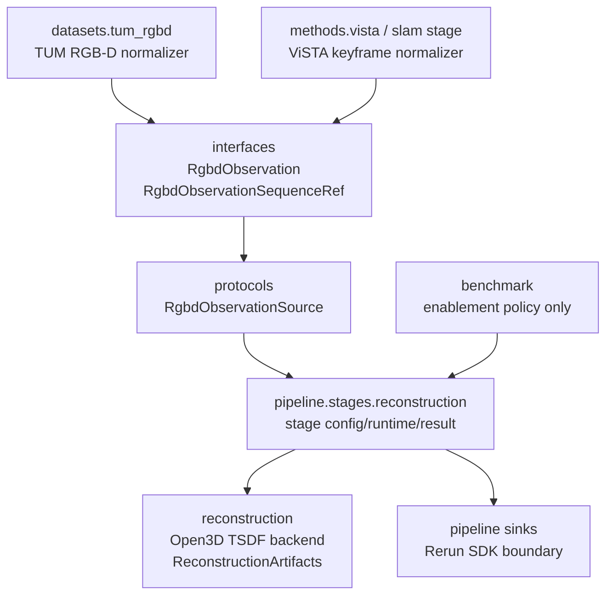
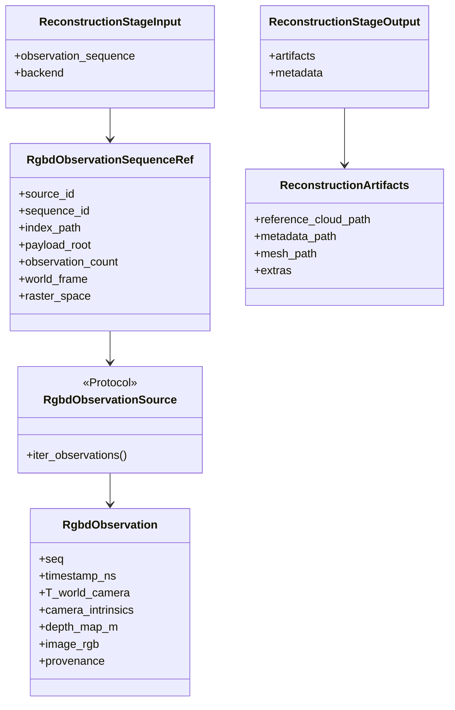
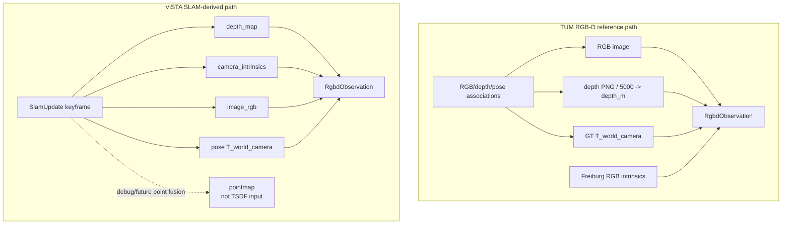
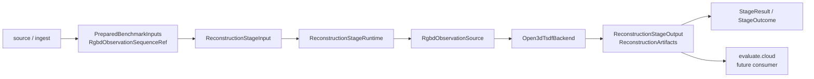
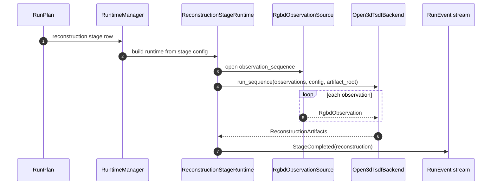

# Reconstruction Stage Target Architecture

This document defines the target architecture for the public `reconstruction`
stage without changing the broader pipeline into a generic workflow engine. It
is a focused companion to
[Pipeline Stage Refactor Target Architecture](./pipeline-stage-refactor-target.md)
and should be read together with the current-stage diagnosis and executable
protocol references.

Companion references:

- [Pipeline stage refactor target](./pipeline-stage-refactor-target.md)
- [Present-state audit](./pipeline-stage-present-state-audit.md)
- [Executable stage protocol reference](./pipeline-stage-protocols-and-dtos.md)
- [Reconstruction package guide](../../src/prml_vslam/reconstruction/README.md)
- [TUM RGB-D dataset guide](../../src/prml_vslam/datasets/tum_rgbd/README.md)
- [ViSTA-SLAM wrapper guide](../../src/prml_vslam/methods/vista/README.md)

Terminology matches the pipeline-stage target document:

- `runtime payload`: rich in-memory payload used inside stage or backend boundaries
- `transport-safe event`: strict DTO crossing Ray/runtime event boundaries
- `durable artifact/provenance`: persisted manifest, artifact ref, or summary
- `transport-safe projection`: app/CLI-facing state derived from events

## Purpose And Relationship To Pipeline Refactor

The reconstruction stage should become a first-class pipeline stage over a
normalized RGB-D observation boundary. It should not consume raw dataset
layouts, method-private update objects, or Rerun payloads directly. The stage
runtime receives one prepared observation sequence, opens a source that yields
normalized posed RGB-D observations, invokes a reconstruction backend, and
returns a typed stage output plus durable `StageOutcome`.

The first executable slice is TUM RGB-D reference reconstruction with Open3D
TSDF. ViSTA-derived reconstruction is part of the target interface, but remains
unavailable until the SLAM stage can either persist accepted keyframe RGB-D
observations or feed them to an explicit live reconstruction sidecar through
the same normalized boundary.

The current implementation already has an experimental reconstruction package
with `ReconstructionObservation`, `ReconstructionArtifacts`,
`Open3dTsdfBackendConfig`, `OfflineReconstructionBackend`, and
`Open3dTsdfBackend`. This document describes how that method-level surface
should integrate into the broader stage refactor.

## Target Non-Goals

- Do not implement any `src/prml_vslam` changes in this documentation step.
- Do not make reconstruction a general multi-source fusion stage in v1.
- Do not make Open3D TSDF consume ViSTA pointmaps as its primary input.
- Do not require every reconstruction backend to be a Ray actor.
- Do not put Rerun SDK calls or entity-path policy in reconstruction DTOs.
- Do not make datasets depend on `prml_vslam.reconstruction` contracts.
- Do not make `reconstruction` responsible for cloud metrics; dense
  cloud metrics belong to `evaluate.cloud` and the `eval` package.
- Do not make `reconstruction` mutate native SLAM outputs or align them
  silently into a benchmark frame.

## Ownership And Normalization Boundary

The target should introduce one shared RGB-D observation boundary that sits
above source-specific adapters and below reconstruction backends.



Ownership rules:

- `interfaces` owns `RgbdObservation` because both dataset adapters and method
  outputs can produce it, and reconstruction consumes it.
- `interfaces` owns `RgbdObservationSequenceRef`, while
  `PreparedBenchmarkInputs` carries prepared refs from ingest/source
  preparation into later stages.
- `protocols` owns `RgbdObservationSource`, the repo-wide behavior seam that
  opens a prepared observation sequence and yields normalized observations.
- `datasets.tum_rgbd` owns TUM-specific association and file loading, then
  normalizes into `RgbdObservation`.
- `methods.vista` and the future SLAM stage runtime own ViSTA keyframe
  normalization, then normalize into `RgbdObservation`.
- `pipeline.stages.reconstruction` owns stage config, stage input/output DTOs,
  runtime status, and `StageResult` integration.
- `reconstruction` owns backend ids, backend configs, method harnesses, Open3D
  TSDF execution, and `ReconstructionArtifacts`.
- `benchmark` owns enablement policy only.

This boundary deliberately differs from `FramePacket`. A `FramePacket` is a
flexible runtime packet where RGB, depth, intrinsics, and pose are optional.
Open3D TSDF needs complete posed RGB-D observations. The reconstruction stage
should therefore consume `RgbdObservation`, not `FramePacket`.

## Stage Vocabulary And Runtime Scope

The public target stage key is `reconstruction`. Reference reconstruction,
3DGS, and future reconstruction methods are backend/mode variants under
`[stages.reconstruction]`, not separate public stage keys. The current
`reference.reconstruct` key is a migration contact for executable code only.
The stage should be implemented as the reconstruction stage package in the
target pipeline layout:

```text
src/prml_vslam/pipeline/stages/reconstruction/
├── config.py      # ReconstructionStageConfig and source/backend selection
├── contracts.py   # ReconstructionStageInput, ReconstructionStageOutput
└── runtime.py     # ReconstructionStageRuntime
```

Runtime classification:

| Stage | Target runtime | Initial executable source | Backend | Output |
| --- | --- | --- | --- | --- |
| `reconstruction` with reference mode | in-process runtime first | TUM RGB-D prepared observations | Open3D TSDF | reference cloud + metadata |
| ViSTA-derived reconstruction | unavailable target-compatible source path | persisted or live ViSTA keyframes | Open3D TSDF after RGB-D normalization | SLAM-local reconstructed scene |
| pointmap fusion | future separate backend/source path | ViSTA pointmaps or other pointmaps | not Open3D RGB-D TSDF v1 | point-cloud or mesh artifact |

The runtime may later become actor-backed when input size, GPU needs, remote
placement, or cancellation/status requirements justify that. The stage
interface should not require Ray actor semantics in v1.

## Target DTOs And Protocols

The normalized observation DTO is source-agnostic and strict:



`RgbdObservation` target fields:

| Field | Meaning |
| --- | --- |
| `seq` | Monotonic observation index within the selected sequence. |
| `timestamp_ns` | Source-aligned timestamp in nanoseconds. |
| `T_world_camera` | Canonical repo pose convention, world <- camera. |
| `camera_intrinsics` | Pinhole intrinsics for the RGB-D raster. |
| `depth_map_m` | HxW metric depth in meters, aligned with the RGB raster and intrinsics. |
| `image_rgb` | Optional HxWx3 RGB image aligned with `depth_map_m`. |
| `provenance` | Source, dataset/method id, world frame, pose source, and raster-space metadata. |

`RgbdObservationSequenceRef` should be a durable descriptor, not a list of
arrays. It points to a prepared index or manifest and a payload root that a
runtime can open locally or on a worker. This matches the current artifact-first
pipeline design and avoids treating transient Ray handles as replayable
scientific inputs.

`ReconstructionStageInput` is intentionally single-source in v1:

```text
ReconstructionStageInput
  observation_sequence: RgbdObservationSequenceRef
  backend: ReconstructionBackendConfig
```

Do not use `sources: list[...]` until there is a real multi-source
reconstruction requirement and clear output naming/provenance rules for every
source.

## Input Source Normalization

The reconstruction stage should not know whether observations originated from
TUM RGB-D files or ViSTA keyframe updates. Source-specific packages normalize
into the shared RGB-D boundary first.



### TUM RGB-D Reference Path

TUM RGB-D is the first executable source because all required data already
exists durably:

- RGB frames are loaded from `rgb.txt` and the `rgb/` directory.
- Depth frames are associated from `depth.txt` and converted with
  `depth_png / 5000.0`.
- Intrinsics are Freiburg RGB intrinsics loaded by the TUM adapter.
- Poses are nearest ground-truth RGB camera poses in the mocap world.

The TUM adapter should prepare a `RgbdObservationSequenceRef` during source or
benchmark-input preparation. That ref is then carried through
`PreparedBenchmarkInputs` or the equivalent target prepared-input boundary.
The reconstruction runtime opens the ref through `RgbdObservationSource` and
streams observations into Open3D TSDF.

### ViSTA SLAM-Derived Path

ViSTA streaming `SlamUpdate` already exposes a TSDF-compatible keyframe bundle
when the accepted keyframe has:

- `pose`
- `depth_map`
- `camera_intrinsics`
- optional `image_rgb`

These fields describe the ViSTA preprocessed model raster, not the original
source-frame raster. That is valid as long as the observation provenance records
the raster space and world-frame semantics. ViSTA `pose` is `T_world_camera` in
ViSTA's SLAM-local world.

`SlamUpdate.pointmap` must not be treated as Open3D RGB-D TSDF input. It is an
already unprojected camera-local pointmap in ViSTA's RDF camera basis. It is
appropriate for Rerun/debugging and may support a future pointmap-fusion
backend, but it is not the same input modality as an RGB-D depth image.

The ViSTA source path remains unavailable until one of these lifecycle choices
is implemented:

- persist accepted keyframe RGB-D observations into a durable
  `RgbdObservationSequenceRef`; or
- run reconstruction as an explicit live sidecar while transient keyframe
  payloads are still available.

## Open3D TSDF Backend Contract

The Open3D backend remains source-agnostic. It should consume normalized
observations and write normalized artifacts:

```text
OfflineReconstructionBackend.run_sequence(
    observations: Iterable[RgbdObservation],
    *,
    backend_config: ReconstructionBackendConfig,
    artifact_root: Path,
) -> ReconstructionArtifacts
```

The first backend is `Open3dTsdfBackend` using Open3D
`ScalableTSDFVolume`. It should integrate `depth_map_m`,
`camera_intrinsics`, `T_world_camera`, and optional `image_rgb`. It writes one
normalized world-space `reference_cloud.ply` plus metadata. Optional mesh or
debug files may be extras, but they do not replace the required point-cloud
artifact.

The backend should reject incomplete or inconsistent observations before
integration:

- missing depth
- missing pose
- missing intrinsics
- non-finite or negative depth values
- RGB/depth raster mismatch
- intrinsics width/height mismatch with the raster

## Runtime Integration

The reconstruction stage fits the target `StageRuntime` model from the pipeline
refactor. It receives a prepared stage input, opens the observation source,
runs the backend, and returns `StageResult`.





The stage should be unavailable during planning when no
`RgbdObservationSequenceRef` exists. In v1, this means TUM RGB-D can enable the
stage after source preparation, while ADVIO-only monocular video cannot.

The stage output should be usable by `evaluate.cloud` later, but cloud metrics
must remain a separate stage. `reconstruction` produces geometry; it does not
score SLAM output quality.

## Rerun And Event Integration

Reconstruction DTOs must stay Rerun-friendly, but they must not call the Rerun
SDK. Rerun SDK calls remain inside the pipeline sink.

Target event behavior:

- `StageStarted(reconstruction)` records stage start.
- Optional `StageRuntimeStatus` updates report observation count, throughput,
  and last warning/error.
- `ArtifactRegistered` records `reference_cloud`, metadata, and optional mesh
  artifacts.
- `StageCompleted(reconstruction)` carries `ReconstructionStageOutput`
  through `StageResult` or the target stage-output summary.

If Rerun export of reconstruction outputs is added later, the sink should map
the output artifact or neutral visualization envelope to Rerun entity paths.
The reconstruction package should never embed Rerun entity paths, timelines,
styles, or SDK commands in core DTOs.

## Failure Modes And Availability

Planning availability should fail closed with explicit reasons:

| Condition | Planning or runtime behavior |
| --- | --- |
| No `RgbdObservationSequenceRef` | Stage unavailable. |
| Observation source cannot be opened | Stage fails before backend execution. |
| Missing depth, pose, or intrinsics | Stage fails with source-normalization error. |
| RGB/depth/intrinsics raster mismatch | Stage fails with validation error. |
| Open3D dependency missing | Stage fails with reconstruction backend configuration error. |
| Open3D extracts an empty cloud | Stage fails with backend execution error. |
| ViSTA source selected without durable/live keyframe observation support | Stage unavailable. |

These failures should produce normal `StageOutcome` failures and should not
silently skip reconstruction when the stage was explicitly enabled.

## Change Inventory For Later Implementation

Contract additions:

- Add `RgbdObservation` and observation provenance to `interfaces`.
- Add `RgbdObservationSequenceRef` to the shared prepared-input boundary.
- Add `RgbdObservationSource` to `protocols`.
- Add `ReconstructionStageInput` and `ReconstructionStageOutput` to the
  reconstruction stage package.

Dataset changes:

- Add a TUM RGB-D observation-sequence preparer.
- Include the prepared observation sequence in `PreparedBenchmarkInputs` or the
  target equivalent prepared-input DTO.
- Add a TUM RGB-D `RgbdObservationSource` that reuses existing association,
  depth loading, intrinsics loading, and ground-truth pose loading logic.

Method / SLAM changes:

- Add a ViSTA keyframe normalizer from accepted `SlamUpdate` values into
  `RgbdObservation`.
- Defer executable ViSTA reconstruction until durable keyframe observation
  persistence or an explicit live reconstruction sidecar exists.

Pipeline changes:

- Add `pipeline.stages.reconstruction`.
- Add planning availability based on `RgbdObservationSequenceRef`.
- Add stage runtime integration with `StageResult`, `StageOutcome`, artifact
  registration, and status reporting.

Reconstruction package changes:

- Generalize the existing backend from `Sequence[ReconstructionObservation]`
  to `Iterable[RgbdObservation]`.
- Keep Open3D TSDF as the only v1 backend.
- Keep method switching inside the reconstruction harness/config union.

## Test Plan

Future implementation should include these tests:

- TUM RGB-D normalizer yields complete `RgbdObservation` values.
- Missing depth, pose, intrinsics, or mismatched raster shape fails early.
- Open3D TSDF consumes `Iterable[RgbdObservation]`.
- Reconstruction stage produces `reference_cloud.ply`, metadata,
  `StageResult`, and `StageOutcome`.
- ViSTA keyframe normalizer rejects incomplete updates.
- ViSTA pointmaps are not accepted as Open3D TSDF input.
- Planning marks reconstruction unavailable when no RGB-D observation sequence
  exists.
- Rerun sink remains the only SDK caller for any future reconstruction
  visualization path.

## Assumptions And Deferred Decisions

Assumptions:

- V1 implementation target is TUM RGB-D reference reconstruction.
- Only one reconstruction source is selected per run.
- Open3D TSDF is the first reconstruction backend.
- `reconstruction` remains separate from `evaluate.cloud`.
- ViSTA support requires later keyframe RGB-D persistence or a live sidecar.

Deferred decisions:

- Whether ViSTA reconstruction should be post-SLAM over durable keyframe
  observations or live as a streaming sidecar.
- Whether pointmap fusion becomes a separate reconstruction backend or a
  separate stage source path.
- Whether reconstruction needs actor placement once large scenes, remote
  execution, or cancellation requirements become concrete.
