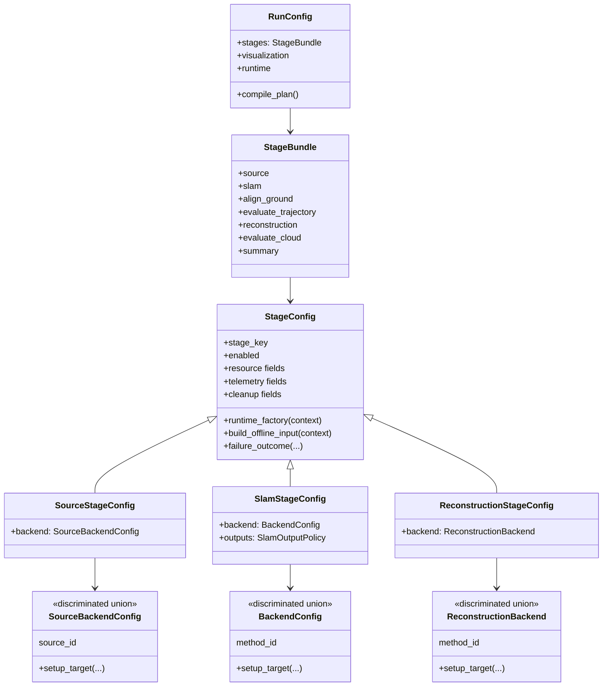

# PRML VSLAM Package Architecture

This package contains the benchmark-facing implementation for PRML VSLAM:
source normalization, SLAM wrapper integration, derived stages, evaluation,
reconstruction, visualization policy, Streamlit app surfaces, and the pipeline
runtime that composes those pieces into one run.

Use [`REQUIREMENTS.md`](./REQUIREMENTS.md) for concise package ownership rules.
Use package-local README and REQUIREMENTS files for domain-specific behavior.
The historical stage-refactor target in
[`../../docs/architecture/pipeline-stage-refactor-target.md`](../../docs/architecture/pipeline-stage-refactor-target.md)
is no longer the day-to-day source of truth.

## Package Ownership

- [`sources`](./sources/README.md) owns source backend configs, dataset and
  Record3D adapters, replay streams, source manifests, prepared benchmark
  inputs, and source-stage integration.
- [`methods`](./methods/README.md) owns SLAM backend configs, method protocols,
  concrete wrappers such as ViSTA, live method updates, and normalized
  `SlamArtifacts` production.
- [`alignment`](./alignment/README.md) owns derived alignment logic over
  normalized SLAM outputs.
- [`eval`](./eval/README.md) owns metric computation and evaluation artifacts.
- [`reconstruction`](./reconstruction/README.md) owns reconstruction backend
  configs, protocols, implementations, and reconstruction artifacts.
- [`pipeline`](./pipeline/README.md) owns `RunConfig`, planning, execution
  orchestration, runtime DTOs, events, snapshots, artifact layout, and summary
  projection.
- [`visualization`](./visualization/README.md) owns viewer policy and Rerun
  integration. Rerun SDK calls stay in sink/policy code.
- [`interfaces`](./interfaces) owns shared datamodels such as `Observation`,
  camera intrinsics, transforms, artifacts, geometry, and visualization
  primitives.
- [`app`](./app/README.md) owns Streamlit page state and rendering.
- [`utils`](./utils) owns low-level config, path, logging, and serialization
  helpers.

## Stage Authoring Contract

Executable stages are domain-owned except for generic pipeline stages. A domain
stage should expose this shape when it participates in a pipeline run:

- `stage/config.py`: one persisted `*StageConfig` subclass of
  `pipeline.stages.base.config.StageConfig`. It declares stage key, planned
  outputs, availability, lazy runtime factory, input building, and failure
  fingerprint policy.
- `stage/contracts.py`: narrow runtime-boundary DTOs such as
  `SourceStageInput`, `SlamOfflineStageInput`, or
  `ReconstructionStageInput`. Keep these small and do not duplicate broad
  `RunConfig`, `RunPlan`, or `StageResultStore` state.
- `stage/runtime.py`: a runtime adapter implementing the relevant protocol
  from `pipeline.stages.base.protocols`.
- `stage/visualization.py`: optional adapter that turns domain payloads into
  neutral `VisualizationItem` values. It must not call the Rerun SDK.

Domain backends and source/reconstruction variants may use
`FactoryConfig.setup_target(...)` to construct concrete implementations inside
the execution process. Stage configs themselves remain declarative planning
contracts; they do not open sources, allocate Ray actors, or construct sink
sidecars.

`pipeline/stages/base` is the generic stage-runtime framework.
`pipeline/stages/summary` is a pipeline-owned projection stage. Source, SLAM,
alignment, evaluation, and reconstruction stage integrations live in their
domain packages.

## Current Stage And Config Shape

## Runtime Boundary

The pipeline calls all stages through generic runtime protocols:

- `BaseStageRuntime`: status and stop.
- `OfflineStageRuntime`: bounded execution returning one `StageResult`.
- `LiveUpdateStageRuntime`: non-blocking observer updates.
- `StreamingStageRuntime`: start, submit one stream item, finish.

The runtime result is always pipeline-owned `StageResult`; the payload inside it
is domain-owned or shared. Cross-stage handoff happens through
`StageResultStore`, not through ad hoc mutable state. Generic lifecycle,
failure projection, and result storage are handled by `StageRunner`; stage
configs and runtimes remain responsible for domain-specific input and output
semantics.
