# ADVIO Dataset Guide

This package owns the repository-local adapter for the
[ADVIO dataset](https://github.com/AaltoVision/ADVIO): path resolution,
typed loading of official files, replay preparation, and app-facing dataset
services.

The official dataset combines one benchmark reference track with several
device-specific modalities. The most important distinction is that the
ground-truth track is the benchmark reference frame, while ARKit, ARCore, and
Tango pose streams are recorded in their own device-local world frames and must
be aligned before cross-system comparison.

## Sources

- Official dataset repository:
  [AaltoVision/ADVIO](https://github.com/AaltoVision/ADVIO)
- Official paper:
  [ADVIO: An authentic dataset for visual-inertial odometry](https://arxiv.org/abs/1807.09828)
- Repo-owned loader and layout code:
  [`advio_layout.py`](./advio_layout.py),
  [`advio_loading.py`](./advio_loading.py),
  [`advio_sequence.py`](./advio_sequence.py),
  [`advio_replay_adapter.py`](./advio_replay_adapter.py)

## Modality Overview



Source diagram:
[`docs/figures/mermaid/advio-modalities-overview.mmd`](../../../../docs/figures/mermaid/advio-modalities-overview.mmd)

## File Conventions

The official ADVIO repository README and the released ZIP archives are close,
but not perfectly identical. In the checked local ADVIO archives under
`.data/advio/`, all 23 sequences use `ground-truth/pose.csv`,
`iphone/gyro.csv`, and `iphone/platform-locations.csv`, whereas the official
README documents `poses.csv`, `gyroscope.csv`, and `platform-location.csv`.
The Tango point-cloud payloads are also stored as five-digit names such as
`point-cloud-00001.csv`, while the official README documents the schematic
`point-cloud-$index.csv` form. The repository adapter intentionally accepts the
observed released names where needed, but the examples below prefer the names
present in the released archives.

Canonical per-sequence structure:

```text
data/
├── advio-XX/
│   ├── ground-truth/
│   │   ├── pose.csv                  # 6DoF benchmark reference trajectory in the released archives
│   │   └── fixpoints.csv             # manually marked position fixes used to build the reference
│   ├── iphone/
│   │   ├── frames.mov                # RGB video capture
│   │   ├── frames.csv                # exact frame timestamps for the RGB video
│   │   ├── platform-locations.csv    # geographic / platform location samples
│   │   ├── accelerometer.csv         # raw accelerometer stream
│   │   ├── gyro.csv                  # raw gyroscope stream
│   │   ├── magnetometer.csv          # raw magnetometer stream
│   │   ├── barometer.csv             # pressure and relative altitude samples
│   │   └── arkit.csv                 # ARKit pose stream for the iPhone camera
│   ├── pixel/
│   │   └── arcore.csv                # ARCore pose stream from the Google Pixel
│   └── tango/
│       ├── frames.mov                # Tango fisheye video
│       ├── frames.csv                # exact frame timestamps for the fisheye video
│       ├── raw.csv                   # Tango raw odometry
│       ├── area-learning.csv         # Tango loop-closing / map-building odometry
│       ├── point-cloud.csv           # point-cloud timestamps / index table
│       ├── point-cloud-00001.csv     # Tango point-cloud capture
│       ├── point-cloud-00002.csv     # Tango point-cloud capture
│       └── ...
└── calibration/
    ├── iphone-01.yaml                # iPhone intrinsics, distortion, and T_cam_imu
    ├── iphone-02.yaml
    └── ...
```

Repository loader conventions:

- All numeric CSVs are treated as:
  `timestamp, value_1, value_2, ...`
- ADVIO pose CSVs are loaded into `evo.core.trajectory.PoseTrajectory3D` as:
  - translation: columns `1:4`
  - quaternion: columns `4:8`
  - timestamps: column `0`
- The repository treats `ground-truth/fixpoints.csv` as part of the
  `GROUND_TRUTH` modality bundle. It is preserved for source fidelity and local
  completeness checks, but the trajectory loader reads only the pose CSV.
- Tango `raw.csv` and `area-learning.csv` use the same pose CSV convention as
  the other ADVIO pose streams.
- Tango `point-cloud.csv` rows are `timestamp, point_cloud_index`; each index
  points to a matching `point-cloud-00001.csv`-style payload file whose rows are
  `x, y, z` metric point coordinates emitted by the Tango depth pipeline.
- The calibration YAML is parsed as:
  - pinhole intrinsics: `fx, fy, cx, cy`
  - image size
  - distortion model and coefficients
  - `T_cam_imu`
- In this repository, poses and calibration transforms are handled through
  [`FrameTransform`](../../interfaces/transforms.py) using the canonical
  camera-to-world runtime convention for poses.

## Ground-Truth Fixpoints

`ground-truth/fixpoints.csv` stores the manually marked position fixes used to
build the ADVIO reference trajectory. The paper describes the ground truth as an
iPhone-IMU inertial-navigation estimate conditioned on these manual fixes,
additional calibration, and the external/reference videos and floor plans.
The fixes constrain position only; orientation comes from the inertial
trajectory inference.

In the released CSVs, each row is numeric and starts with the fix timestamp
followed by the metric 3D fix position used by the trajectory optimizer. The
remaining fields preserve the floor-plan marking metadata used by the ADVIO
annotation tooling, such as image-plane marker coordinates and floor or level
identifier. This repository currently preserves the file and uses it for
ground-truth modality completeness checks, but does not parse it into a typed
runtime model.

## Tango Bundle

The Tango modality is an auxiliary Google Tango-device stream, not iPhone RGB-D
ground truth. It contains:

- `raw.csv`: Tango raw odometry, a frame-to-frame pose stream without long-term
  map memory.
- `area-learning.csv`: Tango area-learning odometry, a map-building pose stream
  that can use loop closure to reduce drift.
- `frames.mov` and `frames.csv`: Tango fisheye grayscale video and its frame
  timestamps. The paper reports this video as roughly 5 fps at 640x480.
- `point-cloud.csv`: timestamps and integer point-cloud indices. Sampling is
  non-uniform and follows Tango depth availability rather than video frame rate.
- `point-cloud-00001.csv`, `point-cloud-00002.csv`, ...: one XYZ point-cloud
  payload per index, acquired by the Tango depth sensor and aligned to the
  current Tango device pose by Tango.

Because the Tango capture comes from a separate rigidly mounted device, its
poses and point clouds live in Tango-local coordinate systems. Treat them as
source-native auxiliary geometry until an explicit temporal association and
cross-system alignment into the iPhone or GT world has been performed.

For repository-owned benchmark prep, `AdvioSequence.to_benchmark_inputs()`
materializes both bounded static reference clouds and source-native step-wise
point-cloud sequence references so downstream replay-style consumers, such as
the mock SLAM backend, can associate the nearest Tango payload to an iPhone
frame timestamp and project that geometry back into a camera-local pointmap.

## Frame And Transform Tree



Source diagram:
[`docs/figures/mermaid/advio-transform-tree.mmd`](../../../../docs/figures/mermaid/advio-transform-tree.mmd)

How to read the tree:

- `GT world` is the benchmark reference frame.
- `ARKit world`, `ARCore world`, `Tango raw world`, and
  `Tango area-learning world` are separate pose-system frames.
- `T_cam_imu` is the main explicit static SE(3) transform shipped in the
  calibration YAML and consumed by this repository.
- Cross-device rig extrinsics are described in the paper as part of the capture
  setup, but they are not surfaced as a canonical repo-owned public transform
  file here.
- Any edge from a device-local world into `GT world` is a derived comparison
  transform, not an official stored ADVIO pose stream.

## Ground Truth Versus Device Poses

The official paper describes the ground-truth as a reference trajectory inferred
from the iPhone IMU, additional calibration, and manually marked fixation
points from an external reference video and floor plans. In practice, the
repository uses it as the authoritative benchmark trajectory and world frame for
evaluation and visualization.

That means:

- `GT` is the reference trajectory.
- `ARKit`, `ARCore`, `Tango/raw`, and `Tango/area-learning` are baseline or auxiliary pose streams.
- Direct overlays of raw pose CSVs are not valid cross-system comparisons until
  an explicit alignment step is applied.

## Repo Interpretation For Visualization

For the current Streamlit Sequence Explorer:

- global comparison mode aligns ARKit and ARCore into the ground-truth frame
  with an SE(3) fit for display
- local comparison mode normalizes each trajectory by the inverse of its own
  first pose so each track starts at the origin in its own local frame
- ADVIO is displayed as `Y`-up, so the BEV uses the `X-Z` floor plane

Those display transforms are repository-owned visualization choices. They are
not stored as native ADVIO modalities.
