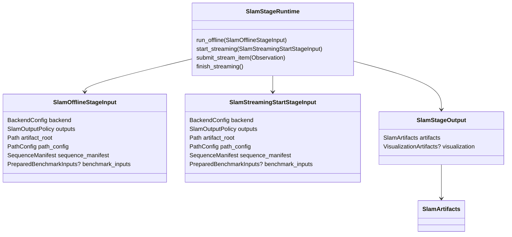

# Methods

This package owns concrete SLAM wrapper execution: backend config variants,
method protocols, ViSTA adapter bootstrap, backend-native live updates, and
normalized `SlamArtifacts` production.

Persisted SLAM stage policy lives under `methods/stage/`; reusable method
wrappers and native artifact interpretation remain in the method package.

## Stage Integration

- [`stage/backend_config.py`](./stage/backend_config.py): public SLAM backend
  discriminator `method_id`, concrete backend configs, and `SlamOutputPolicy`.
  Concrete backend configs construct wrappers through `setup_target(...)`.
- [`stage/config.py`](./stage/config.py): `SlamStageConfig`, which declares
  planned SLAM outputs, availability, and output materialization policy.
- [`stage/contracts.py`](./stage/contracts.py): `SlamOfflineStageInput` and
  `SlamStreamingStartStageInput`, plus `SlamStageOutput` for terminal
  downstream handoff.
- [`stage/runtime.py`](./stage/runtime.py): `SlamStageRuntime`, the runtime
  adapter implementing offline, streaming, and live-update capability surfaces.
- [`stage/spec.py`](./stage/spec.py): `SLAM_STAGE_SPEC`, which binds runtime
  construction, offline/streaming input building, and failure fingerprints.
- [`stage/visualization.py`](./stage/visualization.py): neutral
  visualization-item adapter for SLAM artifacts and live updates.

## I/O And Protocols

- Offline SLAM backends consume `Iterable[Observation]`, not source manifests
  or backend-private file layouts.
- Streaming SLAM sessions consume shared `Observation` stream items after
  `SlamStageRuntime` has started the session.
- [`protocols.py`](./protocols.py) owns `OfflineSlamBackend`,
  `StreamingSlamBackend`, and `StreamingSlamSession`.
- [`contracts.py`](./contracts.py) owns `SlamUpdate` and backend notice/event
  payloads emitted by method wrappers.
- SLAM completion returns `SlamStageOutput` inside a pipeline `StageResult`;
  its `artifacts` field contains normalized
  [`SlamArtifacts`](../interfaces/slam.py).

Source manifest dematerialization belongs to source-owned helpers and the SLAM
stage runtime. Method wrappers own backend-specific preprocessing, upstream
runtime initialization, native-output validation, and normalization into
repo-owned artifacts.

## Concrete Backends

- [`vista/`](./vista/README.md): canonical ViSTA-SLAM wrapper, runtime
  bootstrap, frame preprocessing, live session stepping, and native artifact
  import.
- [`mast3r.py`](./mast3r.py): placeholder MASt3R backend that remains fail-fast
  until the repository owns a real integration.

Methods must not own stage order, persisted run config beyond backend variant
fields, resource placement, pipeline events, app state, viewer orchestration, or
evaluation policy.
