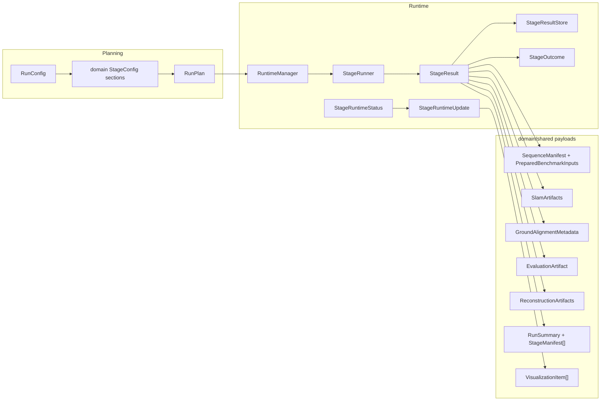
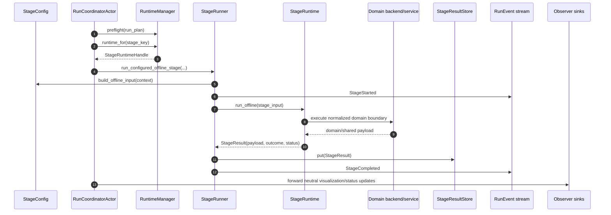

# PRML VSLAM Pipeline Guide

This package owns planning, run orchestration, event truth, live snapshots,
artifact layout, runtime DTOs, and summary projection for repository pipeline
runs. Domain stages live in their owning packages and adapt domain computation
into the generic pipeline runtime contracts.

Package constraints live in [`REQUIREMENTS.md`](./REQUIREMENTS.md). Cross-package
stage-authoring guidance lives in [`../README.md`](../README.md).

The pipeline is a linear benchmark runtime, not a generic workflow engine:

```text
source -> slam -> [gravity.align] -> [evaluate.trajectory] -> [reconstruction] -> [evaluate.cloud] -> summary
```

`evaluate.cloud` is a diagnostic planning binding without a runtime. Efficiency
evaluation is intentionally out of the current public pipeline surface.

## Current Entry Points

- [`RunConfig`](./config.py): persisted TOML launch and planning root.
- [`RunPlan`](./contracts/plan.py): side-effect-free ordered plan.
- [`RunService`](./run_service.py): app/CLI facade over the active backend.
- [`RayPipelineBackend`](./backend_ray.py): Ray lifecycle, coordinator
  attachment, and local Ray bootstrap.
- [`RunCoordinatorActor`](./ray_runtime/coordinator.py): run event log, live
  snapshot projection, stage sequencing, sink fanout, and streaming credit loop.
- [`RuntimeManager`](./runtime_manager.py): lazy local runtime-handle
  construction from stage config factories.
- [`StageRunner`](./runner.py): generic lifecycle executor for bounded and
  streaming stage protocol calls.

Source-provider seams live in [`sources.protocols`](../sources/protocols.py),
source replay streams in
[`sources.replay.protocols`](../sources/replay/protocols.py), shared
observations in [`interfaces.observation`](../interfaces/observation.py), and
SLAM backend seams in [`methods.protocols`](../methods/protocols.py).

## Runtime Protocols

Stage runtimes implement only the capability protocols they need from
[`stages/base/protocols.py`](./stages/base/protocols.py):

- `BaseStageRuntime`: every runtime exposes `status()` and `stop()`.
- `OfflineStageRuntime`: bounded work over one narrow input DTO that returns a
  terminal `StageResult`.
- `LiveUpdateStageRuntime`: active runtimes can non-blockingly drain
  `StageRuntimeUpdate` observer payloads.
- `StreamingStageRuntime`: active hot-path runtimes start a session, accept one
  stream item at a time, and finalize into one `StageResult`.

Capability and deployment are separate. The current `RuntimeManager` lazily
wraps local runtime objects in `StageRuntimeHandle`; the run as a whole is
Ray-backed through `RayPipelineBackend` and `RunCoordinatorActor`, but
independent per-stage Ray-hosted runtime execution is not a current contract.
Ray refs, actor mailboxes, and placement mechanics stay behind backend and
coordinator boundaries.

## StageRunner And StageResultStore

`StageRunner` owns generic lifecycle around runtime protocol calls:

- record stage-start callbacks;
- call `run_offline`, `start_streaming`, `submit_stream_item`, or
  `finish_streaming`;
- convert failures through `StageConfig.failure_outcome(...)`;
- invoke completion/failure callbacks used by the coordinator;
- store successful `StageResult` values.

`StageResultStore` is the ordered completed-result handoff for downstream input
builders. It stores results by `StageKey`, preserves first-completion order, and
exposes only common typed accessors such as `require_sequence_manifest()`,
`require_benchmark_inputs()`, and `require_slam_artifacts()`. Individual stage
configs still build their own narrow runtime input DTOs.

## Generic DTO And Payload Flow



`StageResult` is the canonical cross-stage completion target. `StageOutcome` is
the durable/provenance subset. Semantic outputs remain domain-owned payloads.
Live telemetry and previews stay in `StageRuntimeUpdate`; durable run events
remain lifecycle and provenance records.

## Generic Stage Lifecycle



Streaming follows the same owner split: the coordinator owns stream sequencing
and credit flow, `StageRunner` owns generic protocol calls, the runtime owns
session state, and domain backends own algorithm-specific stepping.

## Artifact Ownership

Durable run outputs are artifacts, manifests, and summaries:

- source preparation writes the normalized sequence manifest and prepared
  benchmark inputs;
- SLAM writes normalized trajectory, point-cloud, and viewer artifacts;
- derived stages write their own domain artifacts;
- summary writes `run_summary.json`, `stage_manifests.json`, and durable event
  logs.

Downstream app or CLI code should inspect artifacts through explicit artifact
inspection helpers instead of treating transient live payloads as durable
scientific outputs.

## Extension Rules

- Add new domain stage behavior under the domain package's `stage/` module.
- Keep generic lifecycle, status, updates, results, and snapshots in pipeline.
- Keep domain computation in the domain package; stage runtimes adapt it into
  `StageResult`, `StageRuntimeStatus`, and `StageRuntimeUpdate`.
- Keep Rerun SDK calls inside sink/policy modules, not in DTOs or stage
  runtimes.
- Keep launch/config additions in `RunConfig` and stage-owned config modules.
