# PRML VSLAM Pipeline Guide

This package owns the typed planning contracts and artifact-boundary
definitions for the repository pipeline. Shared source-provider protocols live
in [`prml_vslam.protocols.source`](../protocols/source.py) and
[`prml_vslam.protocols.runtime`](../protocols/runtime.py), while SLAM
backend/session protocols live in
[`prml_vslam.methods.protocols`](../methods/protocols.py).

## Current State

Today `prml_vslam.pipeline` is primarily a typed planning surface:
[`contracts.py`](./contracts.py) defines public contracts such as
[`RunRequest`](./contracts.py), [`RunPlan`](./contracts.py),
[`SequenceManifest`](./contracts.py), [`StageManifest`](./contracts.py), and
[`RunSummary`](./contracts.py); [`services.py`](./services.py) turns
[`RunRequest`](./contracts.py) into an ordered
[`RunPlan`](./contracts.py); and [`workspace.py`](./workspace.py) defines the
capture-manifest helper models used while materializing sequences.

The generic offline and streaming runners described in
[`REQUIREMENTS.md`](./REQUIREMENTS.md) are target architecture, not implemented
package surfaces yet.

There is one executable bounded demo today. The shared request-template helpers
live in [`demo.py`](./demo.py), where the repository can build or load demo
[`RunRequest`](./contracts.py) values, while the actual runtime is owned by
[`RunService`](./run_service.py) and
[`PipelineSessionService`](./session.py). The Streamlit
[`Pipeline` page](../app/pages/pipeline.py) and the CLI
[`pipeline-demo`](../main.py) command are user-facing launch surfaces: they
configure or load a request, resolve a source, and then hand both into the
pipeline-owned runtime. The current executable slice only supports the
`ingest`, `slam`, and `summary` stages. The planner can still describe
reference and evaluation stages, but the bounded runtime rejects those stage
ids until explicit runtime support is added.

## Current Streaming Demo Implementation

The current runnable streaming demo is split across a small set of cooperating
files. [`demo.py`](./demo.py) owns shared request-template helpers only; it is
not the runner. The UI surface in
[`../app/pages/pipeline.py`](../app/pages/pipeline.py) renders the page,
persists selector-only UI state through
[`PipelinePageState`](../app/models.py), and eventually calls
[`RunService.start_run(...)`](./run_service.py). The packaged app wiring in
[`../app/bootstrap.py`](../app/bootstrap.py) and
[`../app/state.py`](../app/state.py) makes that service available to the page.
The runtime path itself lives in [`RunService`](./run_service.py) and
[`PipelineSessionService`](./session.py), and uses the repository-local
[`MockSlamBackend`](../methods/mock_vslam.py) and
[`MockSlamSession`](../methods/mock_vslam.py), the ADVIO source helpers in
[`../datasets/advio_service.py`](../datasets/advio_service.py),
[`../datasets/advio_sequence.py`](../datasets/advio_sequence.py), and
[`../datasets/advio_replay_adapter.py`](../datasets/advio_replay_adapter.py),
the replay-capable [`FramePacketStream`](../protocols/runtime.py) provided by
[`../io/cv2_producer.py`](../io/cv2_producer.py), the shared
[`FramePacket`](../interfaces/runtime.py) runtime model, the source seams
[`OfflineSequenceSource`](../protocols/source.py) and
[`StreamingSequenceSource`](../protocols/source.py), the SLAM seams
[`OfflineSlamBackend`](../methods/protocols.py),
[`StreamingSlamBackend`](../methods/protocols.py),
[`SlamBackend`](../methods/protocols.py), and
[`SlamSession`](../methods/protocols.py), the live plotting helpers in
[`../app/plotting/record3d.py`](../app/plotting/record3d.py), the planner
contracts in [`contracts.py`](./contracts.py), the
[`RunPlannerService`](./services.py), and the canonical artifact layout exposed
through [`PathConfig.plan_run_paths(...)`](../utils/path_config.py).

## Design Rationale

The architectural center of this repository is not “streaming” and it is not a
generic workflow engine. The center is an offline, artifact-first benchmark
pipeline, as described in [`REQUIREMENTS.md`](./REQUIREMENTS.md), with
streaming retained as a smaller bounded runtime surface that can monitor live
state and eventually hand a session back into the offline core. That design is
why the current package favors typed contracts, stable artifact locations, and
explicit final summaries over generalized graph execution or in-memory
envelopes.

The most important design choice is the shared
[`SequenceManifest`](./contracts.py) boundary. Inputs can come from different
worlds such as a raw video file, an ADVIO sequence, or a live
[`Record3D`](../io/record3d.py) stream, but they should all be normalized into
the same manifest before the benchmark stages run. Upstream of that boundary,
the system is allowed to care about dataset quirks, replay metadata, transport
details, or capture semantics. Downstream of that boundary, the system should
care about benchmark execution, artifact production, provenance, and
evaluation, not about the original source identity.

The split between shared data contracts, shared behavior seams, and concrete
implementations is also deliberate. Shared runtime models such as
[`FramePacket`](../interfaces/runtime.py) live in
[`interfaces`](../interfaces/runtime.py), behavior seams such as
[`StreamingSequenceSource`](../protocols/source.py) and
[`SlamSession`](../methods/protocols.py) live in
[`protocols`](../protocols/source.py) and
[`methods/protocols.py`](../methods/protocols.py), and concrete dataset, I/O,
and backend implementations stay in their owning packages. That separation
keeps source adaptation, packet streaming, backend execution, evaluation, and
visualization from collapsing into one hard-to-reason-about runtime.

The app stays intentionally thin for the same reason. The Streamlit workbench
in [`prml_vslam.app`](../app/bootstrap.py) is supposed to configure, launch,
monitor, and visualize, but not redefine what the pipeline means. The bounded
runtime belongs to [`RunService`](./run_service.py) and
[`PipelineSessionService`](./session.py), while the app and CLI are launch
surfaces that consume those services. This keeps orchestration semantics in the
backend package and prevents page code from becoming a second pipeline
implementation.

Finally, the package favors a “push variability to the edges, keep the center
boring” philosophy. The edges are where sources differ, methods differ, and
live transports differ. The center should stay comparatively calm:
[`RunRequest`](./contracts.py), [`RunPlan`](./contracts.py),
[`RunArtifactPaths`](../utils/path_config.py), [`StageManifest`](./contracts.py),
and [`RunSummary`](./contracts.py) should remain method-agnostic and
source-agnostic as much as possible. That is the main simplification strategy
already encoded in the current design.

## Two Pipeline Modes

The pipeline supports two top-level modes through
[`PipelineMode`](./contracts.py).

### Offline

Use [`PipelineMode.OFFLINE`](./contracts.py) when the input is already bounded
and replayable:

- a raw video file
- a dataset sequence such as ADVIO
- a previously captured live session that has already been materialized

Offline runs are artifact-first. The caller defines a
[`RunRequest`](./contracts.py), builds a [`RunPlan`](./contracts.py),
materializes or resolves a [`SequenceManifest`](./contracts.py), and then
executes the enabled stages in order.

### Streaming

Use [`PipelineMode.STREAMING`](./contracts.py) when the input arrives
incrementally:

- a live camera feed
- a device stream such as Record3D USB or Wi-Fi
- an offline replay that should behave like a stream for monitoring purposes

Streaming mode still uses the same stage vocabulary, but its hot path is
frame-driven. The shared runtime unit is
[`FramePacket`](../interfaces/runtime.py), and the streaming-capable SLAM
session consumes packets one at a time via
[`start_session(...)`](../methods/protocols.py),
[`step(...)`](../methods/protocols.py), and
[`close()`](../methods/protocols.py).

The intended long-term flow is:

1. live ingress produces [`FramePacket`](../interfaces/runtime.py)
2. streaming SLAM produces [`SlamUpdate`](./contracts.py)
3. capture or replay is materialized into [`SequenceManifest`](./contracts.py)
4. downstream artifact stages consume materialized outputs, not live frames

## Core Contracts

### Entry Contract

The entry contract is [`RunRequest`](./contracts.py), which is the
config-defined entry point for both offline and streaming pipelines and owns
`mode`, `source`, `slam`, optional `reference`, and `evaluation`.

### Source Contracts

Source selection is expressed through
[`VideoSourceSpec`](./contracts.py),
[`DatasetSourceSpec`](./contracts.py), and
[`LiveSourceSpec`](./contracts.py).

### Planned Execution

Planning yields a [`RunPlan`](./contracts.py) with an ordered list of
[`RunPlanStage`](./contracts.py) values, plus stable
[`RunPlanStageId`](./contracts.py) identifiers such as `ingest`, `slam`, and
`summary`.

### Shared Normalization Boundary

[`SequenceManifest`](./contracts.py) is the single normalized boundary between
source-specific ingestion and the main benchmark stages. Every manifest must
provide a stable `sequence_id`, and sources should populate the optional paths
for video, timestamps, intrinsics, reference trajectories, and ARCore
baselines whenever those artifacts are already known at the ingestion boundary.

### Stage Outputs

[`SlamArtifacts`](./contracts.py) is the current concrete stage-output bundle.
Large outputs should cross stage boundaries as artifact references rather than
large in-memory payloads. Reference-stage and evaluation-stage bundles are
still target-state concepts described in [`REQUIREMENTS.md`](./REQUIREMENTS.md)
and should only be added to [`contracts.py`](./contracts.py) once a real stage
consumes or produces them.

### Provenance And Summary

[`StageManifest`](./contracts.py) records per-stage provenance through a config
hash, an input fingerprint, named output paths, and an execution status, while
[`RunSummary`](./contracts.py) provides the final run-level view of the
artifact root and stage-status map.

### Minimum Structural Requirements

The source-provider seams live in
[`prml_vslam.protocols.source`](../protocols/source.py), where offline sources
must expose a human-readable `label` plus
[`prepare_sequence_manifest(output_dir) -> SequenceManifest`](../protocols/source.py),
and streaming sources add
[`open_stream(*, loop: bool) -> FramePacketStream`](../protocols/source.py).
The SLAM seams live in [`prml_vslam.methods.protocols`](../methods/protocols.py),
where a backend exposes `method_id`, offline execution implements
[`run_sequence(sequence, cfg, artifact_root) -> SlamArtifacts`](../methods/protocols.py),
streaming execution implements
[`start_session(cfg, artifact_root) -> SlamSession`](../methods/protocols.py),
and a [`SlamSession`](../methods/protocols.py) itself must provide
[`step(frame) -> SlamUpdate`](../methods/protocols.py) and
[`close() -> SlamArtifacts`](../methods/protocols.py). Within
[`SlamArtifacts`](./contracts.py), `trajectory_tum` is mandatory, while
`sparse_points_ply`, `dense_points_ply`, and `preview_log_jsonl` remain
optional because not every backend or run mode materializes them.

## Runtime Interfaces

The current planner and streaming session consume shared source-provider
protocols from `prml_vslam.protocols.source` and SLAM behavior seams from
`prml_vslam.methods.protocols`.

### SLAM

[`OfflineSlamBackend`](../methods/protocols.py) covers materialized-sequence
execution through
[`run_sequence(sequence, cfg, artifact_root) -> SlamArtifacts`](../methods/protocols.py),
while [`StreamingSlamBackend`](../methods/protocols.py) covers incremental
execution through
[`start_session(cfg, artifact_root) -> SlamSession`](../methods/protocols.py).
[`SlamBackend`](../methods/protocols.py) is the convenience
combined protocol for backends that support both modes, and
[`SlamSession`](../methods/protocols.py) is the incremental interface that
consumes [`FramePacket`](../interfaces/runtime.py) through
[`step(frame) -> SlamUpdate`](../methods/protocols.py) and finishes with
[`close() -> SlamArtifacts`](../methods/protocols.py).

The important boundary rule is that streaming logic may consume
[`FramePacket`](../interfaces/runtime.py), but downstream stages should consume
typed artifact bundles or [`SequenceManifest`](./contracts.py), not live
packets.

## Supported Stage Types

The planner can describe more stages through
[`RunPlanStageId`](./contracts.py), but the current executable slice in
[`RunService`](./run_service.py) only accepts `ingest`, `slam`, and `summary`.
Those stage ids are enforced by [`_SUPPORTED_STAGE_IDS`](./run_service.py),
which is why reference and evaluation stages can already appear in a
[`RunPlan`](./contracts.py) without yet being runnable in the bounded runtime.

The `ingest` stage is the normalization stage. In planning, it is emitted by
[`RunPlannerService._build_stages(...)`](./services.py) with the canonical
output [`RunArtifactPaths.sequence_manifest_path`](../utils/path_config.py). At
runtime, it is implemented through the source seam rather than through a
pipeline-local stage object: the source must satisfy
[`OfflineSequenceSource`](../protocols/source.py) or
[`StreamingSequenceSource`](../protocols/source.py), and the actual work is the
call to
[`prepare_sequence_manifest(output_dir) -> SequenceManifest`](../protocols/source.py)
inside [`PipelineSessionService._run_worker(...)`](./session.py). In offline
mode, `ingest` prepares a replayable [`SequenceManifest`](./contracts.py) and
the subsequent stream is opened with `loop=False`; in streaming mode, `ingest`
still prepares the manifest first, but the later stream is opened with
`loop=True` for replay-backed streaming or backed by a live source. In the
current bounded demo, both modes still pass through the
[`StreamingSequenceSource`](../protocols/source.py) seam, so “offline” here
means single-pass replay rather than a completely separate offline runner.

The `slam` stage is the execution stage. In planning, it is emitted by
[`RunPlannerService._build_stages(...)`](./services.py) with trajectory output
always enabled and sparse or dense outputs added according to
[`SlamConfig`](./contracts.py). Its interfaces live in
[`prml_vslam.methods.protocols`](../methods/protocols.py):
[`OfflineSlamBackend`](../methods/protocols.py),
[`StreamingSlamBackend`](../methods/protocols.py),
[`SlamBackend`](../methods/protocols.py), and
[`SlamSession`](../methods/protocols.py). The current bounded runtime uses only
the streaming path: [`PipelineSessionService._run_worker(...)`](./session.py)
calls
[`StreamingSlamBackend.start_session(...)`](../methods/protocols.py), then
feeds each [`FramePacket`](../interfaces/runtime.py) into
[`SlamSession.step(...)`](../methods/protocols.py), receives
[`SlamUpdate`](./contracts.py) values for live progress, and finally closes the
session to obtain [`SlamArtifacts`](./contracts.py). In other words, offline
mode in the current demo still executes `slam` through the streaming session
interface, just against a bounded replay source, while the true
[`OfflineSlamBackend.run_sequence(...)`](../methods/protocols.py) seam exists as
the intended offline interface for a fuller future runner.

The `summary` stage is the provenance and terminalization stage. In planning,
it is emitted with the canonical outputs
[`RunArtifactPaths.summary_path`](../utils/path_config.py) and
[`RunArtifactPaths.stage_manifests_path`](../utils/path_config.py). Unlike
`ingest` and `slam`, it does not currently have an external protocol seam.
Instead, it is owned by the internal finalization logic in
[`PipelineSessionService._finalize_outputs(...)`](./session.py),
[`PipelineSessionService._build_stage_status(...)`](./session.py),
[`PipelineSessionService._build_stage_manifests(...)`](./session.py), and
[`PipelineSessionService._build_summary_manifest(...)`](./session.py). In both
offline and streaming modes, `summary` runs only once the session reaches a
terminal outcome. The difference is how that terminal state is reached: offline
single-pass replay usually ends through `EOFError`, while streaming mode may
end through EOF, an explicit stop request, or a runtime failure. The summary
logic is the same in all of those cases: persist
[`StageManifest`](./contracts.py) records and the final
[`RunSummary`](./contracts.py) even when the run stopped early or failed.

New stage types need both planning support and runtime support. Planning support
means adding a new [`RunPlanStageId`](./contracts.py), extending
[`RunRequest`](./contracts.py) if the stage is config-gated, adding canonical
output ownership to [`RunArtifactPaths`](../utils/path_config.py), and wiring
the stage into [`RunPlannerService._build_stages(...)`](./services.py). Runtime
support means extending the executable slice in [`RunService`](./run_service.py)
and the terminal accounting in [`PipelineSessionService`](./session.py), plus
introducing a reusable protocol in the owning module when the new stage needs a
real execution seam. In practice, if the stage behaves like source
normalization it probably belongs behind [`prml_vslam.protocols.source`](../protocols/source.py);
if it behaves like backend execution it probably belongs behind
[`prml_vslam.methods.protocols`](../methods/protocols.py); and if it is
strictly run-finalization logic it may remain internal to
[`prml_vslam.pipeline.session`](./session.py). The existing
[`How To Add A Stage`](#how-to-add-a-stage) section below is still the
step-by-step checklist, but the key design rule is simple: a new stage type is
not real in this repository until both the planner and the bounded runtime know
how to represent and finalize it.

## Potential Improvements And Simplifications

The current scaffold already has the right seams, so the next step is not a
fresh redesign. The main improvement is to finish the real runner layer that is
still described as target architecture in [`REQUIREMENTS.md`](./REQUIREMENTS.md):
introduce a true `OfflineRunner` and a true `StreamingRunner`, keep
[`RunService`](./run_service.py) as the single façade for the app and CLI, and
let those runners consume the existing contracts instead of inventing a second
execution vocabulary.

Another simplification is to introduce a real source resolver from
[`SourceSpec`](./contracts.py) into either
[`OfflineSequenceSource`](../protocols/source.py) or
[`StreamingSequenceSource`](../protocols/source.py). That would move the
remaining source branching out of launch surfaces and make it easier to add new
datasets or live transports without teaching the rest of the system about their
construction details.

Method execution should stay thin and wrapper-oriented. The repo already points
in that direction through [`SlamConfig`](./contracts.py),
[`OfflineSlamBackend`](../methods/protocols.py), and
[`StreamingSlamBackend`](../methods/protocols.py). The natural next step is to
replace the mock-only execution path with real wrappers around upstream
implementations such as [`ViSTA-SLAM`](https://arxiv.org/abs/2509.01584) and
[`MASt3R-SLAM`](https://github.com/rmurai0610/MASt3R-SLAM), normalizing their
native outputs back into the shared repo-owned artifacts rather than
re-implementing their internals locally.

Live-source persistence is another major gap and simplification opportunity.
The current [`Record3DStreamingSource`](../io/record3d_source.py) already fits
the shared source protocol, but the longer-term architecture becomes much
cleaner once live sessions can always materialize a durable capture boundary
and hand off into the same offline-core postprocessing path that dataset and
video runs use.

Evaluation should remain explicit and separate from app previews. The
repository already has a thin [`eval`](../eval/README.md) layer and already
uses [`evo`](https://github.com/MichaelGrupp/evo) for trajectory work. The app
can keep local previews, but benchmark policy should remain in explicit
evaluation stages rather than being re-embedded in page helpers. The same
general principle applies to support tooling such as
[`pooch`](https://www.fatiando.org/pooch/latest/) for dataset fetching and
[`Open3D`](https://www.open3d.org/) or
[`CloudCompare`](https://www.cloudcompare.org/) for geometry inspection: use
existing tools where they already solve the non-research part of the problem.

The final simplification principle is negative rather than additive: do not
turn this into a generic workflow framework. The current docs are already right
to reject generic envelopes, graph-core abstractions, and inter-stage queues
beyond live ingress. The existing typed, linear, artifact-first structure is a
better fit for a benchmark instrument than a more abstract orchestration layer
would be.

## Artifact Layout

[`PathConfig.plan_run_paths(...)`](../utils/path_config.py) returns the
canonical [`RunArtifactPaths`](../utils/path_config.py) layout for one run. In
practice that means stages should write to stable locations such as
`input/sequence_manifest.json`, `slam/trajectory.tum`,
`slam/sparse_points.ply`, `dense/dense_points.ply`,
`reference/reference_cloud.ply`, `evaluation/*.json`, and
`summary/run_summary.json` instead of inventing stage-local layouts.

## Defining An Offline Pipeline

The smallest offline pipeline is a [`RunRequest`](./contracts.py) with an
offline source and a [`SlamConfig`](./contracts.py).

```python
from pathlib import Path

from prml_vslam.methods import MethodId
from prml_vslam.pipeline import PipelineMode, RunRequest
from prml_vslam.pipeline.contracts import (
    BenchmarkEvaluationConfig,
    ReferenceConfig,
    SlamConfig,
    VideoSourceSpec,
)
from prml_vslam.utils import PathConfig

request = RunRequest(
    experiment_name="office-offline-vista",
    mode=PipelineMode.OFFLINE,
    output_dir=Path(".artifacts"),
    source=VideoSourceSpec(video_path=Path("captures/office.mp4"), frame_stride=2),
    slam=SlamConfig(method=MethodId.VISTA, emit_dense_points=False),
    reference=ReferenceConfig(enabled=False),
    evaluation=BenchmarkEvaluationConfig(
        compare_to_arcore=False,
        evaluate_cloud=False,
        evaluate_efficiency=True,
    ),
)

plan = request.build(PathConfig())
```

A dataset-backed offline request uses
[`DatasetSourceSpec`](./contracts.py) instead of
[`VideoSourceSpec`](./contracts.py).

```python
from pathlib import Path

from prml_vslam.datasets.contracts import DatasetId
from prml_vslam.methods import MethodId
from prml_vslam.pipeline import RunRequest
from prml_vslam.pipeline.contracts import DatasetSourceSpec, SlamConfig

request = RunRequest(
    experiment_name="advio-office-vista",
    output_dir=Path(".artifacts"),
    source=DatasetSourceSpec(dataset_id=DatasetId.ADVIO, sequence_id="advio-15"),
    slam=SlamConfig(method=MethodId.VISTA),
)
```

## Defining A Streaming Pipeline

A streaming plan uses [`PipelineMode.STREAMING`](./contracts.py) together with
[`LiveSourceSpec`](./contracts.py).

```python
from pathlib import Path

from prml_vslam.methods import MethodId
from prml_vslam.pipeline import PipelineMode, RunRequest
from prml_vslam.pipeline.contracts import LiveSourceSpec, SlamConfig

request = RunRequest(
    experiment_name="record3d-live-vista",
    mode=PipelineMode.STREAMING,
    output_dir=Path(".artifacts"),
    source=LiveSourceSpec(source_id="record3d_usb", persist_capture=True),
    slam=SlamConfig(method=MethodId.VISTA),
)
```

Planning a streaming run does not itself start the stream. It defines the
intended topology, stage set, and artifact root for a future runner.

## Current Ways To Use The Contracts

### CLI Planning

[`prml_vslam.main.plan_run`](../main.py) constructs a
[`RunRequest`](./contracts.py) from CLI arguments and prints the resulting
[`RunPlan`](./contracts.py). This is the current offline planning entrypoint.

### TOML Configs

[`prml_vslam.main.plan_run_config`](../main.py) now loads persisted requests
through [`load_run_request_toml`](./demo.py), which in turn uses
[`PathConfig.resolve_pipeline_config_path(...)`](../utils/path_config.py) to
find the TOML file and [`RunRequest.from_toml(...)`](../utils/base_config.py)
to hydrate the model. The important nuance is that only the config file itself
is repo-resolved automatically. Nested TOML paths such as `source.video_path`,
`slam.config_path`, or `output_dir` are hydrated exactly as written, so runtime
code should resolve them explicitly through
[`PathConfig`](../utils/path_config.py) whenever repo-relative behavior is
required. Bare filenames now resolve under `.configs/pipelines/`, while
explicit relative and absolute paths keep their original anchoring.

### Streamlit Monitoring Demo

The [`Pipeline` page](../app/pages/pipeline.py) demonstrates the same
contracts in an executable but bounded way. It loads a persisted
[`RunRequest`](./contracts.py), builds a [`RunPlan`](./contracts.py),
materializes an ADVIO-backed [`SequenceManifest`](./contracts.py), opens an
ADVIO replay stream, runs the repository-local
[`MockSlamBackend`](../methods/mock_vslam.py), and displays frames,
trajectories, stage manifests, artifacts, and the final summary. The page
supports `offline` as a single replay pass and `streaming` as looped replay
over the same incremental SLAM interface.

## Request Lifecycle

The sequence below summarizes how one persisted
[`RunRequest`](./contracts.py) moves from
[`load_run_request_toml`](./demo.py) through
[`RunPlannerService`](./services.py), [`RunService`](./run_service.py), and
[`PipelineSessionService`](./session.py) before the bounded demo runtime hands
packets to a [`StreamingSequenceSource`](../protocols/source.py) and a
[`MockSlamBackend`](../methods/mock_vslam.py). The Mermaid source lives in
[`docs/figures/mermaid_pipeline_request_flow.mmd`](../../../docs/figures/mermaid_pipeline_request_flow.mmd).


## Run And Session Lifetime

The bounded demo has two related lifetimes. A pipeline run starts when
[`RunService.start_run(...)`](./run_service.py) receives a
[`RunRequest`](./contracts.py) together with a
[`StreamingSequenceSource`](../protocols/source.py). At that moment
[`RunPlannerService`](./services.py) resolves the request into a concrete
[`RunPlan`](./contracts.py), checks that every planned stage belongs to the
currently supported slice, and either launches a session or records a
pre-launch failure through
[`PipelineSessionService.set_failed_start(...)`](./session.py). In other words,
the run lifetime begins with a typed request and a typed source, but only
becomes executable after planning has already succeeded.

The session lifetime begins when
[`PipelineSessionService.start(...)`](./session.py) stops any existing worker,
creates a connecting snapshot, and launches a new background thread. Inside
that worker, the first durable boundary is the
[`SequenceManifest`](./contracts.py): the source materializes it through
[`prepare_sequence_manifest(...)`](../protocols/source.py), and the session
writes it into the canonical
[`RunArtifactPaths.sequence_manifest_path`](../utils/path_config.py). Only
after that manifest exists does the session open a
[`FramePacketStream`](../protocols/runtime.py), call
[`StreamingSlamBackend.start_session(...)`](../methods/protocols.py), and
transition the visible
[`PipelineSessionSnapshot`](./session.py) into the running state.

While the session is running, each arriving
[`FramePacket`](../interfaces/runtime.py) is consumed by
[`SlamSession.step(...)`](../methods/protocols.py), which produces a
[`SlamUpdate`](./contracts.py). The session does not treat those updates as a
new artifact boundary. Instead, it uses them to refresh the in-memory snapshot
with the latest pose estimate, point counts, frame-level preview state, and
runtime metrics. This is why the hot path remains frame-driven and lightweight,
while the durable boundaries stay anchored at the manifest, the final
[`SlamArtifacts`](./contracts.py), and the summary outputs.

Terminal handling is centralized in
[`PipelineSessionService._run_worker(...)`](./session.py) and
[`PipelineSessionService._finalize_outputs(...)`](./session.py). An
end-of-stream condition leads to
[`PipelineSessionState`](./session.py) `completed`, an explicit stop request
leads to `stopped`, and an uncaught runtime error leads to `failed`. In every
terminal path the service attempts to close the active
[`SlamSession`](../methods/protocols.py), derive truthful
[`StageExecutionStatus`](./contracts.py) values for the executed stages,
persist [`StageManifest`](./contracts.py) records, and write the final
[`RunSummary`](./contracts.py). The important operational detail is that even a
failed or manually stopped session still tries to finalize outputs so the user
sees a stable terminal snapshot instead of losing provenance.

The snapshot lifetime is intentionally longer than the worker lifetime.
[`PipelineSessionService.snapshot()`](./session.py) always returns the latest
deep-copied [`PipelineSessionSnapshot`](./session.py), including the most
recent plan, manifest, SLAM artifacts, summary, manifests, and any terminal
error message. That lets the app keep rendering the outcome after the worker
has already exited, which is why a stopped, completed, or failed run remains
inspectable until a later session replaces it.

The following state diagram summarizes the visible session-state transitions.
The Mermaid source lives in
[`docs/figures/mermaid_pipeline_session_state.mmd`](../../../docs/figures/mermaid_pipeline_session_state.mmd).



The next diagram summarizes the durable data boundaries that matter during one
run. The Mermaid source lives in
[`docs/figures/mermaid_pipeline_boundaries.mmd`](../../../docs/figures/mermaid_pipeline_boundaries.mmd).


## Persisting A Pipeline Config

The repo-owned way to persist a durable pipeline request is:

```python
from prml_vslam.pipeline.demo import save_run_request_toml
from prml_vslam.utils import PathConfig

path_config = PathConfig()
request = ...
config_path = save_run_request_toml(
    path_config=path_config,
    request=request,
    config_path="advio-office-vista.toml",
)
```

This helper lives in [`pipeline/demo.py`](./demo.py) so the app, CLI, and
examples all share one persisted-request path. When `config_path` is a bare
filename, it is written to `.configs/pipelines/<name>.toml` through
[`PathConfig.resolve_pipeline_config_path(...)`](../utils/path_config.py).
Explicit relative paths keep their repo-root anchoring, which is useful when a
team wants to keep example configs in a subdirectory that is still owned by the
repository.

## Configuring Stages Via TOML

[`RunRequest`](./contracts.py) owns stage-specific config as nested config
models, so the TOML mirrors the model tree directly:

```toml
experiment_name = "advio-office-offline-vista"
mode = "offline"
output_dir = ".artifacts"

[source]
dataset_id = "advio"
sequence_id = "advio-15"

[slam]
method = "vista"
config_path = ".configs/methods/vista/demo.toml"
max_frames = 300
emit_dense_points = true
emit_sparse_points = true

[reference]
enabled = false

[evaluation]
compare_to_arcore = true
evaluate_cloud = false
evaluate_efficiency = true
```

Fields that belong to [`RunRequest`](./contracts.py) stay top-level, while
fields owned by [`SlamConfig`](./contracts.py),
[`ReferenceConfig`](./contracts.py), and
[`BenchmarkEvaluationConfig`](./contracts.py) live under `[slam]`,
`[reference]`, and `[evaluation]`. The `[source]` table is a tagged-by-shape
union: a video request uses `video_path` with an optional `frame_stride`, a
dataset request uses `dataset_id` and `sequence_id`, and a live request uses
`source_id` with an optional `persist_capture`.

## Common Questions

### Which Stages Actually Execute Today?

[`RunPlanStageId`](./contracts.py) can already describe `ingest`, `slam`,
`reference_reconstruction`, `trajectory_evaluation`, `cloud_evaluation`,
`efficiency_evaluation`, and `summary`, and the planner in
[`services.py`](./services.py) can emit those stages when the request enables
them. The current bounded runtime in [`run_service.py`](./run_service.py) and
[`session.py`](./session.py) only executes `ingest`, `slam`, and `summary`,
which is why reference and evaluation stages are still described as planned
architecture in this package rather than as part of the runnable slice.

### Which Modules Own Which Boundaries?

Boundary ownership is deliberately split: [`pipeline/contracts.py`](./contracts.py)
owns stage DTOs, plans, manifests, summaries, and artifact bundles;
[`pipeline/services.py`](./services.py) owns planner wiring and stage
selection; [`pipeline/run_service.py`](./run_service.py) is the app-facing
facade for the current runnable slice; [`pipeline/session.py`](./session.py)
owns the bounded runtime and manifest finalization;
[`protocols/source.py`](../protocols/source.py) owns source-provider seams;
[`methods/protocols.py`](../methods/protocols.py) owns SLAM backend and session
seams; and [`utils/path_config.py`](../utils/path_config.py) owns the canonical
artifact layout together with repo-owned config-path resolution.

### What Happens If I Omit Optional Stage Config?

If a caller omits optional stage config, the defaults in
[`contracts.py`](./contracts.py) apply: `ReferenceConfig.enabled` defaults to
`false`, `BenchmarkEvaluationConfig` defaults to `compare_to_arcore = true`,
`evaluate_cloud = false`, and `evaluate_efficiency = true`, and `SlamConfig`
defaults to both dense and sparse export enabled. In practice, a minimal
[`RunRequest`](./contracts.py) with only `source` and `slam` therefore plans
`ingest`, `slam`, `trajectory_evaluation`, `efficiency_evaluation`, and
`summary`, as you can confirm from the planner behavior documented in
[`tests/test_pipeline.py`](../../../tests/test_pipeline.py).

### Which TOML Paths Are Auto-Resolved?

The auto-resolved paths are the TOML file passed to
[`plan-run-config`](../main.py) and the bare filenames passed through the
repo-owned helpers in [`pipeline/demo.py`](./demo.py). Nested fields inside the
TOML are not rewritten automatically, so values such as `source.video_path`,
`slam.config_path`, and `output_dir` are hydrated exactly as written and should
be normalized explicitly through [`PathConfig`](../utils/path_config.py) when a
runtime wants repo-relative behavior.

### What Is The Minimum Valid `SequenceManifest`?

Structurally, [`SequenceManifest`](./contracts.py) only requires
`sequence_id`. In practice, video-backed sources should also provide
`video_path` and attach `timestamps_path` or `intrinsics_path` when known;
dataset-backed sources should populate the dataset-derived `video_path`,
`timestamps_path`, `intrinsics_path`, `reference_tum_path`, and
`arcore_tum_path` whenever those artifacts are already available; and live or
replay captures should include whichever persisted capture artifacts have
already been materialized for downstream stages. The ADVIO implementation in
[`advio_sequence.py`](../datasets/advio/advio_sequence.py) is the best current
reference for a fully populated dataset-backed manifest.

### Which Artifacts Are Mandatory Vs Optional?

In the current runnable slice, ingest must write
`input/sequence_manifest.json`, SLAM must write `slam/trajectory.tum`, and the
summary stage must write both `summary/run_summary.json` and
`summary/stage_manifests.json` through the canonical layout in
[`RunArtifactPaths`](../utils/path_config.py). The SLAM stage may additionally
write `slam/sparse_points.ply`, `dense/dense_points.ply`, and a live
preview/event log when the backend and run mode support them. Reference and
evaluation artifact bundles should only become mandatory after those stages
gain real runtime support.

### Which Files Usually Change When Adding A Runnable Stage?

For a new runnable stage, the minimum change set usually spans
[`pipeline/contracts.py`](./contracts.py), [`pipeline/services.py`](./services.py),
[`utils/path_config.py`](../utils/path_config.py),
[`pipeline/run_service.py`](./run_service.py), and
[`pipeline/session.py`](./session.py), plus the owning protocol module if the
stage introduces a new reusable execution seam. Tests typically start in
[`tests/test_pipeline.py`](../../../tests/test_pipeline.py) and expand into the
path or CLI suites when config loading or artifact layout changes.

## How To Add A Stage

When adding a stage, change the typed contracts first and the runner wiring
second. In practice that means deciding whether the new capability introduces a
major artifact boundary and, if it does, adding or extending the relevant typed
artifact bundle in [`contracts.py`](./contracts.py). Then add the enabling
config to [`RunRequest`](./contracts.py), add the new
[`RunPlanStageId`](./contracts.py), extend the canonical outputs in
[`RunArtifactPaths`](../utils/path_config.py), and insert the stage into
[`RunPlannerService._build_stages(...)`](./services.py). If the stage
introduces a reusable behavior seam, put that seam in the true owning protocol
module, which usually means [`prml_vslam.protocols.source`](../protocols/source.py)
for source behavior or [`prml_vslam.methods.protocols`](../methods/protocols.py)
for SLAM behavior rather than inventing a pipeline-local protocol file.

For the current runnable slice, planner changes are not sufficient on their
own. A stage that must execute in the bounded demo also needs runtime support
in [`RunService`](./run_service.py) and finalization support in
[`PipelineSessionService`](./session.py), plus tests for planning, artifact
layout, and execution behavior. If the stage appears to need direct live
[`FramePacket`](../interfaces/runtime.py) access, challenge that design first:
in this repository only ingress and streaming SLAM should normally operate on
live packets, while later stages should run on materialized artifacts.

## Recommended Extension Pattern

The extension rule is simple: if a capability consumes a fully materialized
sequence, model it as an offline stage; if it must react frame by frame, model
it as streaming SLAM or as observability around streaming SLAM; and if it
produces reusable geometry or metrics, materialize it as a typed artifact
bundle.

## Related Files

For the current implementation, the most important follow-on references are
[`contracts.py`](./contracts.py), [`services.py`](./services.py),
[`run_service.py`](./run_service.py), [`session.py`](./session.py), and
[`workspace.py`](./workspace.py) inside this package; the shared protocol seams
in [`../methods/protocols.py`](../methods/protocols.py),
[`../protocols/source.py`](../protocols/source.py), and
[`../protocols/runtime.py`](../protocols/runtime.py); the current runtime and
demo surfaces in [`../app/pages/pipeline.py`](../app/pages/pipeline.py),
[`../methods/mock_vslam.py`](../methods/mock_vslam.py),
[`../datasets/advio_service.py`](../datasets/advio_service.py),
[`../datasets/advio_sequence.py`](../datasets/advio_sequence.py),
[`../datasets/advio_replay_adapter.py`](../datasets/advio_replay_adapter.py),
and [`../io/cv2_producer.py`](../io/cv2_producer.py); the shared runtime data
model in [`../interfaces/runtime.py`](../interfaces/runtime.py); the canonical
path layout in [`../utils/path_config.py`](../utils/path_config.py); and the
target-state architecture in [`REQUIREMENTS.md`](./REQUIREMENTS.md).
