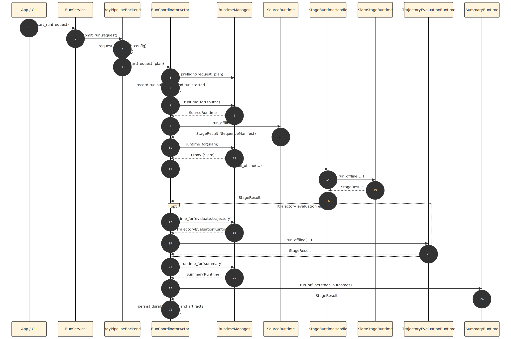
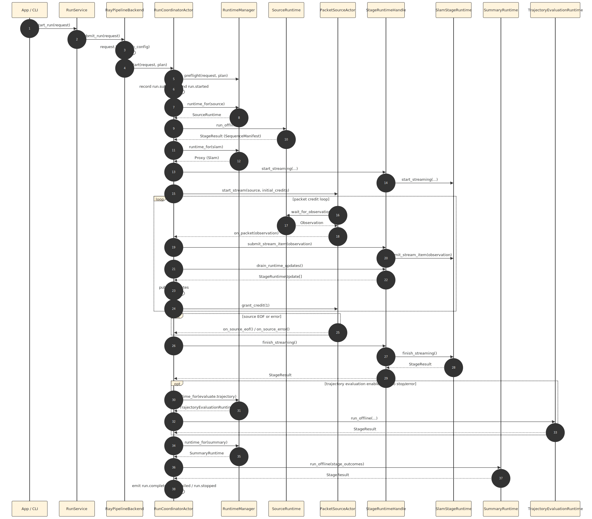

# PRML VSLAM Pipeline Guide

This package owns the typed planning, event, artifact, provenance, and
execution-coordination surfaces for the repository pipeline. Shared source
protocols live in [`prml_vslam.protocols.source`](../protocols/source.py) and
[`prml_vslam.protocols.runtime`](../protocols/runtime.py), while shared SLAM
backend and session protocols live in
[`prml_vslam.methods.protocols`](../methods/protocols.py). Package-local
constraints and invariants live in [REQUIREMENTS.md](./REQUIREMENTS.md).

The current executable stage slice is `ingest -> slam ->
[trajectory.evaluate] -> summary`. The additional stage keys
[`reference.reconstruct`](./contracts/stages.py#L16),
[`cloud.evaluate`](./contracts/stages.py#L17), and
[`efficiency.evaluate`](./contracts/stages.py#L18) already exist in the
registry, but they still compile as unavailable until explicit runtime support
is added. The package is therefore not a generic workflow engine. Its center of
gravity is the event-first execution path built from
[`RunRequest.build()`](./contracts/request.py#L205),
[`StageRegistry.default()`](./stage_registry.py#L102),
[`RuntimeStageProgram.default()`](./ray_runtime/stage_program.py#L98), the
authoritative [`RunCoordinatorActor`](./ray_runtime/coordinator.py#L70), the
projected [`RunSnapshot`](./contracts/runtime.py#L32), and
[`project_summary()`](./finalization.py#L18).

## Package Map

The tree below mirrors the current package layout. Documentation files and
namespace markers stay as file leaves because they have no executable symbols;
every executable module ends in the classes or functions that actually carry
the module responsibility. File markers mean:

- `[*]`: common stage-extension touchpoint
- `[~]`: conditional stage-extension touchpoint that often changes when a stage
  widens contracts, changes telemetry, or needs special runtime handling

```text
src/prml_vslam/pipeline
├── README.md [~]                                  # architectural guide and extension notes
├── REQUIREMENTS.md [~]                            # package constraints and invariants
├── __init__.py [~]                                # curated public pipeline surface
│   ├── PipelineMode                               # public mode enum
│   ├── RunPlan                                    # public plan contract
│   ├── RunRequest                                 # public entry contract
│   ├── SequenceManifest                           # normalized ingest boundary
│   ├── RunSummary                                 # final run summary
│   └── SlamArtifacts                              # normalized SLAM output bundle
├── backend.py                                     # backend abstraction consumed by RunService
│   ├── PipelineRuntimeSource                      # injected runtime source alias
│   └── PipelineBackend                            # execution substrate protocol
├── backend_ray.py [~]                             # Ray-backed backend and Ray head lifecycle
│   └── RayPipelineBackend                         # concrete backend implementation
├── contracts                                      # pipeline-owned contract slices
│   ├── __init__.py                                # contract namespace marker
│   ├── artifacts.py [~]                           # durable artifact references and SLAM bundle
│   │   ├── ArtifactRef                            # one materialized artifact reference
│   │   └── SlamArtifacts                          # normalized SLAM outputs
│   ├── events.py [~]                              # append-only runtime truth
│   │   ├── EventTier                              # durable vs telemetry split
│   │   ├── StageProgress                          # human-readable stage progress
│   │   ├── FramePacketSummary                     # transport-safe packet metadata
│   │   ├── StageOutcome                           # terminal stage result
│   │   ├── PacketObserved                         # streaming packet telemetry
│   │   ├── BackendNoticeReceived                  # translated backend notice
│   │   ├── StageCompleted                         # terminal stage completion event
│   │   └── RunEvent                               # discriminated union of all events
│   ├── handles.py [~]                             # opaque live payload handles
│   │   ├── ArrayHandle                            # object-store array handle
│   │   ├── PreviewHandle                          # preview image handle
│   │   └── BlobHandle                             # generic binary handle
│   ├── plan.py [~]                                # deterministic plan contracts
│   │   ├── RunPlanStage                           # one planned stage row
│   │   └── RunPlan                                # full planned run
│   ├── provenance.py [~]                          # persisted stage and run provenance
│   │   ├── StageStatus                            # shared status vocabulary
│   │   ├── StageManifest                          # persisted stage record
│   │   └── RunSummary                             # persisted run-level outcome
│   ├── request.py [*]                             # request, source, backend, and placement contracts
│   │   ├── PipelineMode                           # offline vs streaming mode
│   │   ├── VideoSourceSpec                        # offline video source contract
│   │   ├── DatasetSourceSpec                      # dataset source contract
│   │   ├── Record3DLiveSourceSpec                 # live Record3D source contract
│   │   ├── StagePlacement                         # per-stage resource preferences
│   │   ├── PlacementPolicy                        # repo-owned placement policy
│   │   ├── RunRuntimeConfig                       # repo-owned runtime policy
│   │   ├── SlamStageConfig                        # SLAM-stage request contract
│   │   ├── RunRequest                             # top-level run request
│   │   ├── build_backend_spec                     # method -> backend spec helper
│   │   └── build_run_request                      # request construction helper
│   ├── runtime.py [~]                             # projected runtime state contracts
│   │   ├── RunState                               # app-facing lifecycle states
│   │   ├── RunSnapshot                            # projected runtime snapshot
│   │   └── StreamingRunSnapshot                   # streaming telemetry snapshot
│   ├── sequence.py [~]                            # normalized source boundary
│   │   └── SequenceManifest                       # canonical ingest manifest
│   ├── stages.py [*]                              # stage vocabulary and availability
│   │   ├── StageKey                               # stage identifiers
│   │   ├── StageAvailability                      # availability decision
│   │   └── StageDefinition                        # registry entry contract
│   └── transport.py                               # strict transport-safe model base
│       └── TransportModel                         # portable DTO base class
├── demo.py [~]                                    # shared request and runtime-source helpers
│   ├── build_advio_demo_request                   # canonical ADVIO request template
│   ├── load_run_request_toml                      # TOML loader
│   ├── build_runtime_source_from_request          # runtime source resolver
│   ├── save_run_request_toml                      # TOML writer
│   └── persist_advio_demo_request                 # persisted demo config helper
├── finalization.py [~]                            # pure summary projection and hashing
│   ├── project_summary                            # derive run summary and stage manifests
│   ├── stable_hash                                # stable payload fingerprint
│   └── write_json                                 # deterministic JSON writer
├── ingest.py [~]                                  # canonical offline ingest materialization
│   └── materialize_offline_manifest               # normalize prepared source boundary
├── placement.py [~]                               # request policy -> Ray actor options
│   └── actor_options_for_stage                    # stage placement translator
├── ray_runtime                                    # Ray execution package
│   ├── __init__.py                                # runtime namespace marker
│   ├── common.py [~]                              # shared runtime DTOs and helpers
│   │   ├── IngestStageResult                      # ingest result wrapper
│   │   ├── SlamStageResult                        # SLAM result wrapper
│   │   ├── TrajectoryEvaluationStageResult        # trajectory result wrapper
│   │   ├── SummaryStageResult                     # summary result wrapper
│   │   ├── put_array_handle                       # object-store array handle builder
│   │   ├── put_preview_handle                     # preview handle builder
│   │   ├── artifact_ref                           # artifact reference helper
│   │   └── backend_config_payload                 # request -> backend config bridge
│   ├── coordinator.py [~]                         # authoritative per-run state owner
│   │   └── RunCoordinatorActor                    # event recorder and hot-path coordinator
│   ├── stage_actors.py [*]                        # stateful runtime actors
│   │   ├── OfflineSlamStageActor                  # offline SLAM executor
│   │   ├── PacketSourceActor                      # credit-based packet reader
│   │   └── StreamingSlamStageActor                # ordered streaming SLAM executor
│   ├── stage_execution.py [*]                     # bounded stage helper implementations
│   │   ├── StageExecutionContext                  # immutable run-scoped execution context
│   │   ├── run_ingest_stage                       # ingest helper
│   │   ├── run_offline_slam_stage                 # offline SLAM helper
│   │   ├── run_trajectory_evaluation_stage        # trajectory evaluation helper
│   │   └── run_summary_stage                      # summary projection helper
│   └── stage_program.py [*]                       # phase-aware linear stage program
│       ├── RuntimeExecutionState                  # mutable execution state between stages
│       ├── StageCompletionPayload                 # stage completion payload
│       ├── RuntimeStageDriver                     # coordinator driver protocol
│       ├── StageRuntimeSpec                       # runtime binding for one stage
│       └── RuntimeStageProgram                    # offline / prepare / finalize executor
├── run_service.py                                 # app- and CLI-facing facade
│   └── RunService                                 # thin backend adapter
├── sinks                                          # observer sinks
│   ├── __init__.py                                # sink namespace exports
│   ├── jsonl.py                                   # durable event persistence
│   │   └── JsonlEventSink                         # durable JSONL sink
│   ├── rerun.py                                   # Rerun sink and sidecar actor
│   │   ├── RerunEventSink                         # local Rerun observer
│   │   └── RerunSinkActor                         # Ray-owned sink sidecar
│   └── rerun_policy.py [~]                        # event -> viewer logging policy
│       └── RerunLoggingPolicy                     # Rerun entity-layout policy
├── snapshot_projector.py [~]                      # event -> snapshot projection
│   └── SnapshotProjector                          # deterministic snapshot projector
├── source_resolver.py [~]                         # request spec -> offline source adapter
│   ├── VideoOfflineSequenceSource                 # video-backed offline source
│   └── OfflineSourceResolver                      # source-spec resolver
├── stage_registry.py [*]                          # linear stage vocabulary and plan compiler
│   └── StageRegistry                              # registry-backed planner
└── workspace.py [~]                               # prepared-input workspace manifests
    ├── FrameSample                                # one materialized RGB sample
    └── CaptureManifest                            # persisted capture metadata
```

The rest of this guide links the important symbols back to source, but the tree
above is the quickest answer to “where does this responsibility actually live?”

## Current Implementation

The app and CLI both enter the pipeline through
[`RunService`](./run_service.py#L16), which speaks only to the backend protocol
[`PipelineBackend`](./backend.py#L18). The active backend is
[`RayPipelineBackend`](./backend_ray.py#L55), which builds a deterministic
[`RunPlan`](./contracts/plan.py#L31) from the request, starts or connects to a
local Ray head, and boots exactly one
[`RunCoordinatorActor`](./ray_runtime/coordinator.py#L70) per run. That
coordinator owns event recording, snapshot projection, bounded handle
retention, sink fan-out, and the streaming credit loop. The actual stage bodies
remain small and explicit: batch-style work lives in
[`stage_execution.py`](./ray_runtime/stage_execution.py#L34), long-lived or
ordered runtime work lives in
[`stage_actors.py`](./ray_runtime/stage_actors.py#L40), and the orchestration
logic that decides which stage runs in which phase lives in
[`RuntimeStageProgram`](./ray_runtime/stage_program.py#L94).

That split is deliberate. Planning is registry-backed and deterministic;
execution is event-first and coordinator-owned; durable outputs are always
artifacts, manifests, and summaries instead of opaque runtime state. The app is
allowed to configure, launch, tail, and inspect runs, but the meaning of a run
stays in `prml_vslam.pipeline`, not in UI code. The quickest path through the
current implementation is to read
[`RunRequest`](./contracts/request.py#L175),
[`StageRegistry.compile()`](./stage_registry.py#L57),
[`RuntimeStageProgram.default()`](./ray_runtime/stage_program.py#L98),
[`RunCoordinatorActor`](./ray_runtime/coordinator.py#L70), and
[`SnapshotProjector.apply()`](./snapshot_projector.py#L46) in that order.

The runtime layout below shows the current ownership split. The planner and the
coordinator stay in the middle; source adapters, backend wrappers, and sinks
stay at the edges.



Source diagram:
[`docs/figures/mermaid/pipeline/pipeline_runtime_overview.mmd`](../../../docs/figures/mermaid/pipeline/pipeline_runtime_overview.mmd)

## Design Rationale

The architectural center of this package is not “streaming” and it is not a
generic DAG runtime. The center is a linear, artifact-first benchmark pipeline
that accepts one typed [`RunRequest`](./contracts/request.py#L175), compiles one
typed [`RunPlan`](./contracts/plan.py#L31), records one append-only
[`RunEvent`](./contracts/events.py#L159) stream, projects one live
[`RunSnapshot`](./contracts/runtime.py#L32), and persists one final
[`RunSummary`](./contracts/provenance.py#L59). Sources, transports, SLAM
backends, and viewers are allowed to vary at the edges; the pipeline core stays
small and explicit.

The most important normalization boundary is
[`SequenceManifest`](./contracts/sequence.py#L10). A raw video, a dataset
sequence, or a live Record3D session may need different source-specific setup,
but downstream artifact stages should consume the same normalized manifest and
the same durable artifact references. The same philosophy applies to runtime
truth. The coordinator never treats the snapshot as the source of truth; it
treats [`RunEvent`](./contracts/events.py#L159) as truth and uses
[`SnapshotProjector`](./snapshot_projector.py#L37) only to derive a live,
metadata-rich view for the app and CLI.

The package also follows the repository-wide ownership split documented in
[`docs/architecture/interfaces-and-contracts.md`](../../../docs/architecture/interfaces-and-contracts.md).
Shared data models such as [`FramePacket`](../interfaces/runtime.py#L68),
[`CameraIntrinsics`](../interfaces/camera.py#L15), and
[`FrameTransform`](../interfaces/transforms.py#L21) live in
`prml_vslam.interfaces`. Shared behavior seams such as
[`OfflineSequenceSource`](../protocols/source.py#L17),
[`StreamingSequenceSource`](../protocols/source.py#L35),
[`OfflineSlamBackend`](../methods/protocols.py#L31), and
[`StreamingSlamBackend`](../methods/protocols.py#L49) live in `protocols` and
`methods`. The pipeline package owns only its planning, runtime, artifact, and
provenance contracts.

## Core Contracts

The entry contract is [`RunRequest`](./contracts/request.py#L175). It owns the
selected [`PipelineMode`](./contracts/request.py#L31), the source spec, the
chosen backend spec, the [`PlacementPolicy`](./contracts/request.py#L145), and
the repo-owned [`RunRuntimeConfig`](./contracts/request.py#L158). Its
[`build()`](./contracts/request.py#L205) method validates request-level
invariants, describes the backend, and hands the request into
[`StageRegistry.compile()`](./stage_registry.py#L57), which returns a
deterministic [`RunPlan`](./contracts/plan.py#L31) made of ordered
[`RunPlanStage`](./contracts/plan.py#L15) values. The stage vocabulary itself
is fixed by [`StageKey`](./contracts/stages.py#L10), while availability and
placeholder status are expressed through
[`StageAvailability`](./contracts/stages.py#L35).

At runtime, the append-only truth is the discriminated union
[`RunEvent`](./contracts/events.py#L159). Durable events such as
[`StageCompleted`](./contracts/events.py#L118) and
[`RunCompleted`](./contracts/events.py#L148) share the same contract space as
telemetry events such as [`PacketObserved`](./contracts/events.py#L102) and
[`BackendNoticeReceived`](./contracts/events.py#L111), but their durability is
made explicit through [`EventTier`](./contracts/events.py#L22). Terminal stage
results are represented by [`StageOutcome`](./contracts/events.py#L46), while
the app-facing lifecycle view is projected into
[`RunSnapshot`](./contracts/runtime.py#L32) or, for live runs,
[`StreamingRunSnapshot`](./contracts/runtime.py#L57).

The durable data boundary is intentionally narrow. Ingest yields the normalized
[`SequenceManifest`](./contracts/sequence.py#L10); backend execution yields the
typed [`SlamArtifacts`](./contracts/artifacts.py#L25) bundle; persisted outputs
are referenced through [`ArtifactRef`](./contracts/artifacts.py#L12); and final
provenance is written as [`StageManifest`](./contracts/provenance.py#L27) plus
[`RunSummary`](./contracts/provenance.py#L59), both of which reuse the shared
[`StageStatus`](./contracts/provenance.py#L15) vocabulary. Large transient
payloads such as RGB frames and previews never cross those boundaries directly.
They use the strict transport layer
[`TransportModel`](./contracts/transport.py#L10) plus opaque
[`ArrayHandle`](./contracts/handles.py#L10) and
[`PreviewHandle`](./contracts/handles.py#L20) references instead.

## Module Responsibilities

The tree above is the quick locator. The paragraphs here explain how those
modules fit together at runtime.

The small public surface of the package lives in [`__init__.py`](./__init__.py),
which re-exports the curated entry contracts rather than exposing the full
internal namespace. The app- and CLI-facing adapter is
[`RunService`](./run_service.py#L16); the backend abstraction it consumes is
[`PipelineBackend`](./backend.py#L18); and the current execution substrate is
[`RayPipelineBackend`](./backend_ray.py#L55), which owns Ray lifecycle,
namespace handling, process-wide runtime environment setup, and per-run
coordinator bootstrap.

The `contracts/` namespace exists to keep package-owned contract slices small
and explicit. [`contracts/__init__.py`](./contracts/__init__.py) is just the
namespace marker; [`request.py`](./contracts/request.py#L31),
[`plan.py`](./contracts/plan.py#L15), [`stages.py`](./contracts/stages.py#L10),
[`events.py`](./contracts/events.py#L22), [`runtime.py`](./contracts/runtime.py#L21),
[`sequence.py`](./contracts/sequence.py#L10),
[`artifacts.py`](./contracts/artifacts.py#L12),
[`provenance.py`](./contracts/provenance.py#L15),
[`handles.py`](./contracts/handles.py#L10), and
[`transport.py`](./contracts/transport.py#L10) each own one contract slice and
avoid turning the pipeline root into a large compatibility import hub.

Planning and scheduling concerns live outside the runtime actors. The registry
and plan compiler live in [`stage_registry.py`](./stage_registry.py#L27), while
[`placement.py`](./placement.py#L16) translates repo-owned placement policy
into Ray actor options. Input normalization lives alongside that planning
surface. [`source_resolver.py`](./source_resolver.py#L38) resolves offline
source specs into concrete source adapters, [`ingest.py`](./ingest.py#L15)
materializes the canonical offline boundary, and
[`workspace.py`](./workspace.py#L13) owns prepared input and capture manifest
types used while inputs are materialized.

The `ray_runtime/` package owns the actual execution program. Its namespace
marker is [`ray_runtime/__init__.py`](./ray_runtime/__init__.py). Shared runtime
limits, small stage result DTOs, handle builders, backend config translation,
and artifact flatteners live in
[`common.py`](./ray_runtime/common.py#L27). The linear phase-aware execution
program lives in [`stage_program.py`](./ray_runtime/stage_program.py#L94). Pure
or bounded stage helpers such as ingest, trajectory evaluation, and summary
projection live in [`stage_execution.py`](./ray_runtime/stage_execution.py#L34).
Long-lived or ordered actors such as
[`OfflineSlamStageActor`](./ray_runtime/stage_actors.py#L40),
[`PacketSourceActor`](./ray_runtime/stage_actors.py#L84), and
[`StreamingSlamStageActor`](./ray_runtime/stage_actors.py#L175) live in
[`stage_actors.py`](./ray_runtime/stage_actors.py#L40). The authoritative
orchestrator that ties all of that together is
[`RunCoordinatorActor`](./ray_runtime/coordinator.py#L70).

Projection, finalization, and observation stay separate from stage execution.
[`SnapshotProjector`](./snapshot_projector.py#L37) owns deterministic event to
snapshot projection, while [`finalization.py`](./finalization.py#L18) owns pure
summary projection and stable hashing. The observer sinks live in the
[`sinks`](./sinks/__init__.py) package: [`jsonl.py`](./sinks/jsonl.py#L12)
persists durable semantic events, [`rerun.py`](./sinks/rerun.py#L30) owns the
Rerun sink and its sidecar actor, and
[`rerun_policy.py`](./sinks/rerun_policy.py#L20) interprets pipeline events as
viewer logging policy. Finally, [`demo.py`](./demo.py#L61) exists to keep TOML
loading, request templates, and shared runtime-source construction out of the
launch surfaces themselves.

## Lifecycle

Offline runs are entirely plan-driven. The backend first compiles a
[`RunPlan`](./contracts/plan.py#L31), the coordinator emits the initial durable
events, ingest prepares a normalized
[`SequenceManifest`](./contracts/sequence.py#L10), the offline SLAM actor
produces [`SlamArtifacts`](./contracts/artifacts.py#L25), trajectory evaluation
runs only if it was planned, and finalization projects the accumulated
[`StageOutcome`](./contracts/events.py#L46) values into persisted
[`StageManifest`](./contracts/provenance.py#L27) and
[`RunSummary`](./contracts/provenance.py#L59) records.



Source diagram:
[`docs/figures/mermaid/pipeline/pipeline_offline_lifecycle.mmd`](../../../docs/figures/mermaid/pipeline/pipeline_offline_lifecycle.mmd)

Streaming runs share the same request, plan, stage vocabulary, and summary
contracts, but the runtime is deliberately split into three phases. During
streaming prepare, the coordinator executes the non-hot-path stages first,
especially ingest. During the packet hot path, the
[`PacketSourceActor`](./ray_runtime/stage_actors.py#L84) reads packets under a
bounded credit budget, the coordinator records
[`PacketObserved`](./contracts/events.py#L102) telemetry, and the
[`StreamingSlamStageActor`](./ray_runtime/stage_actors.py#L175) translates
backend updates into [`BackendNoticeReceived`](./contracts/events.py#L111)
events. During streaming finalize, the coordinator closes the streaming SLAM
actor, optionally evaluates the resulting trajectory, and then projects the
same durable summary artifacts that the offline path writes.



Source diagram:
[`docs/figures/mermaid/pipeline/pipeline_streaming_lifecycle.mmd`](../../../docs/figures/mermaid/pipeline/pipeline_streaming_lifecycle.mmd)

That prepare or hot path or finalize split is implemented directly in
[`execute_offline()`](./ray_runtime/stage_program.py#L154),
[`execute_streaming_prepare()`](./ray_runtime/stage_program.py#L178), and
[`execute_streaming_finalize()`](./ray_runtime/stage_program.py#L201). It is
the reason the pipeline can share one stage vocabulary without pretending that
offline and streaming execution are mechanically identical.

## IPC And Data Movement

The pipeline uses two IPC styles on purpose. Durable semantic truth is the
event stream. Runtime helpers and actors emit [`RunEvent`](./contracts/events.py#L159)
values, the coordinator records them through
[`_record_event()`](./ray_runtime/coordinator.py#L599), durable events are
appended to disk through [`JsonlEventSink.observe()`](./sinks/jsonl.py#L23),
and live UI state is projected through
[`SnapshotProjector.apply()`](./snapshot_projector.py#L46). The snapshot is
therefore not a second mutable source of truth; it is a projection over the
append-only event log plus the current in-memory terminal payloads.

The second IPC style is the transport-safe live path. Actor boundaries and
backend-to-app boundaries use strict, portable DTOs derived from
[`TransportModel`](./contracts/transport.py#L10), such as
[`FramePacketSummary`](./contracts/events.py#L38),
[`StageOutcome`](./contracts/events.py#L46), and
[`RunSnapshot`](./contracts/runtime.py#L32). Bulk arrays deliberately stay off
that public contract path. The runtime stores packet RGB, previews, depth maps,
and pointmaps in the Ray object store through
[`put_array_handle()`](./ray_runtime/common.py#L61) and
[`put_preview_handle()`](./ray_runtime/common.py#L74), then exposes only
[`ArrayHandle`](./contracts/handles.py#L10) or
[`PreviewHandle`](./contracts/handles.py#L20) values. The coordinator keeps a
bounded handle table via [`HANDLE_LIMIT`](./ray_runtime/common.py#L28), and the
app resolves a handle only on demand through
[`RunService.read_array()`](./run_service.py#L49).

The observer path follows the same rule. The Rerun sink never becomes a second
execution backend. Instead, the coordinator forwards the semantic event plus a
best-effort set of transient payload bindings to
[`RerunSinkActor.observe_event()`](./sinks/rerun.py#L90). Once a stage finishes,
the boundary switches back to durable artifacts. Ingest writes manifest files,
SLAM returns [`SlamArtifacts`](./contracts/artifacts.py#L25), evaluation writes
metric artifacts, and finalization writes `run_summary.json` plus
`stage_manifests.json`. That is why [`ArtifactRef`](./contracts/artifacts.py#L12)
and [`StageManifest`](./contracts/provenance.py#L27) matter more than rich
in-memory objects once execution crosses a stage boundary.

## Offline And Streaming

Offline and streaming runs are much more similar at the contract layer than at
the execution layer. Both modes start from the same
[`RunRequest`](./contracts/request.py#L175), compile the same
[`RunPlan`](./contracts/plan.py#L31) through the same
[`StageRegistry`](./stage_registry.py#L27), use the same
[`StageKey`](./contracts/stages.py#L10) vocabulary, record the same
[`RunEvent`](./contracts/events.py#L159) types, and terminate in the same
[`StageManifest`](./contracts/provenance.py#L27) and
[`RunSummary`](./contracts/provenance.py#L59) artifacts. The coordinator is
authoritative in both modes, and the summary stage is projection-only in both
modes.

What changes is the execution mechanics. Offline mode runs each stage body
directly through [`execute_offline()`](./ray_runtime/stage_program.py#L154),
usually after resolving the source through
[`OfflineSourceResolver`](./source_resolver.py#L38). Streaming mode requires an
explicit runtime source, runs ingest during prepare, then uses a credit-based
packet loop through [`PacketSourceActor`](./ray_runtime/stage_actors.py#L84)
and [`StreamingSlamStageActor`](./ray_runtime/stage_actors.py#L175), and
projects live packet, keyframe, map, and trajectory telemetry into
[`StreamingRunSnapshot`](./contracts/runtime.py#L57). Trajectory evaluation is
also stricter in streaming mode: it only runs during finalize when there was no
stop request and no streaming error.

## Extending The Pipeline

### Adding A New Stage

Adding a new stage always means touching both the planner and the runtime. The
first step is to define or reuse a key in
[`StageKey`](./contracts/stages.py#L10). The next step is to register that key
in [`StageRegistry.default()`](./stage_registry.py#L102), where you decide
whether the stage is always present or request-gated, how availability is
computed for the chosen backend, and which canonical output paths it is
expected to own. If the stage needs new user-facing knobs, add them to the
appropriate request-side config in [`contracts/request.py`](./contracts/request.py#L31);
if the stage is really benchmark policy, keep that configuration in the owning
benchmark package instead of widening the pipeline request surface casually.

Once planning is in place, wire the stage into
[`RuntimeStageProgram.default()`](./ray_runtime/stage_program.py#L98). That is
where you decide whether the stage belongs in offline execution, streaming
prepare, streaming finalize, or some combination. If the work is bounded and
stateless, it usually belongs in a helper inside
[`stage_execution.py`](./ray_runtime/stage_execution.py#L34). If it needs
long-lived state, an ordered hot path, or a specialized execution boundary, it
should become a dedicated actor in
[`stage_actors.py`](./ray_runtime/stage_actors.py#L40) instead. Either way, the
stage should finish by returning a [`StageOutcome`](./contracts/events.py#L46)
with named [`ArtifactRef`](./contracts/artifacts.py#L12) outputs so that
[`project_summary()`](./finalization.py#L18) can derive
[`StageManifest`](./contracts/provenance.py#L27) and
[`RunSummary`](./contracts/provenance.py#L59) without inventing stage-specific
summary logic.

Making the existing placeholder `cloud.evaluate` stage real would look like
this at the registry layer. The important point is that planning becomes
truthful before the runtime changes: the stage only compiles as available when
the selected backend can emit dense points and the request actually asks for
them.

Closest current source equivalent:
[`StageRegistry.default()`](./stage_registry.py#L116)

```python
# stage_registry.py
registry.register(
    StageDefinition(key=StageKey.CLOUD_EVALUATION),
    lambda request, backend: StageAvailability(
        available=backend.capabilities.dense_points and request.slam.outputs.emit_dense_points,
        reason=(
            None
            if backend.capabilities.dense_points and request.slam.outputs.emit_dense_points
            else "Cloud evaluation requires dense points from the selected backend."
        ),
    ),
    enabled_fn=lambda request: request.benchmark.cloud.enabled,
    outputs_fn=lambda _request, run_paths: [run_paths.cloud_metrics_path],
)
```

The matching runtime change belongs in
[`RuntimeStageProgram.default()`](./ray_runtime/stage_program.py#L98), where the
stage is attached to the offline path and to streaming finalize. The failure
fingerprint should hash the benchmark-side config and the concrete dense-point
input that the stage consumes.

Closest current source equivalent:
[`RuntimeStageProgram.default()`](./ray_runtime/stage_program.py#L125)

```python
# ray_runtime/stage_program.py
StageRuntimeSpec(
    key=StageKey.CLOUD_EVALUATION,
    run_offline=_run_cloud_evaluation,
    run_streaming_finalize=_run_cloud_evaluation,
    build_failure_outcome=_failure_builder(
        stage_key=StageKey.CLOUD_EVALUATION,
        config_payload=lambda context, state: context.request.benchmark.cloud,
        input_payload=lambda _context, state: {
            "reference_clouds": (
                None if state.benchmark_inputs is None else state.benchmark_inputs.reference_clouds
            ),
            "dense_points_ply": None if state.slam is None else state.slam.dense_points_ply,
        },
    ),
)
```

The stage body itself can stay small and follow the same shape as
[`run_trajectory_evaluation_stage()`](./ray_runtime/stage_execution.py#L116):
validate that the upstream artifact is present, call the owning benchmark or
evaluation service, and return a `StageOutcome` with named artifact refs.

Closest current source equivalent:
[`run_trajectory_evaluation_stage()`](./ray_runtime/stage_execution.py#L116)

```python
# ray_runtime/stage_execution.py
def run_cloud_evaluation_stage(
    *,
    context: StageExecutionContext,
    sequence_manifest: SequenceManifest,
    benchmark_inputs: PreparedBenchmarkInputs | None,
    slam: SlamArtifacts,
) -> StageOutcome:
    if slam.dense_points_ply is None:
        raise RuntimeError("Cloud evaluation requires `slam.dense_points_ply`.")

    metrics_artifact = CloudEvaluationService(...).compute_pipeline_evaluation(
        request=context.request,
        plan=context.plan,
        sequence_manifest=sequence_manifest,
        benchmark_inputs=benchmark_inputs,
        slam=slam,
    )
    return StageOutcome(
        stage_key=StageKey.CLOUD_EVALUATION,
        status=StageStatus.COMPLETED,
        config_hash=stable_hash(context.request.benchmark.cloud),
        input_fingerprint=stable_hash(
            {"reference_clouds": benchmark_inputs, "dense_points_ply": slam.dense_points_ply}
        ),
        artifacts={"cloud_metrics": artifact_ref(metrics_artifact.path, kind="json")},
    )
```

### Changing Existing Stage Interfaces

When you change request-time knobs, update the full planning path together:
[`contracts/request.py`](./contracts/request.py#L31) for the contract,
[`stage_registry.py`](./stage_registry.py#L27) for availability and planned
outputs, and [`demo.py`](./demo.py#L61) if persisted TOML helpers or demo
defaults must change as well. If you change the materialized outputs of a
stage, update the output expectations in the registry, the artifact bundle or
artifact map emitted by the stage implementation, and the finalization path in
[`finalization.py`](./finalization.py#L18) together.

When you change runtime completion payloads, treat
[`StageOutcome`](./contracts/events.py#L46),
[`StageCompleted`](./contracts/events.py#L118),
[`RunSnapshot`](./contracts/runtime.py#L32), and
[`SnapshotProjector`](./snapshot_projector.py#L37) as one unit. If only one of
those layers changes, the runtime will drift out of sync. The same rule applies
to streaming telemetry. Changes in backend updates or translated notices should
be reflected together in [`SlamUpdate`](../methods/updates.py#L13),
[`translate_slam_update()`](../methods/events.py#L102),
[`SnapshotProjector`](./snapshot_projector.py#L37), and
[`RerunLoggingPolicy`](./sinks/rerun_policy.py#L20).

As a concrete example, suppose the SLAM stage starts producing an additional
durable report artifact. The contract change starts in
[`SlamArtifacts`](./contracts/artifacts.py#L25), because that is the typed stage
boundary consumed by the rest of the pipeline.

Closest current source equivalent:
[`SlamArtifacts`](./contracts/artifacts.py#L25)

```python
# contracts/artifacts.py
class SlamArtifacts(BaseData):
    trajectory_tum: ArtifactRef
    sparse_points_ply: ArtifactRef | None = None
    dense_points_ply: ArtifactRef | None = None
    native_report_html: ArtifactRef | None = None
    extras: dict[str, ArtifactRef] = Field(default_factory=dict)
```

Once the contract widens, the pipeline-side artifact flattening logic has to
learn the new field so that [`StageOutcome`](./contracts/events.py#L46) and the
final persisted manifests stay truthful.

Closest current source equivalent:
[`slam_artifacts_map()`](./ray_runtime/common.py#L109)

```python
# ray_runtime/common.py
def slam_artifacts_map(slam: SlamArtifacts) -> dict[str, ArtifactRef]:
    artifacts = {"trajectory_tum": slam.trajectory_tum}
    if slam.sparse_points_ply is not None:
        artifacts["sparse_points_ply"] = slam.sparse_points_ply
    if slam.dense_points_ply is not None:
        artifacts["dense_points_ply"] = slam.dense_points_ply
    if slam.native_report_html is not None:
        artifacts["native_report_html"] = slam.native_report_html
    for key, artifact in slam.extras.items():
        artifacts[f"extra:{key}"] = artifact
    return artifacts
```

In this particular interface change, the rest of the runtime does not need a
new dedicated snapshot field because [`StageCompleted`](./contracts/events.py#L118)
already carries `slam: SlamArtifacts` and
[`RunSnapshot`](./contracts/runtime.py#L32) already stores that typed bundle.
If the interface change were request-time instead of output-time, the change
would start in [`contracts/request.py`](./contracts/request.py#L31) and then
flow through [`stage_registry.py`](./stage_registry.py#L27) before it touched
the runtime.

### Containerized Or Different Python Environment Stages

Ray can run different actors under different runtime environments, but the
current backend still applies one process-wide runtime environment when it
initializes Ray. Today [`RayPipelineBackend._build_runtime_env()`](./backend_ray.py#L200)
sets that backend-wide environment, and local auto-started heads use
`runtime_env["py_executable"] = sys.executable`. The repo already anticipates
dedicated backend environments through
[`PathConfig.resolve_method_env_dir()`](../utils/path_config.py#L216), but
per-stage or per-actor environment isolation is not yet wired end to end.

The current extension seam is still clear. An env-isolated stage should start
by creating an actor boundary rather than trying to switch interpreters inside a
direct helper. Resolve the stage-specific environment from
[`PathConfig`](../utils/path_config.py), pass a stage-specific `runtime_env`
with an appropriate `py_executable` when constructing the actor, and keep the
cross-environment boundary transport-safe or artifact-based. In practice that
means sending [`TransportModel`](./contracts/transport.py#L10) payloads,
[`ArtifactRef`](./contracts/artifacts.py#L12) values, or opaque handles across
the boundary, never repo-local backend instances or session objects. Build the
backend inside the target actor after the environment is active, and prefer
normal stage outputs over cross-env in-memory object graphs once the stage is
complete.

The current actor construction sites are the natural places to extend. Offline
SLAM actor creation lives in
[`run_offline_slam_stage()`](./ray_runtime/stage_execution.py#L87); streaming
SLAM actor creation lives in
[`RunCoordinatorActor.start_streaming_slam_stage()`](./ray_runtime/coordinator.py#L435);
and packet source actor creation lives in
[`RunCoordinatorActor._run_streaming()`](./ray_runtime/coordinator.py#L346).
If more than one stage needs custom environment selection, factor the runtime
environment policy into a shared helper instead of copying ad hoc dictionaries
into each actor `.options(...)` call.

## Contributor Starting Point

If you need to orient yourself quickly, start with
[`RunRequest`](./contracts/request.py#L175) and
[`RunPlan`](./contracts/plan.py#L31), then read
[`StageRegistry.default()`](./stage_registry.py#L102) to see which stages
exist, [`RuntimeStageProgram.default()`](./ray_runtime/stage_program.py#L98) to
see how those stages run in each mode, and
[`RunCoordinatorActor`](./ray_runtime/coordinator.py#L70) to understand how the
event stream, sinks, and streaming hot path fit together. That path answers the
four contributor questions that come up most often in this package: where a
stage is registered, where it is implemented, how events become snapshots, and
how large arrays move through streaming mode without polluting durable
contracts.
