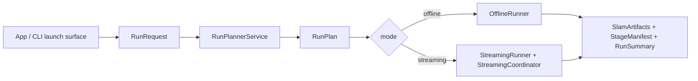
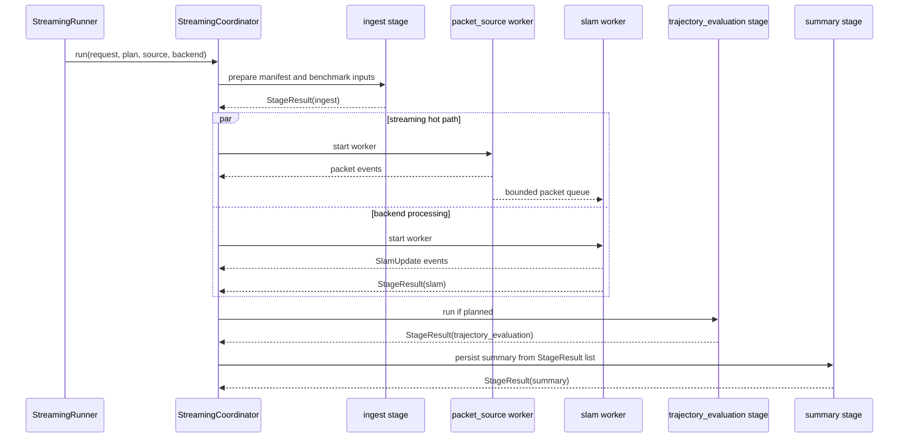

# PRML VSLAM Pipeline Guide

This package owns the typed run request, planning, artifact, provenance, and
execution coordination surfaces for the repository pipeline. Shared source
protocols live in [`prml_vslam.protocols.source`](../protocols/source.py) and
[`prml_vslam.protocols.runtime`](../protocols/runtime.py). SLAM backend and
session protocols live in [`prml_vslam.methods.protocols`](../methods/protocols.py).

## Current Implementation

The current pipeline is an artifact-first benchmark runtime with two execution
modes:

- `OfflineRunner` runs a bounded sequence through a materialized
  `SequenceManifest`.
- `StreamingRunner` runs a streaming coordinator that can consume live or
  replayed `FramePacket` values and coordinate source, SLAM, evaluation, and
  summary work.

The executable stage slice is:

```text
ingest -> slam -> [trajectory_evaluation] -> summary
```

Reference reconstruction, cloud evaluation, and efficiency evaluation remain
plannable target-state stages, but the current runners reject them until explicit
runtime support exists.

The main package surfaces are:

- `contracts/request.py`
  - `PipelineMode`, source specs, `SlamStageConfig`, `RunRequest`, and
    execution placement config
- `contracts/plan.py`
  - `RunPlanStageId`, `RunPlanStage`, and `RunPlan`
- `contracts/sequence.py`
  - `SequenceManifest`
- `contracts/artifacts.py`
  - `ArtifactRef` and `SlamArtifacts`
- `contracts/provenance.py`
  - `StageExecutionStatus`, `StageManifest`, and `RunSummary`
- `contracts/execution.py`
  - `StageExecutionKey`, `StageResult`, and streaming worker events
- `run_service.py`
  - the façade used by CLI and app surfaces
- `offline.py` and `streaming.py`
  - the two runner entrypoints
- `streaming_coordinator.py`
  - streaming worker orchestration, including optional process-backed execution
- `finalization.py`
  - manifest and summary persistence

## Design Rationale

The center of this package is not a generic workflow engine. It is a typed,
linear, artifact-first benchmark pipeline. Sources, transports, and methods are
allowed to vary at the edges; the center stays deliberately boring:
`RunRequest`, `RunPlan`, `SequenceManifest`, `SlamArtifacts`, `StageManifest`,
and `RunSummary`.

`SequenceManifest` is the key normalization boundary. A raw video, ADVIO replay,
TUM RGB-D replay, or Record3D stream may need different source-specific setup,
but downstream benchmark stages should consume normalized manifests and durable
artifacts instead of source-specific state.

The Streamlit app is only a launch, monitoring, and inspection surface. App
controller helpers can build requests and sources for the UI, but pipeline
semantics live here.



## Execution Modes

### Offline

Use `PipelineMode.OFFLINE` when the input is already bounded and replayable:

- raw video files
- dataset sequences
- previously materialized captures

Offline execution resolves or materializes a `SequenceManifest`, runs one
offline-capable SLAM backend over the manifest, optionally evaluates the
trajectory, and persists stage manifests plus a run summary.

### Streaming

Use `PipelineMode.STREAMING` when the source is incremental:

- live Record3D capture
- live-like dataset replay
- any `StreamingSequenceSource` that emits `FramePacket` values

Streaming mode still uses the same stage vocabulary, but its hot path is
packet-driven. The coordinator prepares ingest outputs first, then runs packet
source and SLAM workers concurrently, then runs ordered artifact stages.



## Process-Backed Streaming

Streaming execution defaults to `local` for every component, preserving the
existing behavior. A request may opt individual streaming components into
subprocess execution:

```toml
[execution.streaming]
ingest = "local"
packet_source = "process"
slam = "process"
trajectory_evaluation = "local"
summary = "local"
```

Supported execution keys are:

- `ingest`
  - prepares `SequenceManifest` and optional prepared benchmark inputs
- `packet_source`
  - owns `FramePacketStream.connect()`, `wait_for_packet()`, and `disconnect()`
- `slam`
  - owns the `SlamSession` lifecycle and emits `SlamUpdate` events
- `trajectory_evaluation`
  - computes persisted trajectory metrics when planned
- `summary`
  - persists `StageManifest` records and the final `RunSummary`

Packet source and SLAM workers run concurrently when streaming starts. They are
connected by a bounded packet queue, while the coordinator remains the only code
that mutates `RunnerRuntime` snapshots. Finite stages can also run in a spawned
process, but they still execute in dependency order.

Process mode requires process-safe inputs. Config-backed sources such as
Record3D and ADVIO can be rehydrated inside worker processes. Non-picklable
runtime objects fail early with a clear process-safety error and should stay in
local mode.

## Core Contracts

`RunRequest` is the persisted entry contract. It owns mode, source, SLAM config,
benchmark policy, visualization policy, and execution placement.

`RunPlan` is the deterministic preview of the stages and canonical output paths.
Planning does not open a source or start a backend.

`SequenceManifest` is the normalized source boundary. It carries stable paths to
source video, RGB frames, timestamps, intrinsics, and side metadata when known.

`SlamArtifacts` is the normalized SLAM-stage output bundle. The trajectory TUM
artifact is mandatory; geometry artifacts are optional.

`StageResult` is the in-memory execution result used by streaming finalization.
`StageManifest` is the persisted provenance record derived from executed stage
results. `RunSummary` is the run-level terminal status map.

## TOML-First Run Planning

Durable pipeline requests should live under `.configs/pipelines/` and hydrate
through `RunRequest.from_toml()` or `pipeline.demo.load_run_request_toml()`.

```toml
experiment_name = "vista-full-tuning"
mode = "streaming"
output_dir = ".artifacts"

[source]
dataset_id = "advio"
sequence_id = "advio-15"

[slam]
method = "vista"

    [slam.outputs]
    emit_dense_points = true
    emit_sparse_points = true

    [slam.backend]
    max_frames = 1000

        [slam.backend.slam]
        flow_thres = 5.0
        max_view_num = 400

[benchmark.trajectory]
enabled = false

[visualization]
connect_live_viewer = true
export_viewer_rrd = true

[execution.streaming]
packet_source = "local"
slam = "local"
```

Use the committed examples as starting points:

```bash
uv run prml-vslam plan-run-config .configs/pipelines/advio-15-offline-vista.toml
uv run prml-vslam run-config .configs/pipelines/advio-15-offline-vista.toml
```

## Adding A Runnable Stage

Add planning support and runtime support together:

1. Add or reuse the typed stage id in `RunPlanStageId`.
2. Add request config only if the stage is user-configurable.
3. Add canonical output paths through `RunArtifactPaths`.
4. Extend `RunPlannerService` so the stage appears deterministically.
5. Add a stage executor or worker path in the true owning package.
6. Return a `StageResult` and persist a `StageManifest`.
7. Add tests for planning, TOML hydration, execution, failure, and summary
   provenance.

Do not add a generic graph runtime. The current pipeline is intentionally
linear, with process placement as an execution detail rather than a new workflow
language.

## Boundary Rules

- `SequenceManifest` remains the normalized offline ingest boundary.
- Benchmark-owned prepared inputs stay separate from the sequence manifest.
- `FramePacket` belongs to the streaming hot path, not downstream artifact
  stages.
- Method wrappers stay thin and normalize native outputs into pipeline-owned
  artifacts.
- Evaluation remains explicit and owned by `prml_vslam.eval`.
- The app does not own pipeline semantics.
- `pipeline/contracts/` is an implementation namespace, not a broad public
  compatibility import hub.
