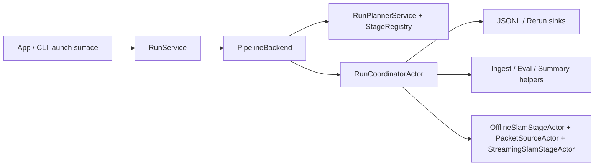
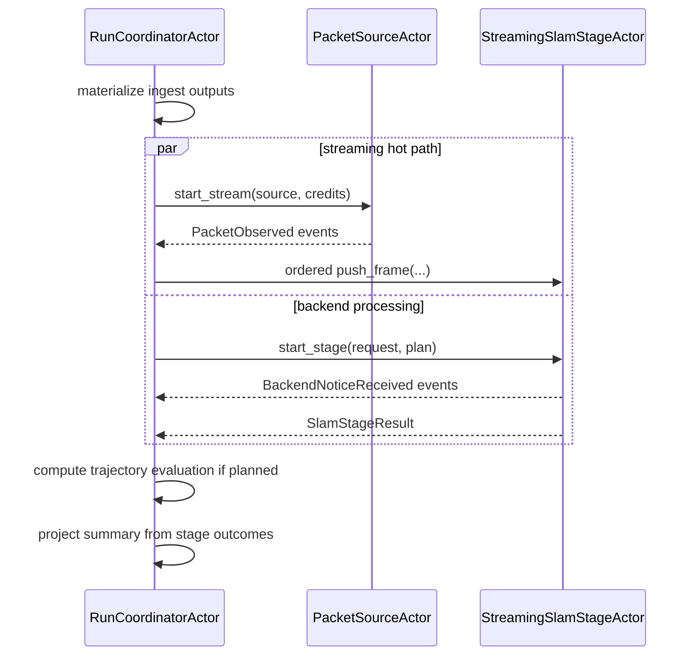

# PRML VSLAM Pipeline Guide

This package owns the typed run request, planning, event, artifact, provenance,
and execution coordination surfaces for the repository pipeline. Shared source
protocols live in [`prml_vslam.protocols.source`](../protocols/source.py) and
[`prml_vslam.protocols.runtime`](../protocols/runtime.py). SLAM backend and
session protocols live in [`prml_vslam.methods.protocols`](../methods/protocols.py).

## Current Implementation

The current pipeline is a linear, artifact-first benchmark runtime built around
three core layers:

- a registry-backed planner that compiles deterministic stage sequences
- an event-first runtime where `RunSnapshot` is projected from `RunEvent`s
- a Ray-backed execution substrate with one authoritative run coordinator per
  run plus only the actors that still need stateful or ordered execution

The executable stage slice is:

```text
ingest -> slam -> [trajectory.evaluate] -> summary
```

Reference reconstruction, cloud evaluation, and efficiency evaluation remain
typed placeholder stages in the vocabulary, but they still compile as
unavailable until explicit runtime support exists.

The main package surfaces are:

- `contracts/request.py`
  - `PipelineMode`, source specs, discriminated `BackendSpec`,
    `SlamStageConfig`, `PlacementPolicy`, and `RunRequest`
- `contracts/plan.py`
  - `RunPlanStage` and `RunPlan`
- `contracts/events.py`
  - `RunEvent`, `StageOutcome`, stage status/progress, and packet summaries
- `contracts/runtime.py`
  - projected `RunSnapshot` and `StreamingRunSnapshot`
- `contracts/handles.py`
  - `ArrayHandle`, `PreviewHandle`, and `BlobHandle`
- `contracts/sequence.py`
  - `SequenceManifest`
- `contracts/artifacts.py`
  - `ArtifactRef` and `SlamArtifacts`
- `contracts/provenance.py`
  - `StageStatus`, `StageManifest`, and `RunSummary`
- `stage_registry.py`
  - stage vocabulary, availability, and plan compilation
- `snapshot_projector.py`
  - deterministic projection from events into snapshots
- `backend.py` / `backend_ray.py`
  - the repo-owned backend protocol and Ray implementation
- `ray_runtime/`
  - coordinator, remaining execution actors, and shared runtime helpers
- `sinks/`
  - JSONL and Rerun observers
- `run_service.py`
  - the thin façade used by CLI and app surfaces
- `finalization.py`
  - pure hashing, evaluation, and summary-projection helpers

## Design Rationale

The center of this package is not a generic workflow engine. It is a typed,
linear, artifact-first benchmark pipeline. Sources, transports, and methods are
allowed to vary at the edges; the center stays deliberately boring:
`RunRequest`, `RunPlan`, `RunEvent`, `RunSnapshot`, `SequenceManifest`,
`SlamArtifacts`, `StageManifest`, and `RunSummary`.

`SequenceManifest` is the key normalization boundary. A raw video, ADVIO replay,
TUM RGB-D replay, or Record3D stream may need different source-specific setup,
but downstream benchmark stages should consume normalized manifests and durable
artifacts instead of source-specific state.

The Streamlit app is only a launch, monitoring, and inspection surface. App
controller helpers can build requests and sources for the UI, but pipeline
semantics live here.



## Execution Modes

### Offline

Use `PipelineMode.OFFLINE` when the input is already bounded and replayable:

- raw video files
- dataset sequences
- previously materialized captures

Offline execution resolves or materializes a `SequenceManifest`, runs one
offline-capable SLAM backend over the manifest, optionally evaluates the
trajectory, and persists stage manifests plus a run summary.

### Streaming

Use `PipelineMode.STREAMING` when the source is incremental:

- live Record3D capture
- live-like dataset replay
- any `StreamingSequenceSource` that emits `FramePacket` values

Streaming mode still uses the same stage vocabulary, but its hot path is
packet-driven. The coordinator prepares ingest outputs first, then drives the
packet source and streaming SLAM actors with bounded in-flight credits before
running ordered artifact stages.



## Ray Execution

The active backend is Ray. The repository owns the contracts and event model;
Ray only executes them.

- `RunCoordinatorActor`
  - authoritative owner of run state, event projection, and handle bookkeeping
- stateful execution actors
  - offline SLAM, packet source, and ordered streaming SLAM execution
- pure stage helpers
  - ingest materialization, trajectory evaluation, and summary projection
- streaming stage actors
  - packet source and ordered streaming SLAM execution

The coordinator is the only submitter to ordered stage actors. Bulk arrays stay
inside Ray-private object refs, while durable/public contracts use repo-owned
opaque handles and typed artifact refs.

## Core Contracts

`RunRequest` is the persisted entry contract. It owns mode, source, backend
selection through discriminated `backend.kind`, benchmark policy,
visualization policy, and repo-owned placement policy.

`RunPlan` is the deterministic preview of the stages, availability, and
canonical output paths. Planning does not open a source or start a backend.

`RunEvent` is the append-only runtime truth. `RunSnapshot` is a projection of
those events, not a second mutable source of truth.

`SequenceManifest` is the normalized source boundary. It carries stable paths to
source video, RGB frames, timestamps, intrinsics, and side metadata when known.

`SlamArtifacts` is the normalized SLAM-stage output bundle. The trajectory TUM
artifact is mandatory; geometry artifacts are optional.
`StageOutcome` is the terminal stage result used for manifest and summary
projection. `StageManifest` is the persisted provenance record derived from
executed stage outcomes. `RunSummary` is the run-level terminal status map.

## TOML-First Run Planning

Durable pipeline requests should live under `.configs/pipelines/` and hydrate
through `RunRequest.from_toml()` or `pipeline.demo.load_run_request_toml()`.

```toml
experiment_name = "vista-full-tuning"
mode = "streaming"
output_dir = ".artifacts"

[source]
dataset_id = "advio"
sequence_id = "advio-15"

[slam]
    [slam.backend]
    kind = "vista"
    max_frames = 1000
    flow_thres = 5.0
    max_view_num = 400

    [slam.outputs]
    emit_dense_points = true
    emit_sparse_points = true

[benchmark.trajectory]
enabled = false

[visualization]
connect_live_viewer = true
export_viewer_rrd = true
```

Use the committed examples as starting points:

```bash
uv run prml-vslam plan-run-config .configs/pipelines/advio-15-offline-vista.toml
uv run prml-vslam run-config .configs/pipelines/advio-15-offline-vista.toml
```

## Adding A Runnable Stage

Add planning support and runtime support together:

1. Add or reuse the typed stage key in the registry.
2. Add request config only if the stage is user-configurable.
3. Add canonical output paths through `RunArtifactPaths`.
4. Extend `StageRegistry` so the stage appears deterministically.
5. Add an executor path in the true owning package, using a stateful actor only when ordering or persistent stage state actually require one.
6. Return a `StageOutcome` and persist a `StageManifest`.
7. Add tests for planning, TOML hydration, execution, failure, event
   projection, and summary
   provenance.

Do not add a generic graph runtime. The current pipeline is intentionally
linear, with backend placement as an execution detail rather than a new workflow
language.

## Boundary Rules

- `SequenceManifest` remains the normalized offline ingest boundary.
- Benchmark-owned prepared inputs stay separate from the sequence manifest.
- `FramePacket` belongs to the streaming hot path, not downstream artifact
  stages.
- Method wrappers stay thin and normalize native outputs into pipeline-owned
  artifacts.
- Evaluation remains explicit and owned by `prml_vslam.eval`.
- The app does not own pipeline semantics.
- `pipeline/contracts/` is an implementation namespace, not a broad public
  compatibility import hub.
