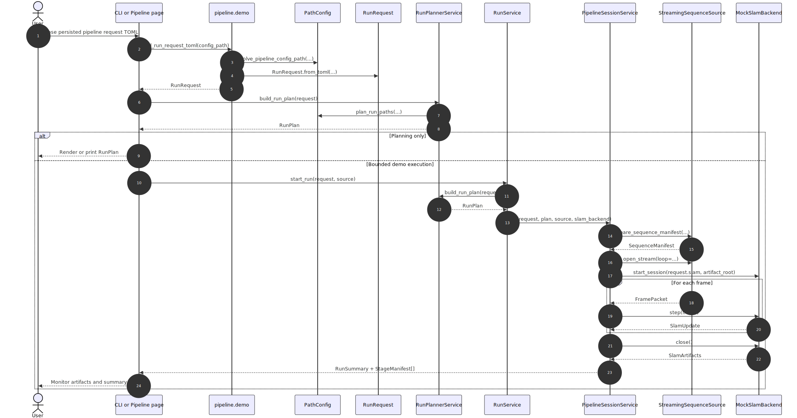

# PRML VSLAM Pipeline Guide

This package owns the typed planning contracts and artifact-boundary
definitions for the repository pipeline. Shared source-provider protocols live
in [`prml_vslam.protocols.source`](../protocols/source.py) and
[`prml_vslam.protocols.runtime`](../protocols/runtime.py), while SLAM
backend/session protocols live in
[`prml_vslam.methods.protocols`](../methods/protocols.py).

## Current State

Today `prml_vslam.pipeline` is primarily a typed planning surface:
[`contracts.py`](./contracts.py) defines public contracts such as
[`RunRequest`](./contracts.py), [`RunPlan`](./contracts.py),
[`SequenceManifest`](./contracts.py), [`StageManifest`](./contracts.py), and
[`RunSummary`](./contracts.py); [`services.py`](./services.py) turns
[`RunRequest`](./contracts.py) into an ordered
[`RunPlan`](./contracts.py); and [`workspace.py`](./workspace.py) defines the
capture-manifest helper models used while materializing sequences.

The generic offline and streaming runners described in
[`REQUIREMENTS.md`](./REQUIREMENTS.md) are target architecture, not implemented
package surfaces yet.

There is one executable demo today: the Streamlit
[`Pipeline` page](../app/pages/pipeline.py) builds a real
[`RunRequest`](./contracts.py), materializes a real
[`SequenceManifest`](./contracts.py), replays ADVIO frames, and feeds them
into the repository-local
[`MockSlamBackend`](../methods/mock_vslam.py). That demo lives in
[`prml_vslam.app`](../app/bootstrap.py), not in `prml_vslam.pipeline`, because
it is a bounded monitoring surface rather than the final reusable runner API.
The current executable [`RunService`](./run_service.py) slice only supports the
`ingest`, `slam`, and `summary` stages. The planner can still describe
reference and evaluation stages, but the bounded runtime rejects those stage
ids until explicit runtime support is added.

## Current Streaming Demo Implementation

The current runnable streaming demo is split across a small set of cooperating
files. The UI surface in [`../app/pages/pipeline.py`](../app/pages/pipeline.py)
renders the page, persists selector-only UI state through
[`PipelinePageState`](../app/models.py), and drives the pipeline-owned
[`PipelineSessionService`](./session.py), which is wired into the packaged app
from [`../app/bootstrap.py`](../app/bootstrap.py) and stored opaquely via
[`../app/state.py`](../app/state.py). The runtime path uses the
repository-local [`MockSlamBackend`](../methods/mock_vslam.py) and
[`MockSlamSession`](../methods/mock_vslam.py), the ADVIO source helpers in
[`../datasets/advio_service.py`](../datasets/advio_service.py),
[`../datasets/advio_sequence.py`](../datasets/advio_sequence.py), and
[`../datasets/advio_replay_adapter.py`](../datasets/advio_replay_adapter.py),
the replay-capable [`FramePacketStream`](../protocols/runtime.py) provided by
[`../io/cv2_producer.py`](../io/cv2_producer.py), the shared
[`FramePacket`](../interfaces/runtime.py) runtime model, the source seams
[`OfflineSequenceSource`](../protocols/source.py) and
[`StreamingSequenceSource`](../protocols/source.py), the SLAM seams
[`OfflineSlamBackend`](../methods/protocols.py),
[`StreamingSlamBackend`](../methods/protocols.py),
[`SlamBackend`](../methods/protocols.py), and
[`SlamSession`](../methods/protocols.py), the live plotting helpers in
[`../app/plotting/record3d.py`](../app/plotting/record3d.py), the planner
contracts in [`contracts.py`](./contracts.py), the
[`RunPlannerService`](./services.py), and the canonical artifact layout exposed
through [`PathConfig.plan_run_paths(...)`](../utils/path_config.py).

## Two Pipeline Modes

The pipeline supports two top-level modes through
[`PipelineMode`](./contracts.py).

### Offline

Use [`PipelineMode.OFFLINE`](./contracts.py) when the input is already bounded
and replayable:

- a raw video file
- a dataset sequence such as ADVIO
- a previously captured live session that has already been materialized

Offline runs are artifact-first. The caller defines a
[`RunRequest`](./contracts.py), builds a [`RunPlan`](./contracts.py),
materializes or resolves a [`SequenceManifest`](./contracts.py), and then
executes the enabled stages in order.

### Streaming

Use [`PipelineMode.STREAMING`](./contracts.py) when the input arrives
incrementally:

- a live camera feed
- a device stream such as Record3D USB or Wi-Fi
- an offline replay that should behave like a stream for monitoring purposes

Streaming mode still uses the same stage vocabulary, but its hot path is
frame-driven. The shared runtime unit is
[`FramePacket`](../interfaces/runtime.py), and the streaming-capable SLAM
session consumes packets one at a time via
[`start_session(...)`](../methods/protocols.py),
[`step(...)`](../methods/protocols.py), and
[`close()`](../methods/protocols.py).

The intended long-term flow is:

1. live ingress produces [`FramePacket`](../interfaces/runtime.py)
2. streaming SLAM produces [`SlamUpdate`](./contracts.py)
3. capture or replay is materialized into [`SequenceManifest`](./contracts.py)
4. downstream artifact stages consume materialized outputs, not live frames

## Core Contracts

### Entry Contract

The entry contract is [`RunRequest`](./contracts.py), which is the
config-defined entry point for both offline and streaming pipelines and owns
`mode`, `source`, `slam`, optional `reference`, and `evaluation`.

### Source Contracts

Source selection is expressed through
[`VideoSourceSpec`](./contracts.py),
[`DatasetSourceSpec`](./contracts.py), and
[`LiveSourceSpec`](./contracts.py).

### Planned Execution

Planning yields a [`RunPlan`](./contracts.py) with an ordered list of
[`RunPlanStage`](./contracts.py) values, plus stable
[`RunPlanStageId`](./contracts.py) identifiers such as `ingest`, `slam`, and
`summary`.

### Shared Normalization Boundary

[`SequenceManifest`](./contracts.py) is the single normalized boundary between
source-specific ingestion and the main benchmark stages. Every manifest must
provide a stable `sequence_id`, and sources should populate the optional paths
for video, timestamps, intrinsics, reference trajectories, and ARCore
baselines whenever those artifacts are already known at the ingestion boundary.

### Stage Outputs

[`SlamArtifacts`](./contracts.py) is the current concrete stage-output bundle.
Large outputs should cross stage boundaries as artifact references rather than
large in-memory payloads. Reference-stage and evaluation-stage bundles are
still target-state concepts described in [`REQUIREMENTS.md`](./REQUIREMENTS.md)
and should only be added to [`contracts.py`](./contracts.py) once a real stage
consumes or produces them.

### Provenance And Summary

[`StageManifest`](./contracts.py) records per-stage provenance through a config
hash, an input fingerprint, named output paths, and an execution status, while
[`RunSummary`](./contracts.py) provides the final run-level view of the
artifact root and stage-status map.

### Minimum Structural Requirements

The source-provider seams live in
[`prml_vslam.protocols.source`](../protocols/source.py), where offline sources
must expose a human-readable `label` plus
[`prepare_sequence_manifest(output_dir) -> SequenceManifest`](../protocols/source.py),
and streaming sources add
[`open_stream(*, loop: bool) -> FramePacketStream`](../protocols/source.py).
The SLAM seams live in [`prml_vslam.methods.protocols`](../methods/protocols.py),
where a backend exposes `method_id`, offline execution implements
[`run_sequence(sequence, cfg, artifact_root) -> SlamArtifacts`](../methods/protocols.py),
streaming execution implements
[`start_session(cfg, artifact_root) -> SlamSession`](../methods/protocols.py),
and a [`SlamSession`](../methods/protocols.py) itself must provide
[`step(frame) -> SlamUpdate`](../methods/protocols.py) and
[`close() -> SlamArtifacts`](../methods/protocols.py). Within
[`SlamArtifacts`](./contracts.py), `trajectory_tum` is mandatory, while
`sparse_points_ply`, `dense_points_ply`, and `preview_log_jsonl` remain
optional because not every backend or run mode materializes them.

## Runtime Interfaces

The current planner and streaming session consume shared source-provider
protocols from `prml_vslam.protocols.source` and SLAM behavior seams from
`prml_vslam.methods.protocols`.

### SLAM

[`OfflineSlamBackend`](../methods/protocols.py) covers materialized-sequence
execution through
[`run_sequence(sequence, cfg, artifact_root) -> SlamArtifacts`](../methods/protocols.py),
while [`StreamingSlamBackend`](../methods/protocols.py) covers incremental
execution through
[`start_session(cfg, artifact_root) -> SlamSession`](../methods/protocols.py).
[`SlamBackend`](../methods/protocols.py) is the convenience
combined protocol for backends that support both modes, and
[`SlamSession`](../methods/protocols.py) is the incremental interface that
consumes [`FramePacket`](../interfaces/runtime.py) through
[`step(frame) -> SlamUpdate`](../methods/protocols.py) and finishes with
[`close() -> SlamArtifacts`](../methods/protocols.py).

The important boundary rule is that streaming logic may consume
[`FramePacket`](../interfaces/runtime.py), but downstream stages should consume
typed artifact bundles or [`SequenceManifest`](./contracts.py), not live
packets.

## Artifact Layout

[`PathConfig.plan_run_paths(...)`](../utils/path_config.py) returns the
canonical [`RunArtifactPaths`](../utils/path_config.py) layout for one run. In
practice that means stages should write to stable locations such as
`input/sequence_manifest.json`, `slam/trajectory.tum`,
`slam/sparse_points.ply`, `dense/dense_points.ply`,
`reference/reference_cloud.ply`, `evaluation/*.json`, and
`summary/run_summary.json` instead of inventing stage-local layouts.

## Defining An Offline Pipeline

The smallest offline pipeline is a [`RunRequest`](./contracts.py) with an
offline source and a [`SlamConfig`](./contracts.py).

```python
from pathlib import Path

from prml_vslam.methods import MethodId
from prml_vslam.pipeline import PipelineMode, RunRequest
from prml_vslam.pipeline.contracts import (
    BenchmarkEvaluationConfig,
    ReferenceConfig,
    SlamConfig,
    VideoSourceSpec,
)
from prml_vslam.utils import PathConfig

request = RunRequest(
    experiment_name="office-offline-vista",
    mode=PipelineMode.OFFLINE,
    output_dir=Path(".artifacts"),
    source=VideoSourceSpec(video_path=Path("captures/office.mp4"), frame_stride=2),
    slam=SlamConfig(method=MethodId.VISTA, emit_dense_points=False),
    reference=ReferenceConfig(enabled=False),
    evaluation=BenchmarkEvaluationConfig(
        compare_to_arcore=False,
        evaluate_cloud=False,
        evaluate_efficiency=True,
    ),
)

plan = request.build(PathConfig())
```

A dataset-backed offline request uses
[`DatasetSourceSpec`](./contracts.py) instead of
[`VideoSourceSpec`](./contracts.py).

```python
from pathlib import Path

from prml_vslam.datasets.contracts import DatasetId
from prml_vslam.methods import MethodId
from prml_vslam.pipeline import RunRequest
from prml_vslam.pipeline.contracts import DatasetSourceSpec, SlamConfig

request = RunRequest(
    experiment_name="advio-office-vista",
    output_dir=Path(".artifacts"),
    source=DatasetSourceSpec(dataset_id=DatasetId.ADVIO, sequence_id="advio-15"),
    slam=SlamConfig(method=MethodId.VISTA),
)
```

## Defining A Streaming Pipeline

A streaming plan uses [`PipelineMode.STREAMING`](./contracts.py) together with
[`LiveSourceSpec`](./contracts.py).

```python
from pathlib import Path

from prml_vslam.methods import MethodId
from prml_vslam.pipeline import PipelineMode, RunRequest
from prml_vslam.pipeline.contracts import LiveSourceSpec, SlamConfig

request = RunRequest(
    experiment_name="record3d-live-vista",
    mode=PipelineMode.STREAMING,
    output_dir=Path(".artifacts"),
    source=LiveSourceSpec(source_id="record3d_usb", persist_capture=True),
    slam=SlamConfig(method=MethodId.VISTA),
)
```

Planning a streaming run does not itself start the stream. It defines the
intended topology, stage set, and artifact root for a future runner.

## Current Ways To Use The Contracts

### CLI Planning

[`prml_vslam.main.plan_run`](../main.py) constructs a
[`RunRequest`](./contracts.py) from CLI arguments and prints the resulting
[`RunPlan`](./contracts.py). This is the current offline planning entrypoint.

### TOML Configs

[`prml_vslam.main.plan_run_config`](../main.py) now loads persisted requests
through [`load_run_request_toml`](./demo.py), which in turn uses
[`PathConfig.resolve_pipeline_config_path(...)`](../utils/path_config.py) to
find the TOML file and [`RunRequest.from_toml(...)`](../utils/base_config.py)
to hydrate the model. The important nuance is that only the config file itself
is repo-resolved automatically. Nested TOML paths such as `source.video_path`,
`slam.config_path`, or `output_dir` are hydrated exactly as written, so runtime
code should resolve them explicitly through
[`PathConfig`](../utils/path_config.py) whenever repo-relative behavior is
required. Bare filenames now resolve under `.configs/pipelines/`, while
explicit relative and absolute paths keep their original anchoring.

### Streamlit Monitoring Demo

The [`Pipeline` page](../app/pages/pipeline.py) demonstrates the same
contracts in an executable but bounded way. It loads a persisted
[`RunRequest`](./contracts.py), builds a [`RunPlan`](./contracts.py),
materializes an ADVIO-backed [`SequenceManifest`](./contracts.py), opens an
ADVIO replay stream, runs the repository-local
[`MockSlamBackend`](../methods/mock_vslam.py), and displays frames,
trajectories, stage manifests, artifacts, and the final summary. The page
supports `offline` as a single replay pass and `streaming` as looped replay
over the same incremental SLAM interface.

## Request Lifecycle

The sequence below summarizes how one persisted
[`RunRequest`](./contracts.py) moves from
[`load_run_request_toml`](./demo.py) through
[`RunPlannerService`](./services.py), [`RunService`](./run_service.py), and
[`PipelineSessionService`](./session.py) before the bounded demo runtime hands
packets to a [`StreamingSequenceSource`](../protocols/source.py) and a
[`MockSlamBackend`](../methods/mock_vslam.py). The Mermaid source lives in
[`docs/figures/mermaid_pipeline_request_flow.mmd`](../../../docs/figures/mermaid_pipeline_request_flow.mmd).



## Persisting A Pipeline Config

The repo-owned way to persist a durable pipeline request is:

```python
from prml_vslam.pipeline.demo import save_run_request_toml
from prml_vslam.utils import PathConfig

path_config = PathConfig()
request = ...
config_path = save_run_request_toml(
    path_config=path_config,
    request=request,
    config_path="advio-office-vista.toml",
)
```

This helper lives in [`pipeline/demo.py`](./demo.py) so the app, CLI, and
examples all share one persisted-request path. When `config_path` is a bare
filename, it is written to `.configs/pipelines/<name>.toml` through
[`PathConfig.resolve_pipeline_config_path(...)`](../utils/path_config.py).
Explicit relative paths keep their repo-root anchoring, which is useful when a
team wants to keep example configs in a subdirectory that is still owned by the
repository.

## Configuring Stages Via TOML

[`RunRequest`](./contracts.py) owns stage-specific config as nested config
models, so the TOML mirrors the model tree directly:

```toml
experiment_name = "advio-office-offline-vista"
mode = "offline"
output_dir = ".artifacts"

[source]
dataset_id = "advio"
sequence_id = "advio-15"

[slam]
method = "vista"
config_path = ".configs/methods/vista/demo.toml"
max_frames = 300
emit_dense_points = true
emit_sparse_points = true

[reference]
enabled = false

[evaluation]
compare_to_arcore = true
evaluate_cloud = false
evaluate_efficiency = true
```

Fields that belong to [`RunRequest`](./contracts.py) stay top-level, while
fields owned by [`SlamConfig`](./contracts.py),
[`ReferenceConfig`](./contracts.py), and
[`BenchmarkEvaluationConfig`](./contracts.py) live under `[slam]`,
`[reference]`, and `[evaluation]`. The `[source]` table is a tagged-by-shape
union: a video request uses `video_path` with an optional `frame_stride`, a
dataset request uses `dataset_id` and `sequence_id`, and a live request uses
`source_id` with an optional `persist_capture`.

## Common Questions

### Which Stages Actually Execute Today?

[`RunPlanStageId`](./contracts.py) can already describe `ingest`, `slam`,
`reference_reconstruction`, `trajectory_evaluation`, `cloud_evaluation`,
`efficiency_evaluation`, and `summary`, and the planner in
[`services.py`](./services.py) can emit those stages when the request enables
them. The current bounded runtime in [`run_service.py`](./run_service.py) and
[`session.py`](./session.py) only executes `ingest`, `slam`, and `summary`,
which is why reference and evaluation stages are still described as planned
architecture in this package rather than as part of the runnable slice.

### Which Modules Own Which Boundaries?

Boundary ownership is deliberately split: [`pipeline/contracts.py`](./contracts.py)
owns stage DTOs, plans, manifests, summaries, and artifact bundles;
[`pipeline/services.py`](./services.py) owns planner wiring and stage
selection; [`pipeline/run_service.py`](./run_service.py) is the app-facing
facade for the current runnable slice; [`pipeline/session.py`](./session.py)
owns the bounded runtime and manifest finalization;
[`protocols/source.py`](../protocols/source.py) owns source-provider seams;
[`methods/protocols.py`](../methods/protocols.py) owns SLAM backend and session
seams; and [`utils/path_config.py`](../utils/path_config.py) owns the canonical
artifact layout together with repo-owned config-path resolution.

### What Happens If I Omit Optional Stage Config?

If a caller omits optional stage config, the defaults in
[`contracts.py`](./contracts.py) apply: `ReferenceConfig.enabled` defaults to
`false`, `BenchmarkEvaluationConfig` defaults to `compare_to_arcore = true`,
`evaluate_cloud = false`, and `evaluate_efficiency = true`, and `SlamConfig`
defaults to both dense and sparse export enabled. In practice, a minimal
[`RunRequest`](./contracts.py) with only `source` and `slam` therefore plans
`ingest`, `slam`, `trajectory_evaluation`, `efficiency_evaluation`, and
`summary`, as you can confirm from the planner behavior documented in
[`tests/test_pipeline.py`](../../../tests/test_pipeline.py).

### Which TOML Paths Are Auto-Resolved?

The auto-resolved paths are the TOML file passed to
[`plan-run-config`](../main.py) and the bare filenames passed through the
repo-owned helpers in [`pipeline/demo.py`](./demo.py). Nested fields inside the
TOML are not rewritten automatically, so values such as `source.video_path`,
`slam.config_path`, and `output_dir` are hydrated exactly as written and should
be normalized explicitly through [`PathConfig`](../utils/path_config.py) when a
runtime wants repo-relative behavior.

### What Is The Minimum Valid `SequenceManifest`?

Structurally, [`SequenceManifest`](./contracts.py) only requires
`sequence_id`. In practice, video-backed sources should also provide
`video_path` and attach `timestamps_path` or `intrinsics_path` when known;
dataset-backed sources should populate the dataset-derived `video_path`,
`timestamps_path`, `intrinsics_path`, `reference_tum_path`, and
`arcore_tum_path` whenever those artifacts are already available; and live or
replay captures should include whichever persisted capture artifacts have
already been materialized for downstream stages. The ADVIO implementation in
[`advio_sequence.py`](../datasets/advio/advio_sequence.py) is the best current
reference for a fully populated dataset-backed manifest.

### Which Artifacts Are Mandatory Vs Optional?

In the current runnable slice, ingest must write
`input/sequence_manifest.json`, SLAM must write `slam/trajectory.tum`, and the
summary stage must write both `summary/run_summary.json` and
`summary/stage_manifests.json` through the canonical layout in
[`RunArtifactPaths`](../utils/path_config.py). The SLAM stage may additionally
write `slam/sparse_points.ply`, `dense/dense_points.ply`, and a live
preview/event log when the backend and run mode support them. Reference and
evaluation artifact bundles should only become mandatory after those stages
gain real runtime support.

### Which Files Usually Change When Adding A Runnable Stage?

For a new runnable stage, the minimum change set usually spans
[`pipeline/contracts.py`](./contracts.py), [`pipeline/services.py`](./services.py),
[`utils/path_config.py`](../utils/path_config.py),
[`pipeline/run_service.py`](./run_service.py), and
[`pipeline/session.py`](./session.py), plus the owning protocol module if the
stage introduces a new reusable execution seam. Tests typically start in
[`tests/test_pipeline.py`](../../../tests/test_pipeline.py) and expand into the
path or CLI suites when config loading or artifact layout changes.

## How To Add A Stage

When adding a stage, change the typed contracts first and the runner wiring
second. In practice that means deciding whether the new capability introduces a
major artifact boundary and, if it does, adding or extending the relevant typed
artifact bundle in [`contracts.py`](./contracts.py). Then add the enabling
config to [`RunRequest`](./contracts.py), add the new
[`RunPlanStageId`](./contracts.py), extend the canonical outputs in
[`RunArtifactPaths`](../utils/path_config.py), and insert the stage into
[`RunPlannerService._build_stages(...)`](./services.py). If the stage
introduces a reusable behavior seam, put that seam in the true owning protocol
module, which usually means [`prml_vslam.protocols.source`](../protocols/source.py)
for source behavior or [`prml_vslam.methods.protocols`](../methods/protocols.py)
for SLAM behavior rather than inventing a pipeline-local protocol file.

For the current runnable slice, planner changes are not sufficient on their
own. A stage that must execute in the bounded demo also needs runtime support
in [`RunService`](./run_service.py) and finalization support in
[`PipelineSessionService`](./session.py), plus tests for planning, artifact
layout, and execution behavior. If the stage appears to need direct live
[`FramePacket`](../interfaces/runtime.py) access, challenge that design first:
in this repository only ingress and streaming SLAM should normally operate on
live packets, while later stages should run on materialized artifacts.

## Recommended Extension Pattern

The extension rule is simple: if a capability consumes a fully materialized
sequence, model it as an offline stage; if it must react frame by frame, model
it as streaming SLAM or as observability around streaming SLAM; and if it
produces reusable geometry or metrics, materialize it as a typed artifact
bundle.

## Related Files

For the current implementation, the most important follow-on references are
[`contracts.py`](./contracts.py), [`services.py`](./services.py),
[`run_service.py`](./run_service.py), [`session.py`](./session.py), and
[`workspace.py`](./workspace.py) inside this package; the shared protocol seams
in [`../methods/protocols.py`](../methods/protocols.py),
[`../protocols/source.py`](../protocols/source.py), and
[`../protocols/runtime.py`](../protocols/runtime.py); the current runtime and
demo surfaces in [`../app/pages/pipeline.py`](../app/pages/pipeline.py),
[`../methods/mock_vslam.py`](../methods/mock_vslam.py),
[`../datasets/advio_service.py`](../datasets/advio_service.py),
[`../datasets/advio_sequence.py`](../datasets/advio_sequence.py),
[`../datasets/advio_replay_adapter.py`](../datasets/advio_replay_adapter.py),
and [`../io/cv2_producer.py`](../io/cv2_producer.py); the shared runtime data
model in [`../interfaces/runtime.py`](../interfaces/runtime.py); the canonical
path layout in [`../utils/path_config.py`](../utils/path_config.py); and the
target-state architecture in [`REQUIREMENTS.md`](./REQUIREMENTS.md).
