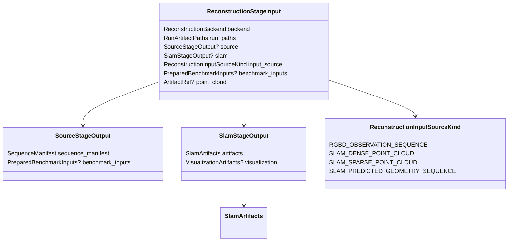
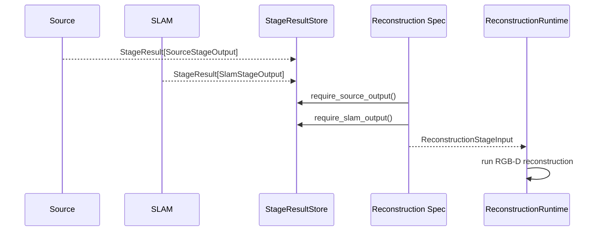

# Reconstruction Guide

This package owns the repository's minimal dense-reconstruction execution
surface. It is the reconstruction analogue of
[`prml_vslam.methods`](../methods/README.md): a small package that names
reconstruction methods, owns reconstruction-private config and artifact DTOs,
and provides thin adapters around external or library-backed reconstruction
implementations. The shared posed RGB-D observation boundary lives in
[`prml_vslam.interfaces.observation`](../interfaces/observation.py) so datasets and SLAM
methods can normalize into the same reconstruction input. Benchmark policy stays in
[`prml_vslam.sources.contracts`](../sources/contracts.py), pipeline orchestration stays
in [`prml_vslam.pipeline`](../pipeline/README.md), and Rerun logging stays in
[`prml_vslam.visualization`](../visualization/README.md) plus the pipeline sink.

The current implementation is intentionally narrow: one minimal Open3D TSDF
implementation backed by the repo pin `open3d>=0.19.0,<0.20` from
[`../../../pyproject.toml`](../../../pyproject.toml). The package should not
start with a general-purpose reconstruction framework, a zoo of backends, or a
repo-local TSDF implementation. It first makes the pipeline `reconstruction`
stage executable with one well-typed, easy-to-extend method boundary.

## Current State

- one executable reconstruction method: Open3D `ScalableTSDFVolume`
- one config-driven method boundary that selects the configured backend
  without a separate harness object
- one normalized offline reconstruction boundary built from shared
  `Observation` values plus explicit `T_world_camera` poses
- one normalized durable output for the stage: a world-space
  `reference_cloud.ply`
- optional extra artifacts such as a mesh or debug metadata only when the
  concrete implementation can provide them without widening the public stage
  contract
- no direct Rerun logging from this package; the package should emit typed
  geometry/raster DTOs that the existing Rerun sink can consume later

## Why This Package Exists

Pipeline stage modules own persisted reconstruction-stage configuration and
enablement policy. This package owns the reusable reconstruction implementation
and artifact DTOs for three reasons:

1. reconstruction methods have method-private config just like SLAM backends do
2. reconstruction execution should be swappable through typed backend configs
   and protocols rather than through ad hoc `if method == ...` branches in
   pipeline code
3. reconstruction artifact DTOs and the shared RGB-D observation DTOs need
   explicit frame and raster semantics so later Rerun logging stays
   straightforward and truthful

## Package Surface

The package stays small and mirrors the useful parts of the methods package
without copying complexity that is not needed.

```text
src/prml_vslam/reconstruction
├── README.md                        # package guide
├── REQUIREMENTS.md                  # concise package constraints
├── __init__.py                      # curated public reconstruction surface
├── contracts.py                     # method ids and reconstruction artifact DTOs
│   ├── ReconstructionMethodId       # supported reconstruction ids
│   ├── ReconstructionArtifacts      # normalized durable outputs
│   └── ReconstructionMetadata       # typed side metadata for outputs
├── protocols.py                     # package-local execution seam
│   └── OfflineReconstructionBackend # normalized offline reconstruction protocol
├── config.py                        # discriminated backend config union
│   ├── ReconstructionBackendConfig  # shared reconstruction config base
│   └── Open3dTsdfBackendConfig      # concrete Open3D TSDF config
└── open3d_tsdf.py                   # thin Open3D-backed implementation
    └── Open3dTsdfBackend            # concrete TSDF reconstructor
```

The important design choice is that typed configs and protocols are the method
selection seam. Pipeline code should depend on `ReconstructionBackendConfig`
and `OfflineReconstructionBackend` rather than a separate harness object.

## Core Interface Shape

The minimum useful reconstruction seam is offline and artifact-first:

```python
class OfflineReconstructionBackend(Protocol):
    method_id: ReconstructionMethodId

    def run_sequence(
        self,
        observations: Iterable[Observation],
        artifact_root: Path,
    ) -> ReconstructionArtifacts: ...
```

That is enough for the first Open3D TSDF implementation. Add a streaming
session/update seam only when there is a real second use case for it. Until
then, one offline protocol is the more elegant interface because it keeps the
surface honest. Backends are configured at construction time from the single
package-owned `ReconstructionBackendConfig` instance.

Persisted method selection uses the package-owned backend configs directly.
The pipeline reconstruction stage references the same discriminated config
surface instead of duplicating Open3D fields under a stage-local id:

```python
class ReconstructionMethodId(StrEnum):
    OPEN3D_TSDF = "open3d_tsdf"


class ReconstructionBackendConfig(BaseConfig):
    method_id: ReconstructionMethodId


class Open3dTsdfBackendConfig(ReconstructionBackendConfig, FactoryConfig[Open3dTsdfBackend]):
    method_id: Literal[ReconstructionMethodId.OPEN3D_TSDF] = ReconstructionMethodId.OPEN3D_TSDF
```

This gives the stage one discriminated config union and one obvious extension
path when a second reconstruction backend appears later.

## Stage Integration

- Config: [`stage/config.py`](./stage/config.py) defines
  `ReconstructionStageConfig` for the `reconstruction` stage. It reuses the
  package-owned reconstruction backend config union, declares the reference
  cloud output, records input-selection policy, and currently enables RGB-D
  execution for TUM RGB-D sources.
- Input DTO: [`stage/contracts.py`](./stage/contracts.py) defines
  `ReconstructionStageInput` with the selected backend, run paths, source
  output, optional SLAM output, input source kind, prepared benchmark inputs,
  and optional selected SLAM point cloud.
- Runtime spec: [`stage/spec.py`](./stage/spec.py) owns reconstruction input
  construction from the shared pipeline execution context.
- Runtime: [`stage/runtime.py`](./stage/runtime.py) adapts
  `OfflineReconstructionBackend` into the pipeline `OfflineStageRuntime`
  contract and returns `ReconstructionArtifacts` as the reconstruction stage
  output inside `StageResult`.
- Visualization: [`stage/visualization.py`](./stage/visualization.py) turns
  reconstruction artifacts into neutral visualization items; Rerun SDK calls
  stay in the sink layer.
- I/O: reconstruction consumes prepared `ObservationSequenceRef` values through
  source-owned observation loading and produces a world-space
  `reference_cloud.ply` plus metadata.

### Stage Input Handoff



The current executable path is RGB-D reconstruction. SLAM dense/sparse point
cloud and predicted-geometry selections are declared at the input boundary so
the pipeline can fail clearly until those reconstruction modes are implemented.



## DTO Design For Easy Rerun Integration

This package should define DTOs so that Rerun logging stays a separate concern,
not something each reconstruction method re-invents.

The key rule is to keep geometry semantics explicit:

- input observations carry camera-local rasters plus an explicit
  `T_world_camera`
- durable outputs carry world-space geometry artifact paths plus explicit frame
  labels
- live or debug payloads, if added later, should use repo-owned array/handle
  DTOs rather than Rerun SDK types

The minimum shared observation DTO lives in `prml_vslam.interfaces.observation` and
should look roughly like this:

```python
class Observation(BaseData):
    seq: int
    timestamp_ns: int
    provenance: ObservationProvenance
    camera_frame: Literal["camera_rdf"] = "camera_rdf"
    rgb: NDArray[np.uint8] | None = None
    depth_m: NDArray[np.float32] | None = None
    intrinsics: CameraIntrinsics | None = None
    T_world_camera: FrameTransform | None = None
```

Contract requirements:

- `T_world_camera` maps world <- camera_rdf when metric geometry is present
- `intrinsics`, `rgb`, and `depth_m` refer to the same raster when combined
- `depth_m` is metric depth in meters, not a visualization depth product
- the DTO is transport- and sink-friendly without importing `rerun`

The durable result DTO should separate required public outputs from optional
extras:

```python
class ReconstructionArtifacts(BaseData):
    reference_cloud_path: Path
    metadata_path: Path
    mesh_path: Path | None = None
    extras: dict[str, Path] = Field(default_factory=dict)
```

This keeps the public stage contract aligned with the existing pipeline output
path `reference_cloud.ply` while still allowing the Open3D implementation to
preserve a mesh or debug artifacts when useful.

## Open3D TSDF Scope

The first implementation should use only the classic Open3D integration path:

- `open3d.geometry.RGBDImage.create_from_color_and_depth(...)`
- `open3d.camera.PinholeCameraIntrinsic(...)`
- `open3d.pipelines.integration.ScalableTSDFVolume(...)`
- `ScalableTSDFVolume.integrate(...)`
- `ScalableTSDFVolume.extract_point_cloud()` and optionally
  `extract_triangle_mesh()`

That is the smallest implementation that still matches the package goal. It
avoids:

- custom TSDF kernels
- Open3D tensor reconstruction unless a later measured need justifies it
- viewer-specific payload types in the package boundary
- fake abstraction layers around library details we only use once

The thin Open3D adapter should therefore:

1. normalize one observation into Open3D `Image`, `RGBDImage`, and
   `PinholeCameraIntrinsic`
2. integrate into one `ScalableTSDFVolume`
3. extract one fused world-space point cloud
4. write the normalized `reference_cloud.ply`
5. persist typed metadata that records the Open3D settings and frame semantics

## Package Boundaries

This package should own:

- reconstruction method ids
- reconstruction-private config
- reconstruction observation/result DTOs
- the Open3D TSDF adapter
- the method-selection harness

This package should not own:

- reconstruction stage enablement
- pipeline stage planning or stage execution orchestration
- dense-cloud metric computation
- Streamlit state or widgets
- Rerun SDK logging calls

## Primary External References

- Open3D `ScalableTSDFVolume`:
  [open3d.pipelines.integration.ScalableTSDFVolume](https://www.open3d.org/docs/release/python_api/open3d.pipelines.integration.ScalableTSDFVolume.html)
- Open3D `RGBDImage`:
  [open3d.geometry.RGBDImage](https://www.open3d.org/docs/release/python_api/open3d.geometry.RGBDImage.html)
- Open3D `PinholeCameraIntrinsic`:
  [open3d.camera.PinholeCameraIntrinsic](https://www.open3d.org/docs/release/python_api/open3d.camera.PinholeCameraIntrinsic.html)

These docs currently resolve to the `0.19.0` API, which matches the repo's
current dependency pin. If the repository updates the Open3D pin later, this
guide should be updated in the same change.
