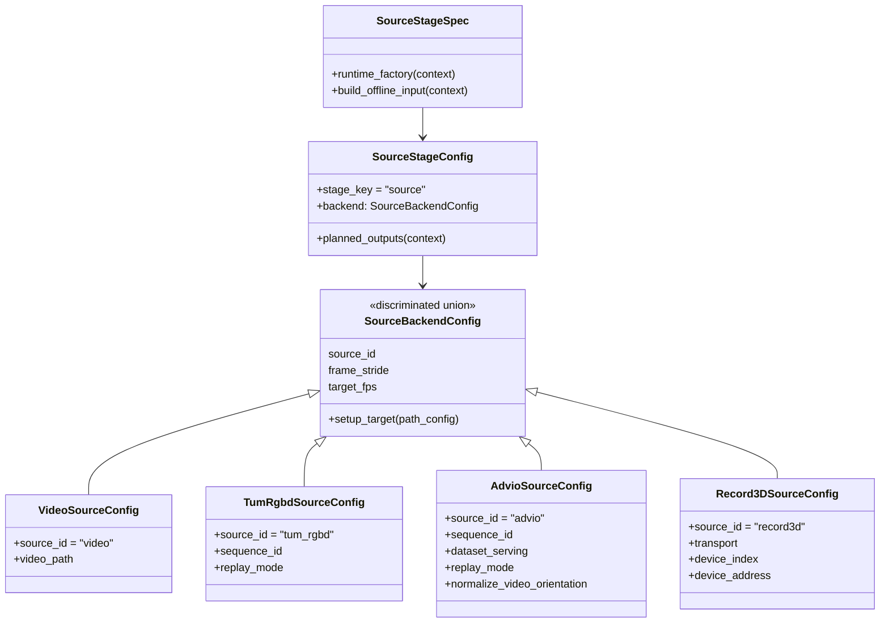

# Sources

This package owns source normalization for the pipeline. It is the single
top-level home for dataset adapters, replay adapters, Record3D transports,
source backend configs, source manifests, prepared benchmark inputs, and
source-stage integration.

Use [`REQUIREMENTS.md`](./REQUIREMENTS.md) for concise invariants. Dataset
details live in [`datasets/README.md`](./datasets/README.md); Record3D transport
details live in [`record3d/README.md`](./record3d/README.md).

## Source Stage Surface

- [`config.py`](./config.py): source backend config variants selected by
  `source_id`. Each concrete backend config builds an offline or streaming
  source adapter through `setup_target(...)`.
- [`stage/config.py`](./stage/config.py): `SourceStageConfig`, the persisted
  stage policy that selects one `SourceBackendConfig`.
- [`stage/contracts.py`](./stage/contracts.py): `SourceStageInput` and
  `SourceStageOutput`.
- [`stage/runtime.py`](./stage/runtime.py): `SourceRuntime`, which prepares the
  normalized `SequenceManifest` and optional `PreparedBenchmarkInputs`.
- [`stage/spec.py`](./stage/spec.py): `SOURCE_STAGE_SPEC`, which binds source
  runtime construction, source-stage input building, and failure fingerprints.
- [`stage/visualization.py`](./stage/visualization.py): source-stage adapter
  from observations and prepared references to neutral `VisualizationItem`s.
- [`materialization.py`](./materialization.py): source-domain manifest
  materialization helpers, not stage artifact projection.
- [`observation_reader.py`](./observation_reader.py): source-owned
  dematerialization from offline manifests into shared `Observation` values for
  consumers such as offline SLAM.

## Backend Config Shape

`frame_stride` and `target_fps` are shared source backend policy fields. Dataset
sources apply them through timestamp-aware frame selection, raw video applies
them during frame materialization, and Record3D treats them as best-effort
sampling before the SLAM hot path.

## Source I/O Contracts

Source stage completion returns `SourceStageOutput`:

- `SequenceManifest`: durable normalized source sequence metadata. It may refer
  to a video, RGB directory, timestamps, intrinsics, rotation metadata, and
  ADVIO-specific assets.
- `PreparedBenchmarkInputs`: optional source-prepared references such as
  reference trajectories, reference clouds, point-cloud sequences, or prepared
  observation sequences.

Live or replay streaming emits shared
[`Observation`](../interfaces/observation.py) values through
[`ObservationStream`](./replay/protocols.py). `Observation` is the only
streaming item leaving source streams; metric geometry is RDF camera-relative
and placed through explicit `T_world_camera`.

## Source Protocols

- [`OfflineSequenceSource`](./protocols.py): prepares one `SequenceManifest`.
- [`BenchmarkInputSource`](./protocols.py): optionally prepares
  `PreparedBenchmarkInputs`.
- [`StreamingSequenceSource`](./protocols.py): prepares the manifest and opens
  an `ObservationStream`.
- [`ObservationStream`](./replay/protocols.py): blocking stream of normalized
  `Observation` values.

Pipeline stage order, SLAM backend selection, evaluation policy, and Rerun SDK
calls are out of scope for this package.

## Domain Owners Under Sources

- `sources.datasets`: ADVIO and TUM RGB-D dataset services, downloads, path
  resolution, timestamp/camera loading, benchmark-reference preparation, and
  dataset-specific replay adapters.
- `sources.replay`: PyAV video replay, image-sequence replay, replay clocking,
  and shared observation-stream utilities.
- `sources.record3d`: USB and Wi-Fi Preview Record3D transport adapters and
  source config support.

ADVIO-specific pose-provider choices remain in ADVIO serving contracts.
Record3D transport details remain Record3D-owned. Neither is promoted into the
generic source backend base unless another source exposes the same semantics.
